# 006：数据湖概述 🏞️

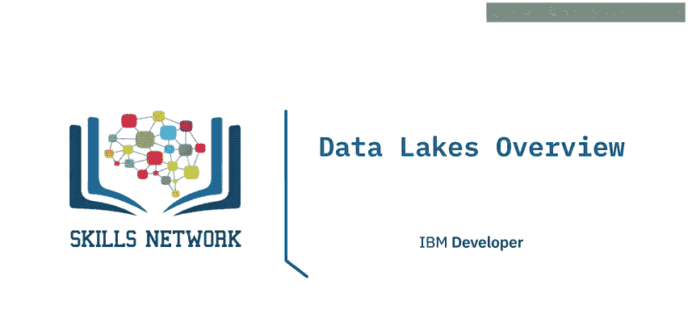

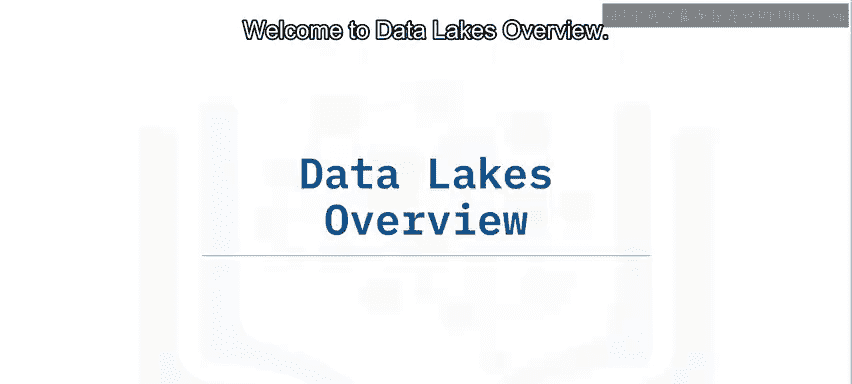

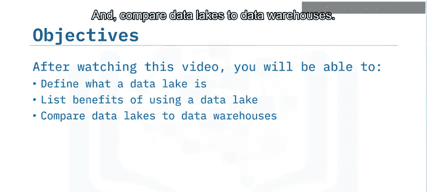

在本节课中，我们将要学习数据湖的基本概念。我们将定义什么是数据湖，列举使用数据湖的优势，并将其与数据仓库进行比较。

## 什么是数据湖？🤔

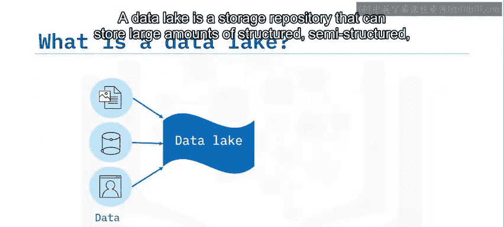

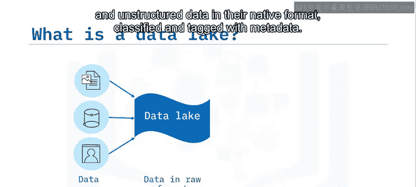

数据湖是一种存储库，能够以原始格式存储大量**结构化**、**半结构化**和**非结构化**数据，并使用元数据进行分类和标记。如果你持续生成或能够访问大量数据，但又不想被限制在特定或预定义的使用场景中，那么数据湖是一个合适的选择。

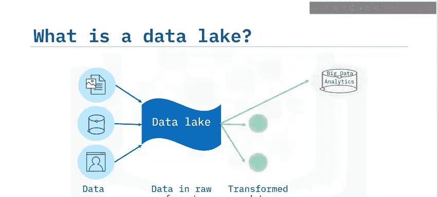

数据湖有时也用作数据转换的**暂存区**，以便在将数据加载到数据仓库或数据集市之前进行处理。

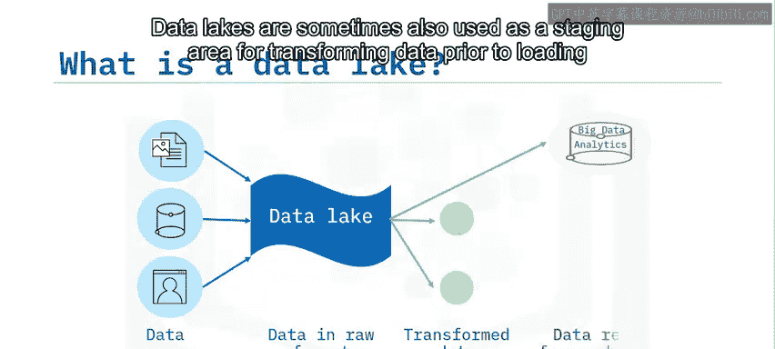

## 深入理解数据湖

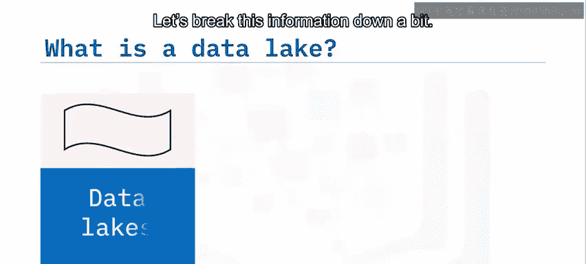

上一节我们介绍了数据湖的基本定义，本节中我们来详细拆解其核心特征。

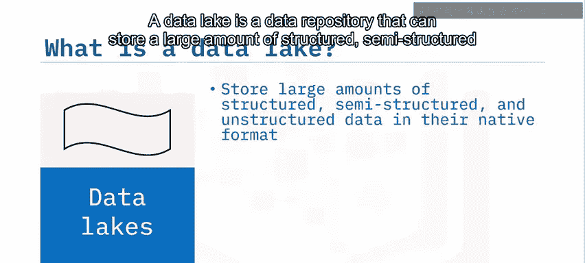

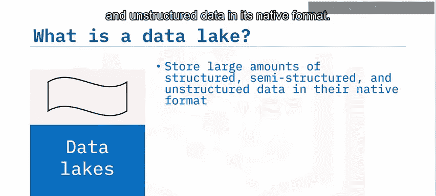

数据湖是一个数据存储库，能够以**原生格式**存储大量结构化、半结构化和非结构化数据。在将数据加载到数据湖之前，你**不需要**定义数据的结构和模式，甚至**不需要**知道分析数据的所有具体用途。

数据湖是直接从源头获取的原始数据的存储库，可以根据分析需求进行转换。但这并不意味着数据湖是一个可以随意倾倒数据、缺乏治理的地方。数据湖也是一种独立于技术的参考架构。

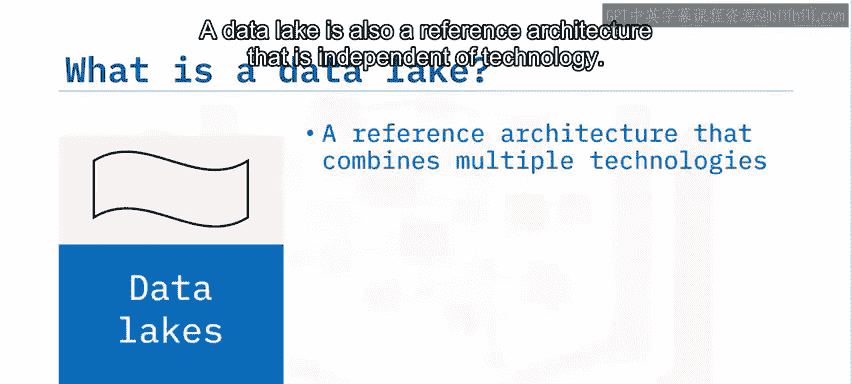

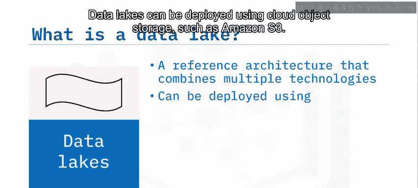

以下是数据湖可以部署的技术平台示例：
*   **云对象存储**：例如 `Amazon S3`。
*   **大规模分布式系统**：例如用于处理大数据的 `Apache Hadoop`。
*   **关系数据库管理系统**以及能够存储海量数据的 **NoSQL** 数据存储库。

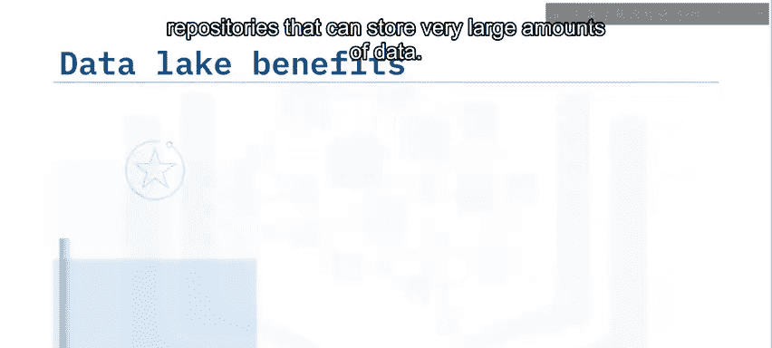

## 数据湖的优势 ✨

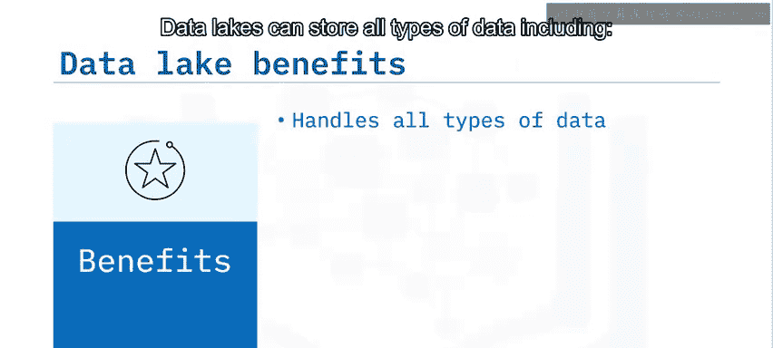

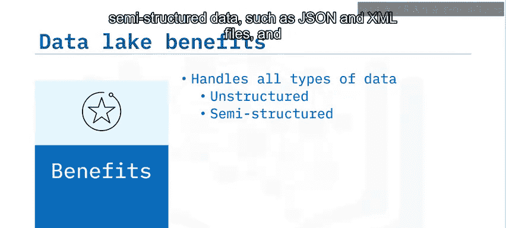

了解了数据湖是什么之后，我们来看看它能为组织带来哪些具体好处。

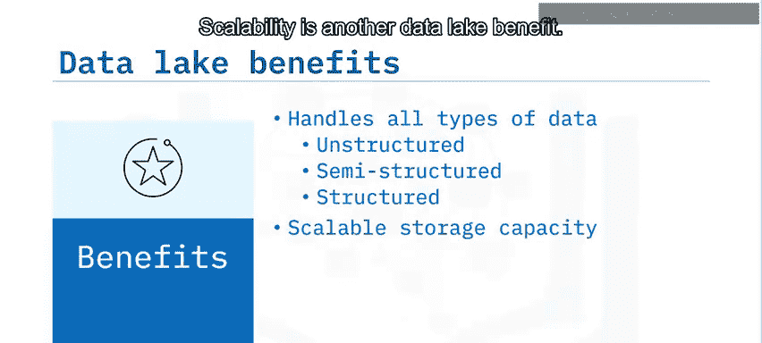

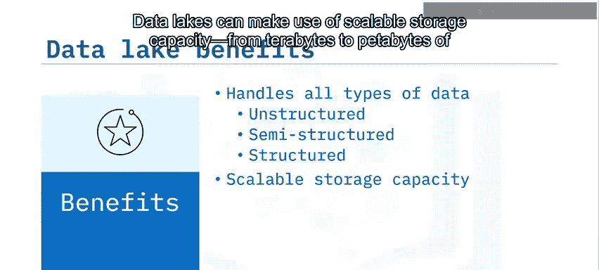

数据湖提供了多项优势：
*   **存储所有类型的数据**：包括文档和电子邮件等**非结构化数据**，JSON和XML文件等**半结构化数据**，以及来自关系数据库的**结构化数据**。
*   **强大的可扩展性**：数据湖可以利用可扩展的存储容量，处理从TB到PB级别的数据。
*   **节省时间与成本**：通过保留数据的原始格式，数据湖节省了组织用于定义结构、创建模式和转换数据的时间。这种以原始格式访问数据的能力，使得数据能够快速、灵活地复用于当前和未来的各种场景。

一些提供数据湖技术、平台和参考架构的供应商包括：Amazon, Cloudera, Google, IBM, Informatica, Microsoft, Oracle, SAS, Snowflake, Teradata 和 Zaloni。

总而言之，数据湖的设计是为了应对数据仓库的局限性。根据需求，一个典型的组织通常需要同时拥有数据仓库和数据湖，因为它们服务于不同的需求。

## 数据湖 vs. 数据仓库 ⚖️

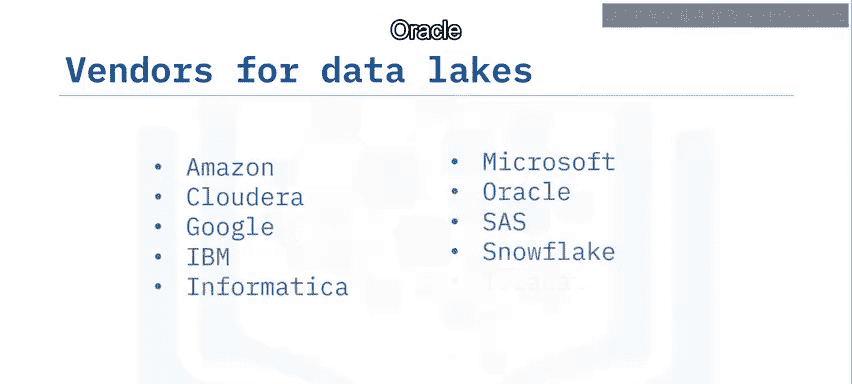

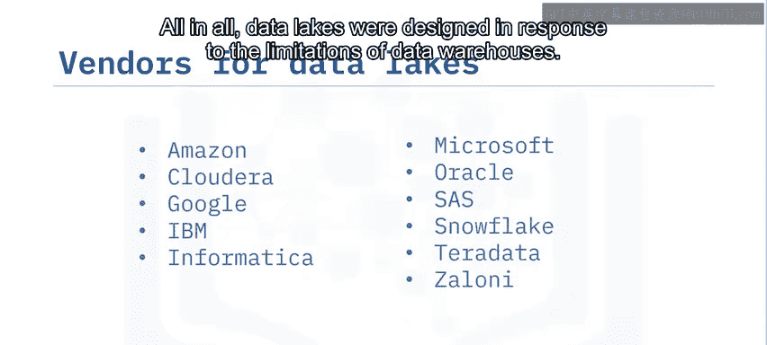

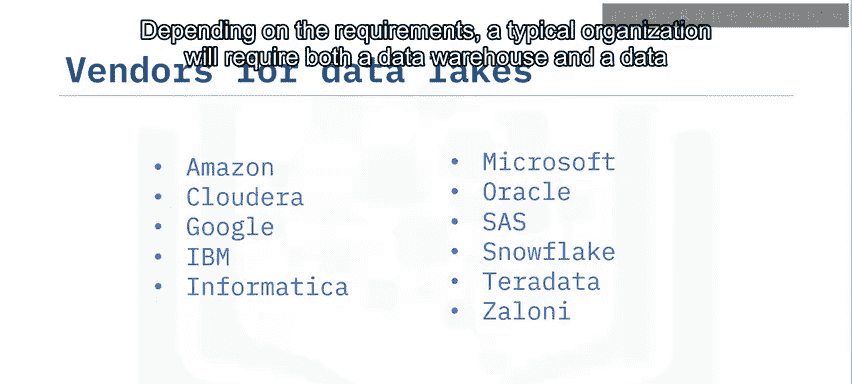

上一节我们探讨了数据湖的优势，本节中我们将其与数据仓库进行对比，以更清晰地理解两者的区别。

让我们从几个维度比较数据湖和数据仓库：

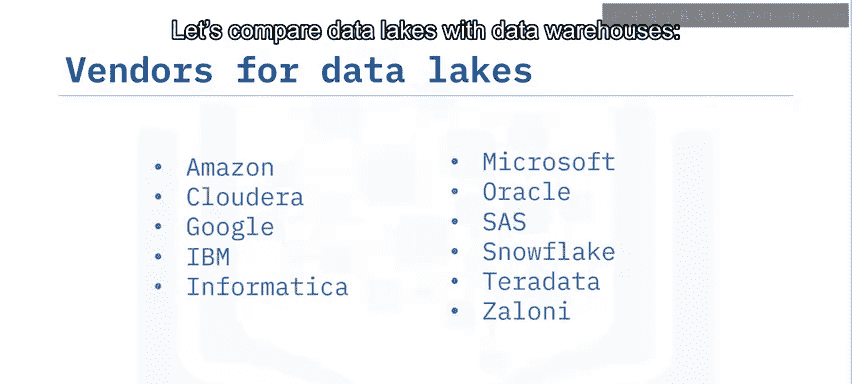

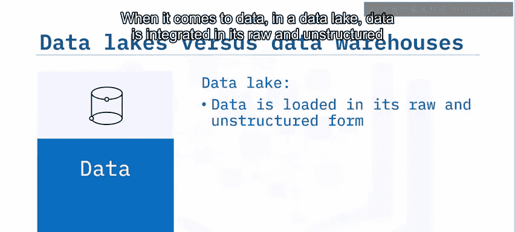

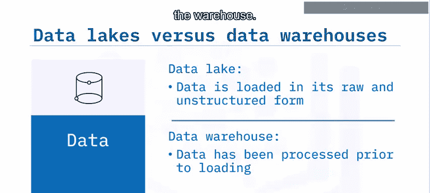

**1. 数据形态**
在数据湖中，数据以其**原始、非结构化**的形式集成。而在数据仓库中，所有数据在加载之前都**已经过处理**并符合既定标准。

**2. 模式（Schema）**
使用数据湖时，你**不需要**在加载数据前定义其结构和模式。相反，数据仓库**需要严格遵守模式**，因此必须在加载数据之前设计和实施模式。

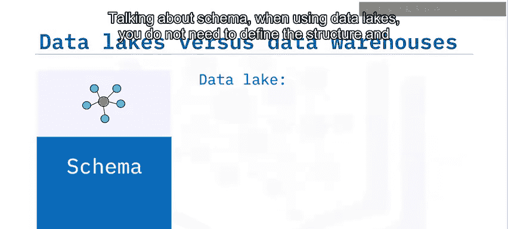

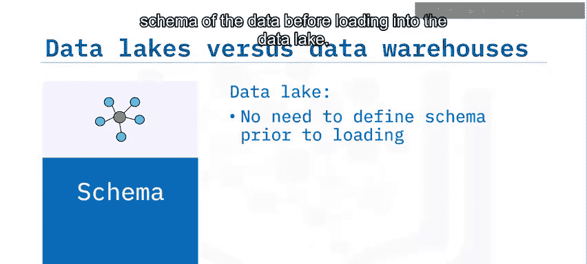

**3. 数据质量**
在数据湖中，数据**可能经过治理，也可能没有**（例如原始数据），数据具有敏捷性，不一定完全遵守治理指南。相比之下，数据仓库中的数据是**经过治理的**，并遵守数据治理规范。

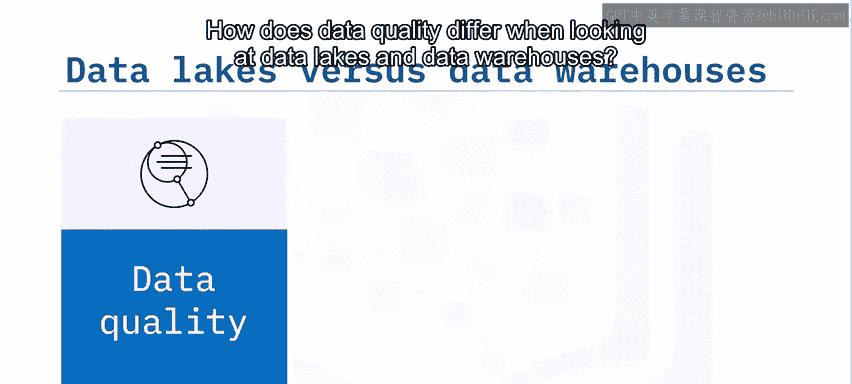

**4. 主要用户**
数据科学家、数据开发人员和机器学习工程师是数据湖的典型用户。而数据仓库则主要由业务分析师和数据分析师使用。

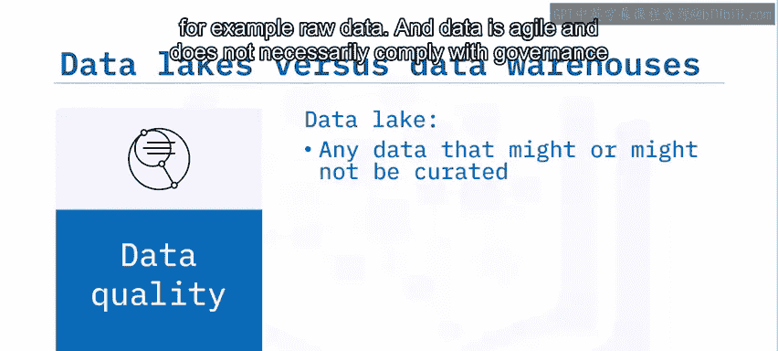

## 总结 📝

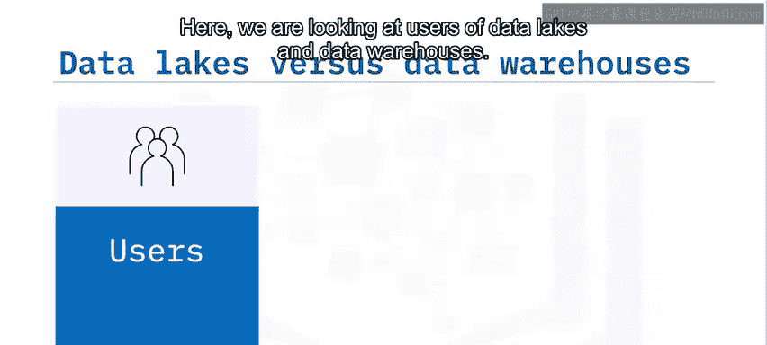

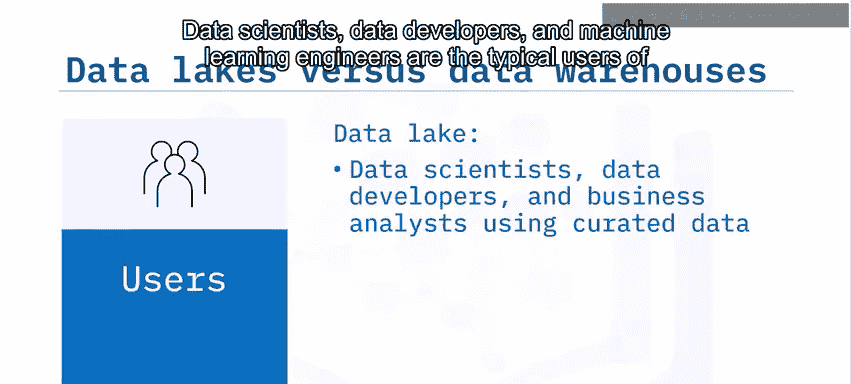

本节课中我们一起学习了数据湖的核心知识。

我们了解到，数据湖是一个能够以原始或原生格式存储大量结构化、半结构化和非结构化数据的存储库，并使用元数据进行分类和标记。在将数据加载到数据湖之前，无需定义数据的结构和模式。

数据湖提供了诸多优势，例如支持存储所有类型的数据、具备可扩展的存储容量、能够节省时间并实现灵活的数据复用。

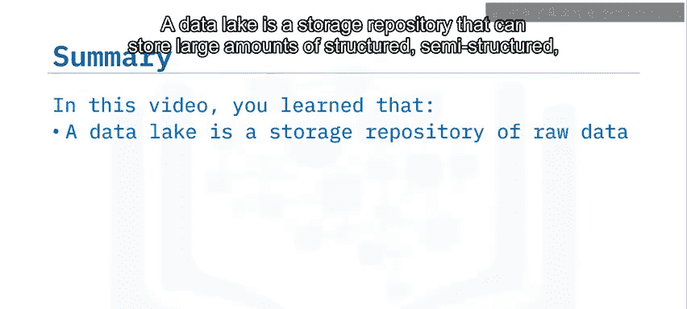

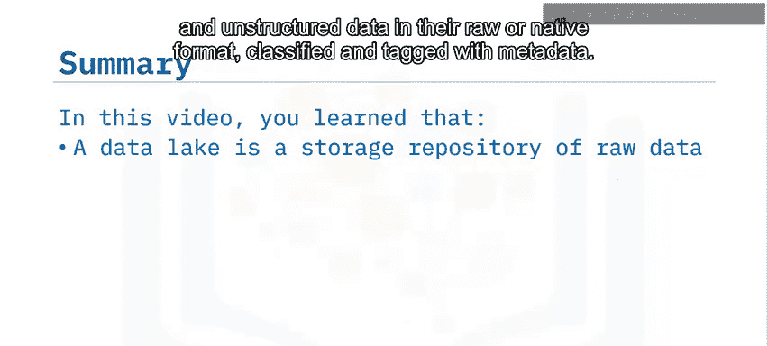

最后，我们学习了数据湖可以作为多种用途的“自助式”暂存区，包括机器学习开发和高级分析。同时，我们也明确了数据湖与数据仓库在数据形态、模式、质量和用户方面的关键区别。