# 007：数据湖解释 🏞️

在本节课中，我们将通过一个餐厅后厨的比喻，来理解数据湖、数据仓库以及数据湖仓的核心概念。我们将探讨它们各自的特点、优势与挑战，并了解它们如何共同构成现代数据架构的基础。

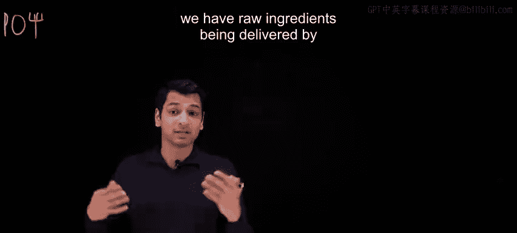

---

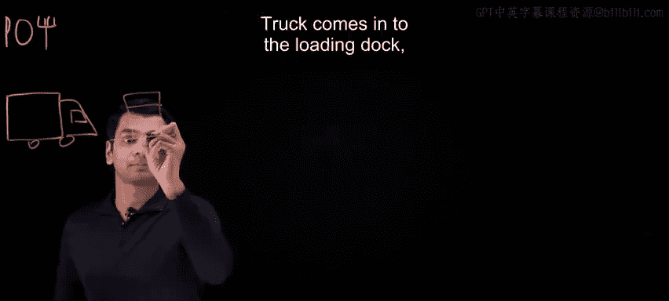

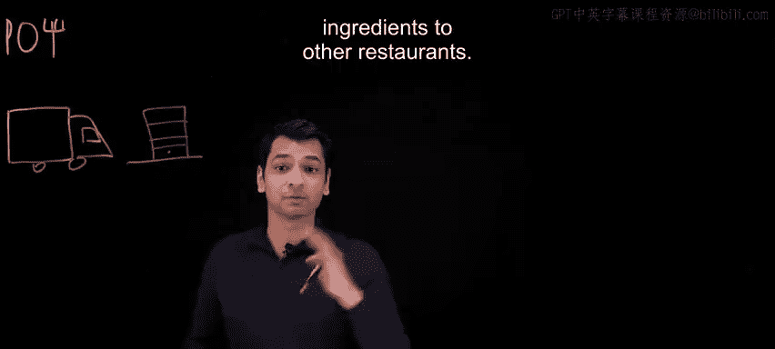

上周我在一家餐厅用餐，环顾四周，餐厅座无虚席。每位顾客的订单都准时送达。我不禁思考起餐厅将原始食材变成美味佳肴背后的物流过程。

让我们花一分钟思考一下。在一个商业厨房里，卡车会运送原始食材到装卸区，通常是大托盘的形式。卡车抵达装卸区，卸下托盘，然后继续上路，为其他餐厅运送更多食材。

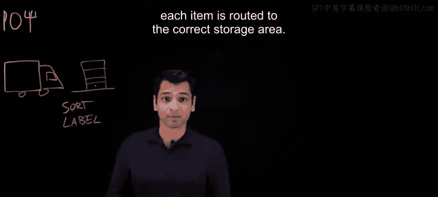

这只是简单部分。现在，我们实际上需要拆开这个托盘并进行处理。我们必须对托盘上的所有物品进行分类，为所有食材贴上标签。同时，我们还要确保每件物品都被送到正确的存储区域。这些物品可能进入储藏室存放干货，也可能进入大型步入式冰箱或冰柜，用于存放新鲜蔬菜和肉类。

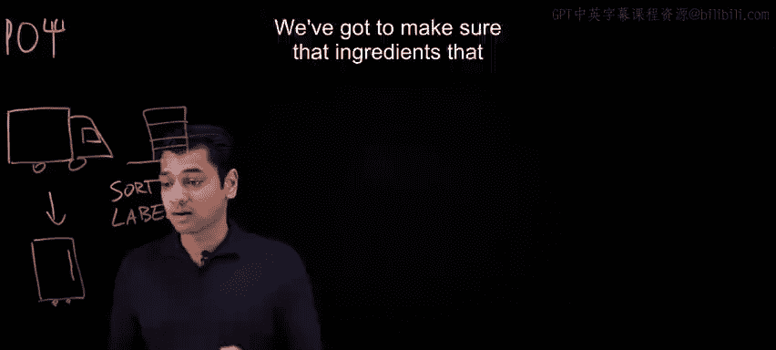

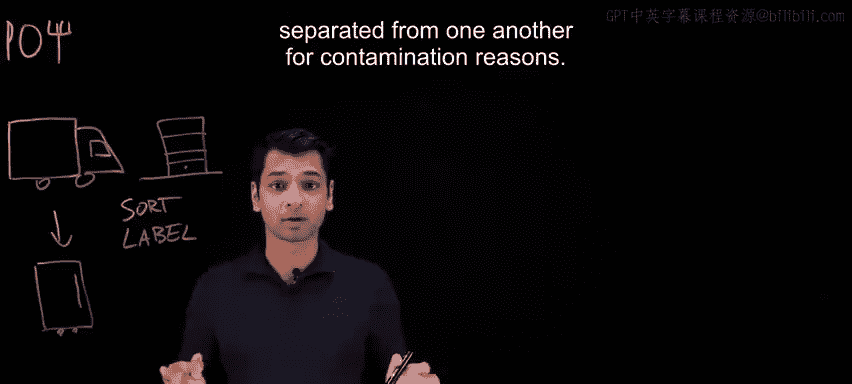

我们还需要组织好这些存储区域。我们必须确保先到期的食材被优先使用。出于防止交叉污染的考虑，我们必须确保某些食材彼此分开存放。同时，我们必须确保某些食材达到特定的温度要求，这也是为了食品安全。

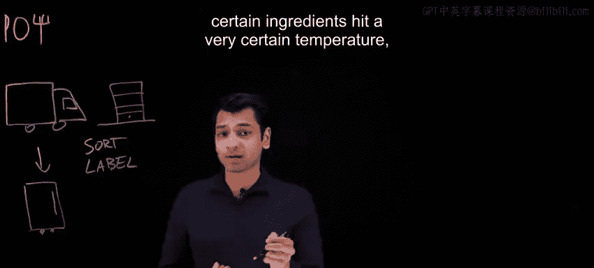

此外，我们需要尽可能快速地完成所有这些工作，以最大限度地减少食物浪费和食材在卡车或托盘上可能发生的腐败变质。如果没有这个过程，厨房里的厨师就无法高效或安全地工作。他们会花费大量时间寻找食材，而用于实际烹饪和为顾客上菜的时间就会减少。

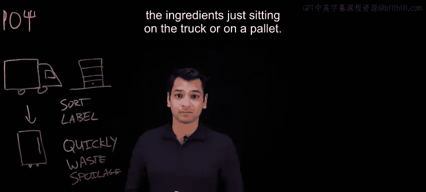

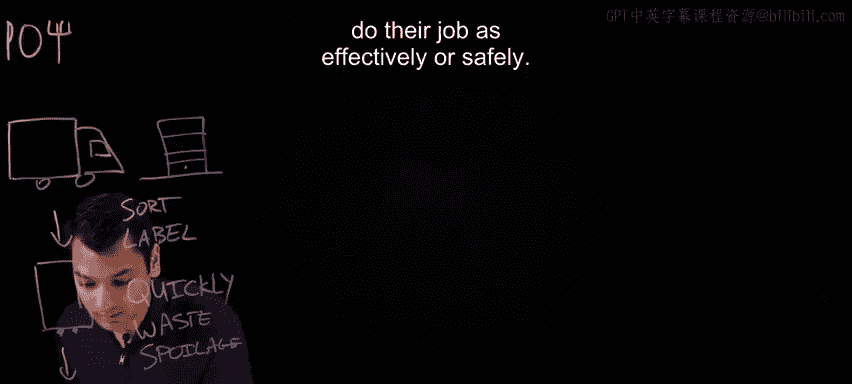

那么，这与数据有什么关系呢？如果我们仔细想想，完全相同的过程也存在于组织的数据架构中。

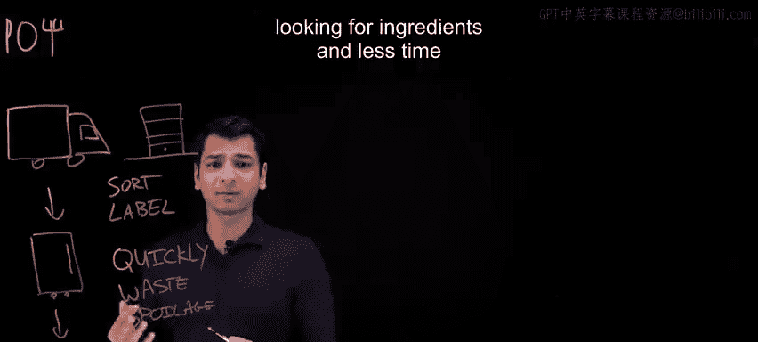

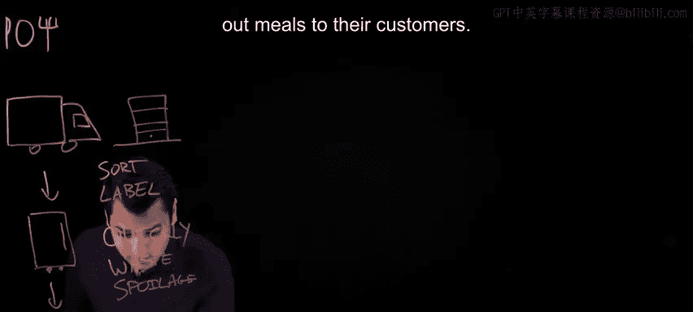

你的组织会从不同来源接收各种数据，例如不同的云环境、不同的运营应用程序。现在，我们甚至还有社交媒体数据。所有这些数据都涌入我们的组织，就像厨房从不同供应商那里接收食材一样。

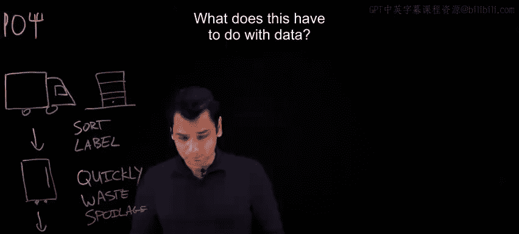

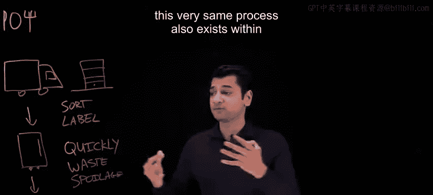

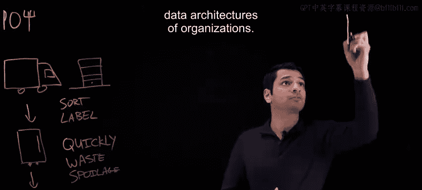

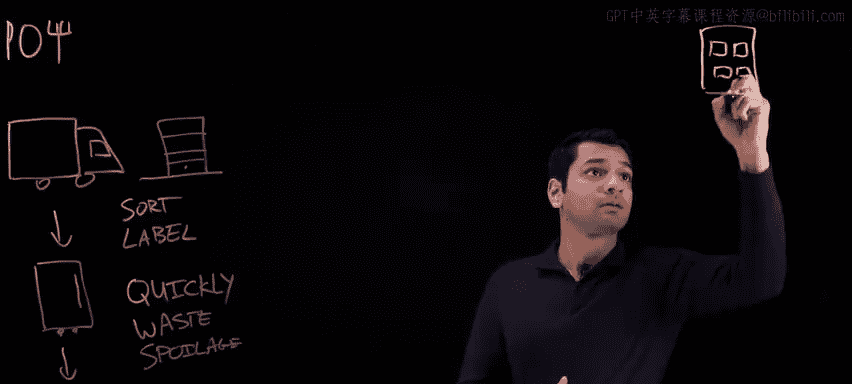

因此，数据不断涌入。我们需要一个快速的地方来存放所有不同类型、不同格式的数据，以备后用。于是，我们有了**数据湖**。

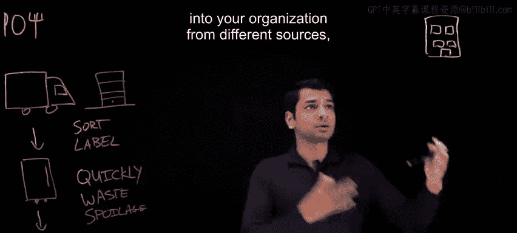

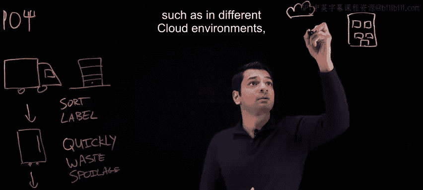

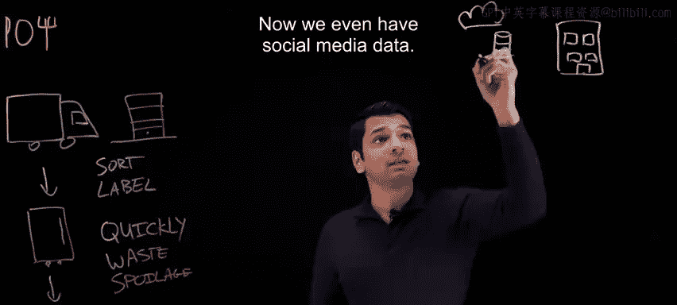

这些数据湖让我们能够以低廉的成本快速捕获原始的**结构化**、**非结构化**甚至**半结构化**数据。现在，就像在厨房里一样，我们不会真的在装卸区烹饪。我们必须将这些数据从其原始状态组织和转换，变成我们的业务想要生成的那种洞察和分析可用的东西。

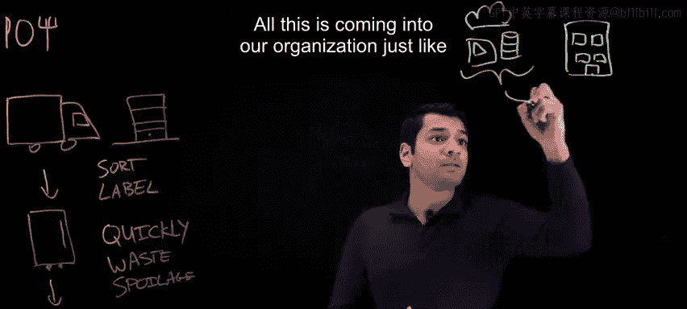

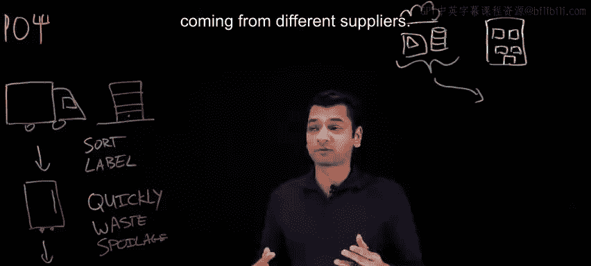

于是，我们有了**企业数据仓库**。数据有时从数据湖加载进来，有时从运营应用程序等其他来源加载进来。数据在这里被优化和组织，以运行非常特定的分析任务。这可能是为不同的商业智能工作负载提供支持，例如构建仪表板和报告，也可能是为其他分析工具提供数据。

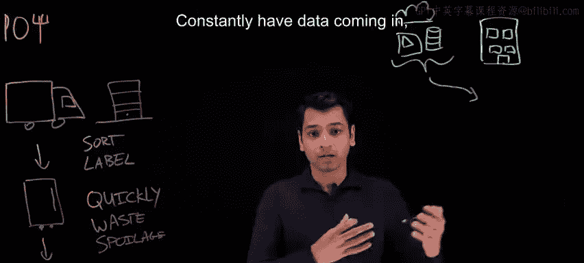

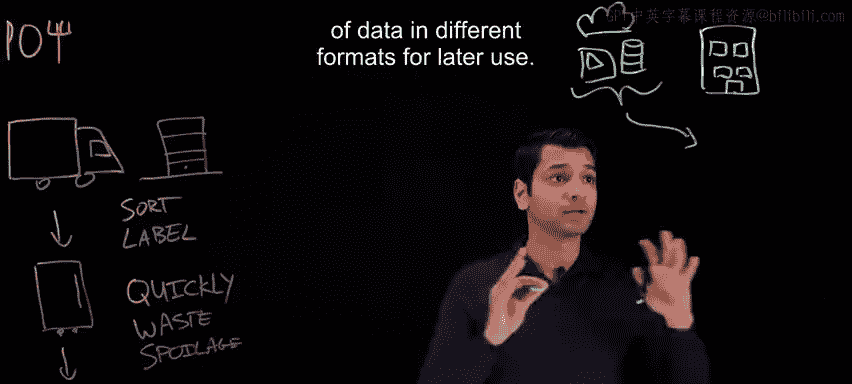

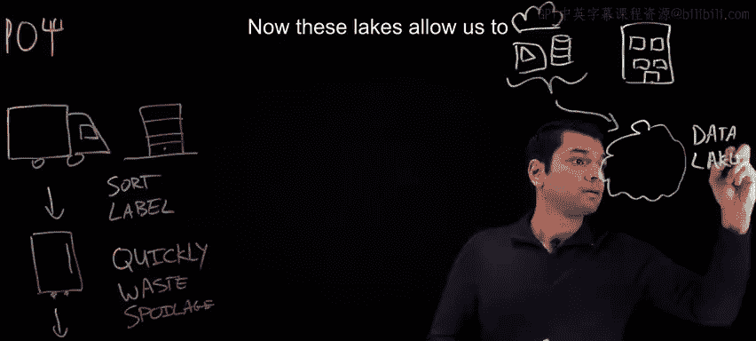

就像我们的储藏室和冰柜一样，仓库中的数据是经过清理、组织、治理的，并且其完整性应该是可信的。

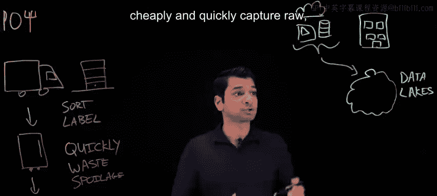

那么，在这种方法中我们看到哪些挑战呢？正如我们所说，数据湖确实非常适合以经济高效的方式捕获海量数据，但我们在**数据治理**和**数据质量**方面遇到了挑战。很多时候，这些数据湖会变成“数据沼泽”。

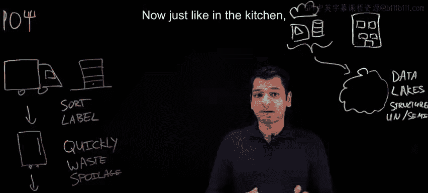

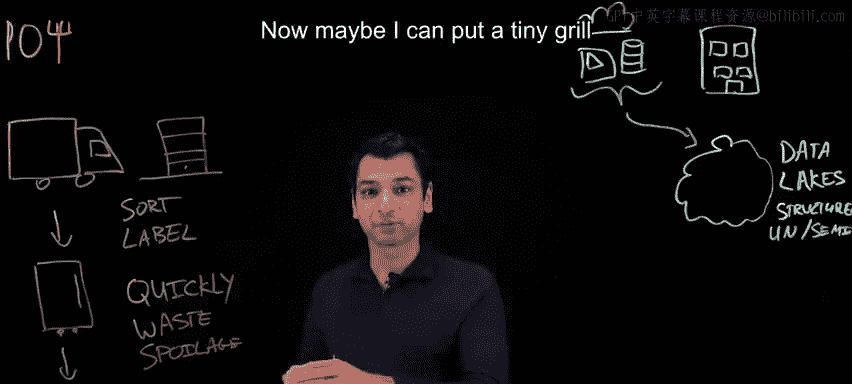

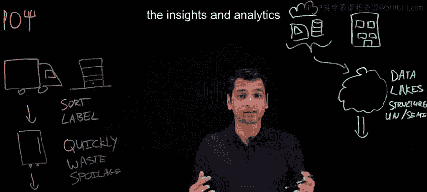

当存在大量重复、不准确或不完整的数据时，就会发生这种情况，使得跟踪和管理资产变得困难。试想一下，如果数据停滞不前会怎样？它会失去创造洞察的价值，就像餐厅里不使用的食材会随时间变质一样。

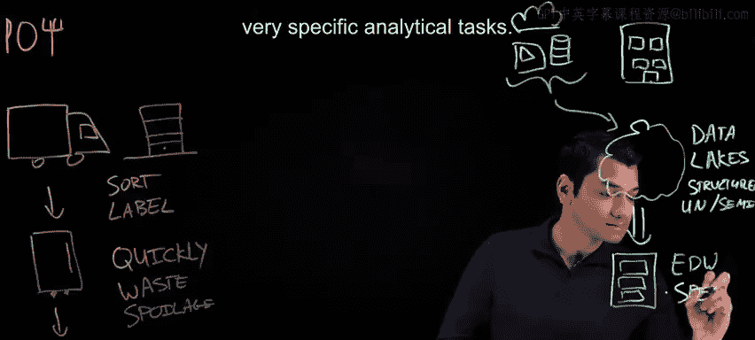

数据湖在查询性能方面也存在挑战，因为它们并非为处理复杂的分析查询而构建和优化，有时很难直接从湖中获取洞察。

现在，让我们看看数据仓库。它们在查询性能方面确实非常出色，但成本可能很高。就像那些大型冰柜运行成本可能非常高昂一样，我们不能把所有东西都放进数据仓库。它们可以更好地优化以维护数据治理和质量。

但是，它们对半结构化和非结构化数据源的支持有限，而这些恰恰是涌入我们组织增长最快的数据类型。此外，对于某些需要最新数据的应用程序类型，数据仓库有时可能太慢，因为对数据进行排序、清理和加载到仓库需要时间。

那么，我们该怎么办呢？开发人员退后一步，说道：让我们结合数据湖和数据仓库两者的优点，将它们融合成一种称为**数据湖仓**的新技术。

这样，我们获得了数据湖的**灵活性**和**成本效益**，同时也获得了数据仓库的**性能**和**结构化**优势。

我们将在未来的视频中更具体地讨论数据湖仓的架构。但从价值角度来看，湖仓让我们能够以低成本的方式存储来自爆炸性增长的新数据源的数据，然后利用内置的数据管理和治理功能，使我们能够快速地为商业智能和高性能机器学习工作负载提供支持。

我们可以通过多种方式开始使用湖仓，例如现代化我们现有的数据湖，或者补充我们的数据仓库以支持这些新型的AI和机器学习驱动的工作负载。这些也将在未来的视频中讨论。

所以，下次你在餐厅时，希望你思考一下你盘子里的菜肴是如何到达那里的，以及食材从厨房到你盘中的餐食所经历的步骤。

---

**本节课总结**

本节课中，我们一起学习了：
1.  **数据湖**：一个用于低成本、快速存储原始、多格式（结构化、半结构化、非结构化）数据的存储库，类似于餐厅的装卸区。
2.  **数据仓库**：一个用于存储经过清洗、组织、治理的结构化数据的系统，针对分析查询进行了优化，类似于餐厅里井然有序的储藏室和冰柜。
3.  **数据湖仓**：一种融合了数据湖的灵活性与成本效益，以及数据仓库的性能与治理优势的新型架构，旨在解决前两者各自的挑战。
4.  通过餐厅后厨的比喻，我们清晰地理解了数据从原始状态到可用洞察的整个处理流程，以及不同数据存储组件在其中扮演的角色。