# 008：数据仓库体系结构概述 🏗️

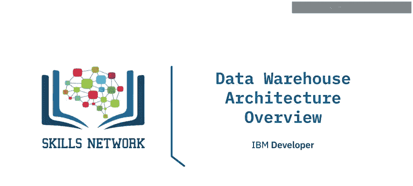

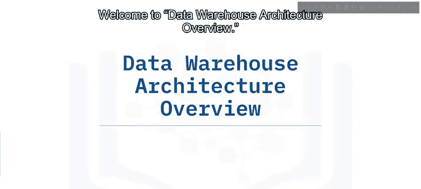

在本节课中，我们将要学习数据仓库体系结构的基础知识。我们将了解驱动数据仓库设计的用例，描述通用的数据仓库架构及其组件层次，区分通用架构与企业级参考架构，并介绍IBM的企业数据仓库平台参考架构。

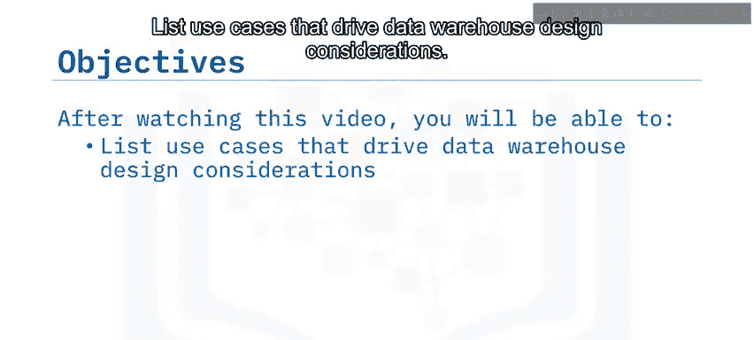

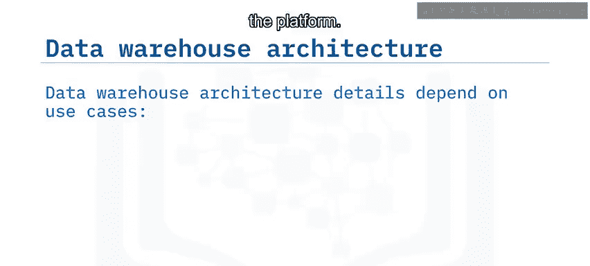

## 通用数据仓库架构模型

上一节我们介绍了课程目标，本节中我们来看看数据仓库的通用架构模型。数据仓库架构的具体细节取决于平台的使用目的，其需求可能包括报告生成与仪表盘、探索性数据分析、自动化与机器学习以及自助式分析。

公司可以基于以下通用企业数据仓库架构模型，来适配其分析需求。该架构包含多个层次或组件：

以下是该架构的主要组成部分：
*   **数据源**：例如平面文件、数据库和现有的业务系统。
*   **ETL层**：用于提取、转换和加载数据。
*   **可选的暂存区和沙盒区**：用于存放数据和开发工作流。
*   **企业数据仓库存储库**：核心数据存储。
*   **数据集市**：当涉及多个数据集市时，这种架构被称为“中心辐射型”架构。
*   **分析层和商业智能工具**：用于数据分析和可视化。

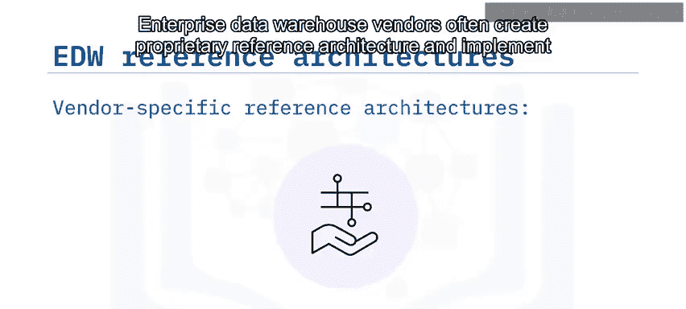

此外，数据仓库还负责在整个网络中为流入的数据以及传递到后续阶段和用户的数据实施安全策略。

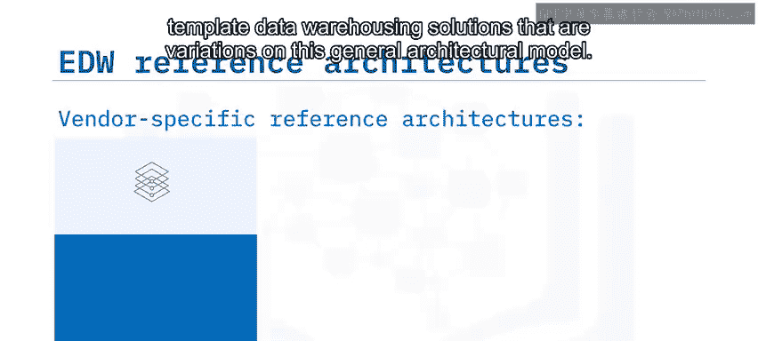

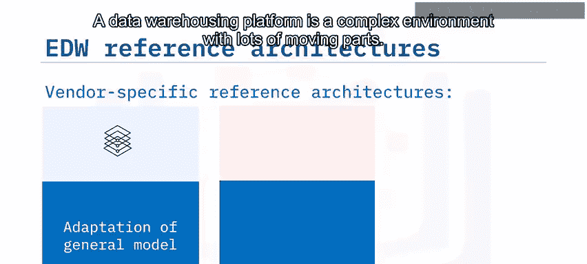

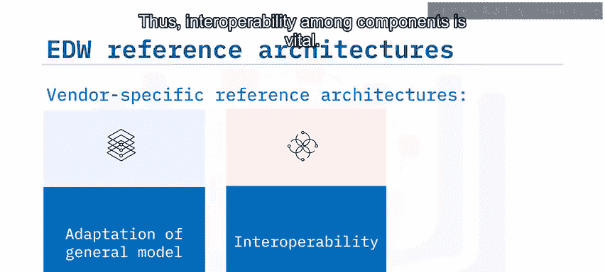

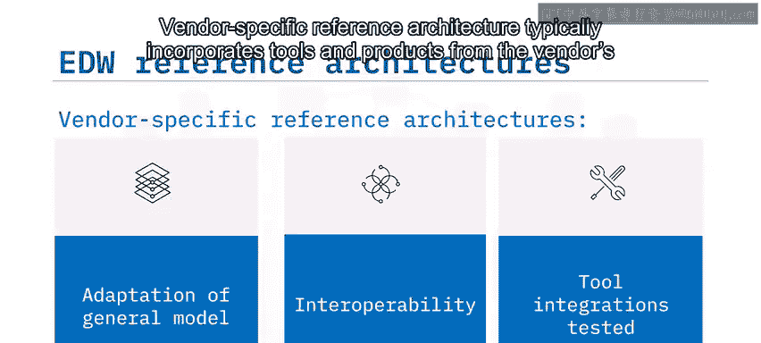

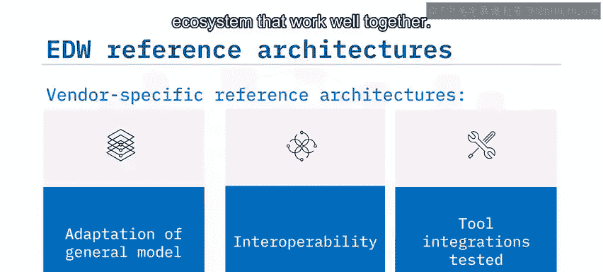

企业数据仓库供应商通常会创建专有的参考架构，并实现基于此通用架构模型变体的模板化数据仓库解决方案。数据仓库平台是一个包含许多活动部件的复杂环境，因此组件间的互操作性至关重要。供应商特定的参考架构通常会整合其生态系统内能够良好协同工作的工具和产品。

接下来，让我们了解一下IBM特定的参考数据仓库架构。

## IBM企业数据仓库参考架构

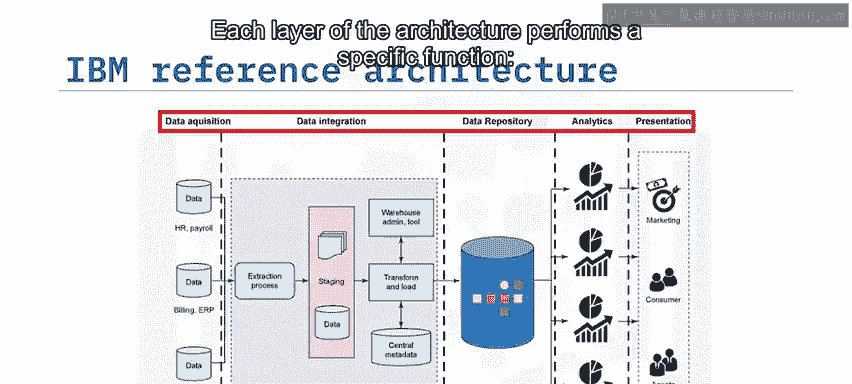

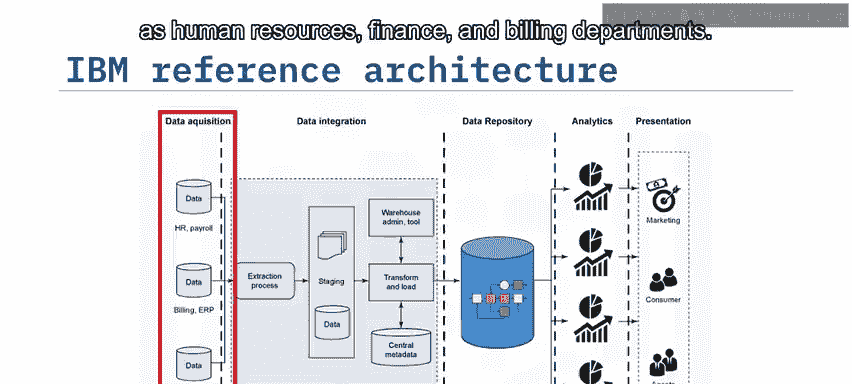

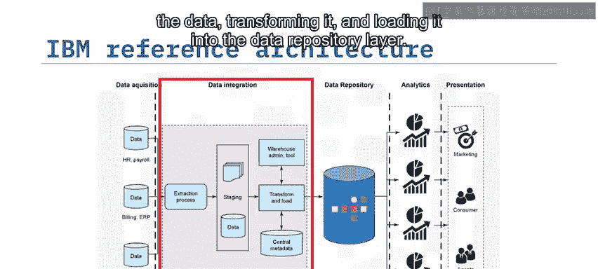

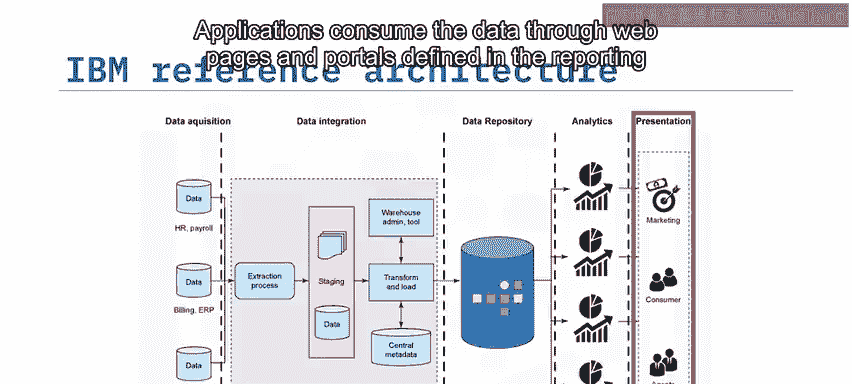

上一节我们了解了通用架构，本节中我们来看看IBM的具体实现。IBM的参考架构包含多个层次，每一层都执行特定的功能。

以下是IBM参考架构的各层及其功能：
*   **数据获取层**：包含从人力资源、财务和计费等源系统获取原始数据的组件。
*   **数据集成层**：本质上是一个暂存区，包含用于提取、转换数据并将其加载到数据存储库层的组件。它还包含管理工具和中央元数据。
*   **数据存储库层**：存储集成后的数据，通常采用关系模型。
*   **分析层**：通常以多维数据集格式存储数据，以便用户更轻松地进行分析。
*   **呈现层**：整合了为不同用户组提供数据访问的应用程序，例如营销分析师、用户和代理。应用程序通过网页、门户、报告工具中定义的界面或Web服务来消费数据。

## IBM相关产品套件

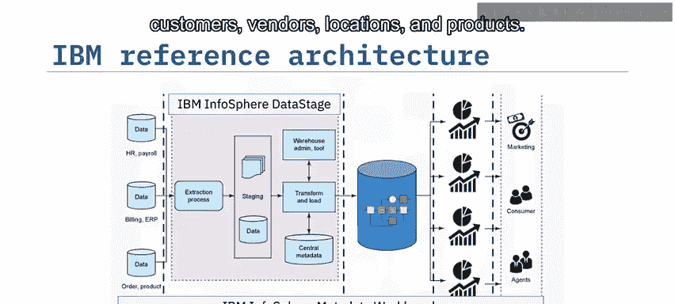

IBM的参考架构通过其InfoSphere套件中的多个产品得到支持和扩展。

以下是支持该架构的核心IBM产品：
*   **IBM InfoSphere DataStage**：一个可扩展的ETL平台，可在本地和云环境中近乎实时地集成所有数据类型。
*   **IBM InfoSphere Metadata Workbench**：提供端到端的数据流报告和影响分析，帮助组织在环境中轻松共享、定位和检索信息资产。利用其内置的数据流报告功能来监控DataStage如何移动和转换数据。
*   **IBM InfoSphere QualityStage**：旨在支持数据质量和信息治理计划，使您能够调查、清理和管理数据。此解决方案有助于创建和维护关键实体的一致视图。
*   **IBM Db2 Warehouse**：一个高性能、可扩展且可靠的数据管理产品系列，用于管理本地和云环境中的结构化和非结构化数据。
*   **IBM Cognos Analytics**：一个先进的商业智能平台，可生成报告、计分板和仪表盘，执行探索性数据分析，甚至可以使用多个来源来管理和连接数据。

## 总结

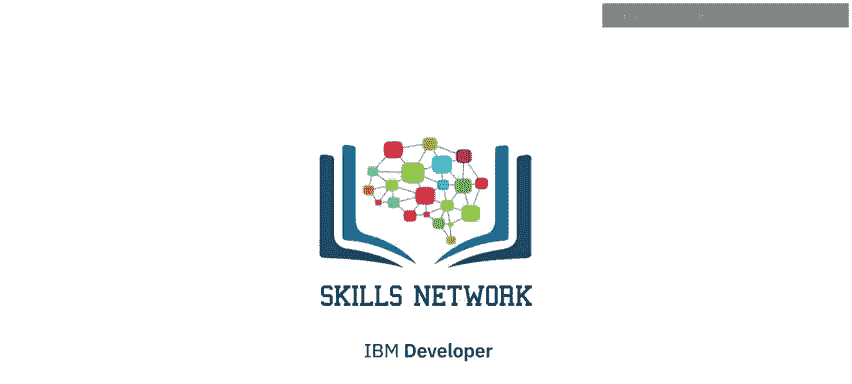

本节课中我们一起学习了数据仓库体系结构的基础知识。我们了解到，通用数据仓库平台的架构模型包括数据源、ETL管道、可选的暂存区和沙盒区、企业数据仓库存储库、可选的数据集市以及分析和商业智能工具。公司可以修改通用的企业数据仓库架构以满足其分析需求。供应商基于通用模型提供经过组件互操作性测试的专有参考架构。最后，IBM的企业数据仓库解决方案将InfoSphere、Db2 Warehouse和Cognos Analytics结合在一起。