# 009：立方体、聚合与物化视图


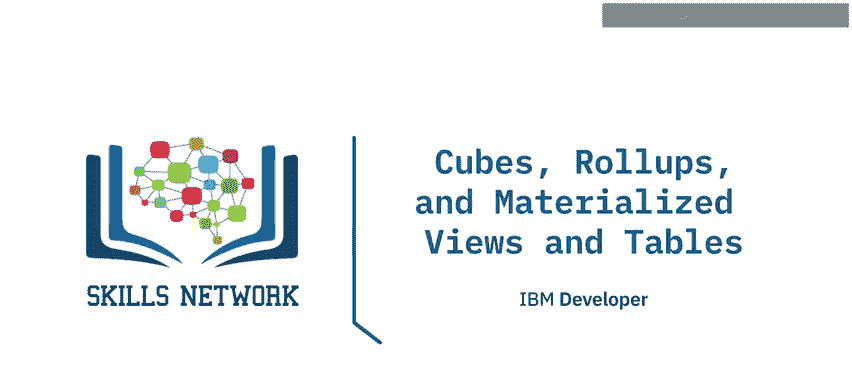

在本节课中，我们将要学习数据立方体的概念、相关操作（如切片、切块、钻取、旋转和上卷），以及物化视图的定义、用途和在不同数据库系统中的创建方法。

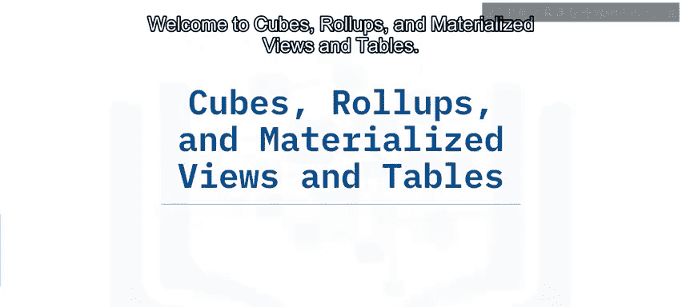

---

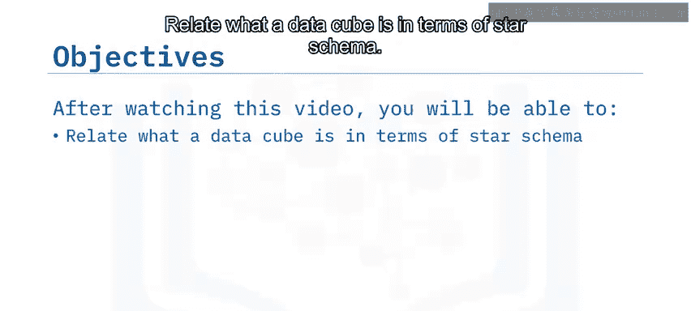

## 🧊 数据立方体概念

上一节我们介绍了数据仓库的基本结构，本节中我们来看看数据立方体。数据立方体是星型模式或多维模式的一种可视化表示，用于在线分析处理。

数据立方体的坐标由从星型模式中选择的一组维度定义。以下是一个基于虚构销售OLAP系统的立方体示例，它展示了三个维度：产品类别、销售所在州/省以及销售年份。立方体的单元格则由模式中的事实（如总销售额）填充。

例如，单元格中的数值“243”可能代表某个特定产品、州和年份组合下的总销售额为243,000美元。

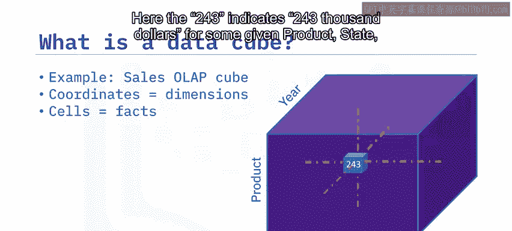

---

## 🔪 数据立方体操作

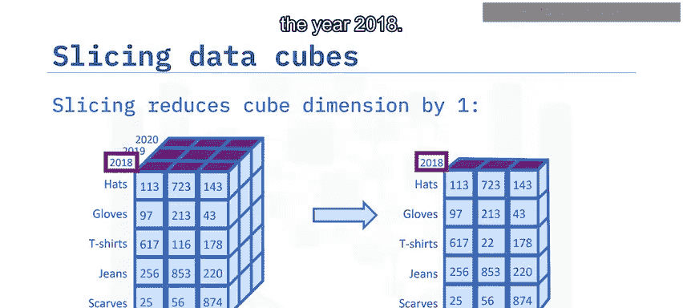

可以对数据立方体执行多种操作，以从不同角度分析数据。以下是几种核心操作的解释：

### 切片
切片操作涉及从某个维度中选择单个成员，从而得到一个比原立方体少一个维度的新立方体。

例如，从“年份”维度中仅选择“2018年”，可以分析2018年所有销售州和所有产品的销售总额。

### 切块
切块操作涉及从某个维度中选择一个值的子集，从而缩小该维度的范围。

例如，从“产品类型”维度中仅选择“手套”、“T恤”和“牛仔裤”，可以将分析视图限制在这几种产品类型上。

### 钻取
在雪花模式中，维度内部可能存在层次或子类别，可以进行钻取分析。

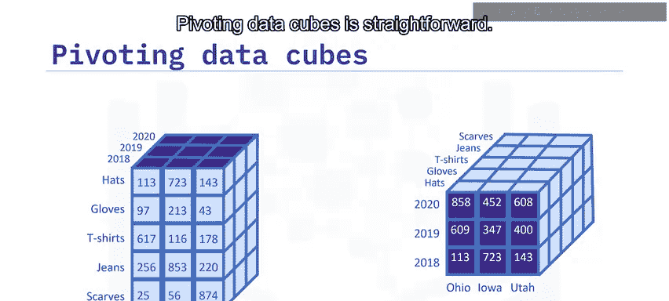

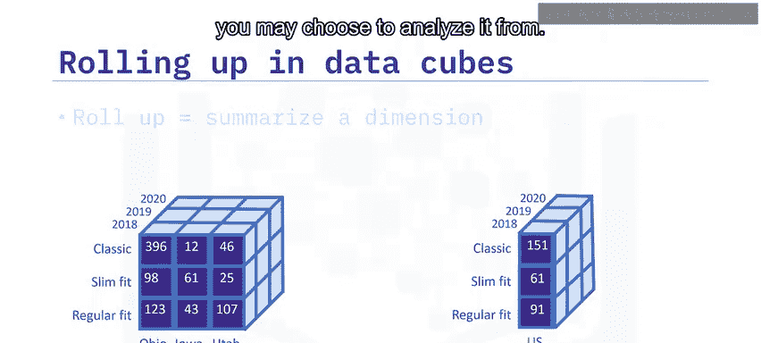

例如，可以向下钻取到“产品类别”维度中的“T恤”成员，进一步查看更具体的产品组，如“经典款”、“修身款”和“常规款”。向上钻取则是相反的过程，将返回到更高级别的视图。

### 旋转
旋转数据立方体很简单，它涉及立方体的旋转，改变维度的排列方式。

例如，交换“年份”和“产品”维度的位置，同时固定“州”维度。旋转不改变信息内容，只是改变了分析数据的视角。

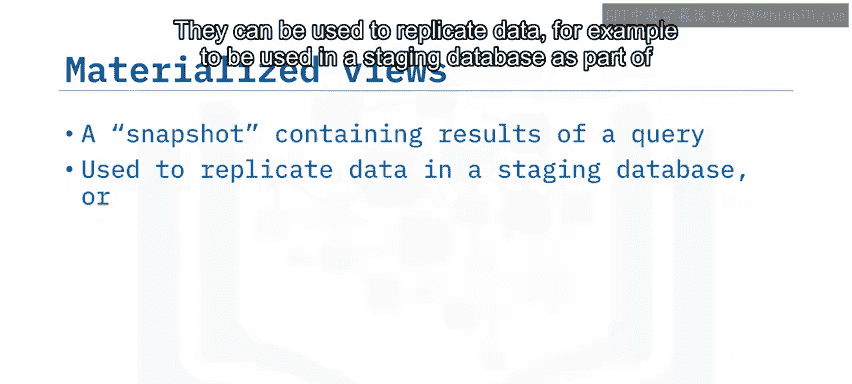

### 上卷
上卷意味着沿某个维度进行汇总。可以通过应用聚合函数（如计数、最小值、最大值、求和、平均值）来上卷一个维度。

例如，可以通过对三个美国州的销售额进行水平求和，然后除以三，来计算经典款、修身款和常规款T恤的平均售价。

---

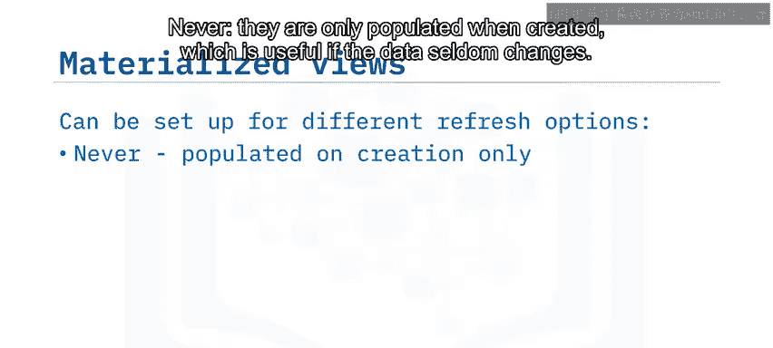

## 📋 物化视图

物化视图本质上是查询结果的本地只读副本或快照。它们主要有两个用途：一是复制数据（例如，在ETL过程中用于暂存数据库），二是预计算并缓存昂贵的查询（如连接或聚合），以供数据分析环境使用。

物化视图通常提供自动刷新数据的选项，以保持查询结果的最新状态。由于物化视图可以被查询，因此可以安全地使用它们，而无需担心影响源数据库。

以下是物化视图常见的几种刷新选项：
*   **创建时填充**：仅在创建时填充数据，适用于数据很少更改的情况。
*   **按需刷新**：在数据更改后手动刷新。
*   **定时刷新**：例如，在每日数据加载后刷新。
*   **立即刷新**：在每个语句执行后自动刷新。

---

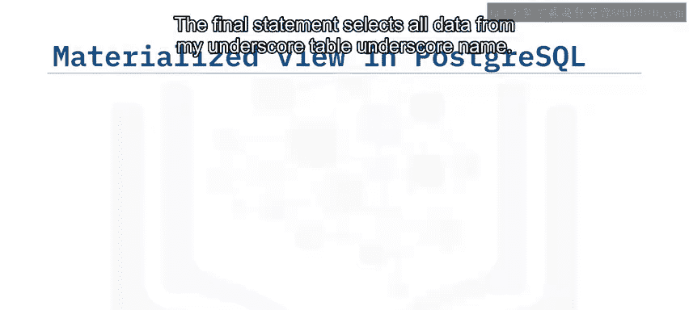

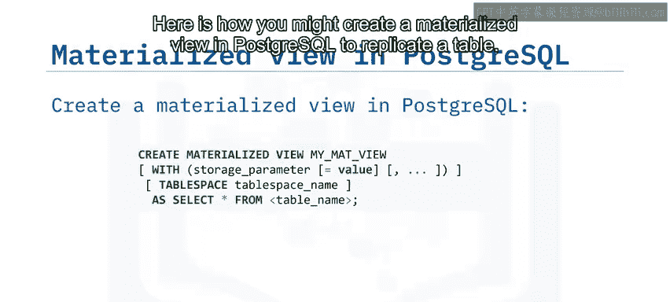

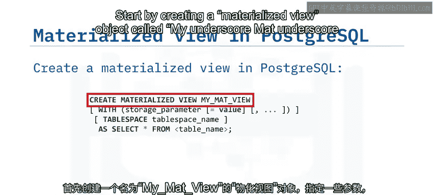

## 💻 在不同数据库中创建物化视图

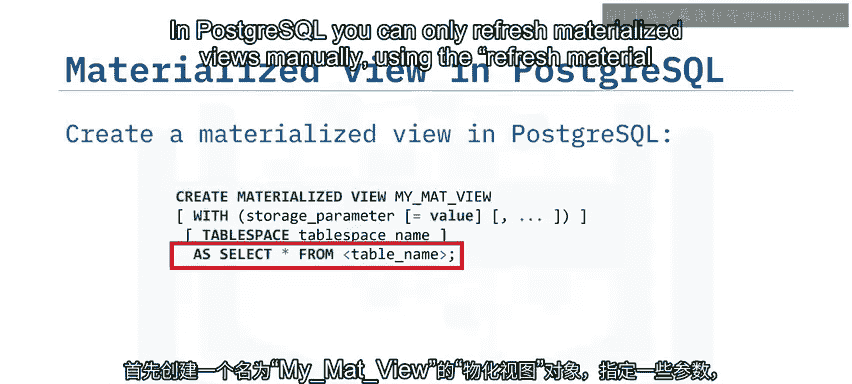

上一节我们了解了物化视图的概念和用途，本节中我们来看看如何在不同的数据库系统中创建它们。

### 在 Oracle 中创建物化视图
以下是在Oracle中使用SQL语句创建物化视图的示例：
```sql
CREATE MATERIALIZED VIEW my_mat_view
REFRESH FAST
START WITH SYSDATE
NEXT SYSDATE + 1
AS SELECT * FROM my_table_name;
```
这段代码创建了一个名为 `my_mat_view` 的物化视图，指定了快速（增量）刷新类型，设置从今天开始，并每天刷新一次。最后的 `SELECT` 语句定义了视图的数据来源。

### 在 PostgreSQL 中创建物化视图
以下是在PostgreSQL中创建用于复制表的物化视图的示例：
```sql
CREATE MATERIALIZED VIEW my_mat_view
TABLESPACE tablespace_name
AS SELECT * FROM table_name;
```
这段代码创建了一个名为 `my_mat_view` 的物化视图，并指定了表空间和源表。需要注意的是，在PostgreSQL中，目前只能使用 `REFRESH MATERIALIZED VIEW` 命令手动刷新物化视图。

### 在 DB2 中创建物化查询表
在DB2中，物化视图被称为物化查询表。以下是IBM在线文档中创建一个由系统维护、立即刷新的MQT示例：
```sql
CREATE TABLE emp_mqt AS (
    SELECT e.empno, e.lastname, d.deptname
    FROM employee e, department d
    WHERE e.workdept = d.deptno
)
DATA INITIALLY DEFERRED
REFRESH IMMEDIATE;
```
这段代码创建了一个基于 `employee` 和 `department` 表的MQT。`DATA INITIALLY DEFERRED` 意味着数据不会在创建表时立即插入；`REFRESH IMMEDIATE` 指定查询应自动刷新。

---

## 📝 总结

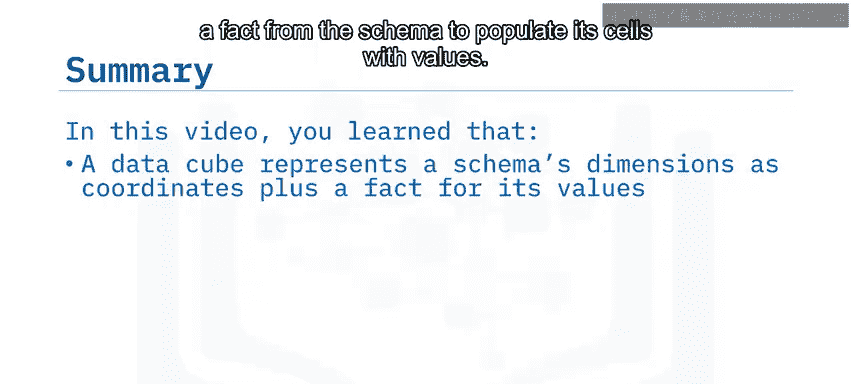

本节课中我们一起学习了数据立方体和物化视图的核心概念。

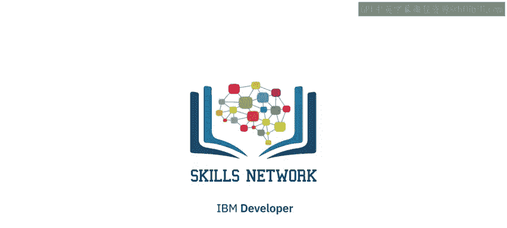

*   数据立方体将星型或雪花模式的维度表示为坐标，并用模式中的事实填充其单元格。
*   可以对数据立方体应用多种操作，如向下钻取层次维度、切片、切块和上卷。
*   物化视图可用于复制数据或预计算昂贵的查询。
*   现代企业数据仓库工具（如Oracle和DB2）允许您自动保持物化视图的最新状态。