# 011：使用星型和雪花模式的数据建模 🗄️

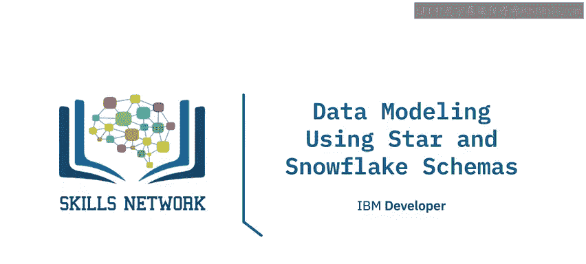

在本节课中，我们将要学习数据建模中的两种核心模式：星型模式和雪花模式。我们将了解它们的基本概念、设计原则以及如何在实际场景中应用。

## 概述

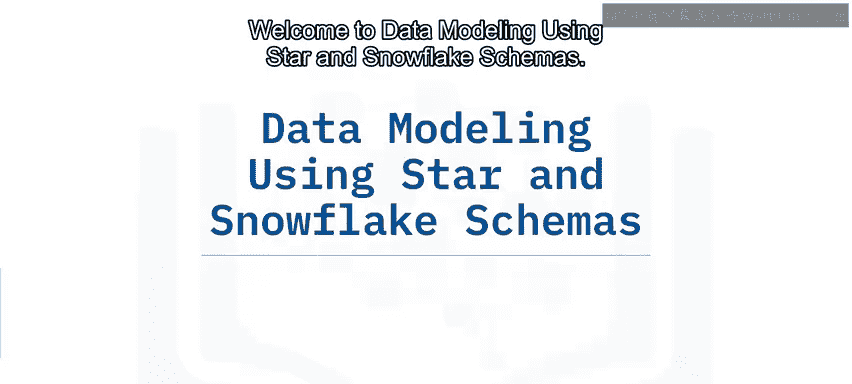

星型模式和雪花模式是构建数据仓库和数据集市时常用的数据建模技术。它们通过组织事实表和维度表，为商业智能分析提供高效、结构化的数据基础。

## 星型模式建模

上一节我们介绍了数据建模的基本概念，本节中我们来看看星型模式的具体构成。

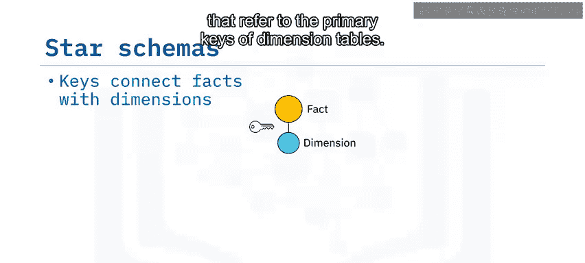

星型模式的核心是一个位于中心的事实表，它通过外键与多个维度表相连。事实表包含业务过程的度量值（事实），而维度表则提供描述这些事实的上下文信息。

一个星型模式可以看作一个图，其中节点是事实表和维度表，边是这些表之间的关系。这种模式常用于开发称为“数据集市”的专用数据仓库。

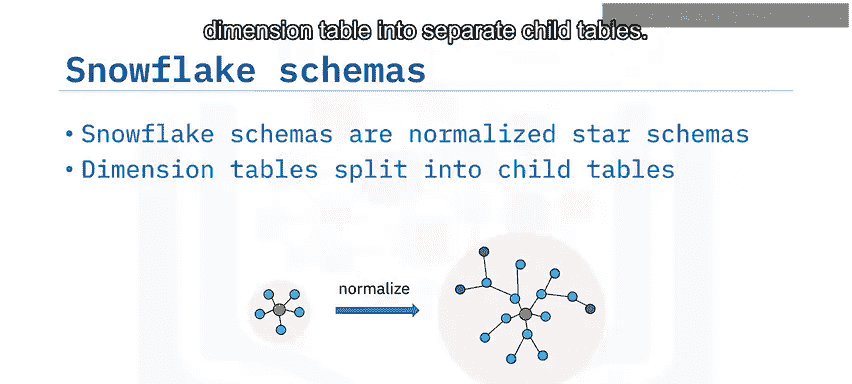

## 雪花模式建模

星型模式是基础，雪花模式则是在其基础上的一种扩展。

雪花模式可以看作是规范化的星型模式。规范化是指将维度表中的层级或层次结构分离到各自的子表中。一个模式只要至少有一个维度表被规范化，就可以被视为雪花模式。

## 设计星型模式的原则

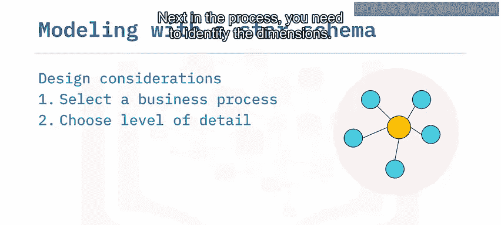

了解了两种模式的定义后，我们来看看设计一个星型模式数据模型时需要考虑哪些通用原则。

以下是设计星型模式的四个关键步骤：

1.  **选择业务过程**：确定你想要建模的业务活动，例如销售、生产或供应链物流。
2.  **确定粒度**：定义需要捕获的数据详细程度。例如，是年度区域销售总额，还是销售人员每月的销售业绩。
3.  **识别维度**：确定描述事实的属性，例如日期、时间、人员、地点和事物的名称。
4.  **识别事实**：确定在业务过程中需要度量的数值，例如销售额、数量、折扣等。

## 应用实例：A to Z折扣仓库

让我们将这些原则应用到一个具体场景中。假设你是一名数据工程师，需要为一家名为“A to Z折扣仓库”的新店设计数据方案。

他们希望建立一个数据计划来捕获每天在收银台发生的POS（销售点）交易。因此，“销售点交易”就是你要建模的业务过程。

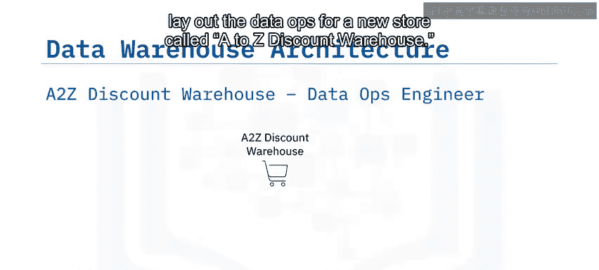

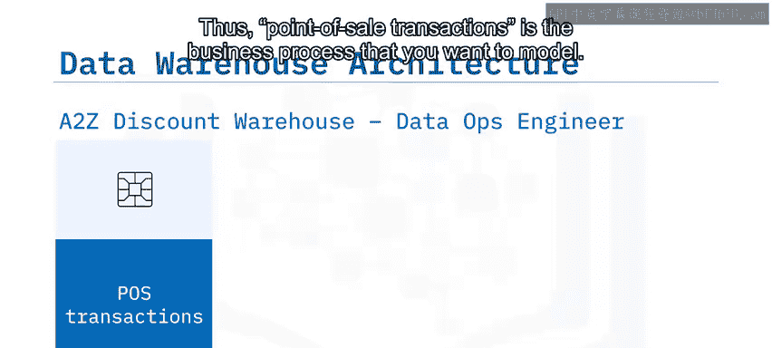

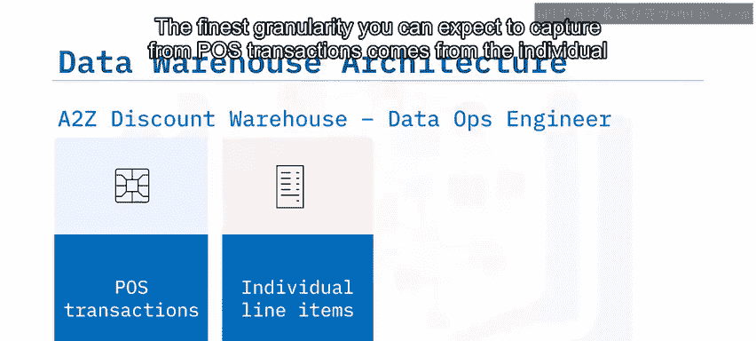

你可以从POS交易中捕获的最细粒度数据来自单个交易行项目，这正是A to Z希望捕获的信息。

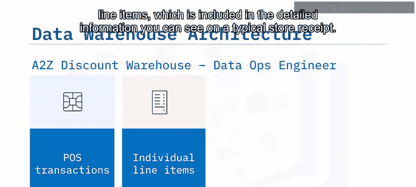

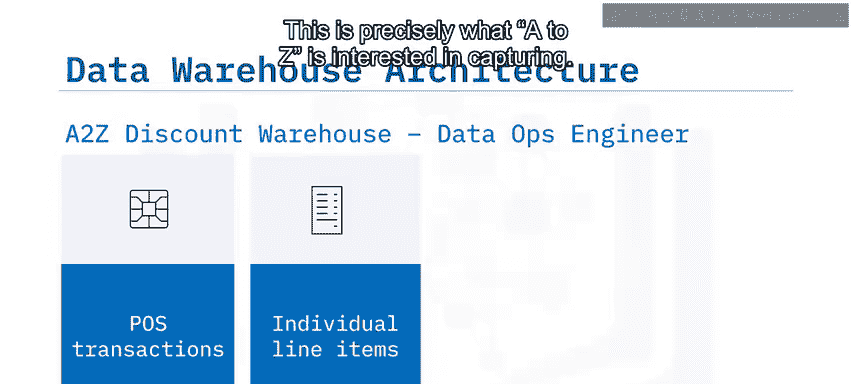

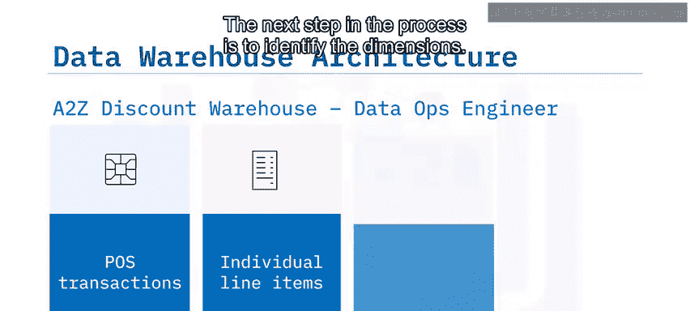

下一步是识别维度。这包括以下属性：

*   购买日期和时间
*   商店名称
*   购买的产品
*   处理交易的收银员

你还可以添加其他维度，例如支付方式、该行项目是退货还是购买，以及客户会员号。

现在考虑事实。你需要识别以下事实：

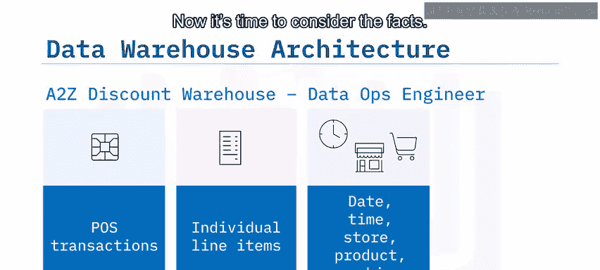

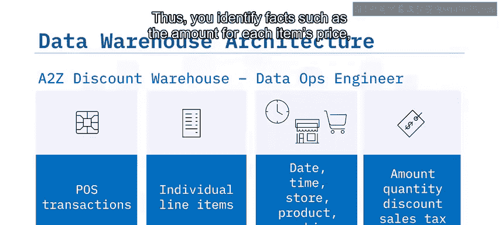

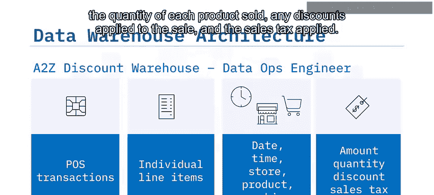

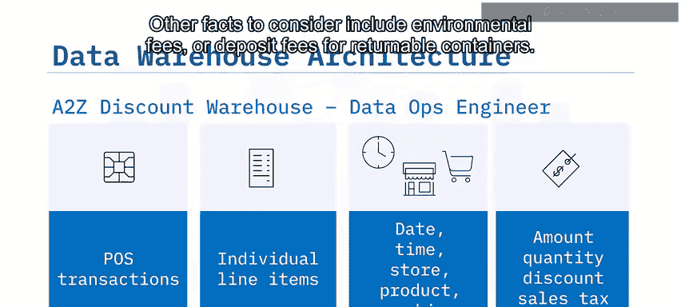

*   每个商品的价格金额
*   每个售出产品的数量
*   应用于销售的折扣
*   适用的销售税

其他可考虑的事实还包括环保费或可退回容器的押金。

## 构建星型模式

基于以上分析，现在可以开始为A to Z折扣仓库构建星型模式了。

在你的星型模式中心，是一个POS事实表。它包含以下内容：

*   `PoID`：交易中每个行项目的唯一ID。
*   度量值（事实）：交易金额（美元）、涉及的商品数量、销售税以及应用的折扣。

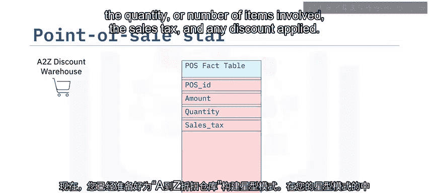

交易中的每个行项目都关联多个维度。你将它们作为外键包含在事实表中，链接到维度表的主键。

例如，商品售出所在的商店名称保存在名为`Store`的维度表中。在事实表中，通过外键`StoreID`的值来标识，该键是`Store`表的主键。

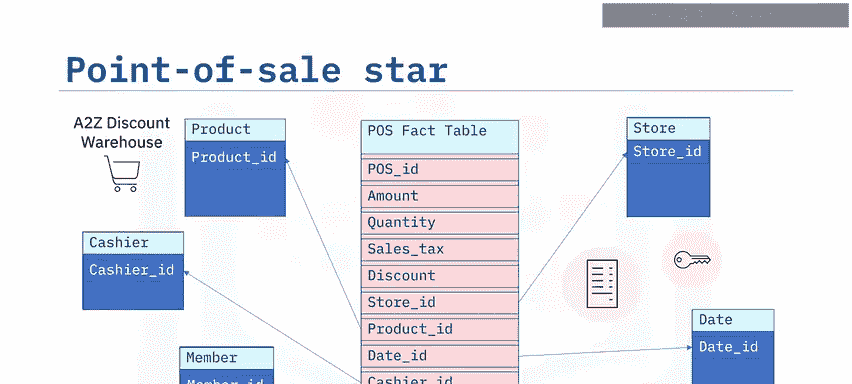

产品信息存储在`Product`表中，由`ProductID`键唯一标识。同样，交易日期由`DateID`键标识，输入交易的收银员由`CashierID`键标识，涉及的会员由`MemberID`标识。

## 从星型模式到雪花模式

我们已经构建了一个星型模式，现在看看如何通过规范化将其扩展为雪花模式。

从你的星型模式开始，可以将维度表中的某些细节提取到它们自己单独的维度表中，从而创建一个表层次结构。

例如，可以使用一个单独的`City`表来记录商店所在的城市，同时在`Store`表中包含一个外键`CityID`以维持链接。你可能还有用于城市、州/省、预定义销售区域以及商店所在国家的表和键。

我们可以继续规范化其他维度，例如产品的品牌和所属类别、日期对应的星期几和月份，以及季度等。

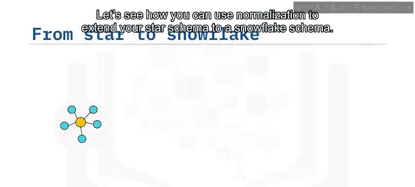

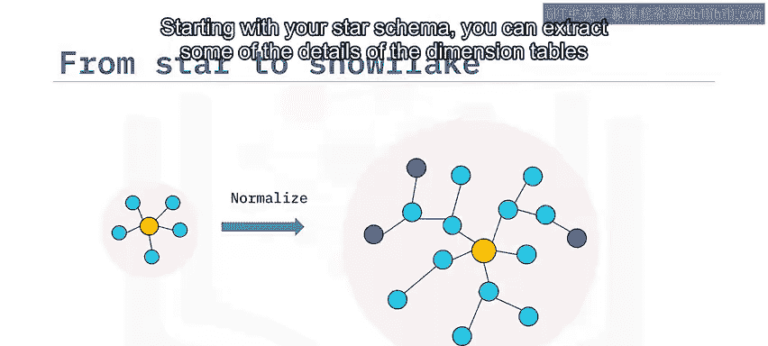

星型模式的这种规范化版本被称为雪花模式，因其多层分支结构类似于雪花。

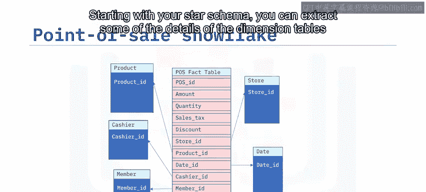

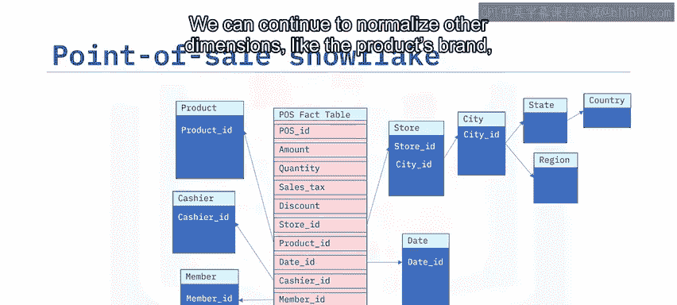

就像在计算中使用指针指向内存位置一样，规范化减少了数据的内存占用。

## 总结

本节课中我们一起学习了数据建模中的星型模式和雪花模式。

*   事实表和维度表，连同外键和主键，共同构成了星型和雪花建模模式。
*   使用星型模式进行数据建模的设计考虑包括识别业务过程、其粒度、事实和维度。
*   雪花模式可以描述为规范化的星型模式，其中规范化涉及将维度表分离为由父维度的层级或层次结构定义的单独表，从而减少存储占用。

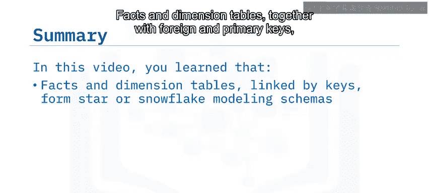

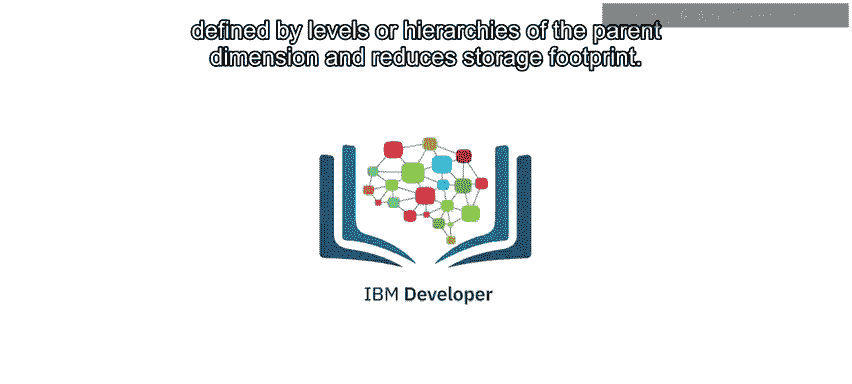

通过掌握这两种模式，你可以为高效的数据分析和商业智能报告打下坚实的数据基础。