# 012：数据仓库的暂存区

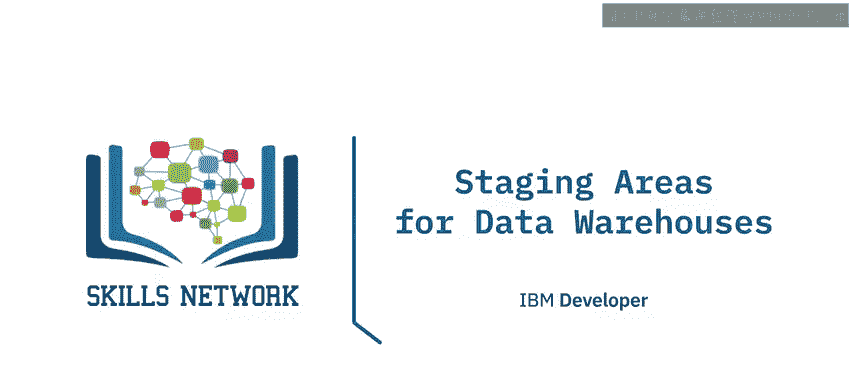

在本节课中，我们将要学习数据仓库暂存区（Staging Area）的概念、作用以及典型应用场景。暂存区是数据仓库架构中的一个关键组成部分，它作为数据源与目标系统之间的桥梁，主要用于ETL（提取、转换、加载）处理。

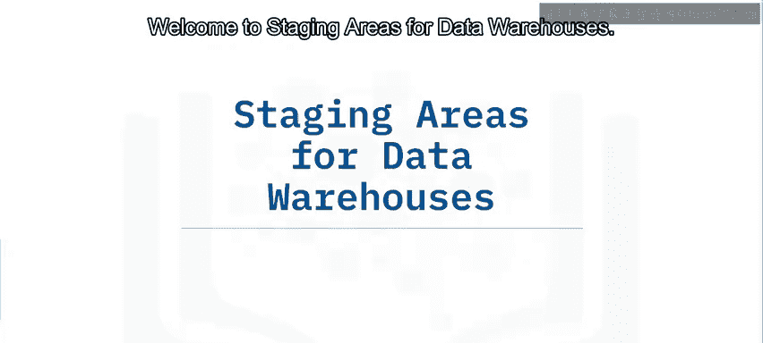

---

## 🧱 什么是数据仓库暂存区？

数据仓库暂存区可以被视为一个用于ETL处理的**中间存储区域**。它充当数据源与目标数据仓库、数据集市或其他数据存储库之间的桥梁。

暂存区通常是**临时性**的，这意味着在ETL工作流成功运行后，其中的数据通常会被清除。然而，许多架构也会出于归档或故障排除的目的而保留数据。暂存区对于监控和优化ETL工作流也非常有用。

暂存区可以通过多种方式实现，包括：
*   存储在目录中并使用Bash或Python等工具管理的简单**平面文件**（如CSV文件）。
*   关系数据库（如DB2）中的一组**SQL表**。
*   数据仓库或商业智能平台（如Cognos Analytics）内的一个**独立数据库实例**。

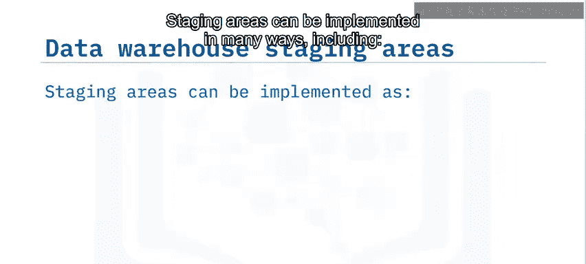

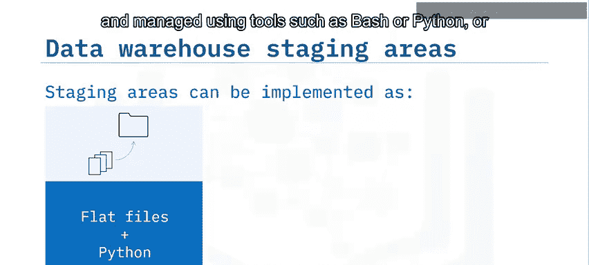

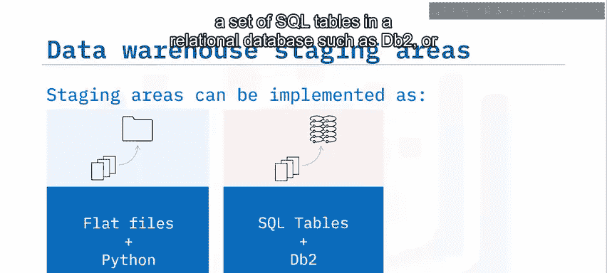

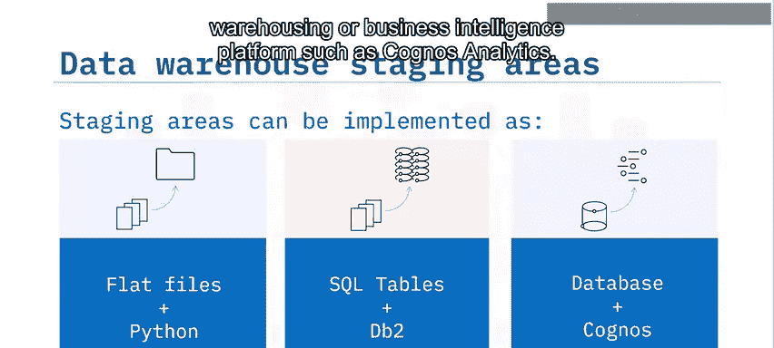

---

## 🏗️ 暂存区架构示例

上一节我们介绍了暂存区的定义，本节中我们通过一个示例用例来探索一个包含暂存区的数据仓库的可能架构。

假设某企业希望创建一个专门的成本会计在线分析处理系统。所需数据由企业内独立的在线事务处理系统管理，分别来自薪资、销售和采购部门。

以下是数据从源系统流向目标系统的典型步骤：

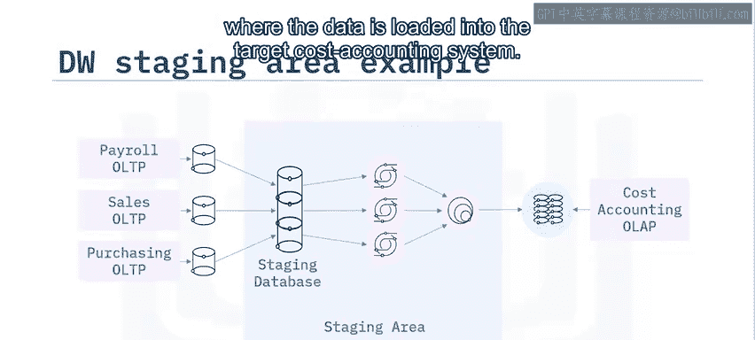

1.  **提取**：数据从这些独立的系统中被提取出来，并加载到暂存数据库中创建的各个**暂存表**中。
2.  **转换**：在暂存区中，使用SQL等工具对这些表中的数据进行**转换**，使其符合成本会计系统的要求。
3.  **集成**：转换后的表可以被**集成**或**连接**成一个单一的表。
4.  **加载**：最后阶段是**加载**阶段，数据被加载到目标成本会计系统中。

这个过程可以概括为：**源系统 -> 暂存区（提取、转换、集成） -> 目标系统**。

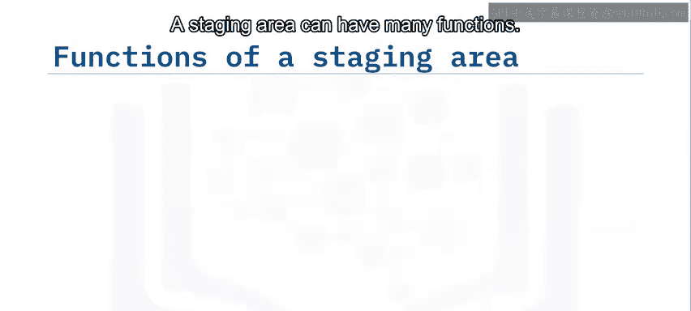

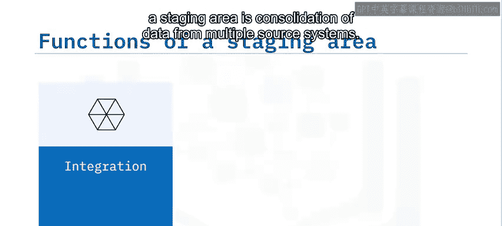

---

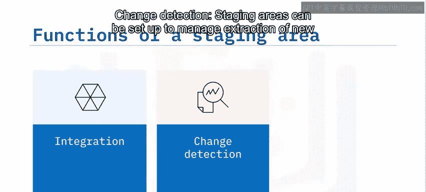

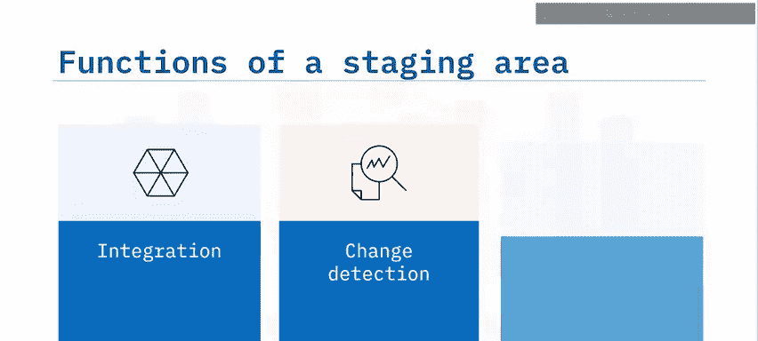

## ⚙️ 暂存区的典型功能

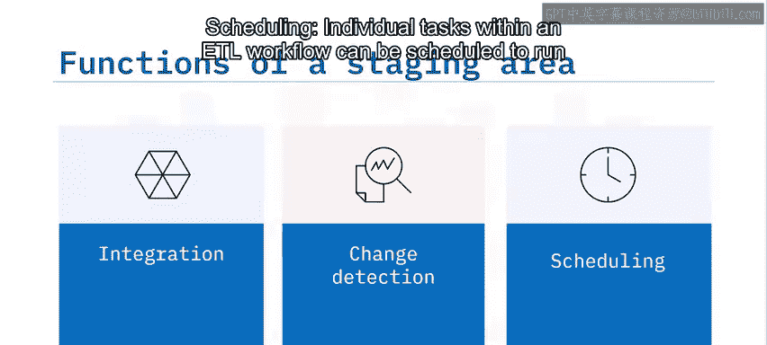

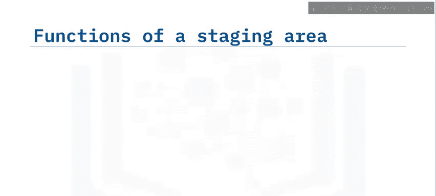

暂存区可以执行多种功能，以下是一些典型用途：

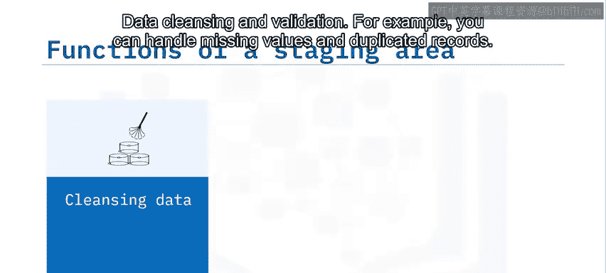

*   **数据集成**：暂存区的主要功能之一是**整合**来自多个源系统的数据。
*   **变更检测**：可以设置暂存区来管理**新增和已修改数据**的提取。
*   **任务调度**：ETL工作流中的各个任务可以被**调度**，以特定顺序、并发或在特定时间运行。
*   **数据清洗与验证**：例如，处理**缺失值**和**重复记录**。
*   **数据聚合**：可以使用暂存区来汇总数据。例如，在加载到报告系统之前，将每日销售数据**聚合**为每周、每月或每年的平均值。
*   **数据规范化**：用于强制执行数据类型的一致性或类别名称的统一（例如，使用国家/州代码代替混合的命名约定，如“Mont”、“MA”或“Montana”）。

---

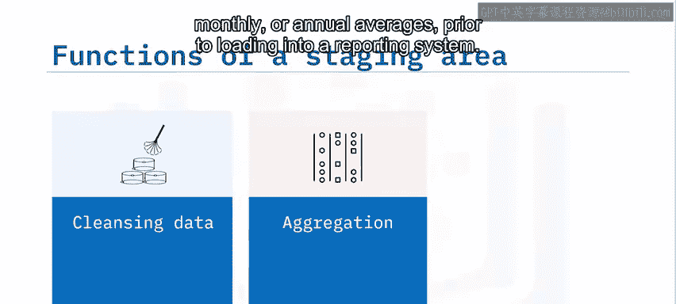

## 🛡️ 使用暂存区的优势

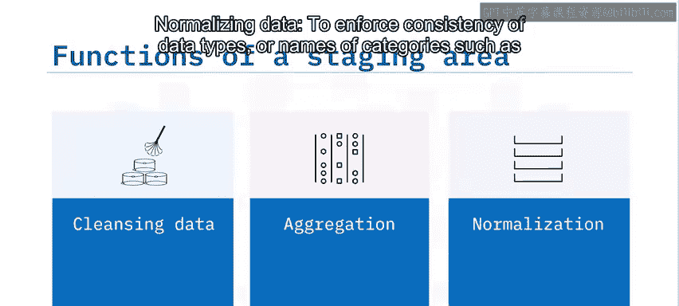

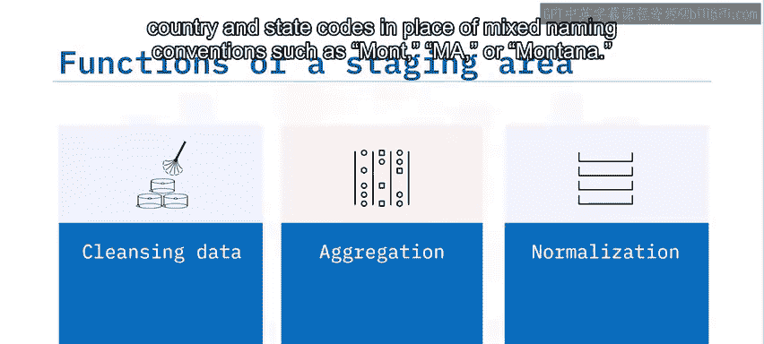

暂存区是一个独立的位置，数据从源系统提取至此。因此，**提取步骤**将验证、清洗等操作与源环境**解耦**。

这有助于最大限度地降低损坏源数据系统的风险，并简化ETL工作流的构建、操作和维护。如果提取的数据以某种方式损坏，也可以轻松恢复。

---

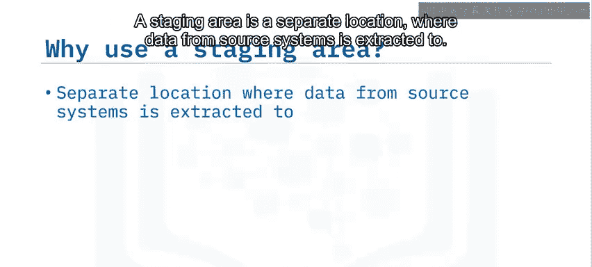

## 📝 课程总结

本节课中，我们一起学习了数据仓库暂存区的核心知识。

我们了解到，暂存区充当数据源与目标系统之间的**桥梁**，主要用于集成数据仓库中不同的数据源。暂存区的实现可以非常简单，例如作为目录中的一组平面文件并用脚本管理，或者作为数据库中的表。

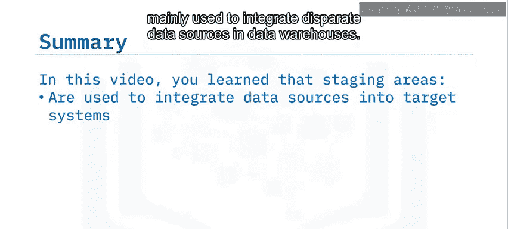

暂存区将数据处理与源系统**解耦**，从而有助于最大限度地降低数据损坏的风险。尽管它们通常是临时的，但暂存区也可以为了归档或故障排除的目的而保留数据。