# 013：验证数据质量

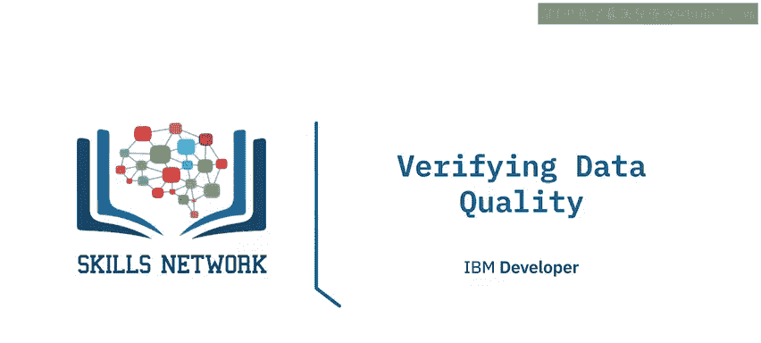

在本节课中，我们将学习数据质量验证的核心概念。我们将了解数据验证包含哪些方面、组织为何要进行数据验证、常见的数据质量问题示例，以及处理不良数据的基本流程。

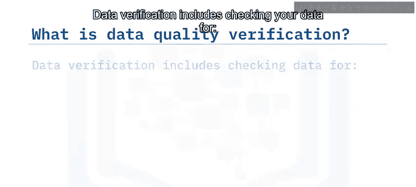

---

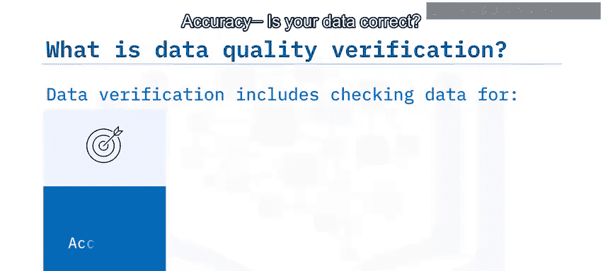

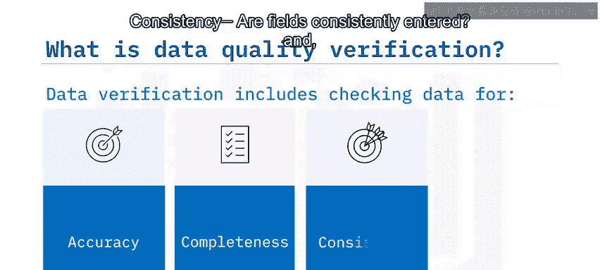

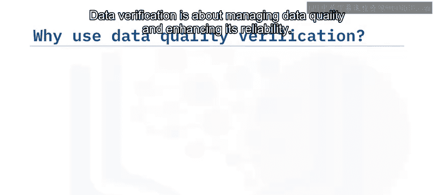

## 🔍 什么是数据质量验证？

数据验证是指检查数据的准确性、完整性、一致性和时效性。具体来说，它包含以下四个维度：

*   **准确性**：数据是否正确无误。
*   **完整性**：是否存在数据缺失。
*   **一致性**：数据字段的录入是否保持一致。
*   **时效性**：数据是否为最新。

数据验证旨在管理数据质量并增强其可靠性。高质量的数据有助于成功整合相关数据及其复杂关系，为组织提供一个完整、互联的数据视图，使其能够进行高级分析、统计建模和机器学习，并最终提升对洞察和决策的信心。

然而，数据质量在日常的公司运营中常常被忽视。根据《哈佛商业评论》的数据，IBM在2016年估计，仅在美国，低质量数据每年造成的损失就超过3万亿美元。

---

## ⚠️ 常见的数据质量问题

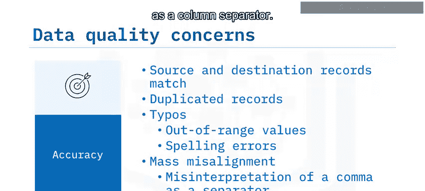

上一节我们介绍了数据验证的四个维度，本节中我们来看看每个维度下具体会遇到哪些问题。

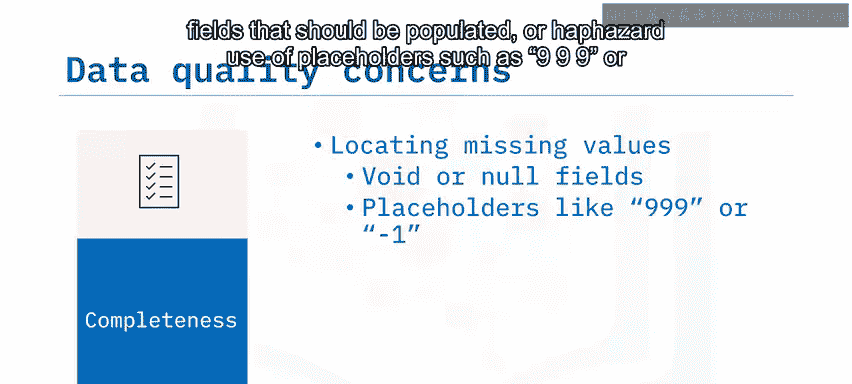

以下是组织经常面临的数据质量问题：

*   **准确性**
    *   **问题描述**：确保源数据与目标数据匹配。数据从源系统迁移时经常包含重复记录；用户手动输入数据时可能产生拼写错误，导致数据出现异常值、离群值或拼写错误。
    *   **示例**：CSV文件中的合法逗号可能被新系统误解为列分隔符，导致数据错位或损坏。

*   **完整性**
    *   **问题描述**：数据不完整，表现为本应填充的字段存在空白或空值，或随意使用占位符（如999或-1）来表示缺失值。
    *   **示例**：由于上游系统故障，可能导致整条记录缺失。

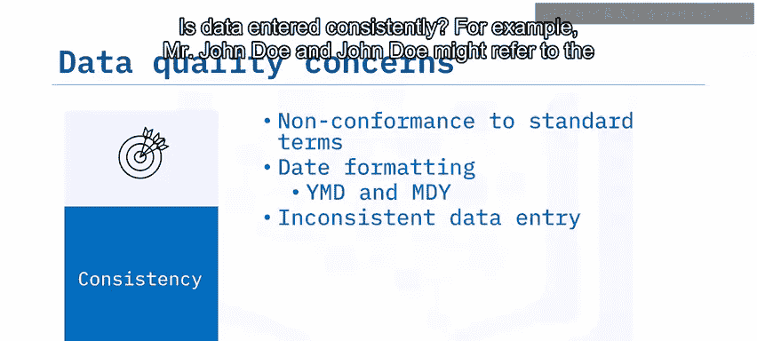

*   **一致性**
    *   **问题描述**：数据录入是否遵循统一标准。例如，日期格式（年月日与月日年）不一致；同一实体（如“John Doe先生”和“John Doe”）因表述不同被系统视为不同对象；计量单位（如公斤与磅、美元与千美元）不统一。

*   **时效性**
    *   **问题描述**：确保数据保持最新状态。例如，维度表中的客户地址可能已过时；客户可能因各种原因更改了姓名。

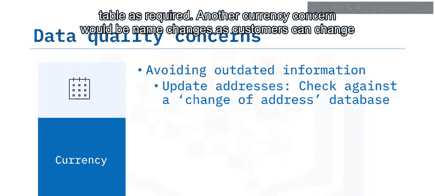

---

## 🛠️ 处理不良数据的流程

识别了数据质量问题后，我们需要一个系统性的流程来解决和预防它们。这是一个复杂且迭代的过程。

以下是处理不良数据的基本步骤：

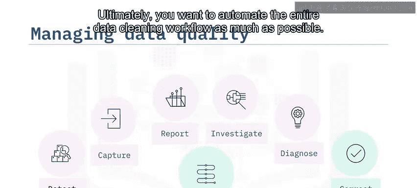

1.  **制定规则**：首先，制定规则来检测不良数据。
2.  **应用与隔离**：应用这些规则来捕获并隔离任何不良数据。
3.  **报告与调查**：可能需要报告不良数据，并将发现分享给相关领域专家。团队可以调查每个问题的根本原因，在数据沿袭中向上游寻找线索。
4.  **诊断与纠正**：诊断每个问题后，开始纠正问题。
5.  **自动化**：最终目标是尽可能自动化整个数据清洗工作流。

---

## 📈 实践案例：数据仓库加载前的验证

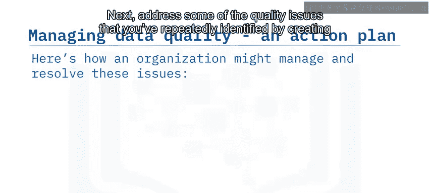

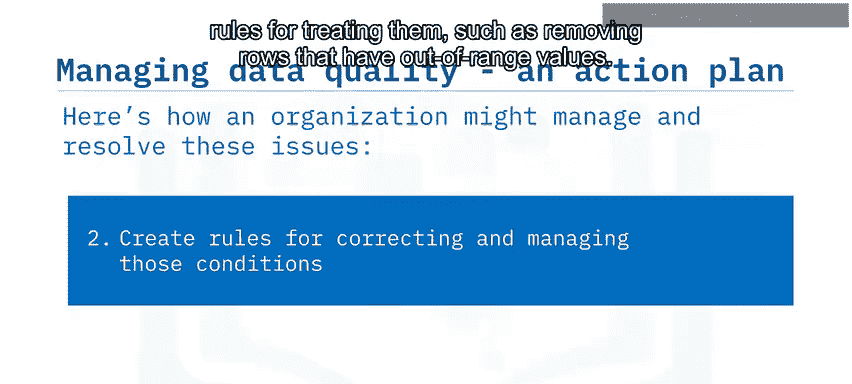

让我们通过一个具体案例来理解上述流程。假设你需要在将数据加载到数据仓库进行分析之前，验证暂存区数据的质量。你发现某些数据源的数据持续存在质量问题，包括数据缺失、重复值、超出范围的值和无效值。

以下是组织管理和解决这些问题的步骤：

1.  **编写检测查询**：首先，编写SQL查询来检测这些问题并进行测试。
2.  **制定处理规则**：针对反复识别的质量问题，创建处理规则。例如，删除包含超出范围值的行。
3.  **创建自动化脚本**：创建一个脚本，在数据仓库夜间加载期间运行查询以检测数据质量问题。该脚本对部分已知问题应用纠正措施和转换。
4.  **前置自动化**：创建第二个脚本，在从各数据源提取数据后，自动在暂存区运行步骤3中的脚本和SQL数据验证查询。
5.  **生成报告**：步骤3中创建的脚本会生成一份报告，列出所有无法自动解决的剩余问题。管理员可以审查此报告并处理未解决的问题。

---

## 🧰 数据质量工具简介

市场上有多种数据质量解决方案。以下是一些主要的供应商及其工具：

*   IBM InfoSphere Information Server for Data Quality 和 IBM Data Refinery
*   Informatica Data Quality
*   SAP Data Quality Management
*   SAS Data Quality
*   Talend for Data Quality
*   Precisely Spectrum Quality
*   Microsoft Data Quality Services
*   Oracle Enterprise Data Quality
*   开源工具：OpenRefine

每种解决方案都有其优势。以IBM InfoSphere Information Server for Data Quality为例，它是一个可以帮助你在统一环境中执行数据验证的产品。它使你能够持续监控数据质量，并保持数据清洁，帮助你将数据转化为可信的信息。

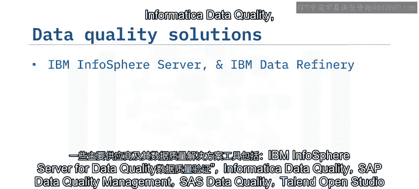

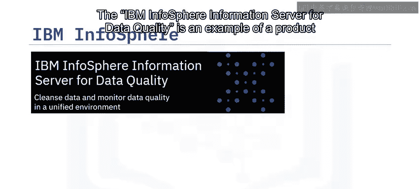

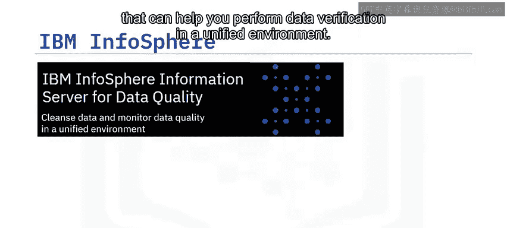

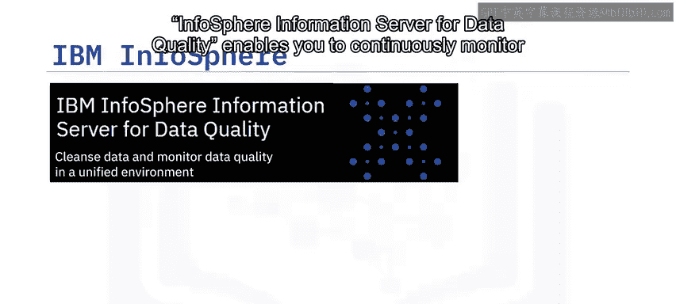

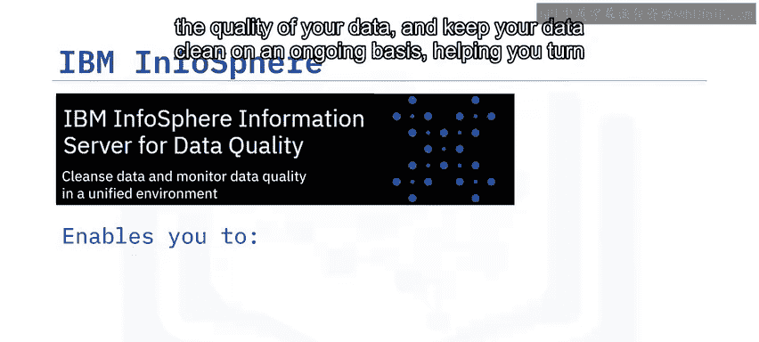

此外，该工具还提供端到端的内置数据质量工具，帮助你理解数据及其关系、持续监控和分析数据质量、清洗、标准化和匹配数据，以及维护数据沿袭（即数据的起源历史及其流转过程）。

---

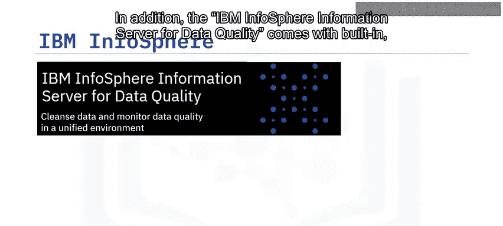

## ✅ 课程总结

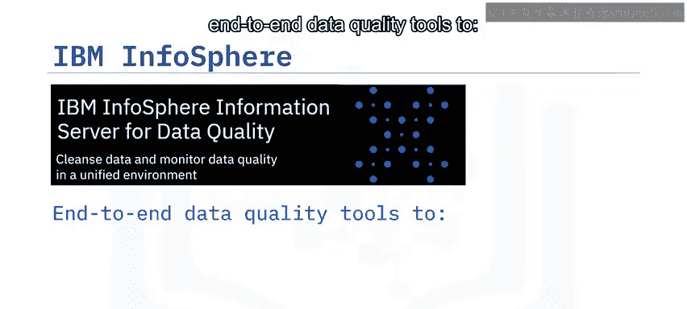

本节课中，我们一起学习了数据质量验证的核心内容。

*   数据验证包括检查数据的**准确性**、**完整性**、**一致性**和**时效性**。
*   数据验证的目的是管理数据质量、增强数据可靠性并最大化数据价值。
*   解决和预防不良数据是一个复杂且迭代的过程。
*   企业级工具（如IBM InfoSphere Information Server for Data Quality）可以帮助你在统一环境中执行数据验证。

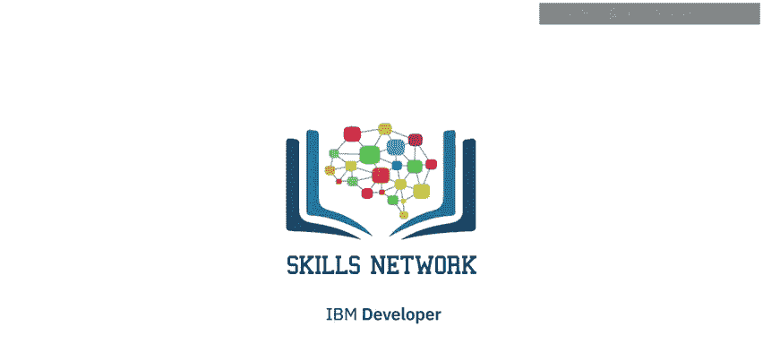

掌握数据质量验证是确保后续数据分析结果准确可靠的关键一步。