# 014：填充数据仓库

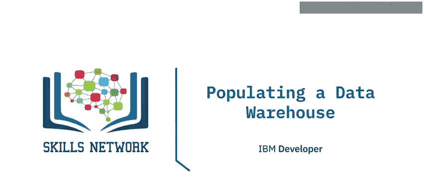

在本节课中，我们将学习如何填充数据仓库。这是一个持续的过程，包括初始加载和后续的增量加载。我们将介绍主要步骤、变更检测方法，并通过一个手动创建销售星型模式的实例来演示整个过程。

## 🚀 数据仓库填充概述

填充企业数据仓库是一个持续的过程。它始于一次初始加载，随后是定期的增量加载。例如，你可能需要每天或每周加载新数据。在发生重大模式变更或灾难性故障时，则可能需要进行完全刷新。

通常，事实表是动态的，需要频繁更新，而维度表则不常变化。例如，城市或商店列表相当静态，但销售交易每天都在发生。

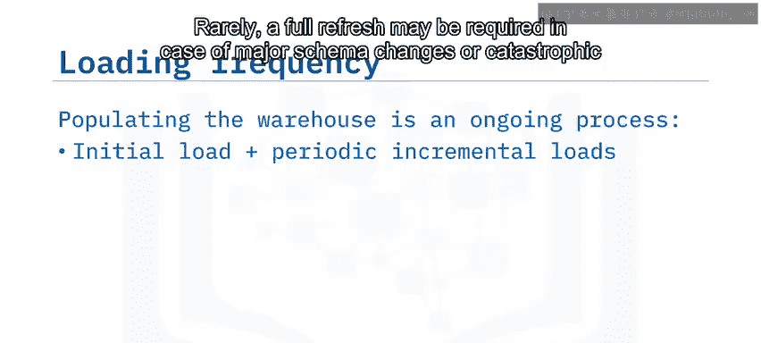

## 🛠️ 自动化填充工具

许多工具可用于自动化数据仓库的持续更新过程。像DB2这样的数据库拥有比逐行插入更快的加载工具。加载数据仓库也可以是你ETL数据管道的一部分，该管道可以使用Apache Airflow和Apache Kafka等工具实现自动化。你也可以编写自己的脚本，结合Bash、Python和SQL等底层工具来构建数据管道，并使用Cron进行调度。Infosphere DataStage则允许你编译和运行作业来加载数据。

在填充数据仓库之前，请确保你的模式已经建模完成，数据已暂存在表或文件中，并且你已建立了数据质量验证机制。

## 📋 初始加载步骤

现在，你已准备好设置数据仓库并实施初始加载。

首先，实例化数据仓库及其模式，然后创建生产表。接着，建立事实表和维度表之间的关系。最后，将经过转换和清洗的数据从暂存表或文件加载到这些表中。

## 🔄 设置持续数据加载

完成初始加载后，是时候设置持续的数据加载了。

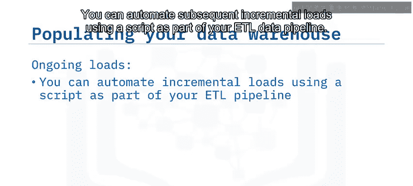

你可以使用脚本自动化后续的增量加载，作为ETL数据管道的一部分。你还可以根据需求，将增量加载安排为每日或每周执行。你还需要包含一些逻辑，以确定暂存区中哪些数据是新的或已更新的。

## 🔍 变更检测方法

通常，你需要在源系统本身检测变更。

许多关系数据库管理系统都具备识别自给定日期以来任何新增、更改或删除记录的机制。你可能还可以访问时间戳，这些时间戳标识了数据首次写入的时间以及可能被修改的时间。

有些系统可能不太方便，你可能需要将整个源数据加载到ETL管道中，以便随后与目标进行暴力比较。如果源数据量不大，这种方法是可以接受的。

## 🧹 数据仓库的定期维护

数据仓库需要定期维护，通常是每月或每年一次，以归档不太可能使用的数据。

你可以编写脚本，既删除旧数据，又将其归档到速度较慢、成本较低的存储中。

## 🧑‍💻 手动填充示例：销售星型模式

让我们通过一个简化的例子来说明这个过程：手动填充一个名为“sales”的星型模式数据仓库。我们假设你已经实例化了数据仓库和sales模式。

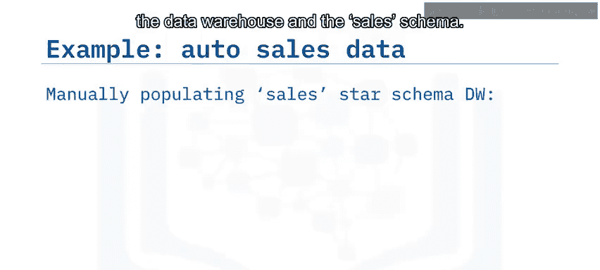

以下是一家名为“Shi Auto Sales”的虚构公司的一些汽车销售交易数据样本。你可以看到几个外键列，例如 `sales_id`（标识销售发票号的顺序键）、`emp_no`（员工编号）和 `class_id`（编码所售汽车的类型，如小型SUV）。这些键中的每一个都代表一个维度，指向星型模式中相应的维度表。`date` 列是一个指示销售日期的维度。`amount` 列是销售金额，它恰好是我们关注的事实。这个表已经非常接近事实表的形式，唯一的例外是 `date` 列尚未用外键 `date_id` 表示。

让我们使用PostgreSQL的终端前端PSQL来演示如何创建维度表，以销售人员维度为例。

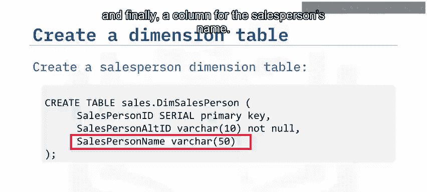

使用 `CREATE TABLE` 子句在 `sales` 模式下创建 `dim_salesperson` 表，其中 `salesperson_id` 作为序列主键，`salesperson_alt_id` 作为销售人员的员工编号，最后一列是销售人员的姓名。

```sql
CREATE TABLE sales.dim_salesperson (
    salesperson_id SERIAL PRIMARY KEY,
    salesperson_alt_id INT,
    salesperson_name VARCHAR(255)
);
```

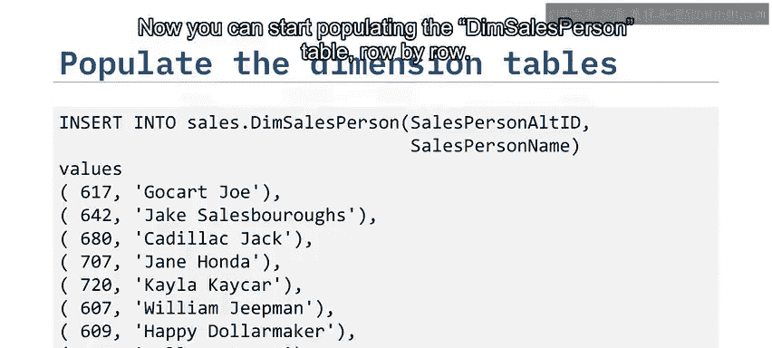

现在，你可以开始逐行填充 `dim_salesperson` 表。

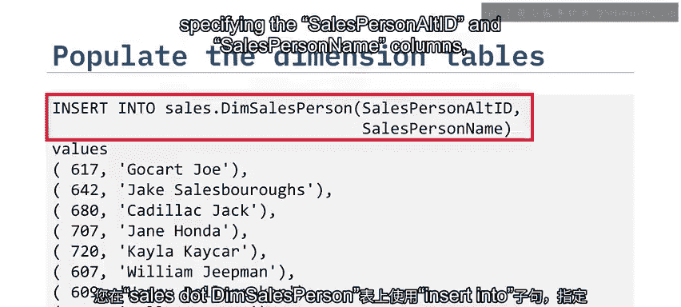

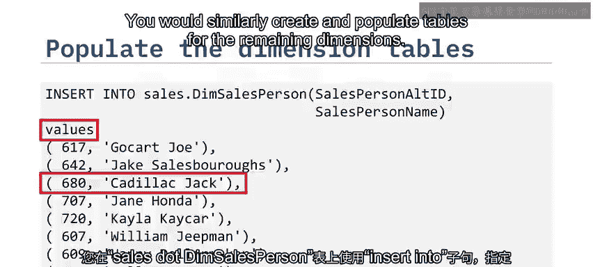

使用 `INSERT INTO` 子句，指定 `salesperson_alt_id` 和 `salesperson_name` 列，并开始插入值，例如员工编号680和姓名“Cadillac Jack”。你将类似地创建和填充其余维度的表。

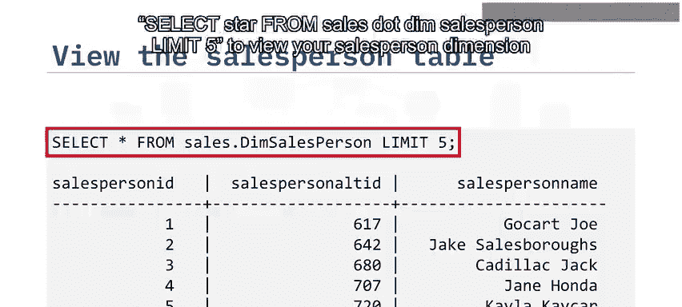

你可以输入SQL语句 `SELECT * FROM sales.dim_salesperson LIMIT 5;` 来查看你的销售人员维度表，并确认一切似乎都已正确填充，例如记录1：员工编号617，销售人员姓名“Go-cart Joe”。

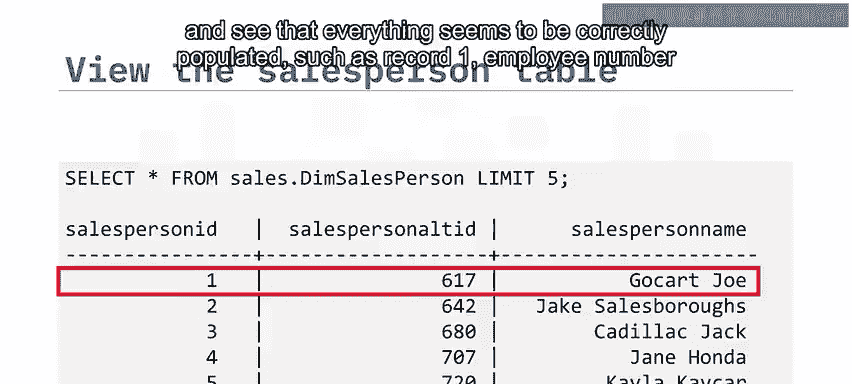

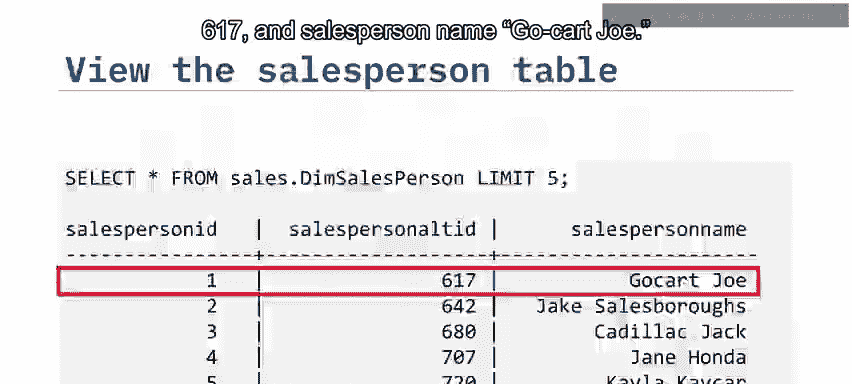

## 📊 创建事实表并建立关系

现在，是时候创建你的销售事实表了。

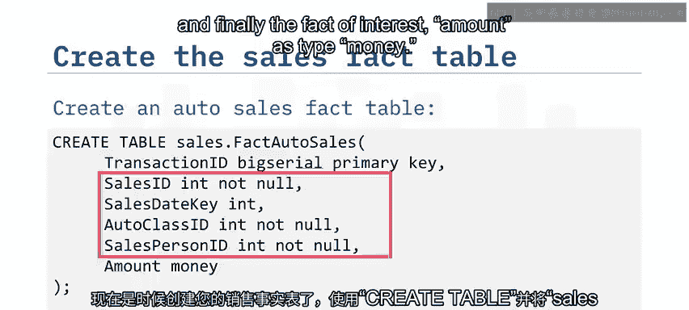

使用 `CREATE TABLE` 语句，以 `sales.fact_auto_sales` 作为表名，`transaction_id` 作为 `BIGSERIAL` 类型的主键，以及各种外键，如 `sales_id` 和 `auto_class_id`，最后，我们关注的事实 `amount` 的类型为 `MONEY`。

```sql
CREATE TABLE sales.fact_auto_sales (
    transaction_id BIGSERIAL PRIMARY KEY,
    sales_id INT,
    amount MONEY,
    salesperson_id INT,
    autoclass_id INT,
    sales_d_key INT
);
```

接下来，你继续设置sales模式中事实表和维度表之间的关系。

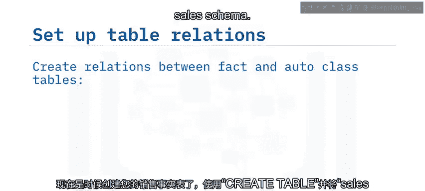

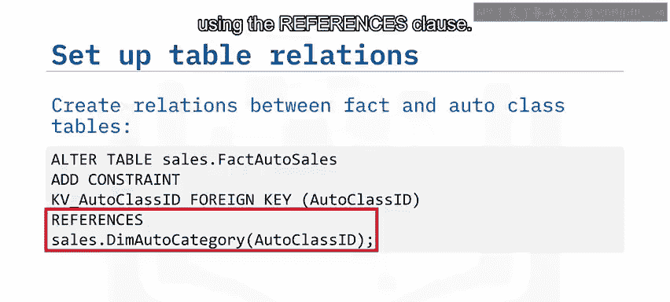

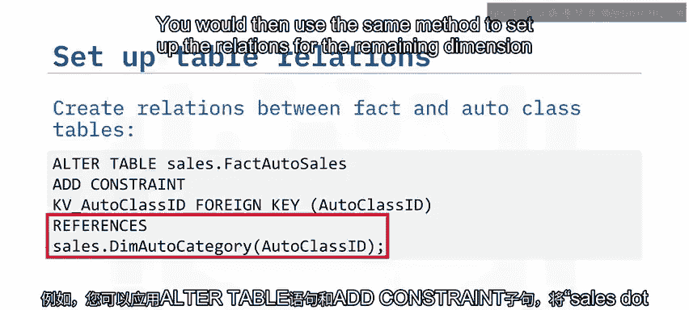

例如，你可以对 `sales.fact_auto_sales` 表应用 `ALTER TABLE` 语句和 `ADD CONSTRAINT` 子句，添加一个名为 `fk_autoclass_id` 的外键，将 `autoclass_id` 关联到 `sales.dim_auto_category` 表中同名的列，使用 `REFERENCES` 子句。然后，你将使用相同的方法为剩余的维度表设置关系。

```sql
ALTER TABLE sales.fact_auto_sales
ADD CONSTRAINT fk_autoclass_id
FOREIGN KEY (autoclass_id)
REFERENCES sales.dim_auto_category (autoclass_id);
```

## 📥 填充事实表

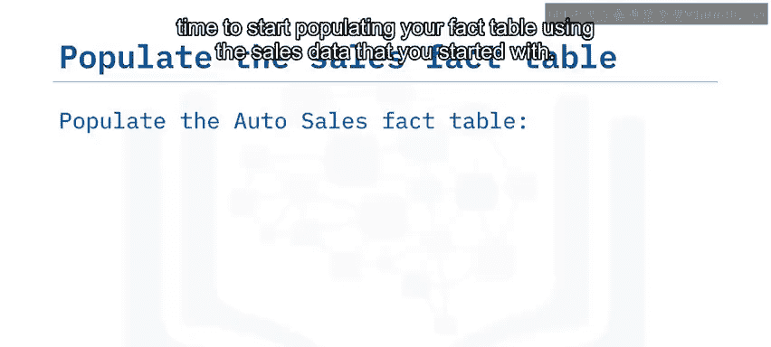

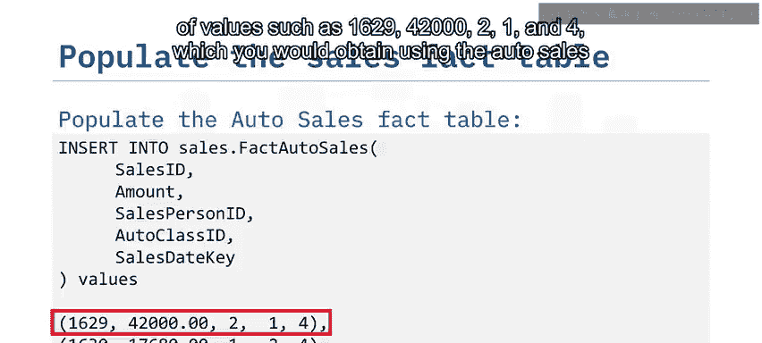

在定义了所有表并建立了相应的关系之后，终于可以开始使用你最初拥有的销售数据来填充事实表了。

你可以使用 `INSERT INTO` 语句，指定列名 `sales_id`、`amount`、`salesperson_id`、`autoclass_id` 和 `sales_d_key`，并插入行，例如 `(1629, 4200.21, 1, 4, 20190101)`，这些数据将从汽车销售数据中获取。

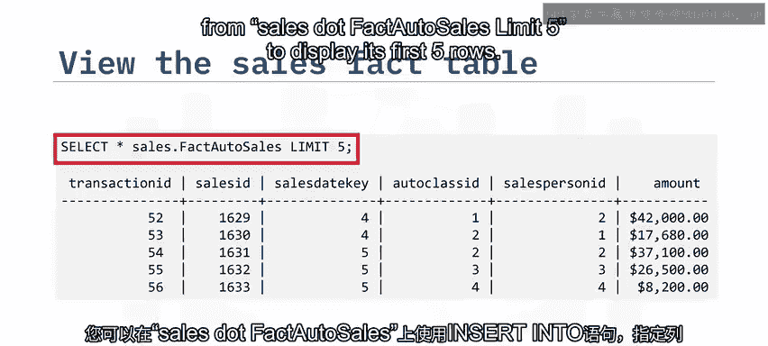

```sql
INSERT INTO sales.fact_auto_sales (sales_id, amount, salesperson_id, autoclass_id, sales_d_key)
VALUES (1629, 4200.21, 1, 4, 20190101);
```

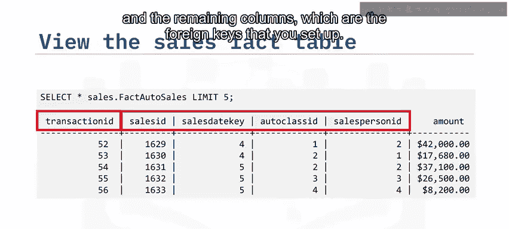

你可以通过输入SQL语句 `SELECT * FROM sales.fact_auto_sales LIMIT 5;` 来查看汽车销售事实表，显示其前五行。在这里，你可以看到单笔汽车销售的美元金额、名为 `transaction_id` 的主键以及你设置的外键列。

## 🎯 课程总结

本节课中，我们一起学习了填充企业数据仓库的过程。

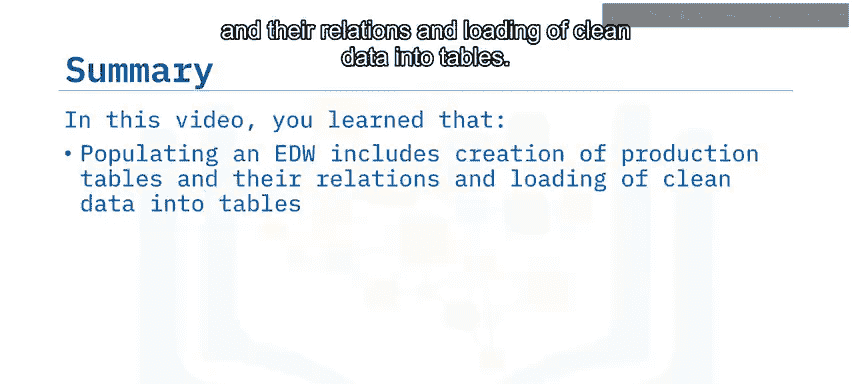


你了解到，填充企业数据仓库包括初始创建事实表和维度表及其关系，并将清洗后的数据加载到表中。这是一个持续的过程，始于初始加载，随后是定期的增量加载。事实表是动态的，需要频繁更新，而维度表则更为静态，不常变化。你可以使用脚本或专门的数据管道工具来自动化数据仓库的增量加载和定期维护。