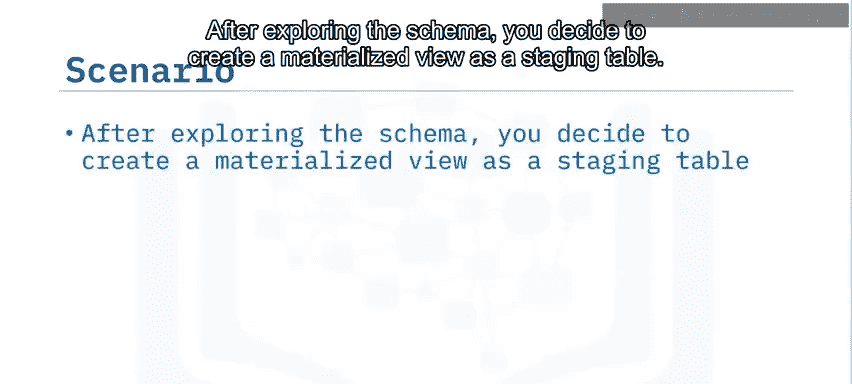
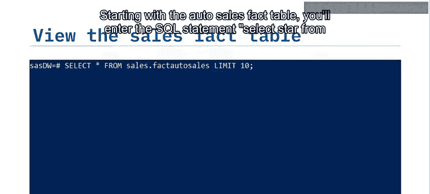
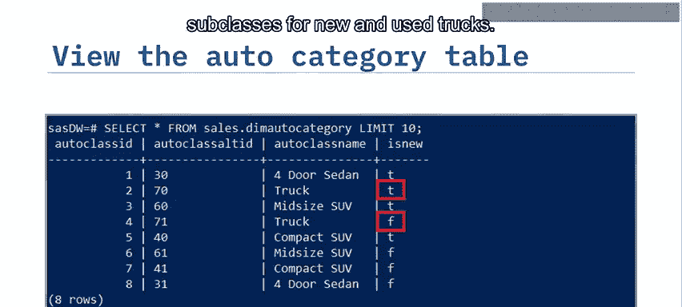
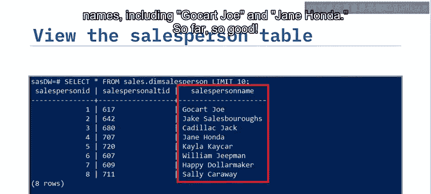
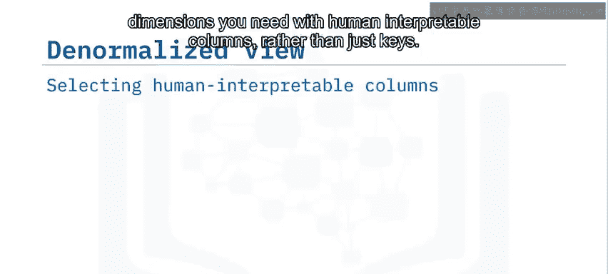
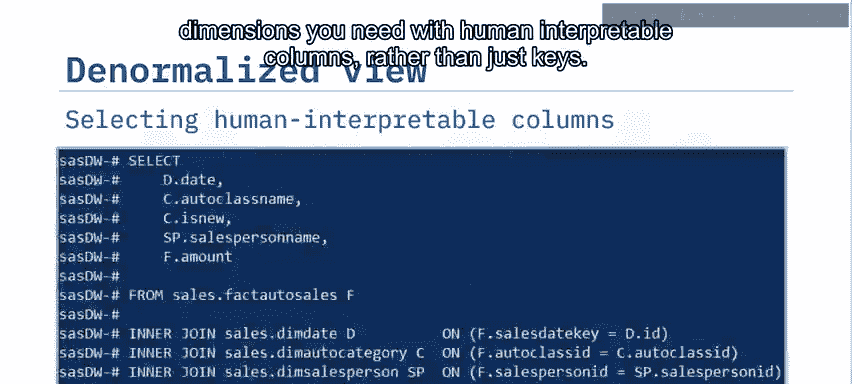
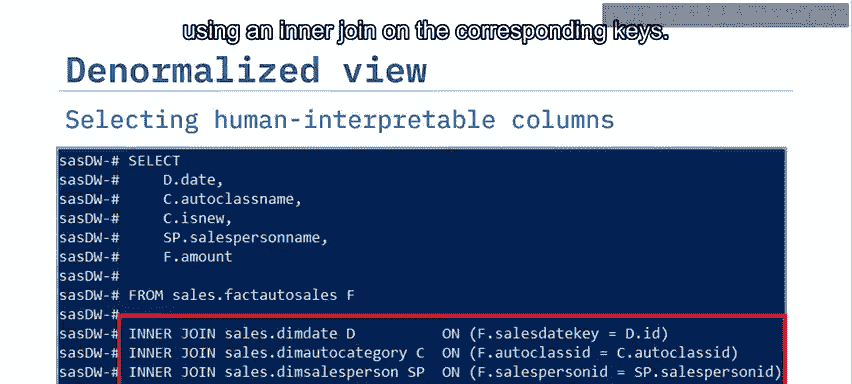
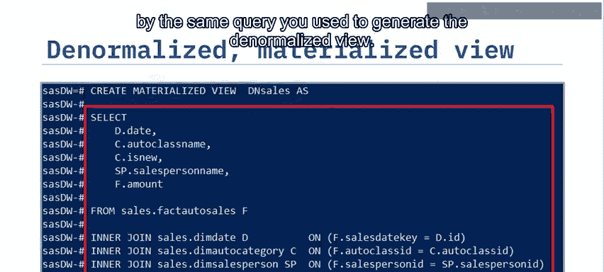
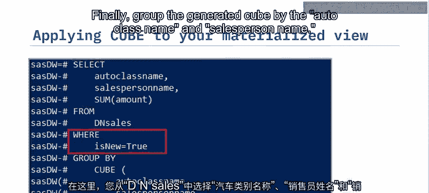
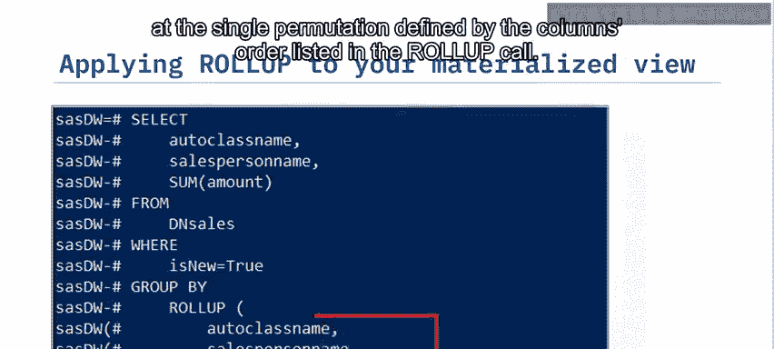

# 015：查询数据

在本节课中，我们将学习如何查询数据仓库中的数据。具体内容包括：解读星型模式的实体关系图（ERD）、利用表间关系建立查询、通过反规范化或连接表来创建物化视图，以及在 `GROUP BY` 子句中应用 `CUBE` 和 `ROLLUP` 选项来生成常见的小计和总计汇总。

`CUBE` 和 `ROLLUP` 操作能生成管理层经常需要的各类汇总数据。相比编写多个SQL查询，这些操作实现起来要简单得多。物化视图可以方便地创建一个存储表，当视图复杂、查询频繁或数据量大时，可以按计划或按需刷新。由于数据是预先计算好的，查询物化视图通常比查询底层表快得多。将 `CUBE` 或 `ROLLUP` 与物化视图结合使用，可以进一步提升性能，甚至可以考虑将 `CUBE` 或 `ROLLUP` 的结果也物化。

## 理解数据模型与查询基础

上一节我们介绍了课程目标，本节中我们来看看如何开始查询。首先，我们需要理解现有的数据模型。

考虑以下场景：你的任务是为 Shiny Auto Sales 公司创建一些实时汇总表，用于报告一月份按销售人员和汽车类型划分的销售情况。首先，你需要理解他们基于 PostgreSQL 的数据仓库 `SASDW` 中现有的星型模式。

你启动一个 PostgreSQL 会话，并生成一个实体关系图（ERD），它代表了在 Shiny Auto Sales 数据仓库 `SASDW` 中实现的销售星型模式。然后，你定位到名为 `factact_auto_sales` 的中心事实表。该表包含你需要的度量值列 `amount`。你还发现了销售事实表中的三个外键：`sal_date_key`、`auto_class_id` 和 `salesperson_id`。这些键分别链接到：
*   **日期维度表**：包含日期及相关值，如星期几、月份名称和季度。
*   **汽车类别维度表**：包含汽车类别名称和布尔值 `is_new` 列。
*   **销售人员维度表**：包含销售人员姓名。

在这个例子中，我们使用 PostgreSQL。假设你已经启动了终端前端 `psql` 并连接到了 `SASDW` 数据仓库。注意，命令提示符包含了你所连接的数据仓库名称 `SASDW`。

## 探索原始数据表

在理解了表结构之后，接下来我们逐一查看各个表中的具体数据。

以下是探索步骤：

1.  **查询事实表**：从 `sales.factact_auto_sales` 表开始，输入 SQL 语句 `SELECT * FROM sales.factact_auto_sales LIMIT 10;` 来显示其前10行。你会看到单笔汽车销售的美元金额，但其余列是主键和外键，目前对你没有直接意义。你注意到 `sales_id` 值是连续的，但编号从 1629 开始，而不是 1。这是因为 Shiny Auto Sales 为你提供的是他们数据的一个窗口子集。
2.  **查询维度表**：接下来，查询 `autocatego` 维度表。现在你可以看到各种汽车类别的有意义名称，如 `Truck` 和 `Compact SUV`。你注意到 `Truck` 类有重复条目，仔细查看后发现，重复条目存在是因为新车和二手车子类别不同。同样，生成销售人员维度表的视图，你会发现八个不同的销售人员姓名，包括 `Go Hart`、`Joe` 和 `Jane Honda`。
3.  **查询日期维度表**：最后，查看日期维度表。你注意到日期只追溯到 2021年1月1日。Shiny Auto Sales 的联系人告知你，稍后会提供更多细节，目前你可以先用较小的数据集来开发查询。日期表包含可能有用的日期元素，如星期几、月份名称和季度名称。

## 创建反规范化的物化视图

在查看了各个独立的表之后，我们意识到直接使用键值进行汇总分析并不直观。因此，我们需要将维度信息与事实数据合并。

此时，拥有一个包含你所需维度且具有人类可读列的数据表会更方便，而不仅仅是键。本质上，你希望通过将维度连接回感兴趣的事实来创建数据的反规范化视图。

你继续操作，从各自的表中选择 `date`、`auto_class_name`、`is_new`、`salesperson_name` 和 `amount` 列，并使用 `INNER JOIN` 在相应的键上将每个维度连接到金额事实。

接下来，为什么不将这个视图捕获为一个名为 `denormalized_sales`（简称 `dn_sales`）的物化视图呢？这样你就可以为不同的查询重用这个物化视图，而无需重新创建工作。

你使用子句 `CREATE MATERIALIZED VIEW dn_sales AS` 后跟用于生成反规范化视图的相同查询来完成此任务。

输入 `SELECT * FROM dn_sales LIMIT 10;` 来显示生成的物化视图。现在，你有了一个整洁的、人类可读的销售数据时间序列，可用于进一步分析。例如，你可以看到 `Cadillac Jack` 在 1月5日 以 260,500 美元的价格售出了一辆新的中型SUV。

## 应用 CUBE 和 ROLLUP 进行汇总分析

有了一个方便查询的物化视图后，本节中我们来看看如何利用它进行高级汇总分析。

接下来，你想将 `CUBE` 和 `ROLLUP` 操作应用到你的反规范化物化视图上。

让我们看看 `CUBE` 的结果。这里，你从 `dn_sales` 中选择 `auto_class_name`、`salesperson_name` 和销售金额的总和，其中 `is_new` 设置为 `true`。最后，通过 `auto_class_name` 和 `salesperson_name` 对生成的 `CUBE` 进行分组。

输出看起来像这样。第一行在维度列中没有条目，这意味着“全部”。因此，值 36,676 美元代表所有新车的总销售额。接下来的记录块中两个维度列都有值，例如，你可以读到 `Go Carcho` 销售的新中型SUV总额为 32,099 美元。同样，最后两个块分别按类别和销售人员汇总了新车销售额。

现在，你将应用 `ROLLUP` 而不是 `CUBE` 操作。你决定保持查询与上一个查询相同，只是将 `CUBE` 替换为 `ROLLUP`。这是结果视图的样子。现在，`ROLLUP` 结果比 `CUBE` 少了 5 行，结果是 13 行而不是 18 行。这个结果的唯一区别是你没有按销售人员汇总的总销售额。`CUBE` 会生成 `GROUP BY` 列的所有可能排列组合，而 `ROLLUP` 只查看 `ROLLUP` 调用中列出的列顺序所定义的单一排列。

## 课程总结

本节课中，我们一起学习了如何在数据仓库中高效地查询和汇总数据。

你了解到，对物化视图进行 `CUBE` 和 `ROLLUP` 汇总为快速查询和分析数据仓库中的数据提供了强大的能力。`CUBE` 和 `ROLLUP` 操作能生成管理层经常要求的、按维度分组的各类汇总数据。你可以使用连接对星型模式进行反规范化，将人类可理解的事实和维度整合到一个物化视图中。你还可以从物化视图创建暂存表，并在非高峰时段增量刷新它们。