# 016：分析与商业智能工具简介

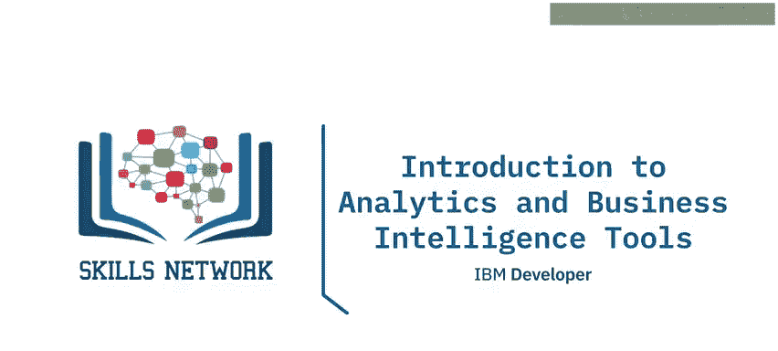

在本节课中，我们将要学习分析与商业智能工具的基本概念。我们将了解分析的定义、商业智能工具如何改变分析处理与结果，并认识市场上几种主流的BI工具。

---

## 什么是分析？

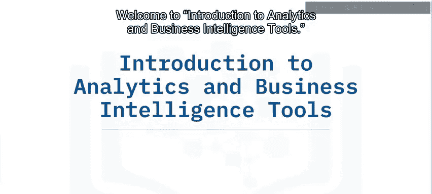

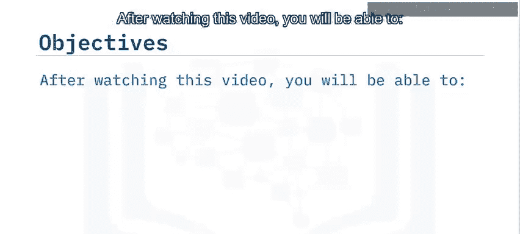

分析是指**系统性地编译和评估数据、统计与运筹学信息，以构建模型，从而做出更优决策**的过程。

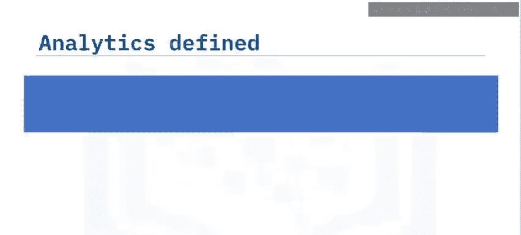

随着计算、存储、处理器和内存能力的显著提升，其速度、容量和可负担性都大幅增加。如今的数据仓库解决方案能够以低延迟存储海量数据。存储、处理器和内存的容量与速度呈指数级增长，使得组织现在能够以极快的周转时间处理**PB级（Petaflops）**的数据。

当可用数据越多时，分析的准确性就越高。组织可以利用商业智能工具内置的专业能力，基于统计建模的机器学习来分析数据并发现模式。

现代分析工具极大地缩短了数据处理时间，使得结果近乎实时可得。

---

## 分析的三种类型

上一节我们介绍了分析的基本概念，本节中我们来看看分析的主要类型。这些分析结果可以分为以下三类：

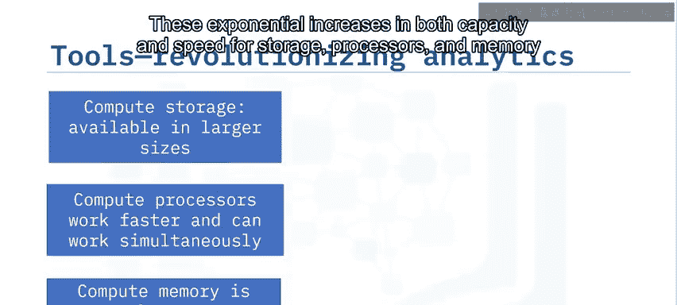

以下是分析的三种主要类型：

*   **描述性分析**：提供对过去情况的洞察。
*   **预测性分析**：提供对未来可能发生情况的洞察。
*   **规范性分析**：提供为在未来创造特定结果，组织应采取何种行动的洞察。

---

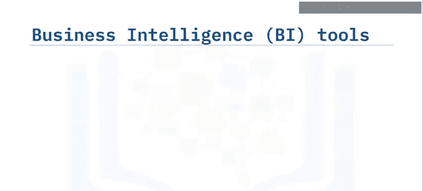

## 什么是商业智能工具？

商业智能工具，或称BI工具，能够实现**数据准备、数据挖掘、数据管理和数据可视化**。使用BI工具很像拼图，旨在获得对组织更全面的认识。

BI工具帮助组织聚焦于“发生了什么”和“为什么发生”。企业利用其数据来发现正在发生的情况，并确定是什么触发了特定结果。

BI工具作为高度进化的软件，在创建内在智能的过程中应用了统计学和运筹学。它们还能帮助组织利用描述性、诊断性、预测性和规范性分析的力量，来支持运营和战略决策。

用户可以通过仪表盘、报告和基于历史、当前及预测数据的自助式分析，来审视业务运营，从而将数据转化为商业机会。

---

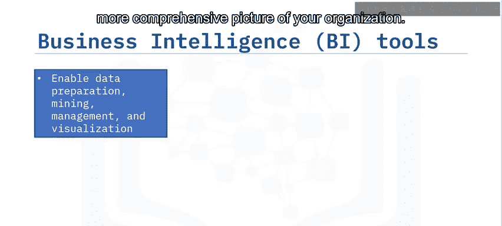

## 主流商业智能工具

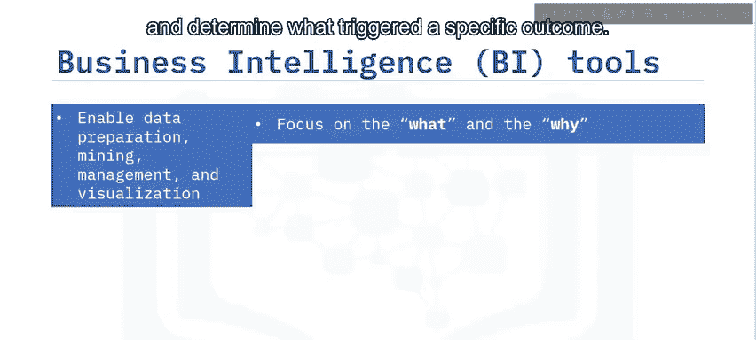

了解了BI工具的核心功能后，本节中我们来看看市场上有哪些主流解决方案。市场上有许多解决方案赋予组织执行高级分析的能力。

以下是一些知名的市场参与者：

*   **IBM Cognos Analytics**：集成了利用IBM人工智能和自然语言处理的Watson Analytics。
*   **Microsoft Power BI**：以其安全的数据洞察能力而闻名。
*   **Tableau**：以其强大的数据可视化功能而著称。
*   **Oracle Analytics Cloud**：以其对话式分析功能而知名。
*   **SAP Business Objects**：以其智能分析功能而闻名。
*   **TIBCO Spotfire**：为各种规模的组织提供可扩展性。

---

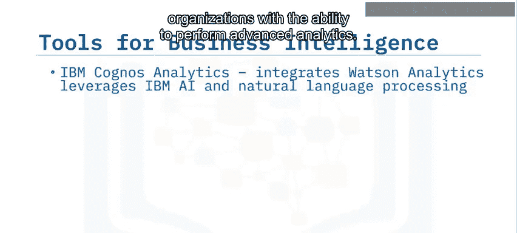

## IBM Cognos Analytics 简介

自2005年以来，IBM已投资超过250亿美元以发展其分析业务。**Cognos Analytics** 是IBM以人工智能驱动的商业智能与分析软件，它支持从数据发现到运营的整个数据分析生命周期。

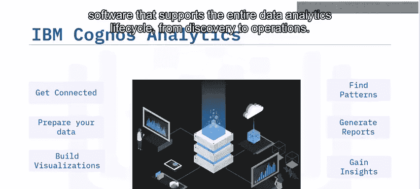

---

## 课程总结

本节课中，我们一起学习了以下核心内容：

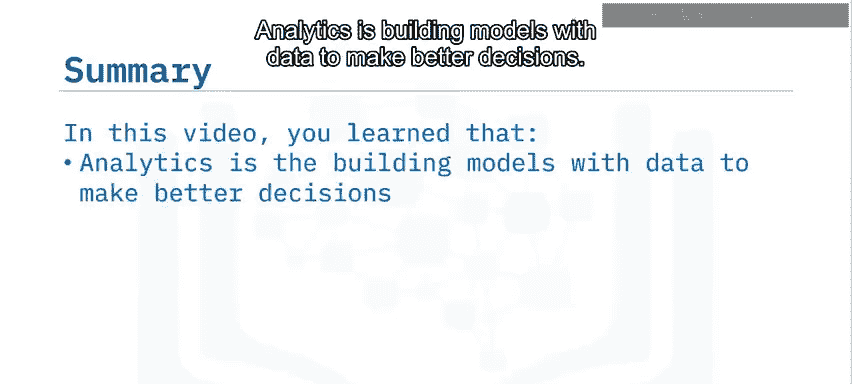

*   分析是利用数据构建模型以做出更优决策的过程。
*   商业智能是一种支持数据准备、数据挖掘、数据管理和数据可视化的技术。
*   软件市场提供了多种商业智能工具。
*   IBM Cognos Analytics 是基于人工智能的顶级BI解决方案之一。