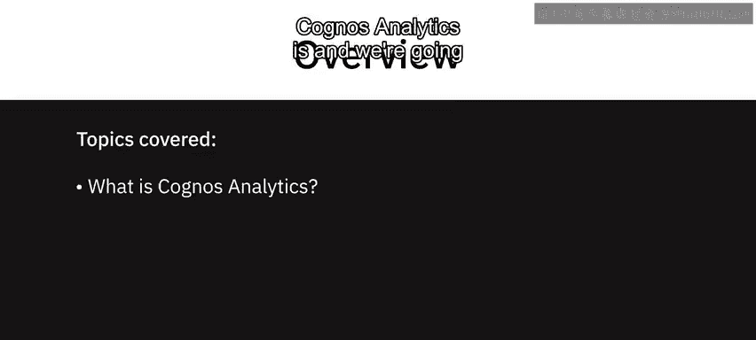
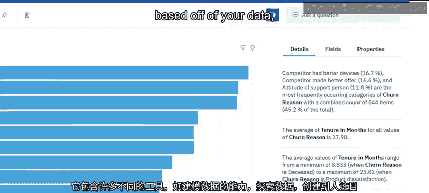
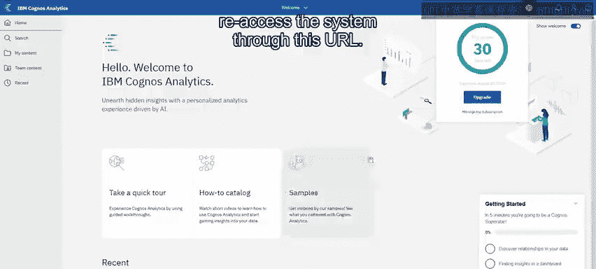
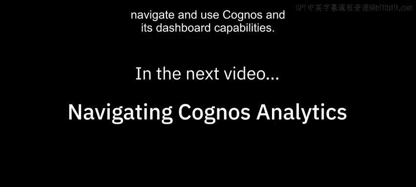

# 017：Cognos Analytics简介及注册方法 📊

在本节课中，我们将学习IBM Cognos Analytics这一商业智能工具的基本概念，并详细介绍如何注册其试用版本。Cognos Analytics是一个功能强大的平台，能够在一个产品内完成多种数据分析任务。

## 什么是Cognos Analytics？🔍

上一节我们介绍了课程的整体目标，本节中我们来看看Cognos Analytics的核心定义。

Cognos Analytics是一个多功能工具，允许您在一个产品内同时执行模式一和模式二类型的分析。它包含多种不同的工具，例如：
*   对数据进行建模的能力。
*   探索数据的能力。
*   创建引人注目、高级的分析可视化（如关键驱动因素分析）。
*   基于您的数据显示自然语言生成的见解。
*   通过过滤器或创建“突发报告”的能力，为您的特定用户创建量身定制的报告。

此外，它还能够创建出色的仪表板，这将是本课程的重点内容。

## 如何注册试用版？📝

了解了Cognos Analytics的基本功能后，接下来我们看看如何获取并使用它。

要注册试用版，请访问网址：**`IBM.biz/try_cognos`**。如果您已经拥有账户，可以在此处直接登录，您只需填写此表单的部分信息。如果您没有账户，那么我们需要快速填写此表格。

以下是注册时需要填写的关键信息列表：
*   姓名
*   电子邮箱
*   公司名称
*   选择离您地理位置最近的数据中心（这是需要注意的关键一项）

填写完毕后，系统将为我们启动。我们可以直接从这个工作流程中启动它。

进入系统后，您可以通过此按钮管理订阅。或者，您也可以通过这个URL重新访问系统。

## 导航与仪表板功能预览 🧭

在下一节视频中，我们将带您初步了解如何导航和使用Cognos Analytics及其仪表板功能。

---

本节课中，我们一起学习了IBM Cognos Analytics的核心功能，它是一个集数据建模、探索、高级可视化、自然语言报告和定制化仪表板于一体的商业智能工具。同时，我们逐步完成了试用版的注册流程，为后续的实际操作做好了准备。