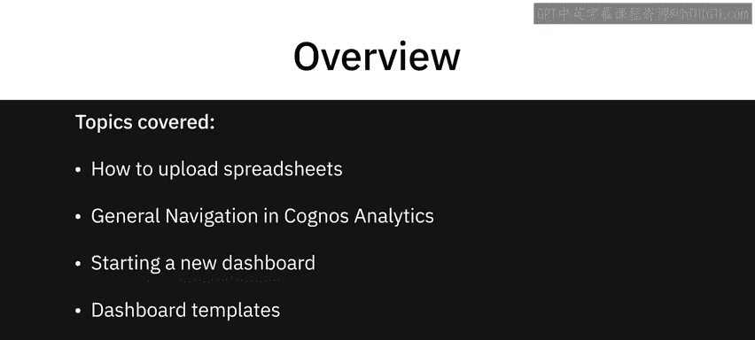
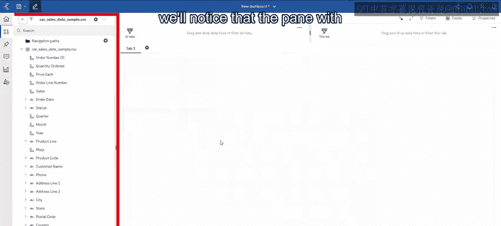
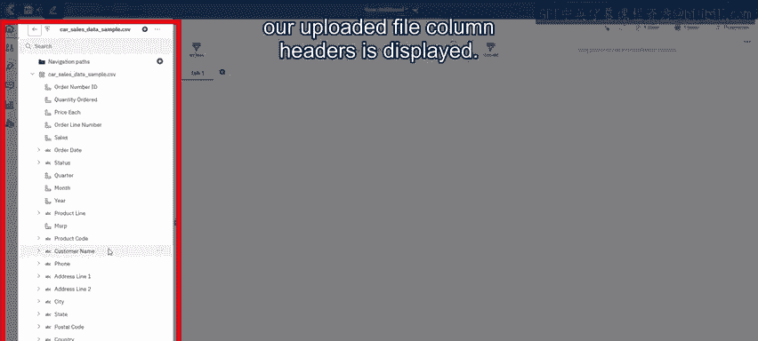
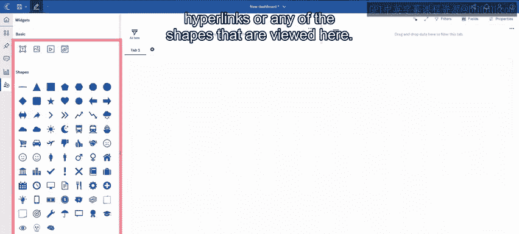

# 018：在Cognos Analytics中导航

在本节课中，我们将学习如何在Cognos Analytics中上传电子表格、进行基本导航、创建新的仪表板，以及使用仪表板模板。我们还将熟悉Cognos Analytics仪表板环境中的主要导航区域。

---

Cognos Analytics主要有两个导航区域：一个位于界面左侧，另一个位于顶部。这些导航区域会根据你在产品中所处的具体模块而动态变化和更新。

今天，虽然Cognos可以连接多种数据库，但我们将从上传一个Excel文件开始。有两种方法可以实现：

以下是两种上传文件的方法：
*   **方法一**：点击“新建”按钮，选择“上传文件”，然后浏览并选择目标文件。
*   **方法二**：直接将文件拖拽到主登录页面区域。

你会注意到提示信息显示，上传的内容将存放在“我的内容”区域，该区域位于左侧导航栏。无论你采用哪种上传方式，文件最终都会存放在同一位置。上传后，你可以将其从“我的内容”移动到“团队内容”等共享区域。

文件上传时，你会看到“正在分析”的提示。这个过程允许系统整合数据，理解数据结构，以便在我们后续构建内容时，能为你做出更好的假设和决策提供帮助。

---

上一节我们介绍了如何上传数据，本节中我们来看看如何开始构建仪表板。

创建仪表板的第一步是选择一个模板。系统提供了多种模板，你可以根据想要实现的目标、所需可视化图表的数量和类型来选择。在本例中，我选择一个包含四个图表和一个较大空间的模板。

进入仪表板编辑界面后，我们会看到左侧窗格显示了已上传文件的列标题。这里还有一些其他的导航功能需要重点介绍，以帮助你更好地使用Cognos Analytics。

以下是仪表板编辑界面中的关键导航功能：
*   **可视化图表库**：这里展示了系统支持的所有可视化图表类型。
*   **自定义可视化**：如果现有图表无法满足需求，你可以上传自己的自定义可视化组件。
*   **小组件**：这里提供了额外的组件，如文本、图像、视频、超链接以及各种形状。
*   **固定面板**：这个功能允许你将不同的可视化图表固定，以便在系统内的其他仪表板中重复使用。
*   **助手**：这个功能允许你用自然语言提问，系统会告诉你一些关于数据的信息，并提供一些可视化建议。我们将在后续视频中详细介绍助手功能。

---

本节课中我们一起学习了Cognos Analytics的基本导航操作，包括上传数据文件、选择仪表板模板，以及熟悉了仪表板编辑环境中的核心功能区域。

在下一个视频中，我们将更深入地探讨如何具体创建和定制仪表板。