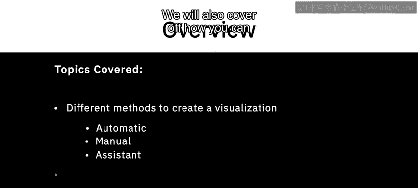
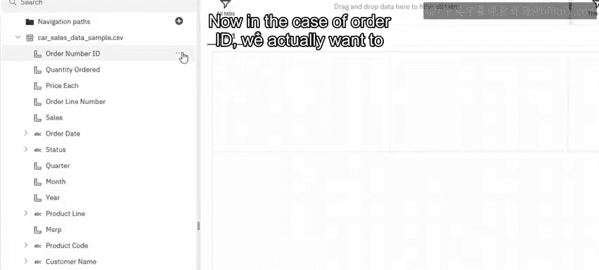
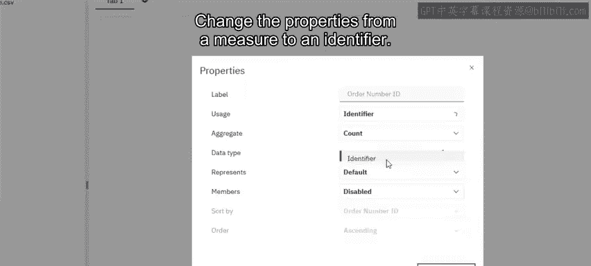
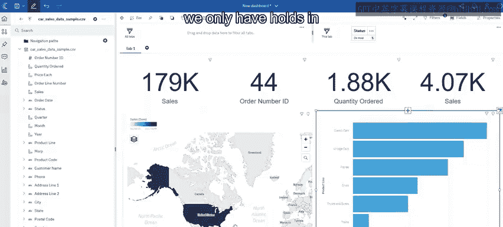

# 019：在Cognos Analytics中创建简单仪表板

在本节课中，我们将学习如何在Cognos Analytics中创建简单的仪表板。我们将介绍多种创建可视化的方法，包括自动生成、手动配置以及使用智能助手。同时，我们也会学习如何在仪表板内应用筛选器。

---

## 🎯 理解数据与调整属性

上一节我们介绍了数据准备，本节我们来看看如何理解数据并调整其属性。当数据上传后，我们需要查看并理解其中包含的数据类型，这可以通过每个数据元素前的图标来识别。

以`Order ID`字段为例，我们实际上需要将其属性从**度量**更改为**标识符**。操作步骤如下：

1.  在数据树中找到`Order ID`字段。
2.  右键点击该字段，选择“属性”或类似选项。
3.  在属性面板中，将其角色从“度量”切换为“标识符”。

完成此操作后，数据的基础结构便已就绪，我们可以开始创建可视化图表。

---

## 📈 创建关键绩效指标可视化

接下来，我们开始创建一些可视化图表。最简单的方法是直接从左侧的数据树中将字段拖放到画布上。

**以下是创建关键绩效指标（KPI）的步骤：**

*   **订单数量**：将`Order ID`字段拖到画布上。系统会自动为标识符类型的数据推荐最佳可视化形式，这里是一个列表。我们可以手动将其更改为摘要卡（如总计），以显示订单总数。
    *   **公式/逻辑**：`订单数量 = COUNT(Order ID)`
*   **订购总量**：将`Quantity Ordered`字段拖到画布上，系统通常会将其汇总为总和。
*   **平均销售额**：将`Sales`字段拖到画布上。然后，在图表属性中将其汇总方式从“总和”更改为“平均值”。
    *   **公式/逻辑**：`平均销售额 = AVERAGE(Sales)`

就这样，我们拥有了几个用于监控和跟踪的关键绩效指标。

---

## 🗺️ 通过选择图表类型创建可视化

另一种创建可视化的方法是先选择想要的图表类型，再将其拖到画布上并配置数据。

例如，如果我们想查看基于国家/地区的全球销售额分布，可以按以下步骤操作：

1.  从图表面板中选择一个地图可视化组件，并将其拖到画布上。
2.  将`Country`字段拖放到地图的“地理位置”区域。
3.  将`Sales`字段拖放到地图的“颜色”或“大小”区域，以用颜色深浅或气泡大小表示销售额高低。

如果数据很多，可以在数据树的搜索框中输入“Country”来快速定位字段。创建后，可以手动拖拽图表的边缘来调整其大小，画布上会显示其占用的百分比。

当然，每个可视化组件都有许多属性可以调整。虽然我们不会深入每个细节，但如果您想实现特定效果，查看属性面板通常能找到相应设置。

---

## 🤖 使用智能助手创建可视化

最后，我们将展示通过智能助手创建可视化的方法。当您不确定要分析什么时，助手可以提供建议。

**以下是使用助手的流程：**

1.  打开智能助手面板。
2.  如果您没有明确想法，可以点击“建议问题”。助手会提供一些您可能未曾想到的分析视角。
3.  例如，我们输入一个简单的问题：“哪个产品线的销售额最高？”
4.  点击执行后，助手会生成相应的可视化图表（如柱状图），并提供基于此图表的其他备选视图。
5.  如果对某个视图满意，只需将其从助手面板拖放到主画布上即可。它就会成为仪表板中的一个新组件，您可以像调整其他图表一样调整其大小。

---

## 🔍 实现仪表板的交互与筛选

我们创建的所有仪表板都设计为交互式的。这意味着您可以通过点击图表中的元素来筛选整个仪表板的数据视图。

**交互筛选有两种主要方式：**

*   **点击筛选**：例如，在“产品线销售额”图表中，点击“经典汽车”这个柱条。您会看到仪表板上的所有其他图表（如全球销售额地图、KPI卡）都立即更新，只显示与“经典汽车”相关的数据。您可以进行多次点击以组合筛选。
*   **拖拽字段筛选**：您也可以将数据树中的某个字段直接拖到画布顶部的“筛选器”区域。例如，如果想按订单状态筛选，可以将`Status`字段拖到筛选器栏。您可以选择一个或多个状态值（例如“On Hold”）。应用后，整个仪表板将只反映处于“On Hold”状态的订单数据，从而提供聚焦的洞察。

---

## 📝 课程总结

本节课中，我们一起学习了在Cognos Analytics中创建简单仪表板的核心技能。我们掌握了三种创建可视化的方法：直接拖放字段生成KPI、手动选择图表类型进行构建，以及利用智能助手快速获得分析建议。更重要的是，我们理解了如何通过点击和拖拽字段来实现仪表板各组件间的联动筛选，从而进行交互式数据分析。

在下一节视频中，我们将深入探讨仪表板更多的高级功能。