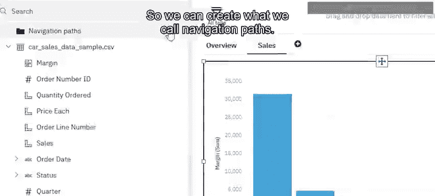
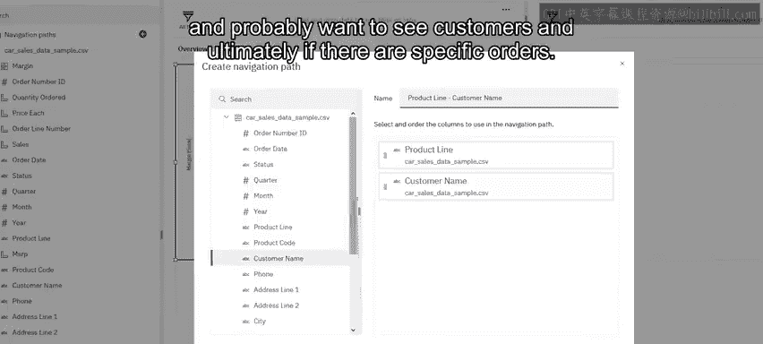
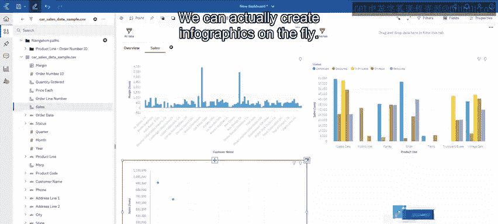

# 020：Cognos分析仪表板的高级功能 🚀

在本节课中，我们将学习Cognos分析仪表板的一些高级功能。这些功能能帮助你更深入地探索数据、创建自定义指标，并优化数据可视化效果，从而获得更深刻的业务洞察。

---

上一节我们介绍了仪表板的基础操作，本节中我们来看看如何创建自定义计算字段。

与Excel类似，我们的仪表板可以创建计算。以下是创建计算字段的几种方法。

*   你可以从列出的多种计算选项中进行选择。
*   或者，你也可以直接开始输入，系统会提供建议。

例如，我们想计算每个产品的利润率。这可以通过公式 **`利润率 = 建议零售价(MSRP) - 销售单价(Sale Price)`** 来实现。

创建完成后，这个计算字段会和其他字段一样出现在数据列表中。现在，我们可以选择“利润率”字段，并查看按“产品线”分类的情况。从结果中，我们可以看到“火车”产品线的利润率表现不佳，甚至为负值。

---

为了深入分析“火车”产品线亏损的原因，我们可以利用导航路径功能。

导航路径允许你选择数据中的任意字段，进行上钻或下钻分析。例如，我们可以从“产品线”开始，下钻到“客户”，最终甚至可以查看具体的“订单”。

在“火车”产品线上右键点击并选择下钻，我们可以看到导致负利润的几位具体客户。继续下钻到其中一位客户（如“Mini Gifts”），可以发现虽然他们有一笔订单是盈利的，但其他订单均造成了亏损。

---

接下来，我们看看如何从可视化图表中排除特定数据。

假设我们查看按“状态”和“产品线”划分的销售额。此时视图可能仍受之前下钻操作的影响，只显示“火车”产品线的数据。我们需要点击返回按钮，回到初始视图。

在图表中，我们发现“已发货”状态的数据量极大，影响了其他状态的观察。我们可以右键点击“已发货”项，选择“排除”，从而更清晰地查看其他状态（如“处理中”、“已取消”等）的数据情况。

---

当数据点过多时，我们可以使用“置顶/置底”功能来聚焦关键信息。

例如，在查看“客户名称”和“销售额”的列表时，数据可能非常庞大。为了快速找到最重要的客户，我们可以右键点击“销售额”字段，选择“显示前N个”。默认情况下，系统会显示前10名客户。这样，我们就能立即看到销售额最高的10位客户。

---

最后，我们还可以快速创建信息图来增强视觉表现。

如果你有一个展示总销售额的图表，可以轻松地将其转换为信息图。只需从左侧的形状库中（比如一个存钱罐图标），将其拖放到销售额图表上。瞬间，一个生动的信息图就生成了，使数据展示更加直观和吸引人。

---

**本节课总结**

本节课我们一起学习了Cognos分析仪表板的四项高级功能：
1.  **创建计算字段**：像在Excel中一样，使用公式（如 `利润率 = MSRP - Sale Price`）生成新的数据指标。
2.  **使用导航路径**：通过右键下钻，从汇总数据（如产品线）深入查看明细数据（如具体客户和订单）。
3.  **从可视化中排除数据**：右键排除特定项（如“已发货”状态），以更清晰地分析其余数据。
4.  **设置置顶/置底**：右键选择“显示前N个”，快速聚焦于最重要的数据点（如前10名客户）。
5.  **创建信息图**：通过拖放图形元素（如存钱罐图标）到数据上，快速生成视觉化的信息图。

掌握这些功能，将帮助你更灵活、更高效地从数据中发现有价值的信息。