# 021：使用Cognos访问您的数据仓库

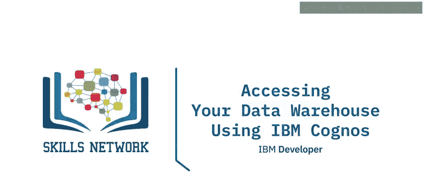

在本节课中，我们将学习如何通过IBM Cognos Analytics连接到数据仓库，并利用其中的数据创建交互式仪表板。我们将详细介绍从建立连接到最终生成可视化报表的完整步骤。

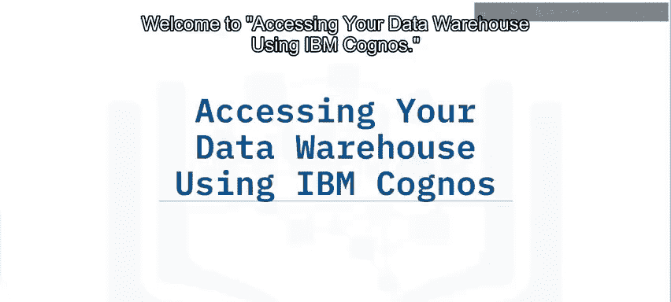

---

除了文件和静态数据集，您还可以使用Cognos Analytics访问云端或企业内的多种数据库和数据仓库。这些数据源包括IBM DB2 Warehouse、Amazon Redshift、Oracle、Microsoft SQL Server、MongoDB、MySQL、PostgreSQL、Snowflake等。

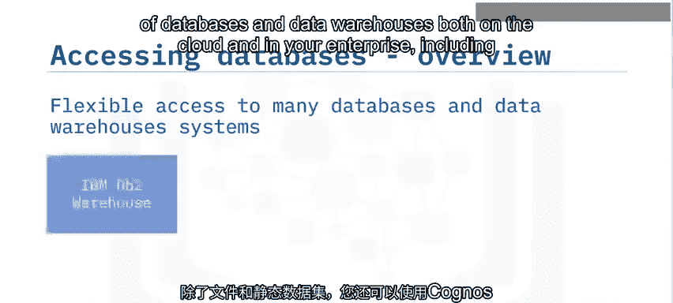

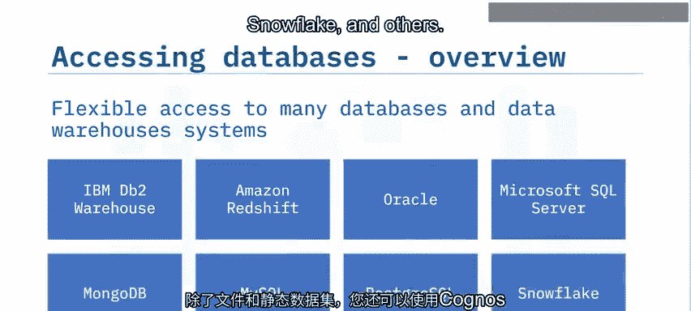

---

上一节我们了解了Cognos支持的数据源类型，本节中我们来看看连接和访问数据仓库的具体步骤。

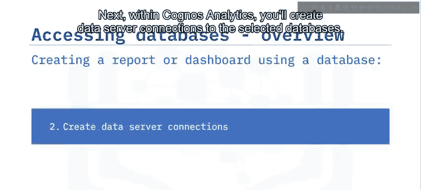

以下是访问数据仓库并创建仪表板的五个核心步骤：

1.  **识别源数据库**：确定要连接的数据库、模式和数据表，并获取其连接凭据。
2.  **创建数据服务器连接**：在Cognos Analytics中，为选定的数据库建立数据服务器连接。
3.  **创建数据模块**：为每个连接，为选定的数据表创建数据模块。
4.  **创建仪表板并添加数据源**：新建一个仪表板，并将上一步创建的数据模块添加为数据源。
5.  **拖拽字段并创建可视化**：将数据模块中的列（字段）拖拽到仪表板画布上，以生成各种可视化图表。

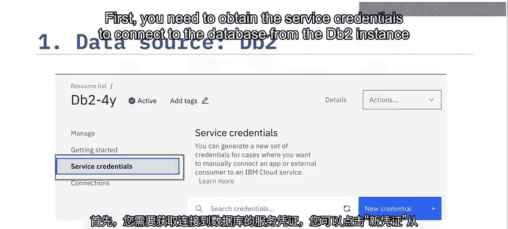

---

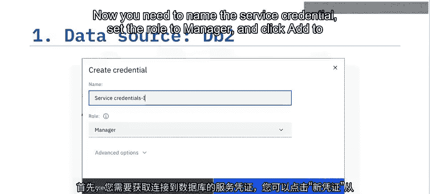

接下来，让我们通过一个演示来具体看看这五个步骤。本次演示将使用一个IBM DB2 on Cloud数据库作为源数据仓库。

**第一步：获取数据库连接凭据**

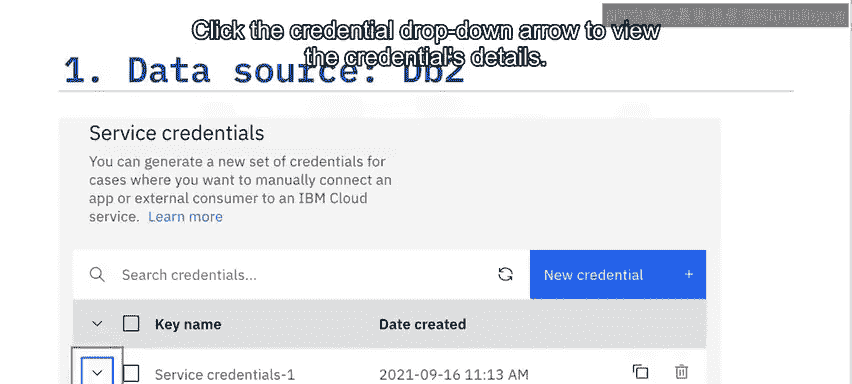

首先，您需要从DB2实例管理页面获取服务凭据以建立连接。点击“New credential”创建新的凭据。

现在，您需要命名服务凭据，将角色设置为“Manager”，然后点击“Add”添加服务凭据。

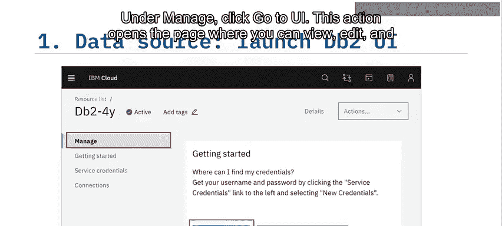

向下滚动，您可以在服务凭据列表中看到刚刚创建的凭据。点击凭据旁边的下拉箭头以查看详细信息。以下是服务凭据详情的片段。复制用户名、密码和JDBC URL。您需要用实际值替换JDBC URL中的用户名和密码占位符。请记住移除尖括号 `<` 和 `>`。

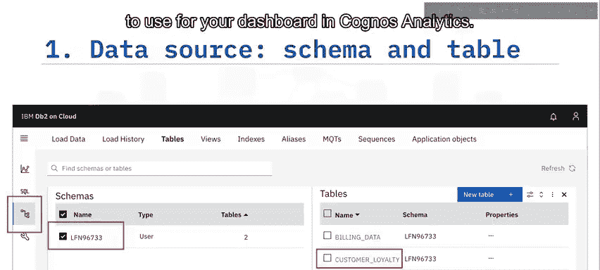

**第二步：识别并预览数据**

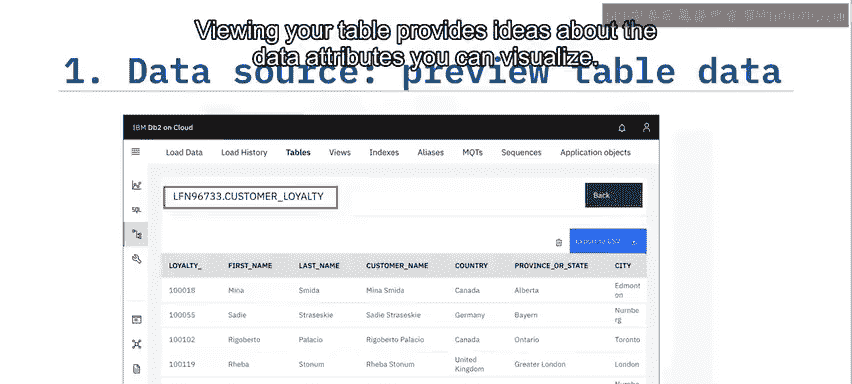

接下来，让我们识别并预览将在Cognos仪表板中使用的数据，即所需的模式和表。在“Manage”下点击“Go to UI”。此操作将打开一个页面，您可以在其中查看、编辑和管理DB2实例。

在DB2 UI中，点击“Data”图标，选择模式，然后选择您想在Cognos Analytics仪表板中使用的表。在本例中，选择“Customer Loyalty”表。

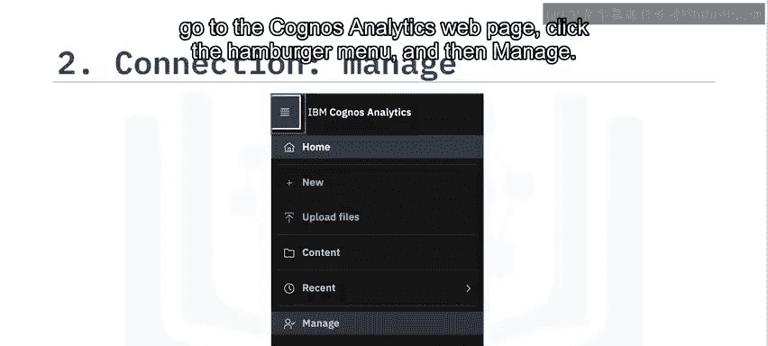

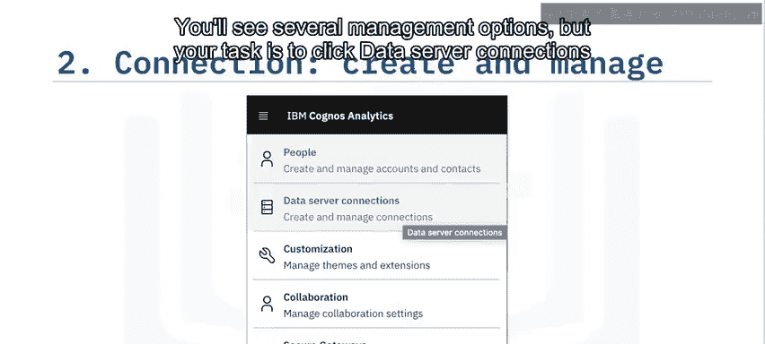

在这里，您正在预览模式“LFN96733”中的“Customer Loyalty”表。查看您的表有助于了解可以可视化的数据属性。

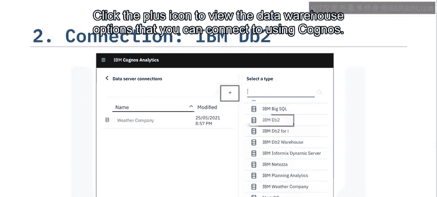

**第三步：在Cognos中创建数据服务器连接**

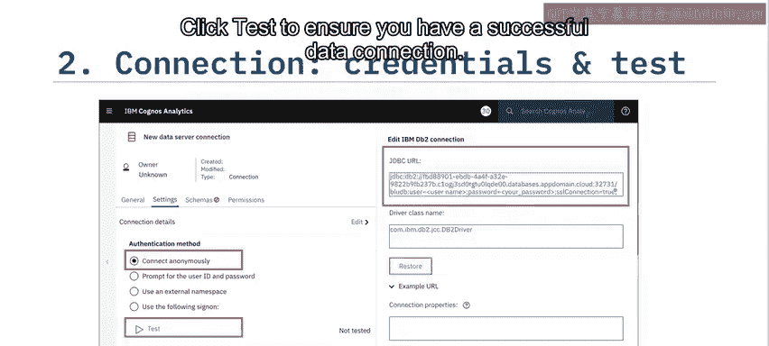

现在您已经获得了数据库凭据并确定了要可视化的数据，接下来转到Cognos Analytics网页。点击汉堡菜单，然后点击“Manage”。您会看到多个管理选项，但您的任务是点击“Data Server Connections”来连接数据服务器。点击加号图标以查看可以使用Cognos连接的数据仓库选项。

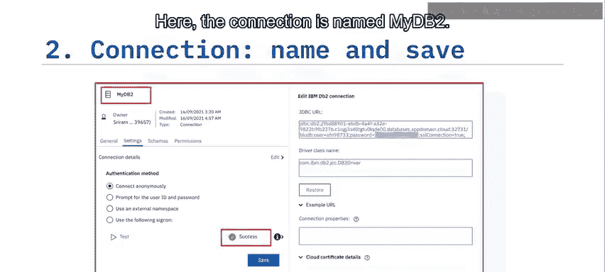

接下来，点击“IBM DB2”。现在选择“Connect anonymously”选项，并粘贴您从DB2实例管理页面复制的JDBC连接字符串。用您的DB2服务凭据替换用户名和密码，然后点击“Test”以确保数据连接成功。

如果测试成功，您将看到一个带有绿色对勾图标的“Success”提示。然后您可以为此连接命名，这里连接被命名为“myDB2”。点击“Save”。

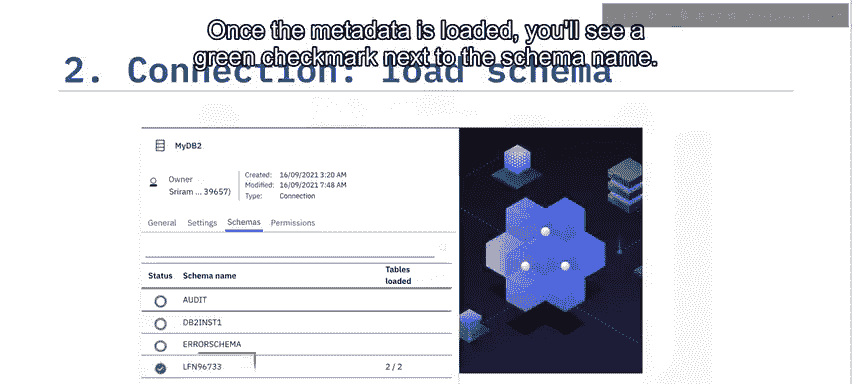

**第四步：加载模式并创建数据模块**

接下来，您需要加载模式。转到“Schema”选项卡，点击您要加载的模式旁边的三个点，然后点击“Load metadata”。此操作需要几秒钟，Cognos会从DB2实例获取并加载元数据。

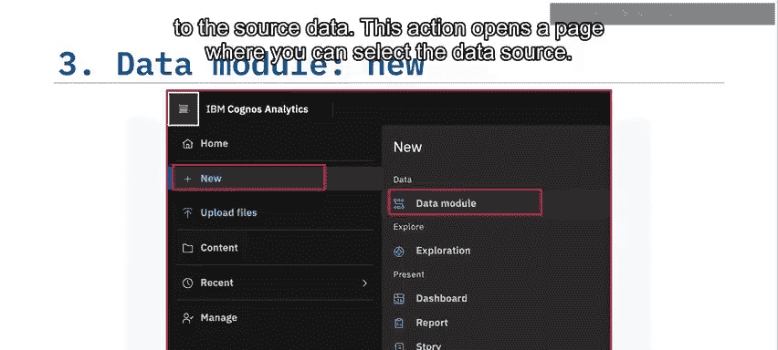

元数据加载完成后，您会在模式名称旁边看到一个绿色对勾标记。

现在您已连接到DB2实例，接下来创建一个新的数据模块，该模块将链接到源数据。此操作会打开一个页面，您可以在其中选择数据源。

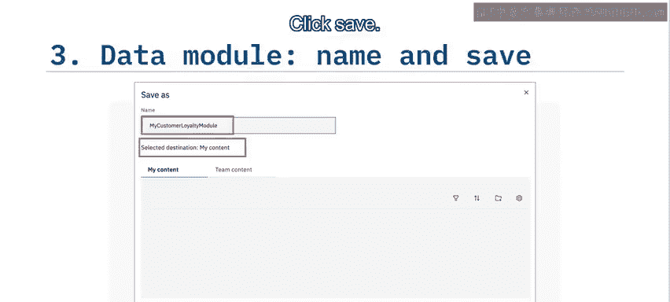

点击左侧窗格中的“Data Servers”图标，然后点击您之前创建的连接“myDB2”。在这里，点击您要使用的模式，然后点击“OK”。当新模块打开时，点击表名，Cognos将打开该表，您可以查看数据。点击文件图标以保存该表。

为数据模块指定一个合适的名称。这里数据模块被命名为“My Customer Loyalty Module”，并保存在“My Content”文件夹中。点击“Save”。

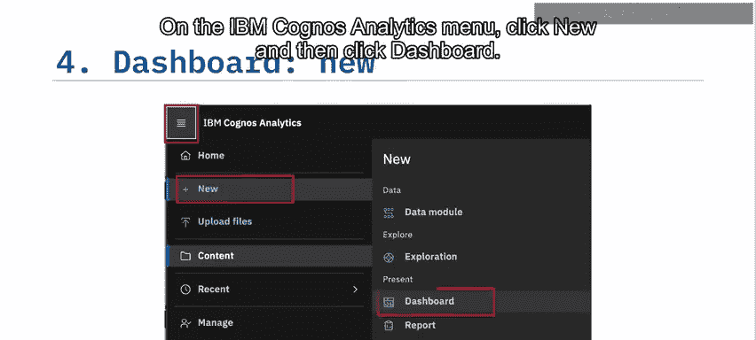

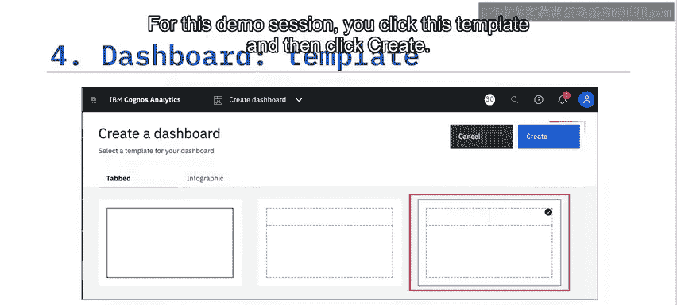

**第五步：创建并设计仪表板**

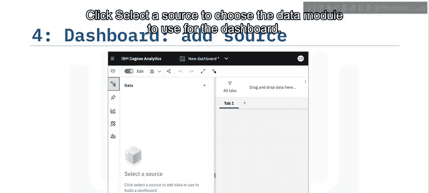

现在数据模块已创建，您将使用它来创建仪表板。在IBM Cognos Analytics菜单上，点击“New”，然后点击“Dashboard”。您可以选择选项卡式或信息图布局，每种都有多个模板选项。在本演示中，点击此模板，然后点击“Create”。

点击“Choose a source”以选择用于仪表板的数据模块。

在仪表板窗口中，点击“My Customer Loyalty”数据模块名称列下的“Add source”，然后点击“Add”。在“My Customer Loyalty”数据模块的左侧窗格中，将您想要查看的属性拖拽到仪表板上。在此示例中，选择了“Quantity Sold”。

您可以看到总销售数量以及标题（默认是字段标签）。您可以双击标签来更改或格式化文本。您还可以根据设计要求调整属性的长度、宽度和位置。

接下来，将属性拖拽到选项卡区域，并将其渲染为条形图。这些属性被渲染成一个条形图，显示各产品线多年来的销售额。您可以调整选项卡的大小和位置，并可以像处理“Quantity Sold”属性一样添加标题并格式化它。

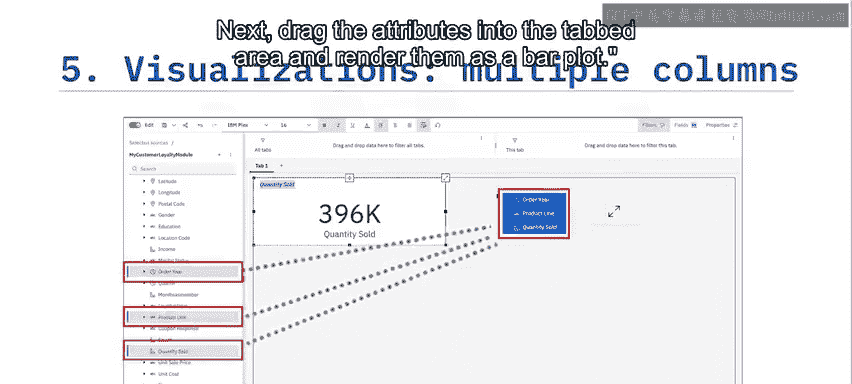

对于第三个选项卡，让我们将“Country”拖到“Quantity Sold”下方，以可视化区域销售情况。

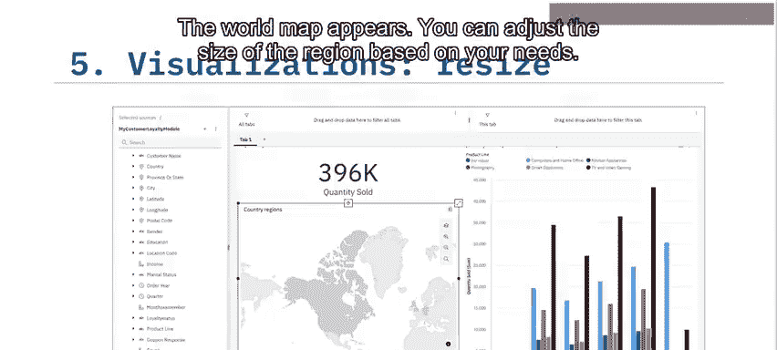

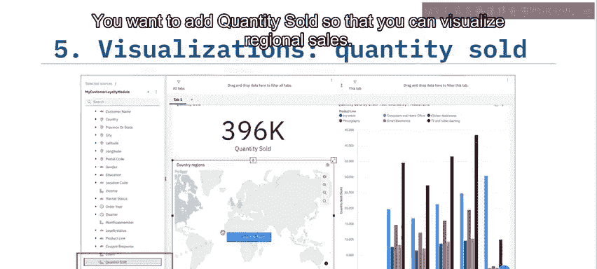

世界地图出现了。您可以根据需要调整区域的大小。让我们为地图添加一些属性。

您想要添加“Quantity Sold”，以便可视化区域销售情况。

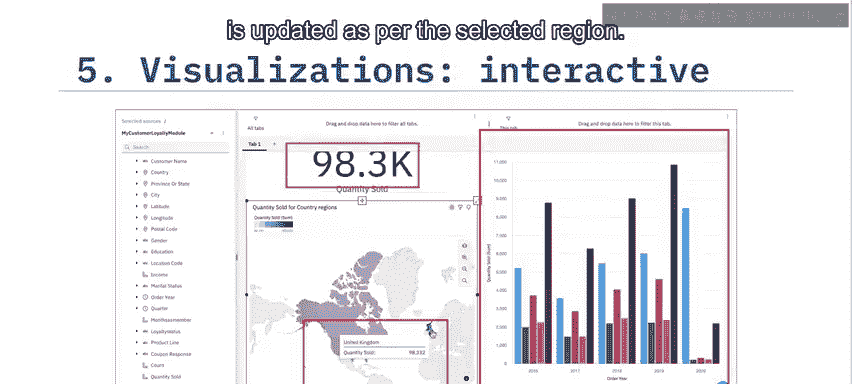

现在，当您点击特定区域时，可以看到条形图，并且销售数量会根据所选区域进行更新。这是完成后的仪表板一瞥。请记住用适当的链接保存您完成的仪表板。Cognos使您可以轻松地将完成的仪表板作为可查看的链接进行分享。

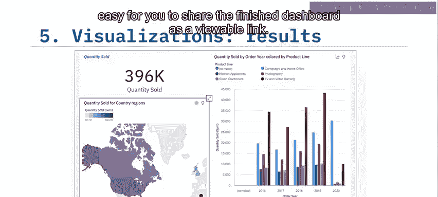

---

本节课中我们一起学习了如何在Cognos Analytics中使用包括平面文件、数据库和数据仓库在内的各种数据源来创建仪表板和报告。

访问Cognos中的数据库需要**数据服务器连接**和**数据模块**。数据服务器连接建立了与数据库的连接，而数据模块是一个容器或指向特定表和数据库对象的链接。您可以像添加任何其他源一样将数据模块添加到仪表板，并使用其字段和列来创建可视化图表。

Cognos Analytics提供了多种模板和可视化选项，可以利用数据仓库中的数据创建交互式仪表板。