# 002：数据科学基础原理

在本节课中，我们将学习数据科学的基础原理，了解其核心组成部分、工作流程以及它如何为组织创造价值。

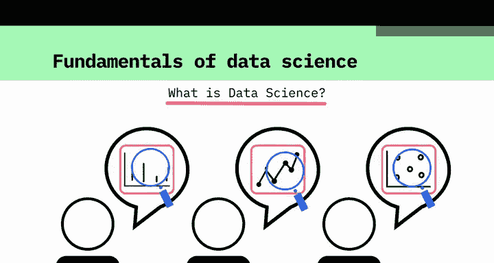

---

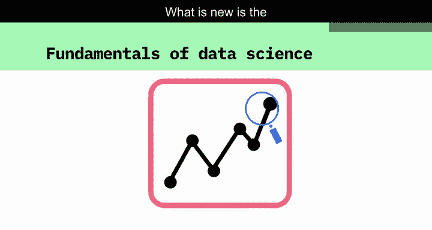

每个人对数据科学的定义可能略有不同。但大多数人认同，数据分析是其重要的组成部分。

数据分析本身并非新事物。真正新颖的是，如今我们可以从极其多样化的来源获取海量数据。

这些来源包括日志文件、电子邮件、社交媒体、销售数据、患者信息档案、体育表现数据、传感器数据、监控摄像头等等。

在数据量空前增长的同时，我们也拥有了进行有效分析、揭示新知识所需的计算能力。

数据科学可以帮助组织理解其运营环境、分析现有问题，并揭示那些先前隐藏的机遇。

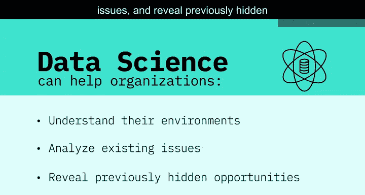

---

上一节我们提到了数据科学的价值，本节中我们来看看数据科学家如何通过数据分析为组织增加知识。

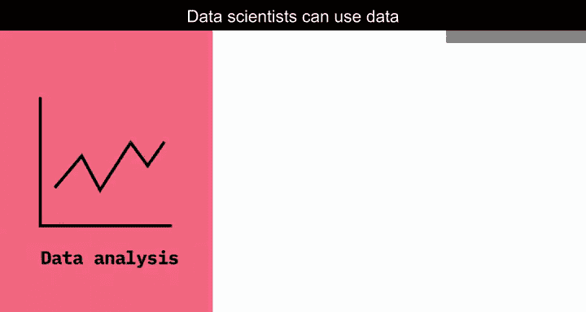

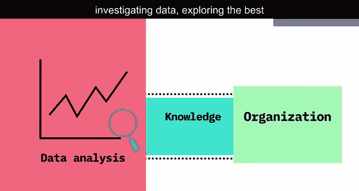

数据科学家通过调查数据来进行分析，探索如何最好地利用数据为业务提供价值。

那么，数据科学的过程是怎样的？许多组织会运用数据科学来聚焦于一个具体问题。因此，明确组织希望解答的问题是至关重要的。

以下是数据科学流程的第一步，也是最关键的一步：

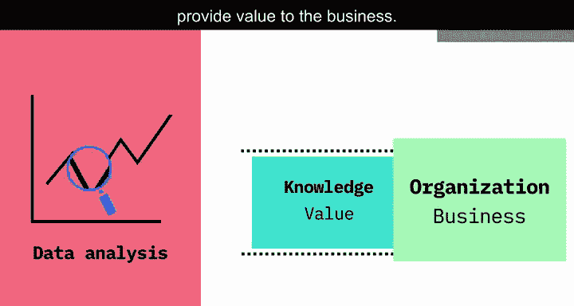

*   **明确问题**：这个步骤定义了整个数据科学项目的走向。

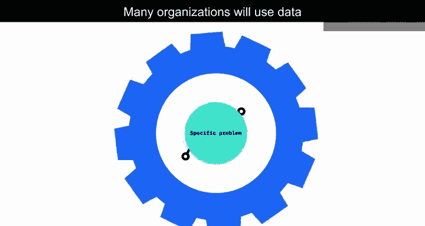

优秀的数据科学家是充满好奇心的人，他们会通过提问来澄清业务需求。

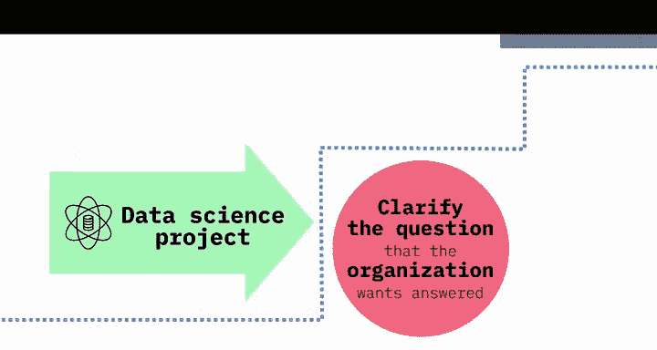

---

明确了问题之后，接下来的问题自然就是：我们需要什么数据来解决这个问题？

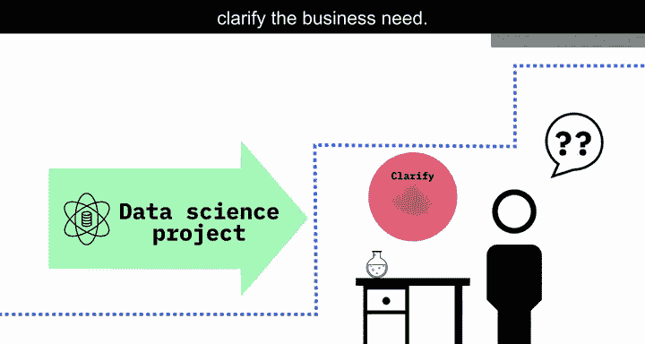

以下是数据科学家在数据准备阶段需要考虑的核心问题：

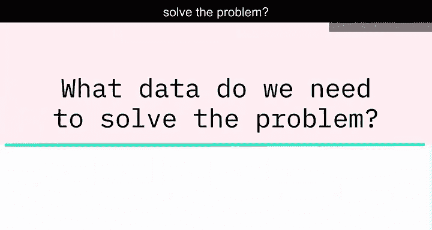

*   **数据需求**：解决这个问题需要哪些数据？
*   **数据来源**：这些数据将从哪里来？

数据科学家可以分析来自多个来源的结构化和非结构化数据。根据问题的性质，他们可以选择不同的方式来分析数据。

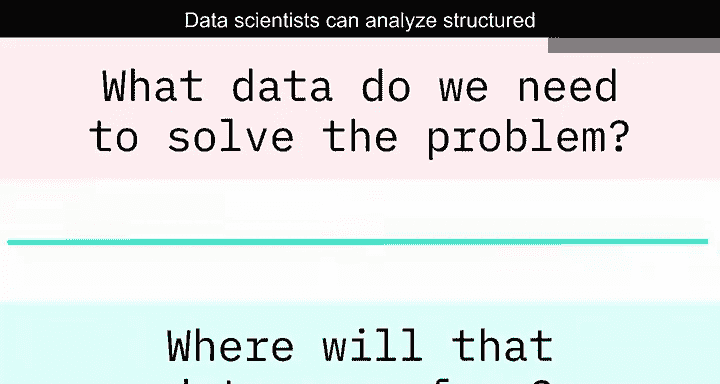

---

上一节我们讨论了数据收集，本节中我们来看看数据分析的核心环节。

使用多种模型来探索数据，可以揭示出其中的模式、原型和异常值。有时，这会证实组织的猜测；但有时，它会带来全新的知识，引导组织采取新的方法。

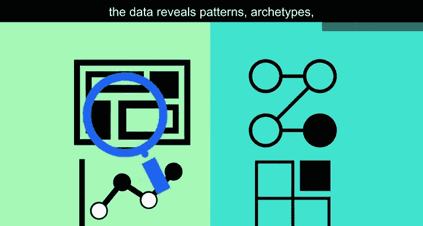

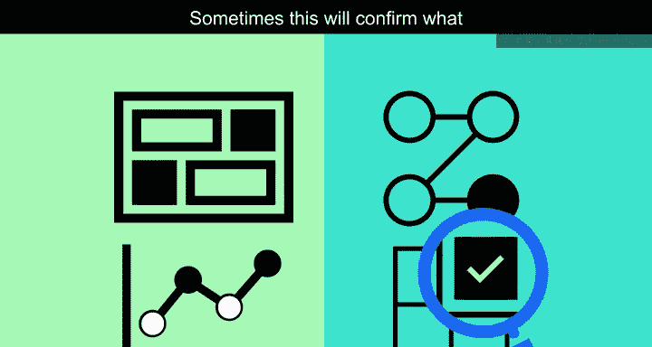

---

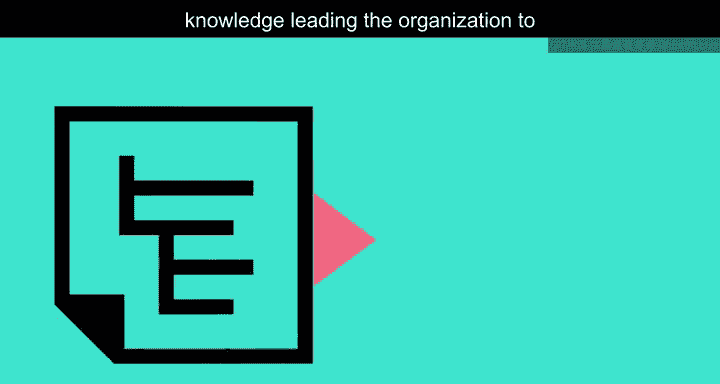

当数据揭示了其洞察后，数据科学家的角色就转变为**故事讲述者**，负责将结果传达给项目相关方。

数据科学家可以利用强大的数据可视化工具，帮助相关方理解结果的性质以及建议采取的行动。

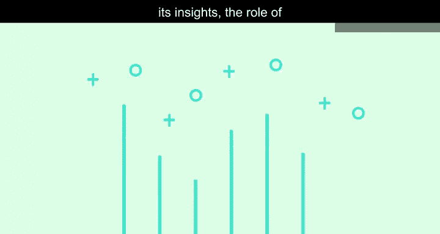

---

数据科学正在改变我们的工作方式，改变我们使用数据的方式，也改变我们看待世界的方法。

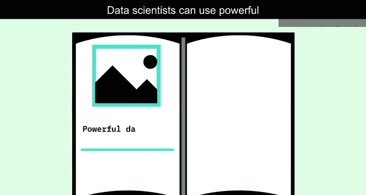

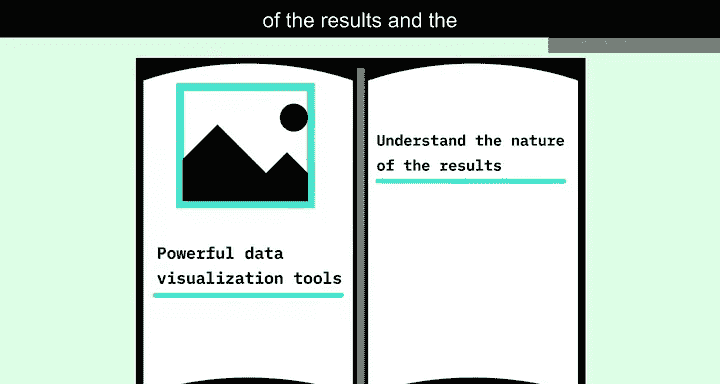

---

**本节课总结**

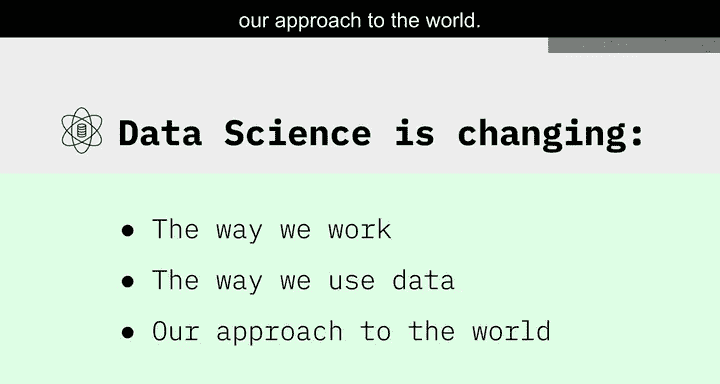

在本节课中，我们一起学习了数据科学的基础原理。我们了解到，数据科学的核心在于利用现代计算能力分析海量、多样的数据。其标准流程始于**明确业务问题**，进而确定**数据需求与来源**，接着通过模型进行**数据分析与探索**以揭示洞察，最后将结果**有效传达**给决策者。数据科学通过这一系列步骤，为组织创造价值并推动变革。