# 006：传统问题与数据科学解决方案 🚀

在本节课中，我们将探讨组织如何利用海量数据，通过数据科学为传统问题寻找创新且最优的解决方案。我们将通过三个不同领域的实例，了解数据科学从发现问题到实施策略的全过程。

---

组织能够以日益增多的方式，利用如今几乎无限量的可用数据。然而，所有组织最终运用数据科学的目的是一致的：为现有问题发现最优解决方案。

上一节我们了解了数据科学的广泛应用潜力，本节中我们来看看数据科学如何具体解决传统难题。以下是三个数据科学为老问题提供创新解决方案的实例。

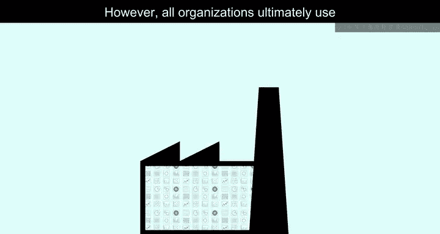

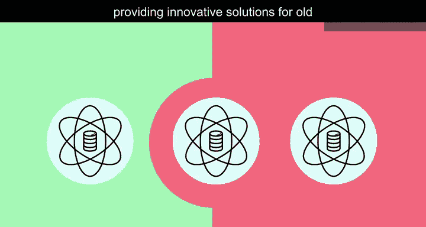

## 交通运输领域的革新 🚕

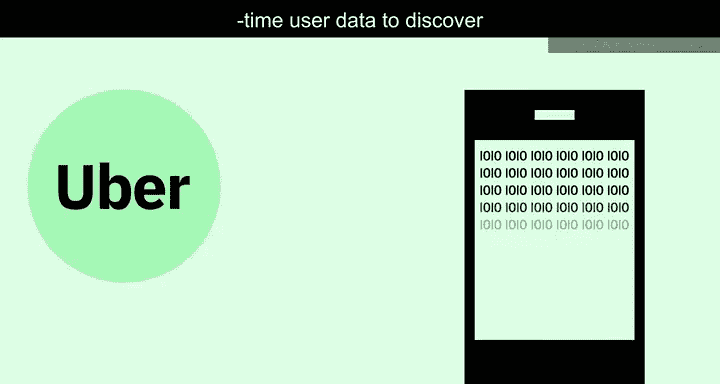

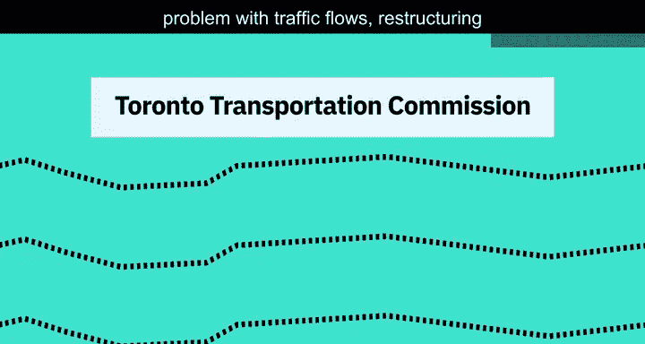

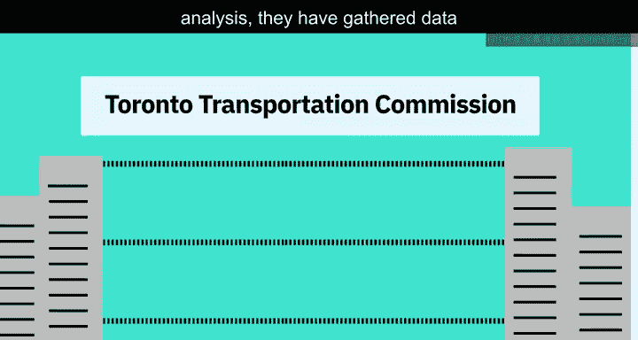

在交通运输领域，Uber通过收集实时用户数据，来发现可用司机数量、判断是否需要更多司机，以及是否应启动动态定价以吸引更多司机。Uber利用数据，旨在以乘客愿意支付的成本，在正确的时间和地点配置正确数量的司机。

在另一项与交通相关的数据科学应用中，多伦多交通委员会在解决交通流量这一老问题上取得了巨大进展。他们运用数据科学工具和分析，重构了城市内及周边的交通流。以下是他们采取的具体步骤：

*   收集数据以更好地理解有轨电车运营并识别需要干预的区域。
*   分析客户投诉数据。
*   利用探测数据更好地了解主干道的交通性能。
*   组建专门团队，以更好地利用大数据进行运营规划和评估。

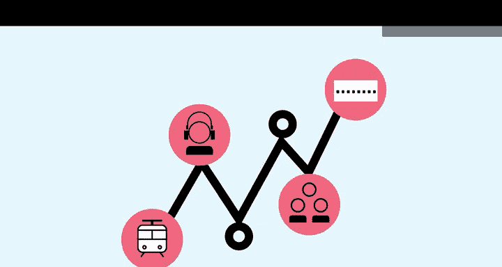

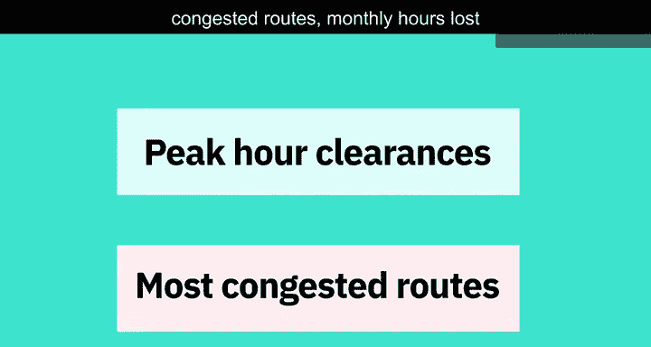

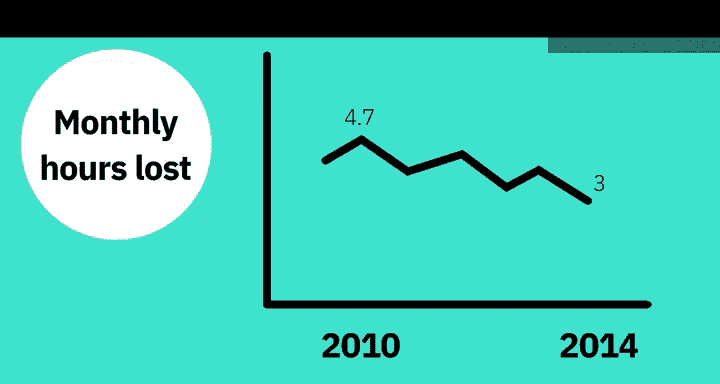

通过专注于高峰时段的疏导并识别最拥堵的路线，通勤者每月因交通拥堵损失的时间从2010年的4.75小时，降至2014年中的3小时。

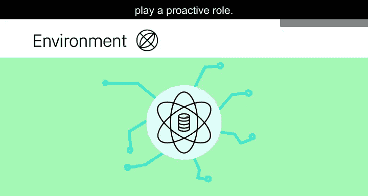

## 应对环境挑战 🌊

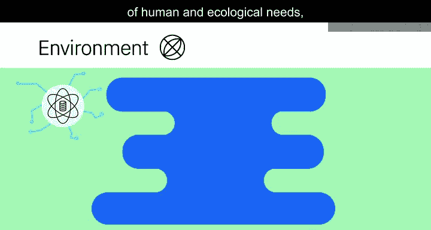

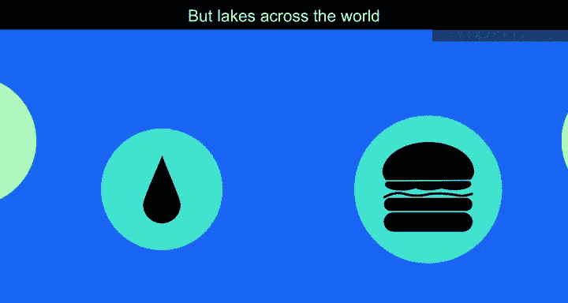

面对环境问题，数据科学也能发挥积极作用。

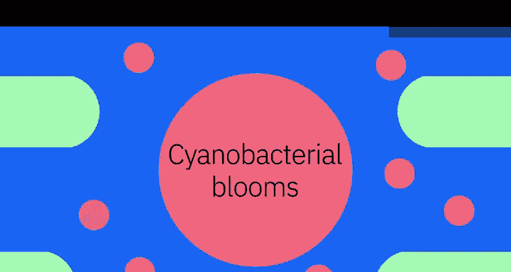

淡水湖满足了人类和生态的多种需求，例如提供饮用水和生产食物。但全球各地的湖泊都受到有害蓝藻水华日益频发的威胁。

为了解决这个长期存在的难题，有许多项目和正在进行的研究。在美国，一个由从缅因州到南卡罗来纳州多个研究中心的科学家组成的团队，正在开发和部署高科技工具来探索东海岸湖泊中的蓝藻。以下是他们采用的方法：

*   使用机器人船、浮标和配备摄像头的无人机。
*   在检测到蓝藻的湖泊中测量物理、化学和生物数据。
*   收集与湖泊及有害水华发展相关的大量数据。

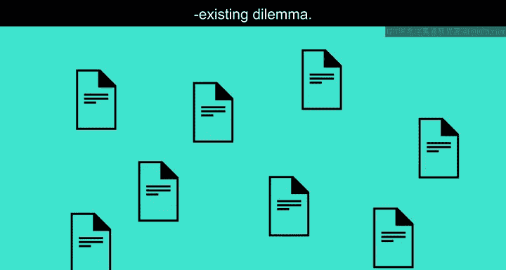

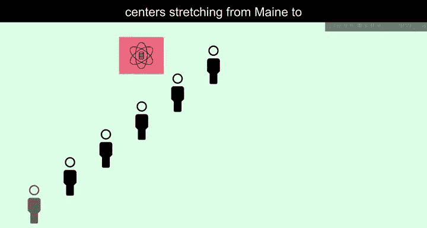

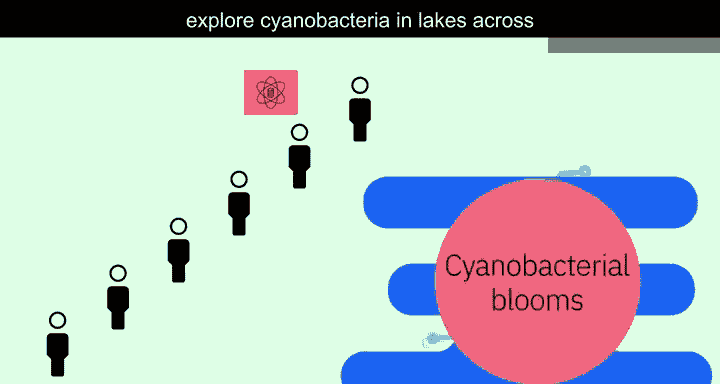

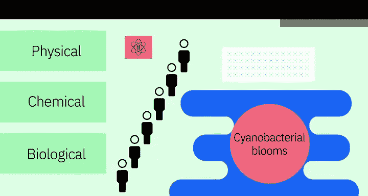

该项目同时也在构建新的算法模型来评估研究结果。收集到的信息将有助于更好地预测蓝藻水华发生的时间和地点，从而能够采取主动措施来保护娱乐湖泊和饮用水源湖泊的公众健康。

这种跨学科的训练，为下一代科学家使用恰当的现代化数据科学工具解决社会问题做好了准备。

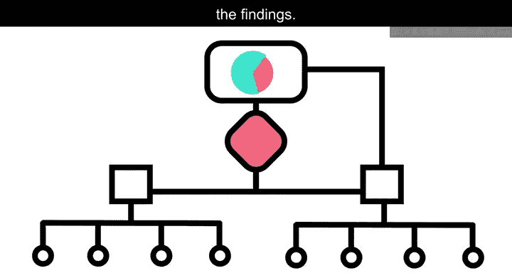

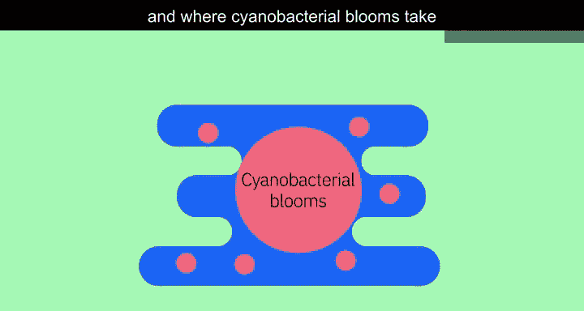

## 数据科学的通用路径 🔄

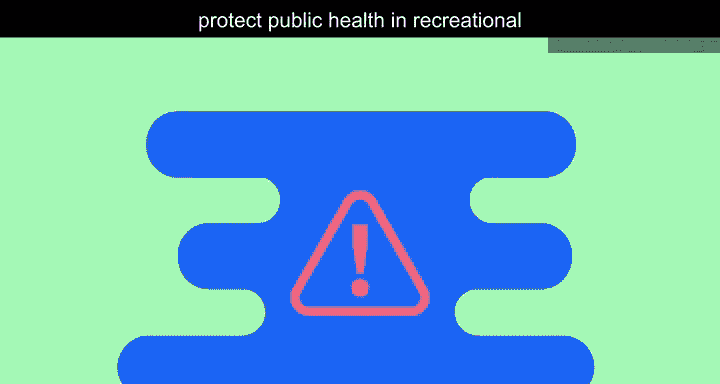

从上述案例可以看出，要获得更好的解决方案，需要经历一个系统的过程。这需要收集大量数据，进行清理和准备，然后对其进行分析，以获得为当今企业开发更优解决方案所需的洞察。

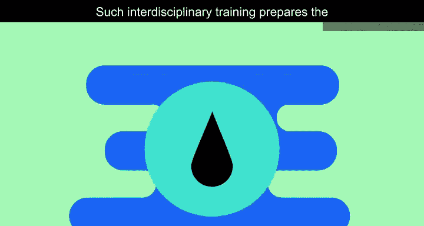

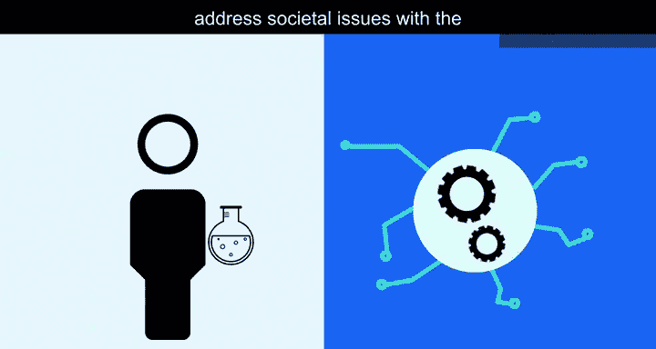

那么，如何获得一个高效且更优的解决方案呢？以下是关键的步骤：

*   **识别问题**：必须明确问题并对其建立清晰的理解。
*   **收集数据**：为分析收集数据。
*   **选择工具**：识别需要使用的正确工具。
*   **制定策略**：制定数据策略。

案例研究也有助于定制潜在的解决方案。一旦这些条件具备且可用数据被提取出来，你就可以开发一个机器学习模型。一个组织需要时间来完善其运用数据科学的数据策略最佳实践，但其带来的效益是值得的。

---

本节课中，我们一起学习了数据科学如何通过系统性的数据收集、分析和建模，为交通、环境等领域的传统问题提供创新且高效的解决方案。关键在于明确问题、收集数据、选用合适工具并制定策略，最终通过持续优化获得显著效益。