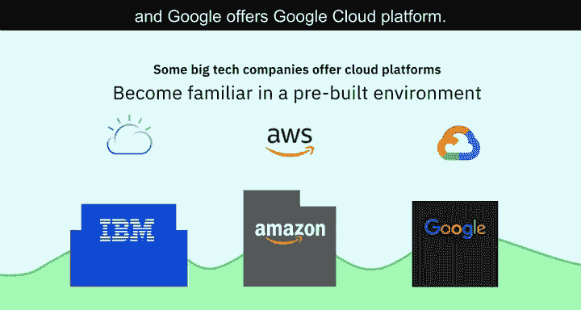
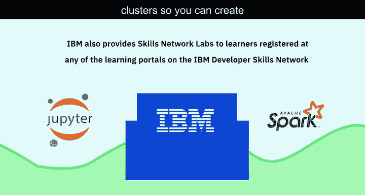
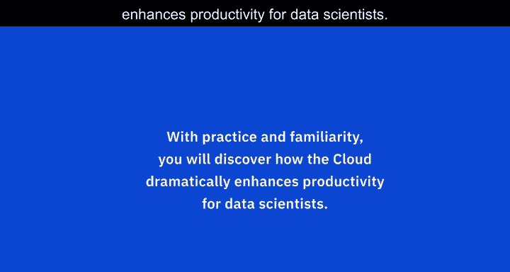

# 008：数据科学中的云计算 ☁️

在本节课中，我们将要学习云计算在数据科学中的核心作用。云计算如何帮助数据科学家突破本地硬件限制，实现高效的数据存储、处理与协作。

---

云计算对数据科学家而言至关重要。它允许你将数据和信息上传至云端，即一个中央存储系统。这使你能够绕过所用计算机和系统的物理限制，并利用先进机器的分析和存储能力，而这些机器不一定是你自己或你公司的设备。

云计算不仅允许你将大量数据存储在例如加利福尼亚州或内华达州的服务器上，还允许你部署非常先进的计算算法，并利用不属于你的机器进行高性能计算。

可以这样理解：你有一些信息无法本地存储，于是将其发送到存储空间（我们称之为云端）。你需要使用的算法本地没有，但在云端这些算法是可用的。因此，你可以在非常大的数据集上部署这些算法，即使你自己的系统、机器或计算环境原本无法支持这样做。所以，云计算非常出色。

云计算的另一个优势是，它允许多个实体同时处理相同的数据。你可以与在德国的同事、印度的另一个团队以及加纳的另一个团队共同处理同一份数据。他们能够协同工作，是因为信息、算法、工具、答案和结果等所需的一切，都集中在一个我们称之为云端的地方。因此，云计算非常出色。

---

上一节我们介绍了云计算的基本概念，本节中我们来看看云计算带来的具体优势。

使用云计算使你能够即时访问开源技术，例如 **Apache Spark**，而无需在本地安装和配置它们。

使用云计算还能让你访问最新的工具和库，无需担心维护和更新问题。

云计算随时随地可用，跨越所有时区。你可以从笔记本电脑、平板电脑甚至手机上使用基于云的技术，这使得协作比以往任何时候都更容易。

多个协作者或团队可以同时访问数据，共同致力于产出解决方案。

---

以下是云计算平台的一些具体示例：

一些大型科技公司提供云平台，让你可以在预构建的环境中熟悉基于云的技术。IBM 提供 **IBM Cloud**，亚马逊提供 **Amazon Web Services (AWS)**，谷歌提供 **Google Cloud Platform**。

IBM 还通过 **Skills Network Labs (SN Labs)** 为学习者提供服务。注册 IBM 开发者技能网络上的任何学习门户后，你便可以访问如 **Jupyter Notebooks** 和 **Spark 集群** 等工具，从而创建自己的数据科学项目并开发解决方案。

---

随着实践和熟悉，你将发现云计算如何显著提升数据科学家的工作效率。

---

本节课中我们一起学习了云计算在数据科学中的关键作用。它通过提供可扩展的存储、强大的计算资源和便捷的协作环境，帮助数据科学家克服本地限制，更高效地处理数据和开发解决方案。掌握云平台的使用是现代数据科学家的重要技能。