# 009：大数据基础架构 🏗️

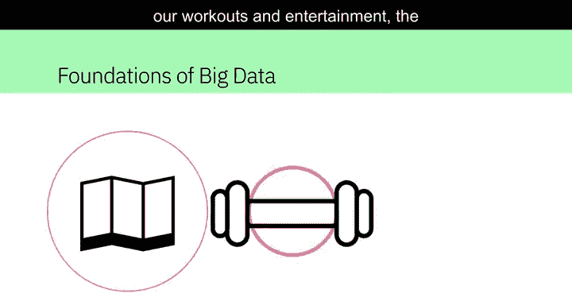

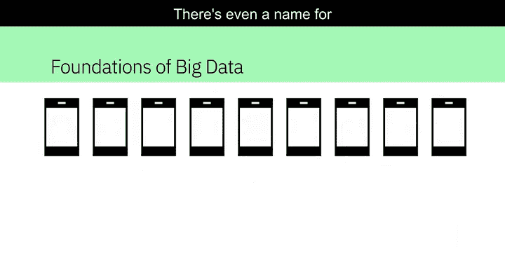

在本节课中，我们将要学习大数据的基础概念及其核心特征。我们将了解大数据如何定义，以及它为何在当今数字世界中至关重要。

在这个数字世界中，每个人都留下了痕迹，从我们的出行习惯到锻炼和娱乐活动。我们日常交互的联网设备数量不断增加，记录了大量关于我们的数据。

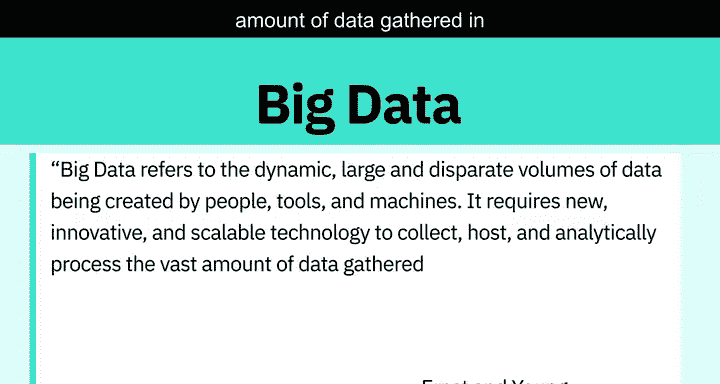

甚至有一个专门的术语来描述它：**大数据**。安永（Ernst & Young）提供了以下定义：大数据指的是由人、工具和机器产生的动态、海量且多样化的数据。它需要新颖、创新且可扩展的技术来收集、存储和分析处理所收集的海量数据，以获取与消费者、风险、利润、绩效、生产力管理和提升股东价值相关的实时商业洞察。

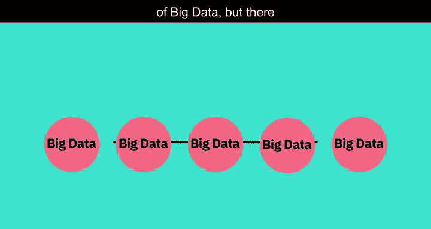

对于大数据并没有一个统一的定义，但在不同的定义中存在一些共同的要素。

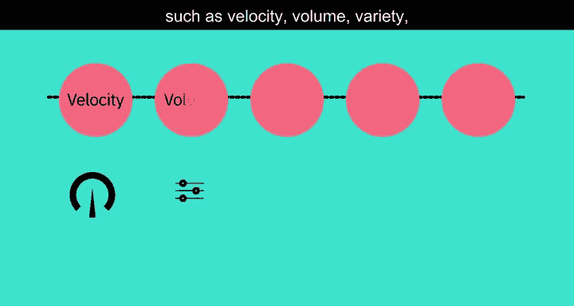

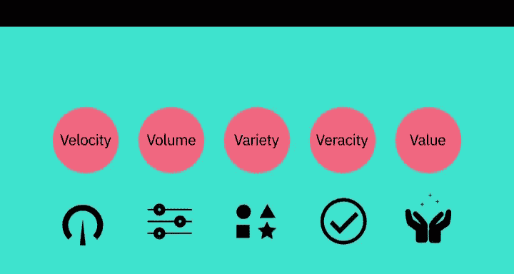

## 大数据的5V特征 📊

这些要素通常被称为大数据的 **5V** 特征。

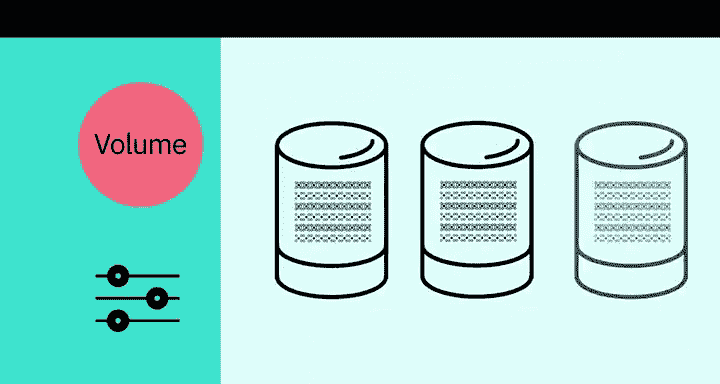

### 速度（Velocity）⚡

速度指的是数据积累的速率。数据正以极快的速度生成，这个过程永不停歇。近实时或实时的流处理技术，以及本地和基于云的技术，可以非常快速地处理信息。

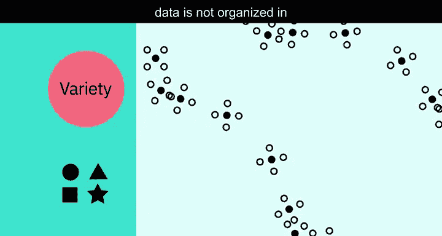

### 容量（Volume）💾

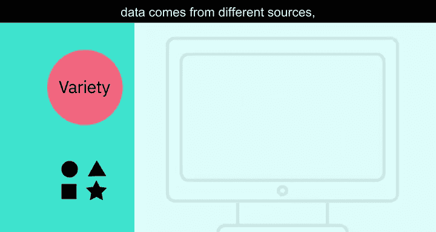

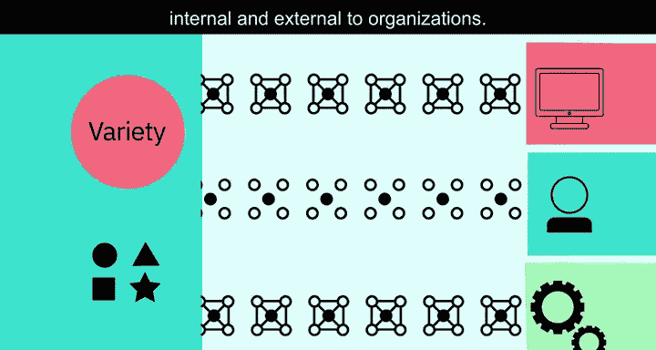

容量指的是数据的规模或存储数据量的增长。驱动容量增长的因素包括数据源的增加、更高分辨率的传感器以及可扩展的基础设施。

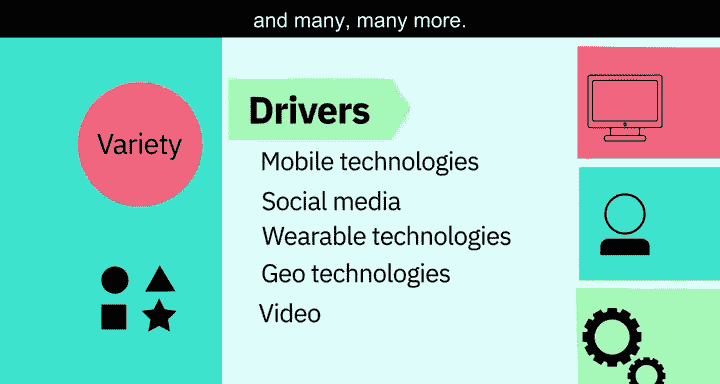

### 多样性（Variety）🎭

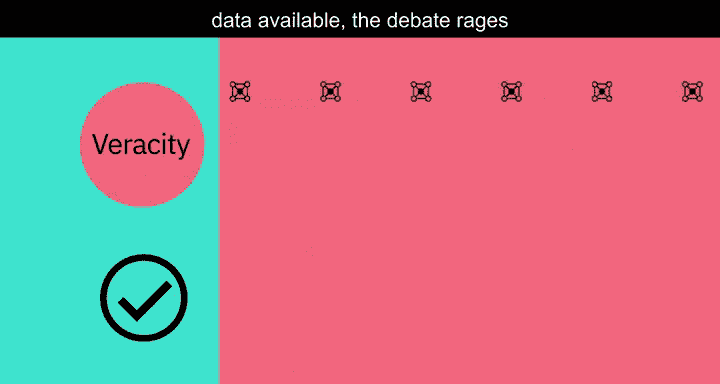

多样性指的是数据的多样性。**结构化数据**可以整齐地放入行和列以及关系型数据库中，而**非结构化数据**则没有预定义的组织方式，例如推文、博客文章、图片、数字和视频。多样性也反映了数据来自不同的来源，包括机器、人员和流程，既有组织内部的，也有外部的。驱动因素包括移动技术、社交媒体、可穿戴技术、地理技术、视频等等。

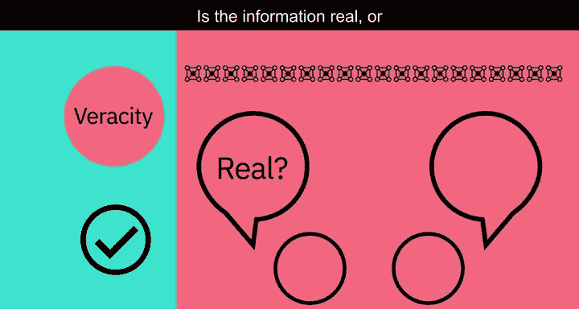

### 真实性（Veracity）✅

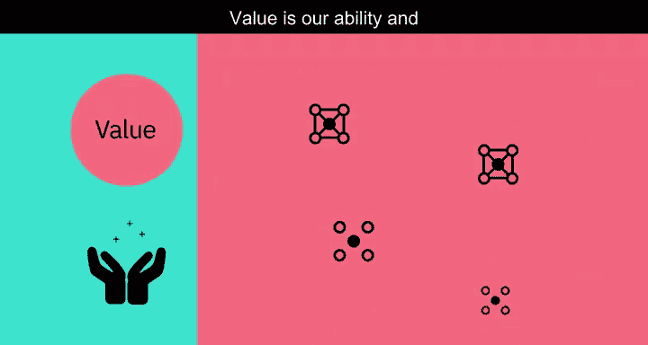

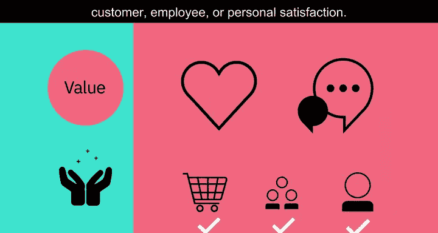

真实性指的是数据的质量和来源，以及其与事实和准确性的符合程度。属性包括一致性、完整性、完整性和模糊性。驱动因素包括成本和对海量数据可追溯性的需求。在数字时代，关于数据准确性的争论非常激烈：信息是真实的还是虚假的？

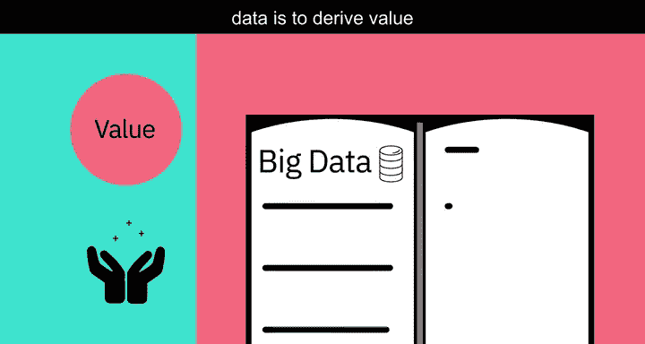

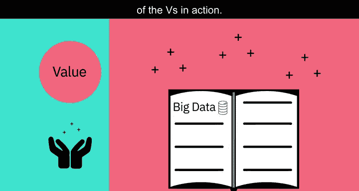

### 价值（Value）💰

价值指的是我们将数据转化为价值的能力和需求。价值不仅仅是利润，它还可能具有医疗或社会效益，以及客户、员工或个人满意度。人们投入时间理解大数据的主要原因正是为了从中获取价值。

## 5V特征实例解析 🔍

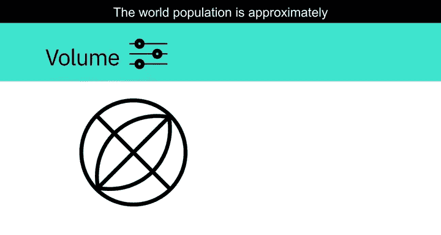

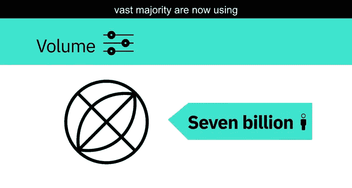

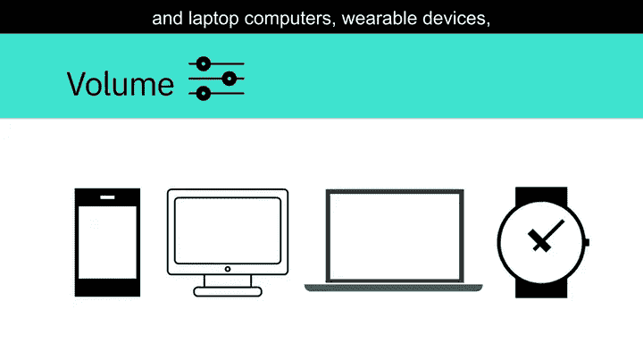

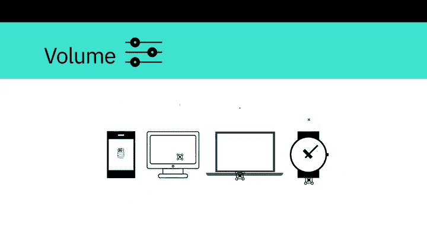

上一节我们介绍了大数据的5V特征，本节中我们来看看这些特征在现实中的具体例子。

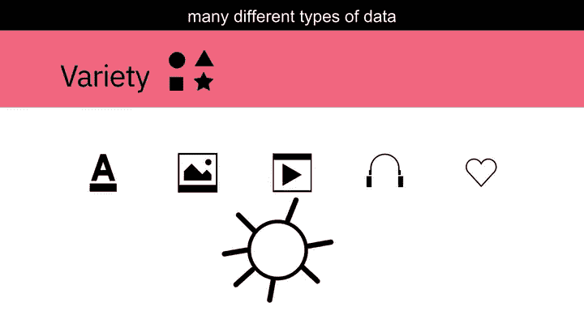

以下是每个V特征对应的实例：

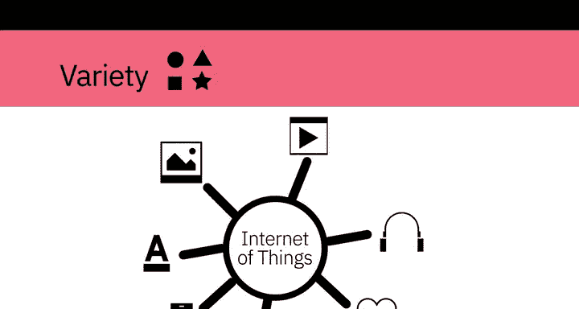

*   **速度**：每分钟都有数小时的视频被上传到YouTube，这些都在生成数据。试想一下，数据在数小时、数天和数年内积累的速度有多快。
*   **容量**：世界人口约70亿，其中绝大多数人现在都在使用数字设备，如手机、台式机和笔记本电脑、可穿戴设备等。这些设备每天生成、捕获和存储大约2.5万亿字节的数据，相当于1000万张蓝光DVD。
*   **多样性**：让我们想想不同类型的数据：文本、图片、电影、声音、来自可穿戴设备的健康数据，以及来自物联网设备的各种不同类型的数据。
*   **真实性**：80%的数据被认为是非结构化的，我们必须设计方法来产生可靠和准确的洞察。数据必须被分类、分析和可视化。
*   **价值**：数据科学家从大数据中获取洞察，并应对这些海量数据集带来的挑战。所收集数据的规模意味着使用传统的数据分析工具是不可行的。

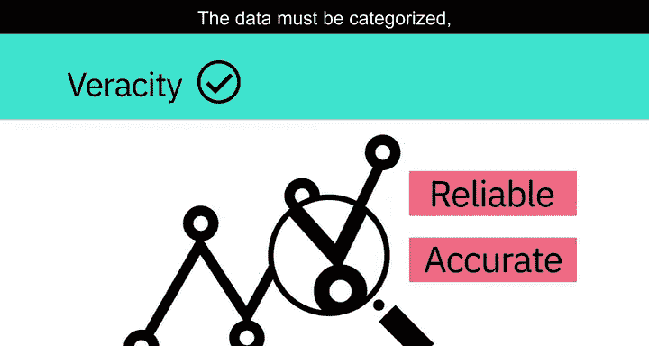

## 大数据处理工具与技术 🛠️

上一节我们看到了大数据特征的具体表现，本节中我们来看看处理这些海量数据所需的工具和技术。

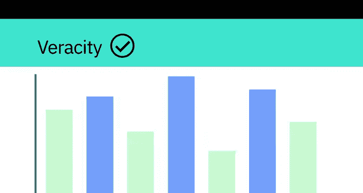

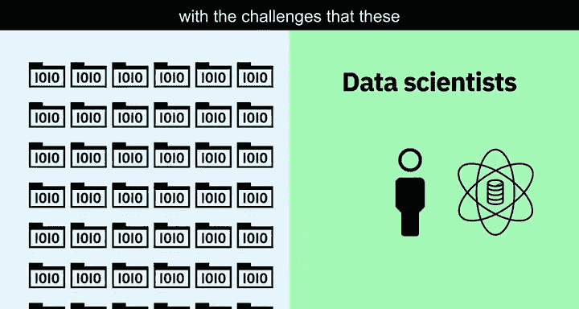

如今的数据科学家从大数据中获取洞察，并应对这些海量数据集带来的挑战。所收集数据的规模意味着使用传统的数据分析工具是不可行的。然而，利用分布式计算能力的替代工具可以克服这个问题。例如，**Apache Spark**、**Hadoop**及其生态系统提供了跨分布式计算资源提取、加载、分析和处理数据的方法，从而提供新的洞察和知识。

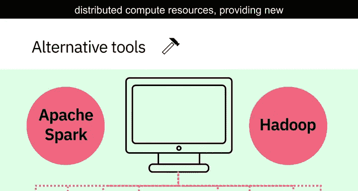

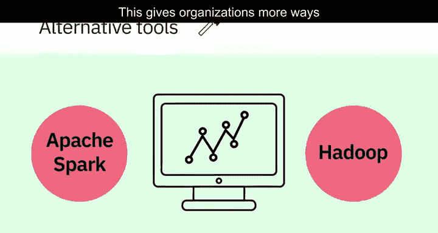

这为组织提供了更多与其客户连接的方式，并丰富了他们提供的服务。

## 总结 📝

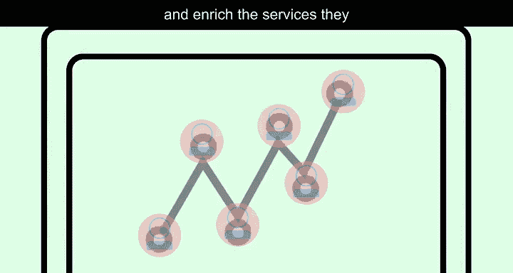

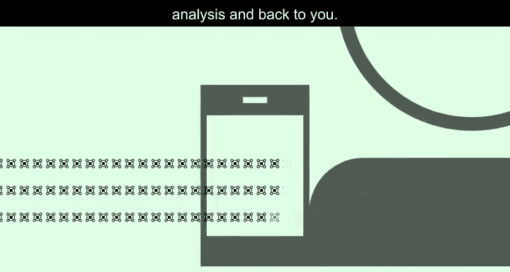

本节课中我们一起学习了大数据的基础架构。我们了解到，在数字世界中，我们的行为不断产生海量、多样、高速的数据，即大数据。我们深入探讨了定义大数据的五个核心特征：**速度（Velocity）**、**容量（Volume）**、**多样性（Variety）**、**真实性（Veracity）** 和 **价值（Value）**。通过实例，我们看到了这些特征在现实中的体现。最后，我们认识到处理如此规模的数据需要像 **Apache Spark** 和 **Hadoop** 这样的分布式计算工具。所以，下次当你戴上智能手表、解锁智能手机或追踪锻炼数据时，请记住，你的数据可能正在开启一段通过大数据分析环游世界并最终回馈于你的旅程。