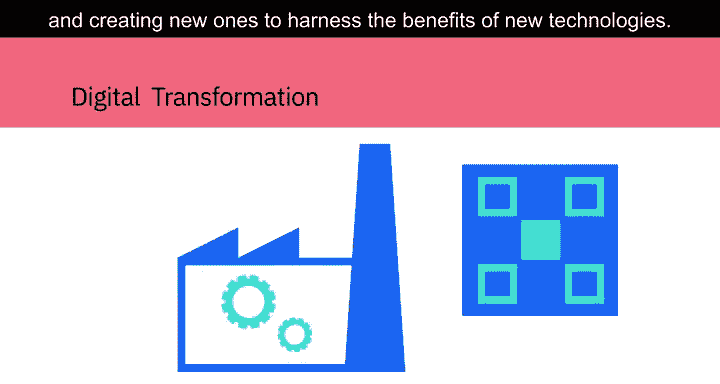
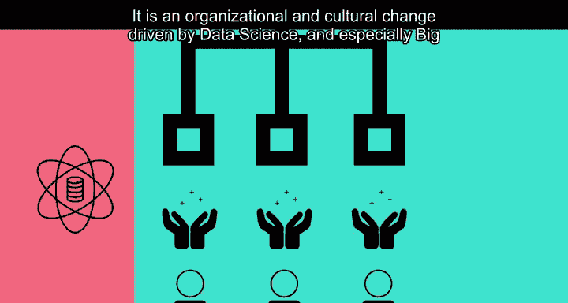
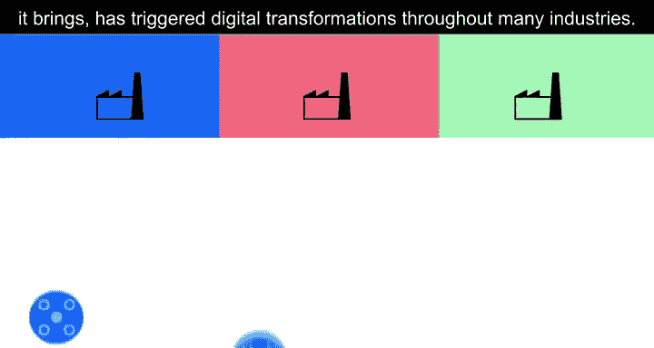
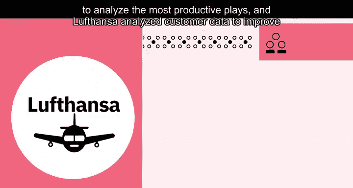
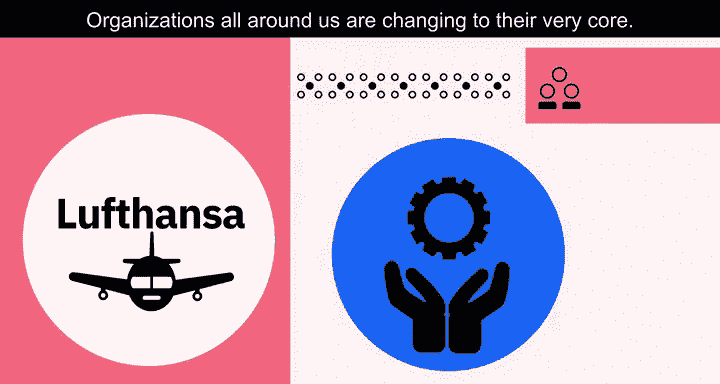
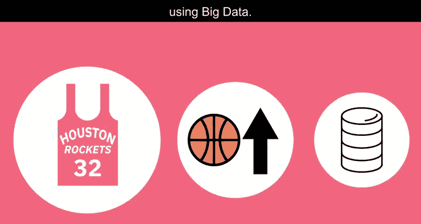
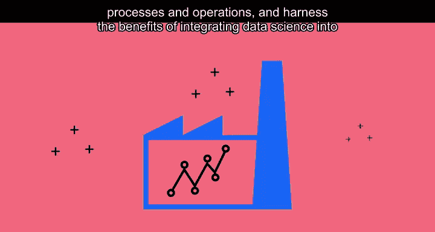
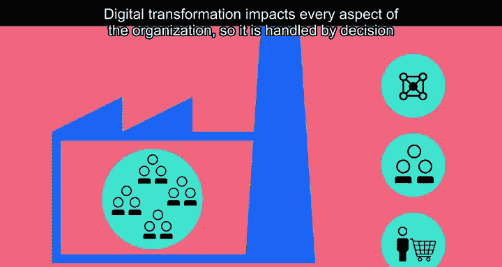
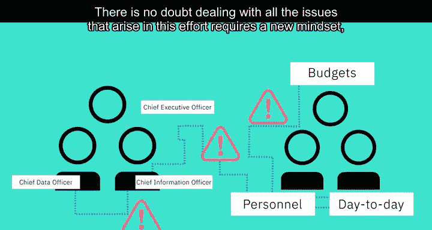

# 011：大数据驱动数字化转型 📊➡️🚀

在本节课中，我们将要学习数字化转型如何影响商业运营，以及大数据和数据科学在其中扮演的核心驱动角色。我们将通过具体案例，理解数字化转型不仅是技术的应用，更是组织与文化的深刻变革。

---

数字化转型影响商业运营，它更新现有的流程与操作，并创造新的流程以利用新技术带来的益处。

这种数字化变革将数字技术整合到组织的所有领域，从根本上改变了组织的运作方式以及其为客户创造价值的方式。这是一场由数据科学，特别是大数据驱动的组织与文化变革。

海量数据的可用性以及分析这些数据带来的竞争优势，已引发了许多行业的数字化转型。例如，Netflix从一家邮寄DVD租赁公司转型为全球领先的视频流媒体提供商。

休斯顿火箭队（NBA球队）利用头顶摄像机收集的数据来分析最高效的战术，而Lathanza（应为“Lathanza”或指代某公司，原文可能有误，保留原词）则通过分析客户数据来改善其服务。我们周围的所有组织都在发生根本性的改变。

上一节我们了解了数字化转型的普遍影响，本节中我们来看一个具体案例，了解大数据如何不仅在一个组织内，甚至在整个行业中触发数字化转型。

在2018年，美国职业篮球协会（NBA）的休斯顿火箭队利用大数据提升了比赛水平。火箭队是首批安装视频追踪系统的四支NBA球队之一，该系统从比赛中采集原始数据。他们分析视频追踪数据，研究哪些战术能提供最佳的得分机会，并有了一个惊人的发现。

数据分析揭示，提供最佳高分机会的投篮是：**两分线内的扣篮**和**三分线外的远投**，而不是两分线内的长距离两分投篮。这一发现彻底改变了球队的比赛策略，他们开始尝试更多的三分球。在2017-18赛季，火箭队投中了比NBA历史上任何其他球队都多的三分球，这也是他们赢得比任何对手都多比赛的一个重要原因。

在篮球领域，大数据改变了球队争取胜利的方式，从而变革了这项运动的打法。

数字化转型不仅仅是现有流程的数字化复制。

通过对业务运作方式的深入分析，组织能够发现如何改进其流程和操作，并收获将数据科学整合到工作流中的益处。

大多数组织意识到，数字化转型将要求他们对数据、员工和客户的态度进行根本性改变，并将影响组织文化。

数字化转型影响组织的方方面面，因此为确保成功，需要由最高层的决策者来推动。

首席执行官的支持对数字化转型过程至关重要，首席信息官和新兴的首席数据官的角色支持也同样重要。但他们也需要获得控制预算、人事决策和日常优先事项的高管们的支持。

这是一个全组织的过程，必须获得所有人的支持才能成功。毫无疑问，处理这一过程中出现的所有问题需要新的思维方式，但数字化转型是现在和未来取得成功的方式。

---

**总结**

本节课中我们一起学习了数字化转型的核心概念。我们了解到，数字化转型是由大数据和分析驱动的深刻变革，它不仅仅是技术的升级，更是组织流程、文化和战略的全面重塑。通过休斯顿火箭队的案例，我们看到了数据分析如何直接改变竞争策略并带来成功。最后，我们认识到成功的数字化转型需要自上而下的全力支持以及全组织的参与。