# 014：核心概念辨析

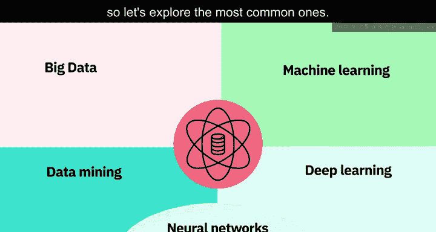

在本节课中，我们将学习数据科学领域中几个容易混淆的核心概念。我们将逐一辨析大数据、数据挖掘、机器学习、深度学习、人工神经网络以及数据科学与人工智能之间的关系，帮助你清晰地理解它们各自的定义、特点与区别。

---

## 🗃️ 大数据

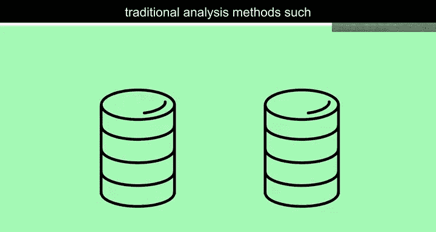

在数据科学领域，许多术语经常被互换使用。首先，我们来探讨最常见的一个：大数据。

大数据指的是那些体量巨大、生成迅速且类型多样的数据集，它们超出了传统分析方法（例如使用关系型数据库进行的分析）的处理能力。

分布式网络中强大计算能力的并行发展，以及数据分析新工具和技术的出现，意味着组织现在有能力分析这些海量数据集。新的知识和洞见正变得对所有人可用。大数据通常用5个“V”来描述：**速度、体量、多样性、真实性和价值**。

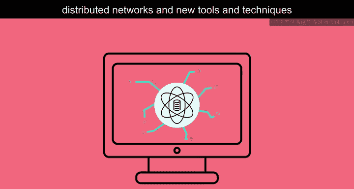

---

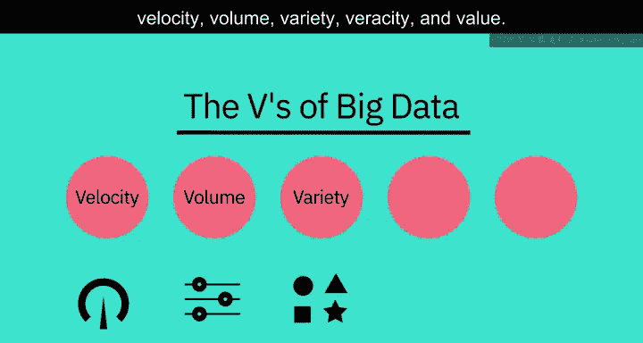

## 🔍 数据挖掘

上一节我们介绍了大数据，本节中我们来看看如何从数据中发现价值，即数据挖掘。

数据挖掘是自动搜索和分析数据，以发现先前未揭示模式的过程。它涉及对数据进行预处理，将其准备并转换为合适的格式。完成此步骤后，便可以使用各种工具和技术（从简单的数据可视化工具到机器学习和统计模型）来挖掘和提取洞见与模式。

以下是数据挖掘的关键步骤：
*   **数据预处理**：准备和转换数据。
*   **模式挖掘**：使用工具和技术提取洞见。
*   **结果应用**：将发现的模式用于决策。

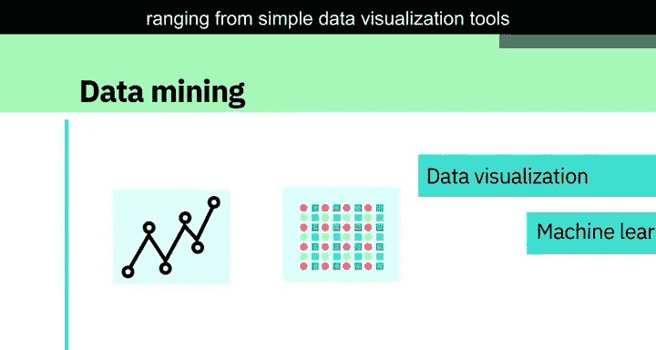

---

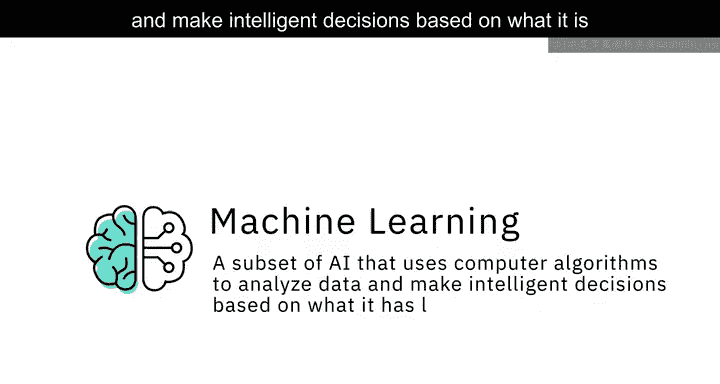

## 🤖 机器学习

理解了如何从数据中挖掘模式后，我们来看一个能让计算机从数据中“学习”并自主决策的技术：机器学习。

机器学习是人工智能的一个子集，它使用计算机算法分析数据，并根据学习到的内容（而非显式编程）做出智能决策。

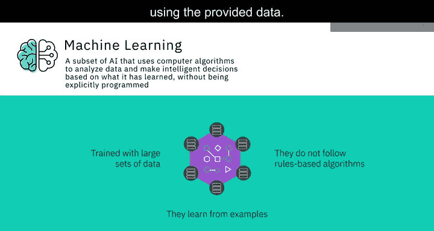

机器学习算法使用大型数据集进行训练，它们从示例中学习，不遵循基于规则的算法。机器学习使得机器能够自主解决问题，并利用提供的数据做出准确的预测。

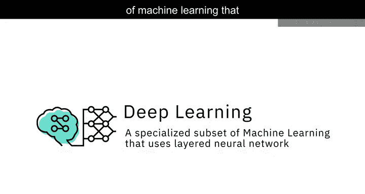

其核心思想可以概括为：
**模型 = 算法 + 数据**
模型通过训练数据学习规律，并对新数据做出预测或决策。

---

## 🧠 深度学习

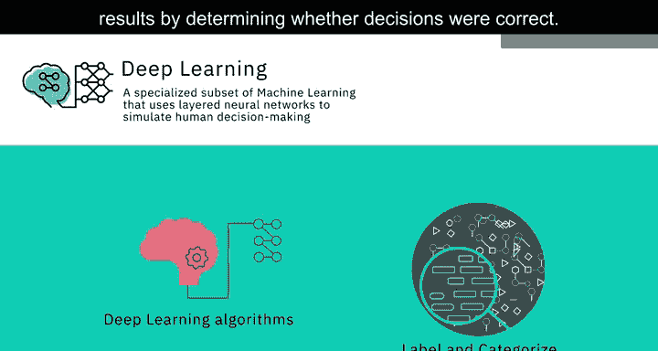

机器学习已经非常强大，而深度学习是其一个更专业的子集，它模拟人脑的工作方式。

深度学习是机器学习的一个专门子集，它使用分层的神经网络来模拟人类的决策过程。

深度学习算法能够标记和分类信息，并识别模式。它使得人工智能系统能够在工作中持续学习，并通过判断决策是否正确来提高结果的质量和准确性。

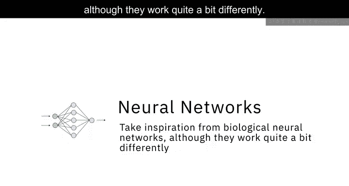

---

## ⚙️ 人工神经网络

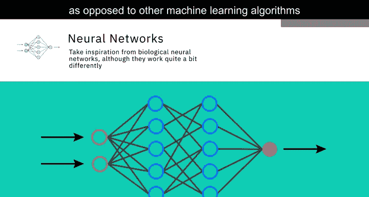

深度学习的能力源于其基础架构：人工神经网络。

人工神经网络（通常简称为神经网络）的灵感来源于生物神经网络，尽管其工作方式有很大不同。在人工智能中，神经网络是由称为“神经元”的小型计算单元组成的集合，这些单元接收输入数据，并随着时间的推移学习做出决策。

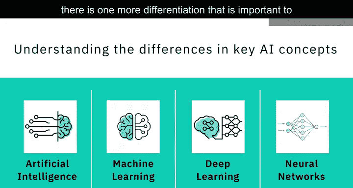

神经网络通常是深度分层的，这也是深度学习算法随着数据集体量增加而效率更高的原因。相比之下，其他机器学习算法可能会随着数据增加而达到性能瓶颈。

---

## 🧩 数据科学与人工智能

现在你已经对几个关键人工智能概念之间的区别有了广泛的理解，还有一个重要的区分需要理解，那就是人工智能与数据科学之间的区别。

数据科学是从大量异构数据中提取知识和洞见的过程与方法。它是一个跨学科领域，涉及数学、统计分析、数据可视化、机器学习等。它使我们能够处理信息、从海量数据中看到模式、发现意义，并利用它来做出推动业务的决策。

数据科学可以使用许多人工智能技术从数据中获取洞见，例如，它可以使用机器学习算法甚至深度学习模型来从数据中提取意义并得出推论。

人工智能和数据科学之间存在一些交互，但两者并非子集关系。相反，**数据科学**是一个广义术语，涵盖了整个数据处理方法论；而**人工智能**则包含了让计算机学习如何解决问题和做出智能决策的一切技术。人工智能和数据科学都可能涉及使用大数据，即体量显著巨大的数据。

---

## 📝 总结

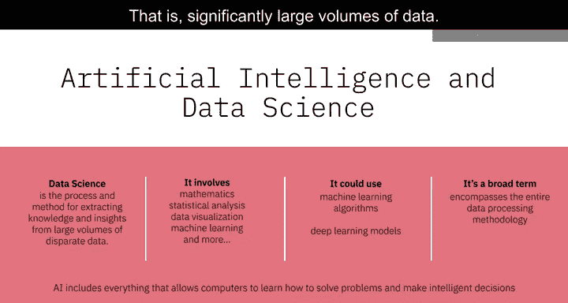

本节课中我们一起学习了数据科学领域的几个核心概念。我们明确了**大数据**指的是海量、高速、多样的数据集；**数据挖掘**是从中自动发现模式的过程；**机器学习**是让计算机从数据中学习并决策的算法；**深度学习**是使用神经网络的机器学习子集；**人工神经网络**是模拟生物神经元的计算模型。最后，我们辨析了**数据科学**（涵盖从数据中提取洞见的全过程）与**人工智能**（使机器具备智能决策能力）这两个广泛领域的关系与区别。理解这些概念是进一步深入学习数据科学和人工智能的重要基础。