# 017：数据科学拯救生命案例 🩺🌪️

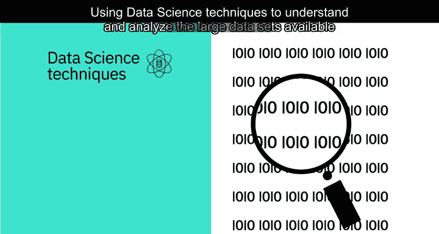

在本节课中，我们将学习数据科学如何通过分析海量数据，在医疗健康和灾害预警等关键领域产生巨大影响，甚至拯救生命。

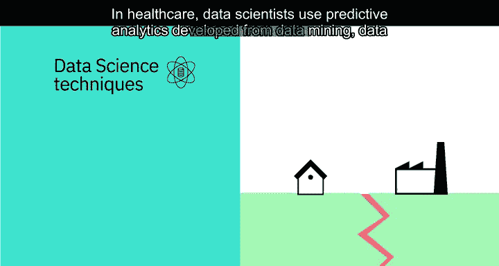

## 概述：数据科学的影响力

运用数据科学技术来理解和分析当今可用的庞大数据集，对人类生活产生了巨大影响。

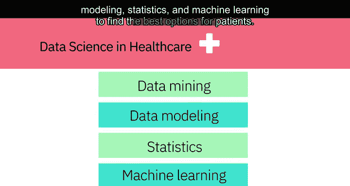

它能够提供有针对性的信息，帮助医疗保健专业人员为患者提供最佳治疗，或帮助预测自然灾害，使人们能够提前做好准备，此外还有许多其他应用。

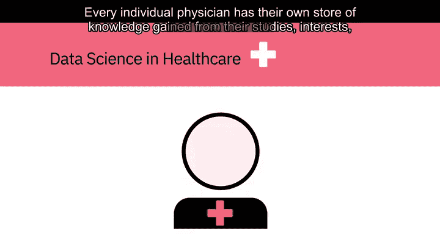

## 数据科学在医疗健康领域的应用

上一节我们了解了数据科学的广泛影响力，本节中我们来看看它在医疗健康领域的具体应用。

在医疗保健领域，数据科学家利用从**数据挖掘**、**数据建模**、**统计学**和**机器学习**中发展出的**预测分析**技术，为患者寻找最佳治疗方案。这类预测分析会检查疾病的所有已知因素。

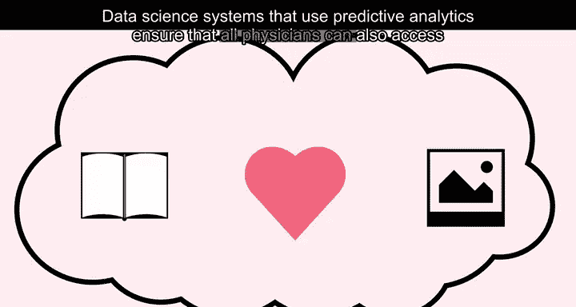

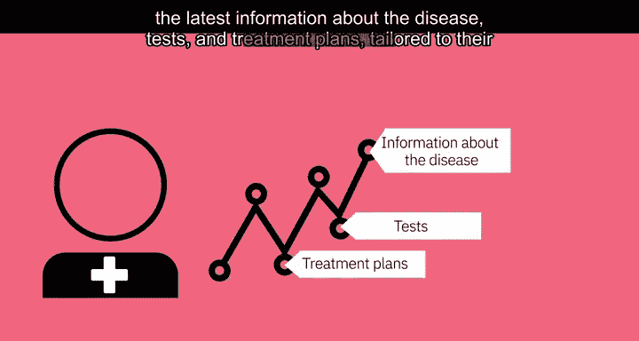

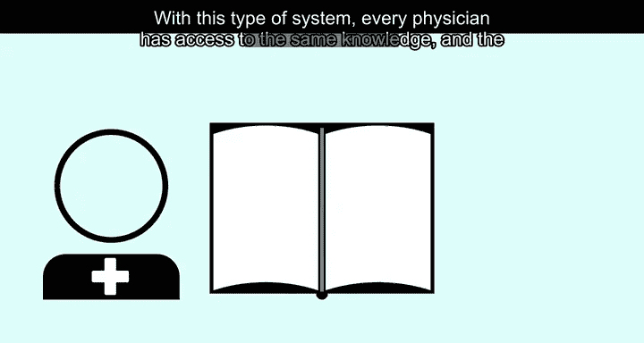

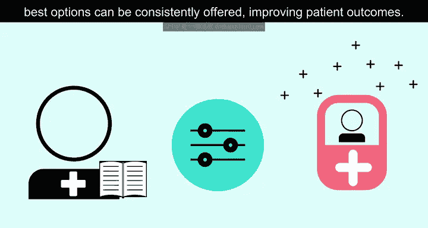

以下是预测分析在医疗中的关键作用：
*   它检查包括**基因标记**、相关病症和环境因素在内的所有疾病相关因素。
*   然后，它会推荐合适的检查、可行的试验以及建议的治疗方案。

每位医生都拥有通过自身学习、兴趣和经验积累的知识库。

而使用预测分析的数据科学系统能确保所有医生也能获取关于疾病的最新信息，以及为特定患者量身定制的检查和治疗计划。借助这类系统，每位医生都能获取相同的知识，从而能够持续提供最佳选择，改善患者的治疗结果。

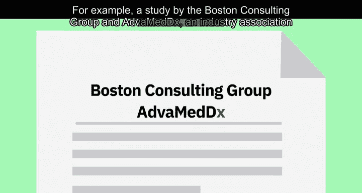

### 案例分析：克服医疗信息壁垒

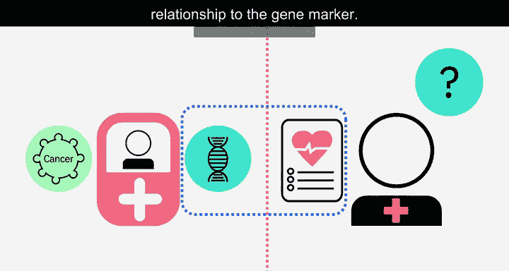

为了更具体地说明，我们来看一个案例。

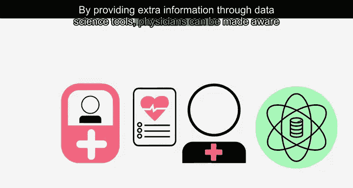

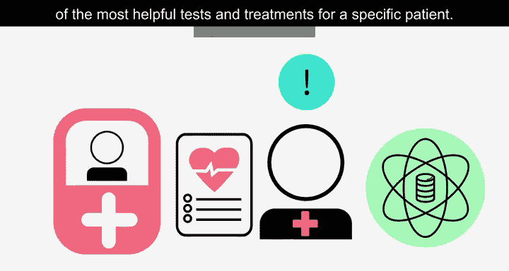

例如，波士顿咨询集团与医疗诊断公司行业协会AVM DX进行的一项研究，调查了为患有特定癌症和特定基因标记的患者采用可能挽救生命的诊断测试所面临的障碍。研究发现，患者能否获得特定测试的最大影响因素是其肿瘤科医生，而该医生可能知道也可能不知道这项测试及其与基因标记的关系。

通过数据科学工具提供额外信息，可以让医生了解到对特定患者最有帮助的检查和治疗方法。

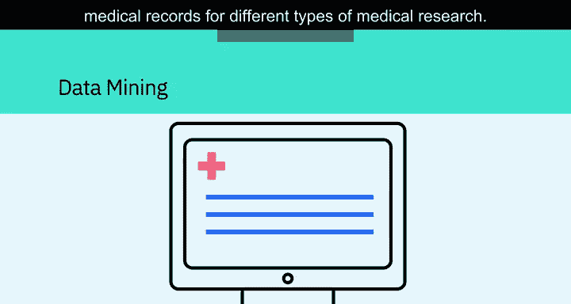

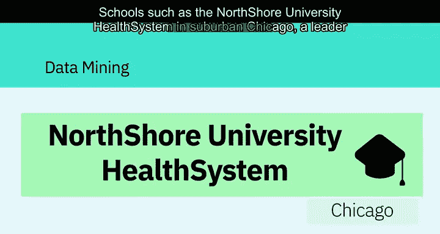

### 数据挖掘与医疗研究

除了直接辅助诊疗，数据科学还为医学研究开辟了新途径。

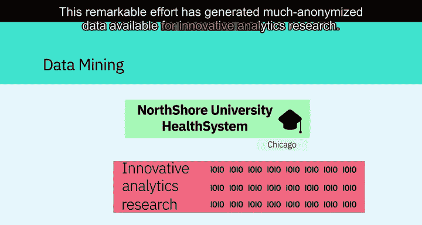

探索其他数据挖掘方式的机会很多，例如从电子病历中挖掘数据用于不同类型的医学研究。像芝加哥郊区的北岸大学医疗系统这样的机构，作为电子病历系统实施的领导者，现在也提供数据挖掘方面的指导。

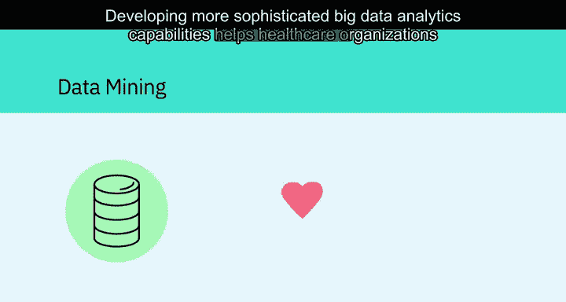

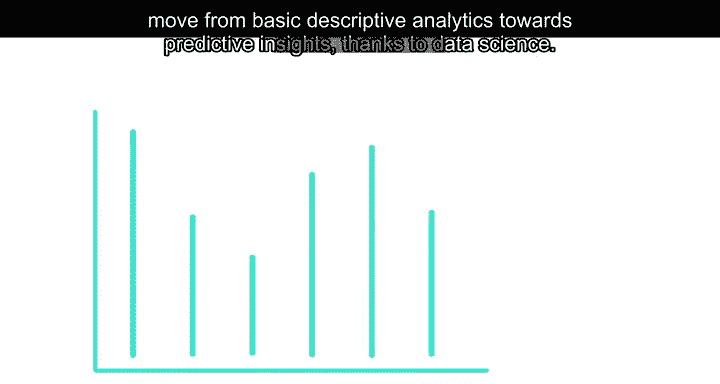

它是美国第一家因住院和门诊护理的电子病历部署达到最高水平而获奖的医疗保健提供商。这项卓越的工作产生了大量可用于创新分析研究的匿名化数据。

开发更复杂的大数据分析能力，有助于医疗保健组织在数据科学的推动下，从基本的描述性分析迈向预测性洞察。

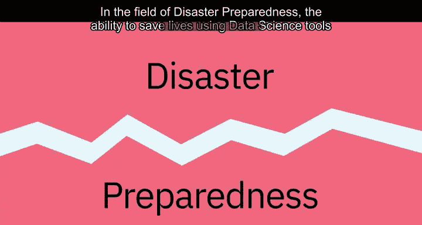

## 数据科学在灾害预警领域的应用

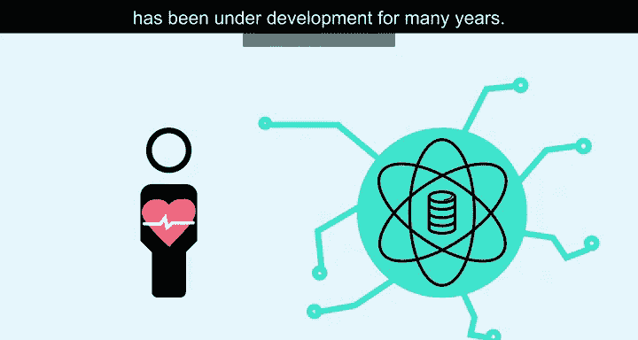

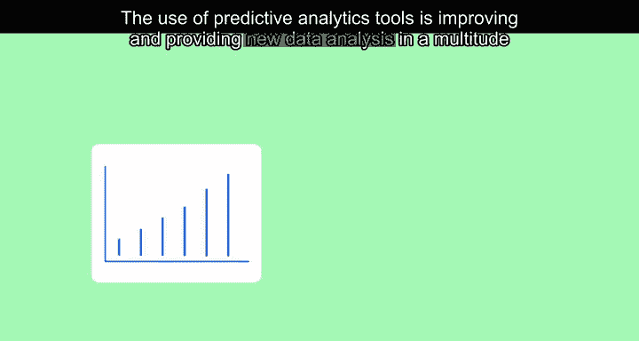

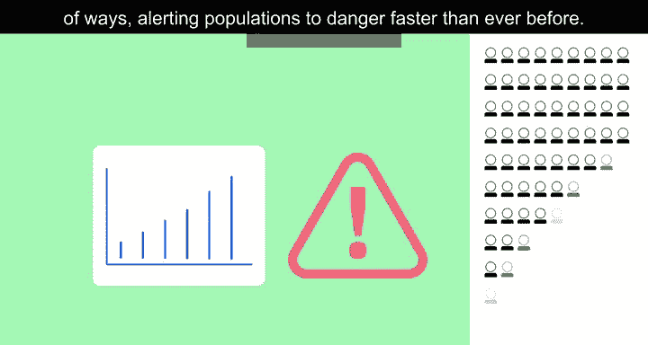

在了解了数据科学如何改善医疗后，我们再来看看它在另一个关乎生命的领域——灾害预警中的应用。

在防灾准备领域，利用数据科学工具拯救生命的能力已发展多年。预测分析工具的使用正在不断改进，并以多种方式提供新的数据分析，比以往任何时候都更快地向人群发出危险警报。

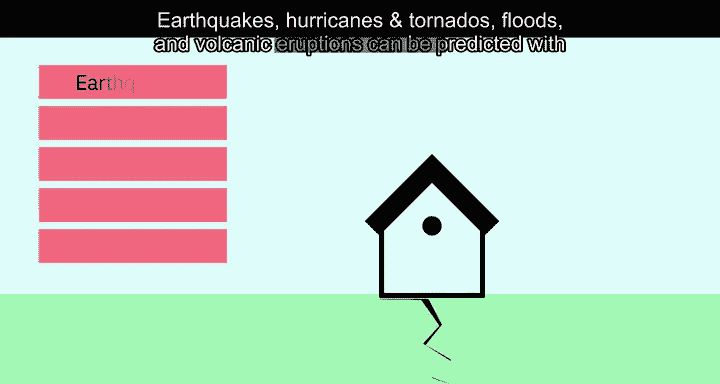

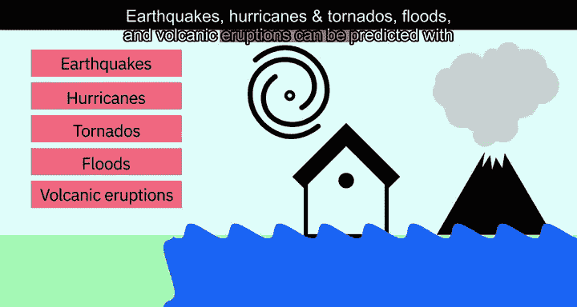

### 预测自然灾害

高质量的大型数据集可用于预测多种类型的自然灾害，这对成千上万人的生死至关重要。借助数据科学，可以预测地震、飓风和龙卷风、洪水以及火山喷发。

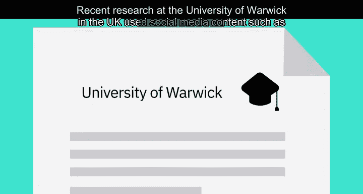

### 创新数据来源：社交媒体

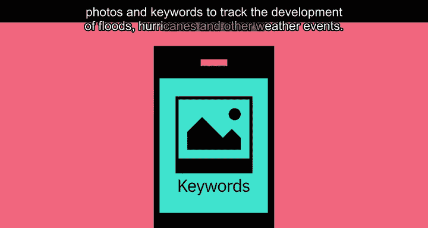

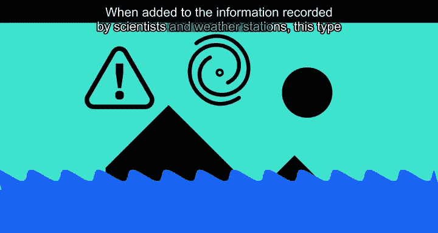

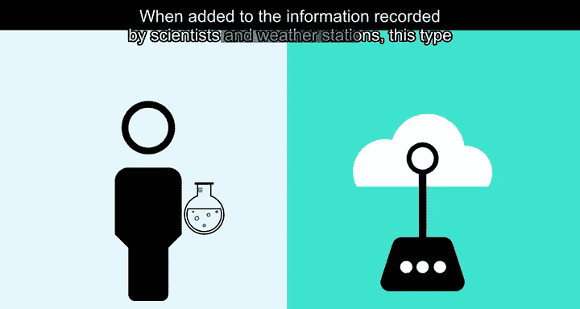

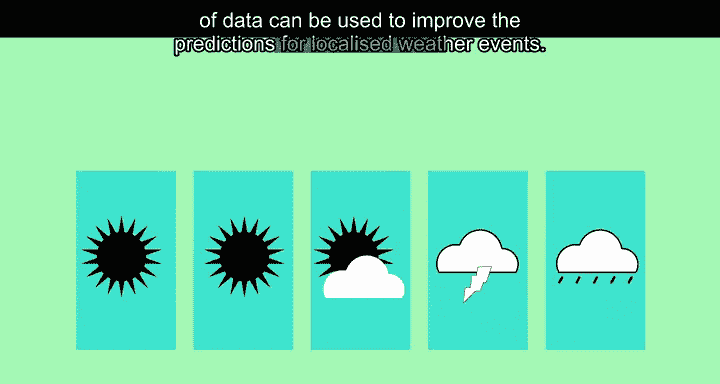

预测的准确性离不开多元化的数据。近期，英国华威大学的研究利用社交媒体内容（如照片和关键词）来追踪洪水、飓风和其他天气事件的发展。当这些数据与科学家和气象站记录的信息相结合时，可用于改进对局部天气事件的预测。

### 数据科学教育的重要性

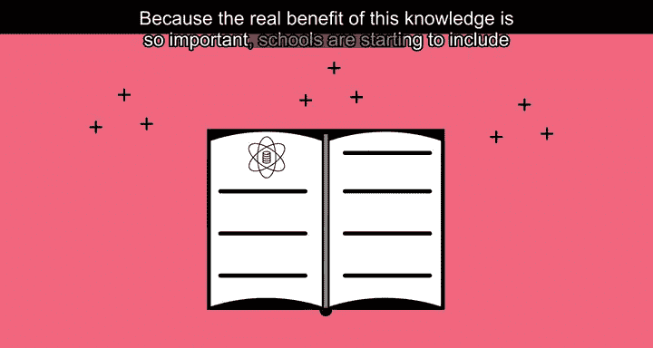

鉴于这些知识的实际效益至关重要，学校开始将这类数据科学教育纳入课程。例如，芝加哥大学格雷厄姆学院就开设了威胁与响应管理科学硕士课程。

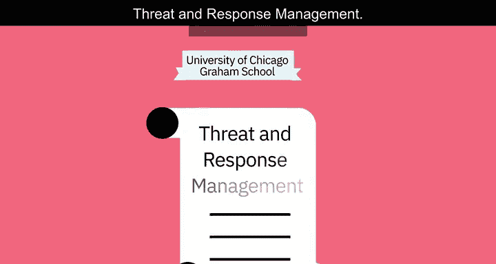

## 总结

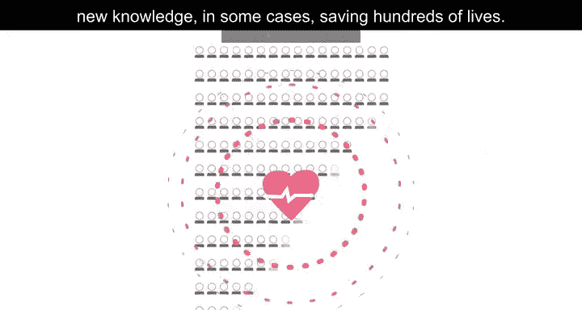

本节课中，我们一起学习了数据科学在现实世界中的强大应用。数据科学工具使组织能够分析来自广泛不同来源的海量数据，并以允许数据科学家获得新知识的方式呈现这些信息，在某些情况下，能够拯救数百人的生命。