# 019：数据科学应用领域 🎯

在本节课中，我们将要学习数据科学和大数据在商业及日常生活中的具体应用。我们将通过实际案例，了解数据科学如何改变企业运营、提升竞争力，并深入影响消费者的数字生活。

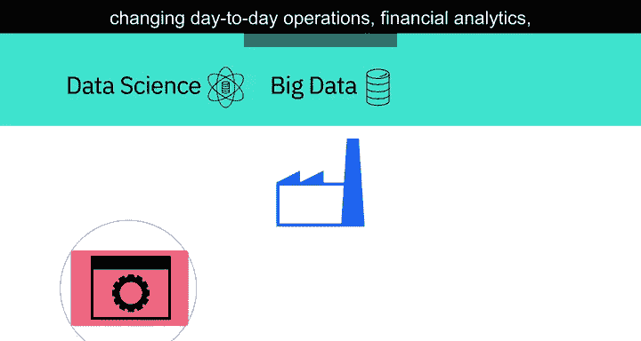

---

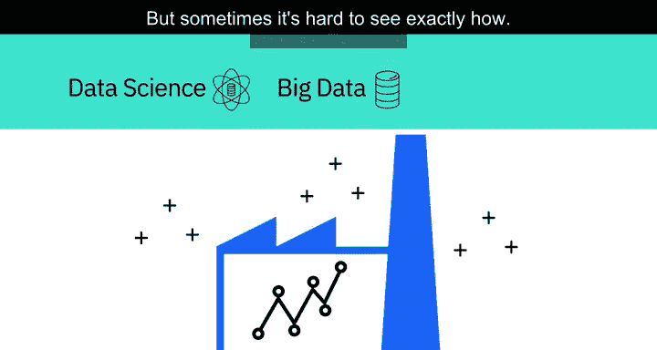

## 数据科学对商业的深远影响

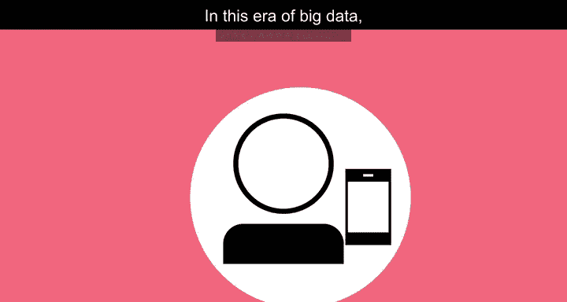

数据科学和大数据正在对商业产生不可否认的影响，改变着日常运营、财务分析，尤其是与客户的互动方式。企业显然可以从数据科学提供的洞察中获得巨大价值，但有时很难确切地看到其具体方式。因此，让我们来看一些例子。

---

## 消费者的数据生成

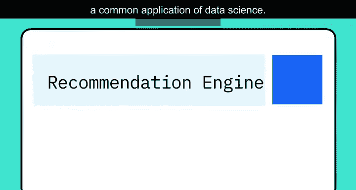

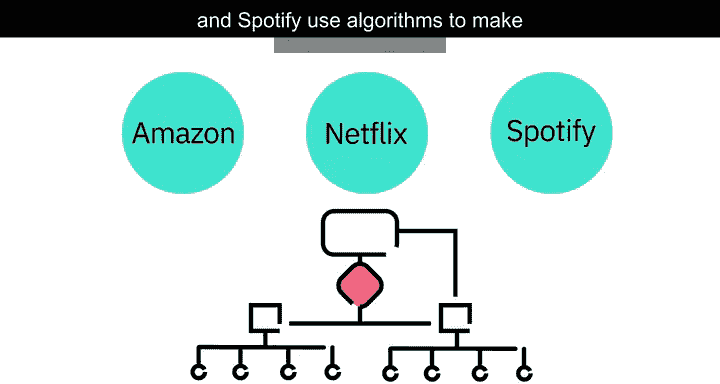

在大数据时代，几乎每个人每天都在生成大量数据，而自己往往并未察觉。这种数字痕迹揭示了我们在线生活的模式。

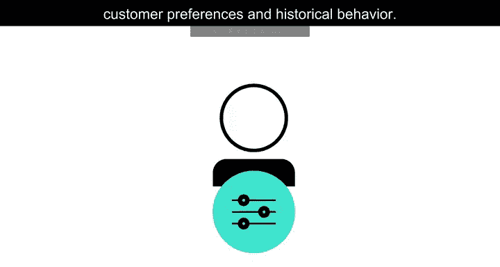

如果你曾在亚马逊这类网站上搜索或购买过产品，你会注意到它开始向你推荐与你搜索相关的商品。这种被称为**推荐引擎**的系统，是数据科学的一个常见应用。像亚马逊、Netflix和Spotify这样的公司，使用算法根据客户偏好和历史行为来做出具体推荐。

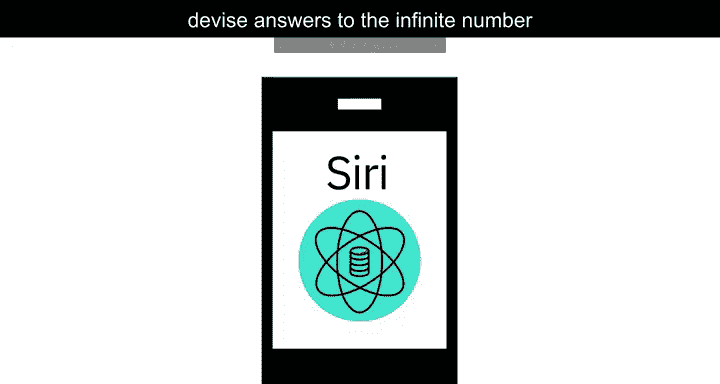

其核心逻辑可以简化为一个公式：
**推荐 = f(用户历史行为, 物品特征, 上下文信息)**

苹果设备上的Siri等个人助手，利用数据科学来回答用户可能提出的无数问题。

谷歌观察你在网络世界中的每一个举动、你的在线购物习惯和社交媒体活动。然后，它分析这些数据，根据从你的设备和当前位置收集的信息，为你推荐餐厅、酒吧、商店和其他景点。

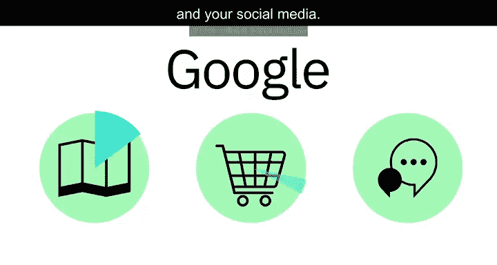

像Fitbits、苹果手表和安卓手表这样的可穿戴设备，将你的活动水平、睡眠模式和心率等信息，添加到你生成的数据中。

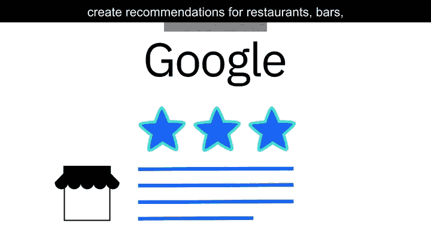

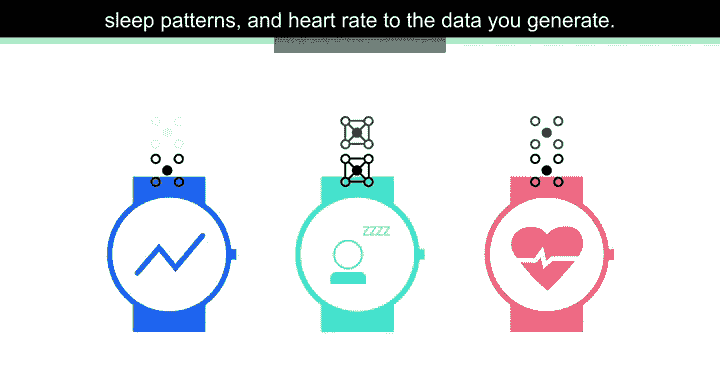

---

## 数据科学如何影响商业运营

现在我们已经了解了消费者如何生成数据，接下来让我们看看数据科学如何影响商业。

2011年，麦肯锡公司曾指出，数据科学将成为竞争的关键基础，支撑着新一轮的生产力、增长和创新浪潮。

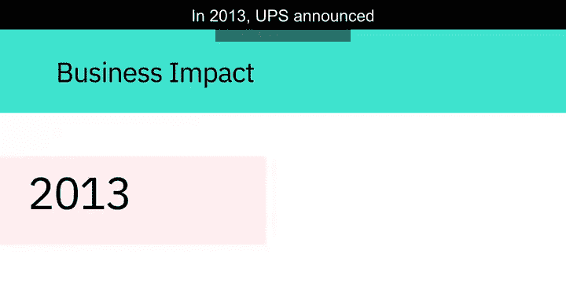

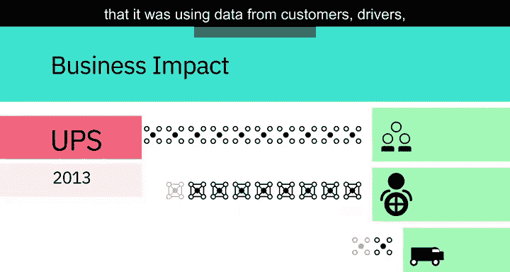

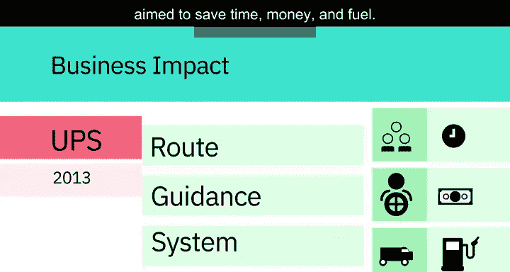

2013年，UPS宣布在其新的路线导航系统中使用来自客户、司机和车辆的数据，旨在节省时间、金钱和燃料。

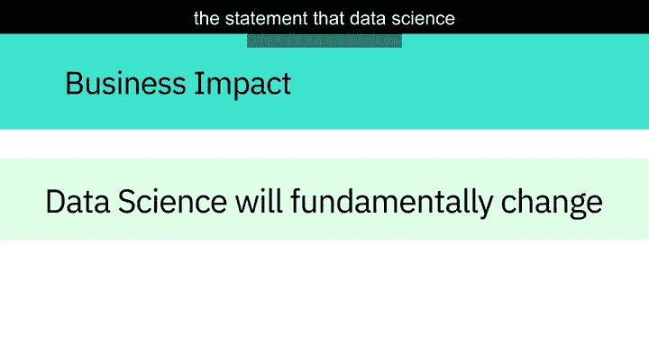

此类举措印证了数据科学将从根本上改变企业竞争和运营方式的论断。

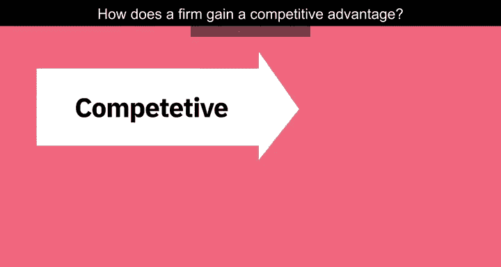

---

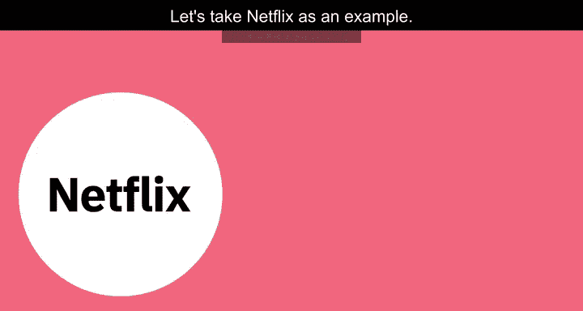

## 企业如何获得竞争优势

企业如何获得竞争优势？让我们以Netflix为例。

Netflix收集并分析了来自数百万用户的海量数据，包括人们在一天中的什么时间观看哪些节目、何时暂停、回放和快进，以及他们搜索了哪些节目的导演和演员。

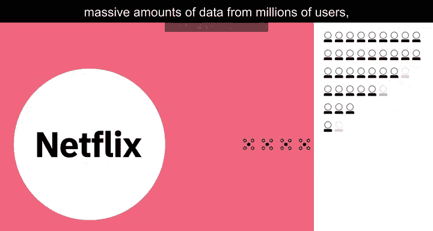

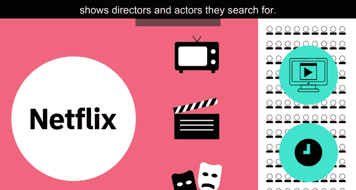

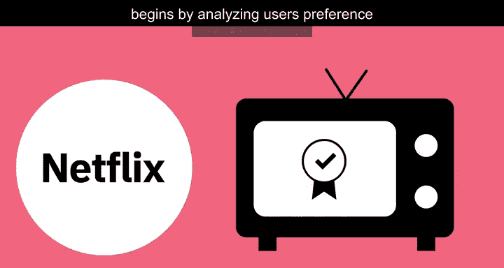

通过分析用户对某些导演和表演人才的偏好，并发现人们喜欢的组合，Netflix甚至可以在拍摄开始前就确信某个节目会大受欢迎。

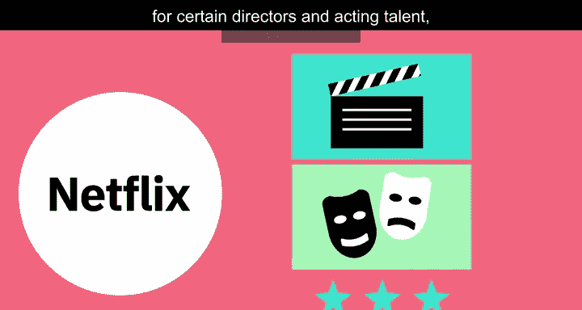

以下是Netflix决策过程的关键数据点：
*   用户对特定导演（如大卫·芬奇）作品的观看历史。
*   由特定演员（如罗宾·怀特）主演的电影的受欢迎程度。
*   原版剧集（如英版《纸牌屋》）的成功数据。

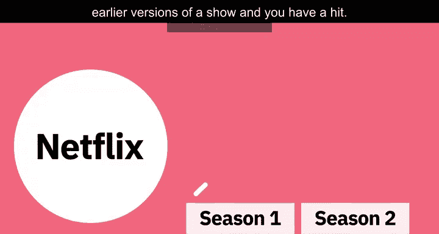

将这些因素与剧集早期版本的成功数据相结合，就能预测出热门作品。例如，Netflix知道许多用户观看过大卫·芬奇的作品，也知道罗宾·怀特主演的电影一直表现良好，同时英版《纸牌屋》非常成功。数据还显示，喜欢芬奇作品的大量用户也喜欢怀特。所有这些信息综合起来表明，购买该剧集版权对公司来说将是一笔不错的投资。事实证明他们是正确的，该剧取得了巨大成功。

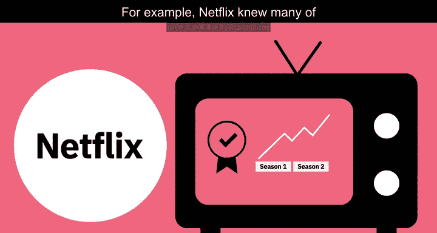

多亏了数据科学，Netflix在人们知道自己想要什么之前，就已经知道了。

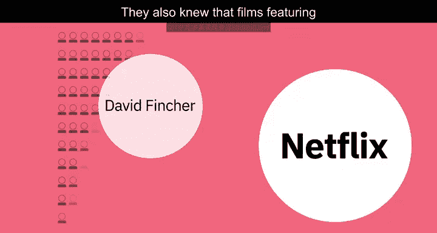

---

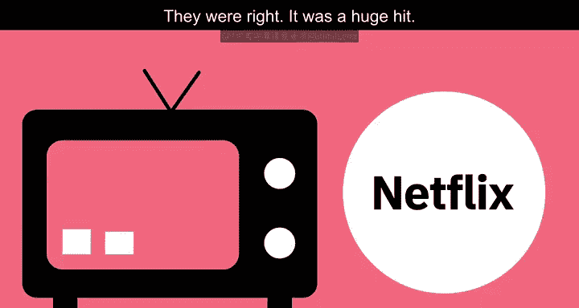

## 总结

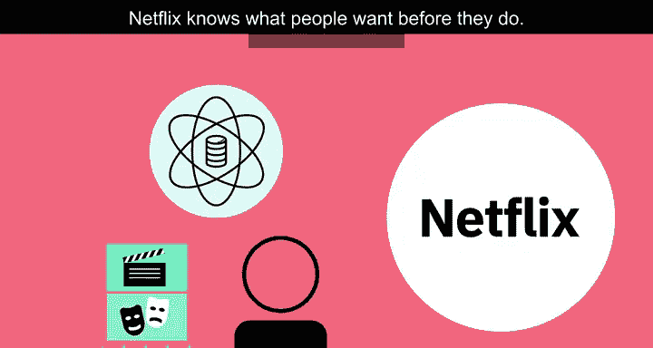

本节课中，我们一起学习了数据科学在现实世界中的广泛应用。我们看到，从消费者的在线推荐、个人助手到企业的路线优化和内容创作决策，数据科学通过分析海量数据来提取洞察，正在深刻改变商业竞争格局和我们的日常生活。其核心在于利用算法和模型，将原始数据转化为可指导行动的宝贵信息。