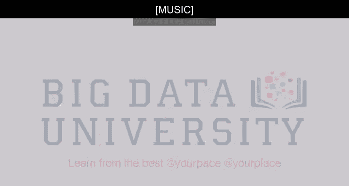

# 021：数据科学人才招聘指南 🧑‍💼

在本节课中，我们将探讨企业如何组建数据科学团队以及招聘数据科学家时应关注的核心素质。我们将从技能要求、个人特质以及团队构建策略等多个角度进行分析。

---

当公司为数据科学团队招聘人员时，无论是数据科学家还是分析师，其倾向往往是寻找一个掌握所有技能的“全能型”人才：他们需要具备领域专业知识，擅长分析结构化和非结构化数据，拥有出色的展示和叙事能力。综合这些要求，你会发现这几乎是在寻找一个“独角兽”，而找到这种人才的概率非常低。

我认为，真正需要做的是在现有的申请人池中，寻找与公司文化DNA最契合的人。因为分析技能是可以教授的，任何人只要投入时间和努力都能学会。但真正重要的是，候选人是否对你所从事的业务充满热情。一个人可能在零售领域是优秀的数据科学家，但对IT相关公司或处理海量网络日志数据的工作却可能毫无兴趣。反之，如果某人对网络日志或健康数据充满热情，那么他将能为团队带来更高的生产力。

---

## 招聘时应优先考虑的特质

以下是招聘数据科学家时，应优先考察的几个关键特质：

1.  **好奇心**：这个人是否对事物充满好奇？不仅是对数据科学，而是对周围的一切，比如房间为什么这样布置，书架上有什么书。他们需要对视野内的一切事物都保有一定程度的好奇心。
2.  **幽默感**：从事这项工作需要保持轻松的心态。如果一个人过于严肃，可能会无法看到问题中轻松的一面。
3.  **叙事能力**：即发现故事、讲述故事的能力。
4.  **技术技能**：这是最后才考虑的一点。如果候选人具备了好奇心、幽默感和叙事能力，并且展现出一定的技术潜力，我就会录用他们。因为技术可以培训，但好奇心、讲故事的能力和幽默感却很难教会。

我认为招聘数据科学家没有硬性规定，需要具体情况具体分析。但必须包含一些技术成分：候选人应能处理并操作数据，并能清晰地传达他们在数据中的发现。通常，没人真正关心R平方值或置信区间，因此你必须能够引入这些概念并以引人入胜的方式进行解释。此外，还需要找到善于沟通的人，因为数据科学通常较新，担任此角色的人需要建立关系并跨部门协作。

---

上一节我们讨论了核心的个人特质，本节中我们来看看具体的技能要求。如果数据科学家拥有良好的数学和统计学背景，他们就需要考虑解决问题的能力和分析能力。数据科学必须擅长分析问题。

被招聘的人应该热爱“玩转”数据，并且知道如何进行数据可视化，具备分析性思维。当公司招聘数据科学团队成员时，他们需要首先明确这个人将承担什么角色。在公司开始招聘前，他们需要理解自己对数据科学团队的期望，然后据此进行招聘。

随着数据科学团队的成长，他们需要明确是更需要工程师、架构师、可视化设计师，还是仅仅需要更多能够处理大型矩阵的人才。

---

## 技术技能平台选择

从技能角度来看，让我们聚焦于技术技能。首先需要确定你想要采用哪种技术平台。

*   **结构化数据环境**：如果你想在结构化数据环境（例如市场研究）中工作，所需的技能与想在大数据环境中工作的人略有不同。在传统的市场研究结构化数据环境中，你的技能应包括一些统计知识、基础统计算法知识，可能还有一些机器学习算法。这些都是你需要掌握的工具。
*   **大数据环境**：如果你想从事大数据工作，则涉及另一个方面：存储数据的能力。你需要从存储海量数据的专业知识开始，然后寻找能够实现这一点的平台。下一步是能够处理海量数据，最后一步是将算法应用于这些大型数据集。这是一个三步过程，但最重要的是，它始于你希望进入哪个领域和行业。

就平台而言：
*   如果你想在传统的预测分析环境中工作，且不涉及大数据，那么 **R**、**SAS** 或 **Python** 将是你的工具。
*   如果你主要处理非结构化数据，那么 **Python** 比 **R** 更合适。
*   如果你处理大数据，那么 **Hadoop** 和 **Spark** 将是你工作的环境。

因此，一切都取决于你想在哪里发展以及什么样的工作能激发你的热情，然后你再选择相应的工具。

---

除了技术技能，数据科学的第二个方面是沟通能力，我称之为“讲故事”的技能。这意味着在你完成分析后，能否从中讲述一个精彩的故事。如果你有一个非常大的表格，能否将其综合并呈现得更具吸引力，使其在屏幕上或文档中能够“自己说话”，让读者一目了然。

因此，无论是口头、演示还是文档，清晰呈现你发现的能力与技术技能同等重要。当你有一个伟大的见解并展示结果时，想象一下你正在山上开车，有一个急转弯，你看不到转弯后的景象。当你转过弯后，突然看到一个巨大的山谷出现在眼前，那种“我原来不知道这个”的惊叹感。当你很好地呈现并沟通了你的伟大发现时，人们就会产生这种感觉。因为他们没有预料到，也不了解，然后会产生一种“我现在知道了，而我之前不知道”的巨大喜悦感，这能赋予他们力量，给他们灵感去思考如何运用这个新见解。这是一种巨大的快乐感，而你作为数据科学家，能够与你的客户分享它，因为你促成了这一切。

---

本节课中，我们一起学习了企业招聘数据科学家时的核心考量。我们了解到，寻找“全能型”人才并不可行，应更关注候选人的好奇心、幽默感和沟通能力等内在特质。技术技能虽然重要，但可以通过培训获得。同时，选择技术平台和技能发展方向需与目标行业和领域紧密结合。最后，将复杂的数据发现转化为引人入胜的“故事”是数据科学家不可或缺的关键能力。