# 022：数据科学职业发展 📈

在本节课中，我们将探讨数据科学领域的职业发展前景、市场需求以及进入该领域所需的技能和准备。

物联网的出现和分布式计算的进步带来了海量数据以及分析这些数据的技术能力。既然我们能够提取有价值的见解和新知识，就需要了解如何塑造这些数据，以聚焦于如何处理数据以及数据能为我们做什么。数据科学应运而生。

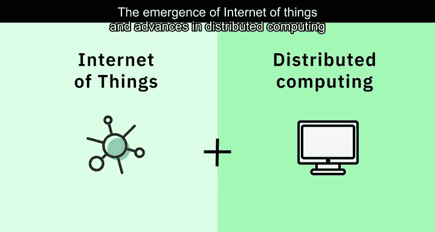

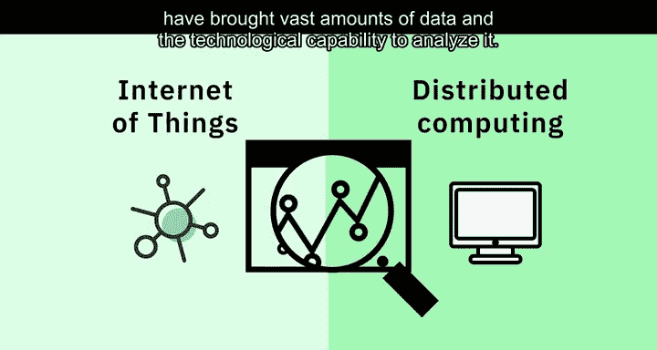

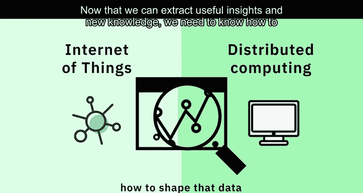

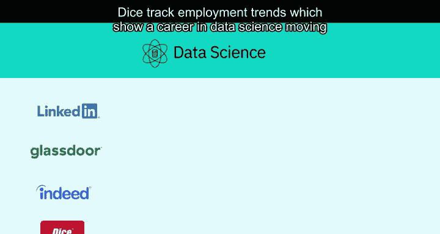

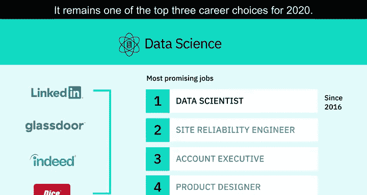

上一节我们介绍了数据科学的兴起背景，本节中我们来看看数据科学职业的市场需求。

LinkedIn、Glassdoor、Indeed和Dice等公司追踪的就业趋势显示，自2016年以来，数据科学职业已上升为最有前途的工作榜首。到2020年，它仍然是排名前三的职业选择之一。Dice指出，招聘职位来自各行各业，而不仅仅是科技行业。

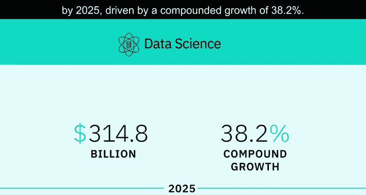

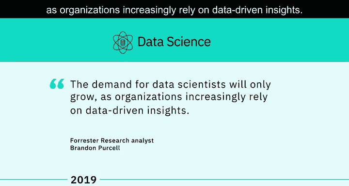

Global Industry Analysts Incorporated预测，到2025年，数据科学平台市场将增长至**3148亿美元**，复合年增长率为**38.2%**。麦肯锡全球研究所在2018年曾警告数据和分析领域将出现巨大的人才短缺。2019年1月，研究分析师Brandon Purcell表示，随着组织越来越依赖数据驱动的洞察，对数据科学家的需求只会增长。

我们现在正处于这个时期，招聘人员发现很难满足对优秀数据科学家日益增长的需求。

那么，是什么激励人们进入数据科学职业领域呢？

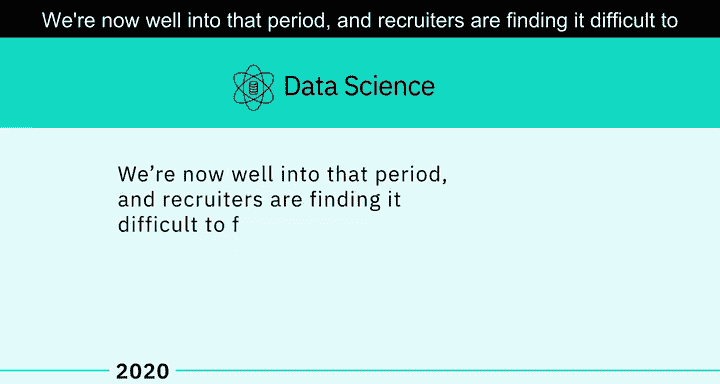

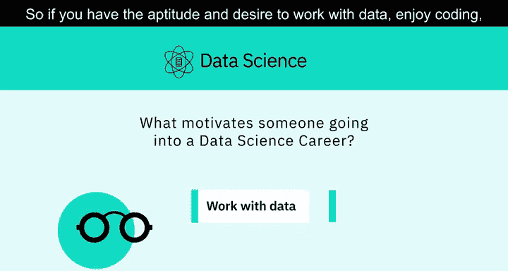

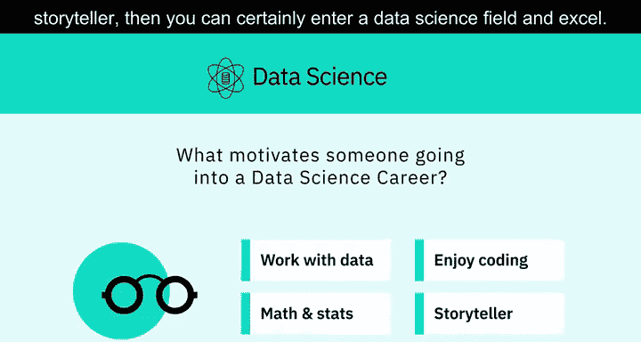

以下是几个关键动机：
*   数据科学几乎适用于任何学科。
*   如果你具备处理数据的才能和意愿，享受编码，学习数学和统计学没有困难，并且擅长讲故事，那么你当然可以在数据科学领域取得成功。

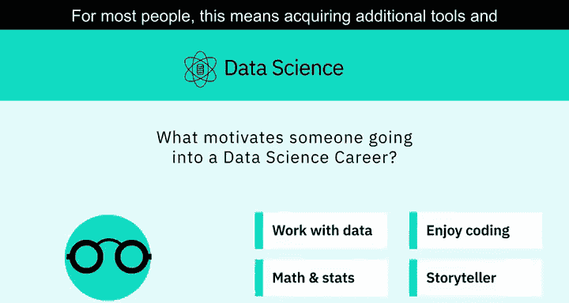

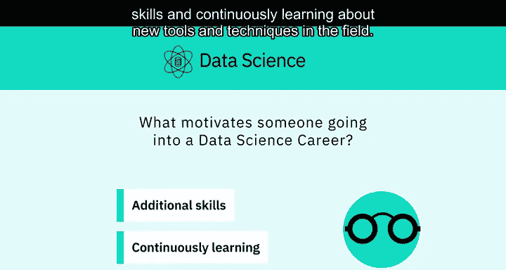

对于大多数人来说，这意味着需要获取额外的工具和技能，并持续学习该领域的新工具和技术。

由斯坦福计算与数学计算研究所发起的“数据科学领域的女性”倡议，致力于激励和教育全球的数据科学家，无论性别，并支持该领域的女性。

当你寻求数据科学职业时，需要确保你的技能组合与你目标职位相匹配。你可以根据你想进入的具体领域来定制你的技能组合，通过众多优秀的在线培训资源之一来补充缺失的技能。这样，你将为一段迷人且回报丰厚的职业生涯做好准备。

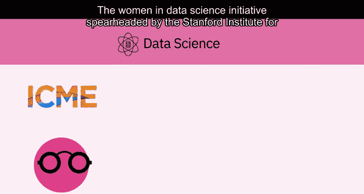

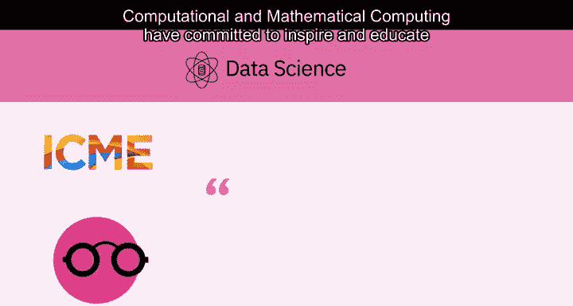

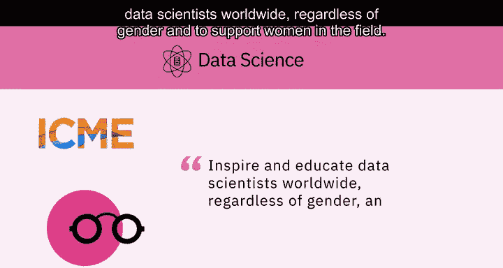

因此，现在正是进入这个领域的时候，因为有如此多样化的选择和使其成为现实的教育资源。

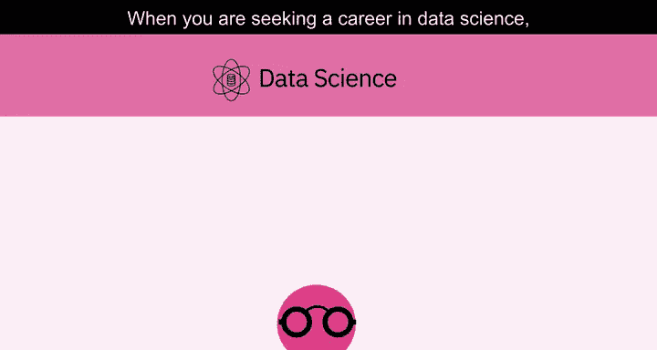

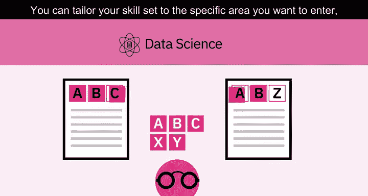

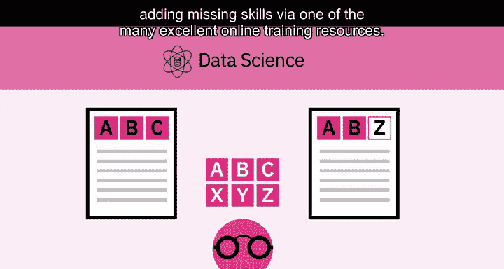

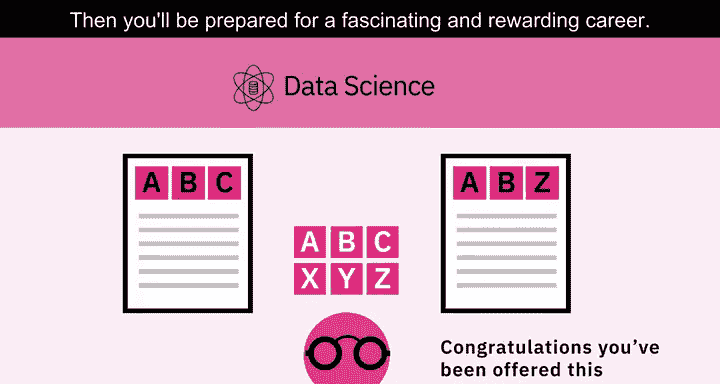

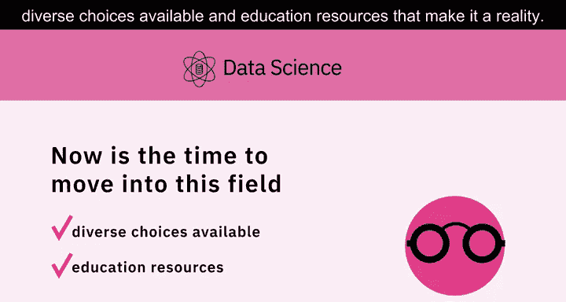

本节课中我们一起学习了数据科学职业的市场需求、从业动机以及进入该领域所需的准备。数据科学是一个充满机遇且快速发展的领域，通过针对性地学习和技能培养，你可以开启一段有价值的职业生涯。