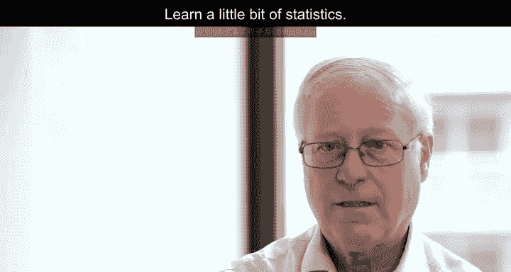
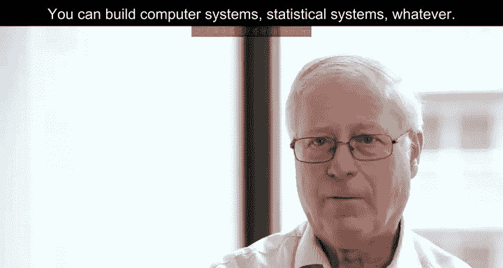
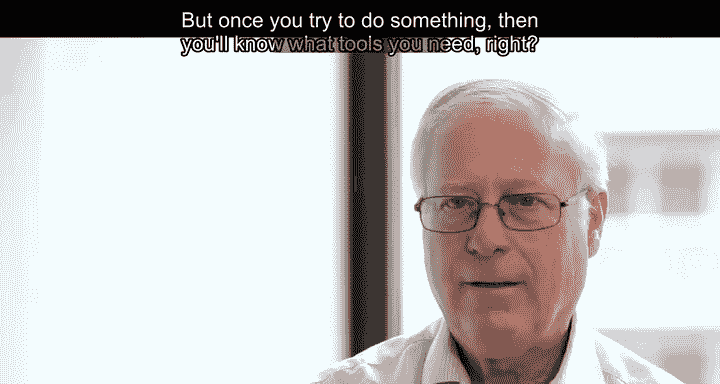
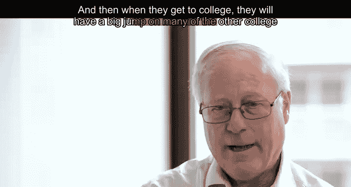
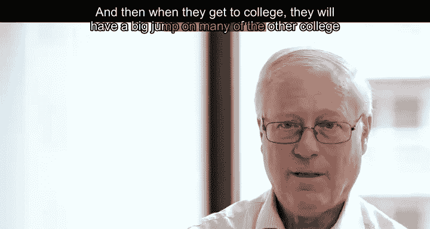

# 023：高中生与数据科学职业

在本节课中，我们将探讨高中生如何为未来的数据科学职业做准备。我们将介绍一系列具体的学习建议和思维培养方法，帮助你从现在开始积累相关技能与经验。

---

## 🧠 核心学习路径

上一节我们了解了数据科学的广泛背景，本节中我们来看看具体的学习步骤。以下是构建数据科学基础的核心路径：

1.  **学习编程**
2.  **学习一些数学知识**
3.  **学习一门概率论课程**
4.  **学习一点统计学**

## 🛠️ 实践与探索

掌握了基础知识后，关键在于动手实践。以下是开始实践的建议：

*   **动手创造**：编写程序，构建系统。这里的“构建”不仅指物理实体，也包括构建计算机系统、统计系统等。
*   **在尝试中学习**：当你尝试完成某个项目时，自然会发现自己需要哪些工具。例如，你可能会问：“内积是什么意思？我该怎么计算？” 这时你就可以有针对性地去学习它。

## 🚀 长期优势

通过早期学习和实践，你将在未来获得显著优势：

*   **大学阶段的飞跃**：进入大学时，你将比许多其他同学拥有更扎实的基础和更丰富的经验。
*   **职业发展的加速**：大学毕业时，你的优势将更加明显，这将有助于你获得理想的职业发展和薪酬。
*   **获得乐趣**：这个过程本身也充满乐趣。

## 🎯 给高中生的具体建议

如果你是一名高中生并对数据科学感兴趣，以下是一些具体的行动指南：

*   **熟悉数据库**：开始学习 **`SQL`**。
*   **接触计算机科学**：如果学校有相关课程，建议选修。这是成为数据科学家的重要组成部分。
*   **培养创造力与好奇心**：可以通过侦探游戏、寻宝游戏等活动来锻炼。这种好奇心对你日后成为数据科学家至关重要，它能确保你在日常生活中保持探索精神。
*   **鼓励实验精神**：类似于科学展览，鼓励你通过科学方法提出问题并寻找答案。只不过，数据科学是用数据集而非“醋火山”模型来进行实验和学习。
*   **关注现实数据**：例如，在选举季，新闻中会有许多关于民意调查和结果的数据。这是一个很好的切入点，可以讨论调查者如何预测选举结果，从而开启关于数据科学的对话。

## 💡 鼓励与展望

我们鼓励对数据科学感兴趣的人坚持追求，因为：

*   这是一个伟大的职业，未来需求巨大。
*   数据科学家是全球企业高度重视的专业人才，能够帮助公司更高效、更智能地成长和发展。市场永远需要这样的人才。

## ✨ 给数学学习者的信心

我理解你的感受，因为我过去也并非顶尖的数学学生。事实上，许多成功且知名的数据科学家也有类似经历。

学校的算术和数学不一定是每个人的强项。但是，当你将数学与实际问题结合时，情况就不同了。这些不再是与你毫无关联的假设数字和题目。当你与问题产生联系时，运用数学来理解它会突然变得容易得多。了解谁会从你的数学分析中受益，这是一件非常棒的事情。

---

**本节课总结**：我们一起学习了高中生迈向数据科学职业的路径，包括学习编程、数学和统计基础，强调动手实践和项目驱动学习的重要性。我们还探讨了培养好奇心与实验精神的方法，并鼓励大家将数学知识与现实问题结合，从而更有效地学习和成长。数据科学是一个充满乐趣且前景广阔的职业领域，现在开始准备将为你的未来奠定坚实基础。