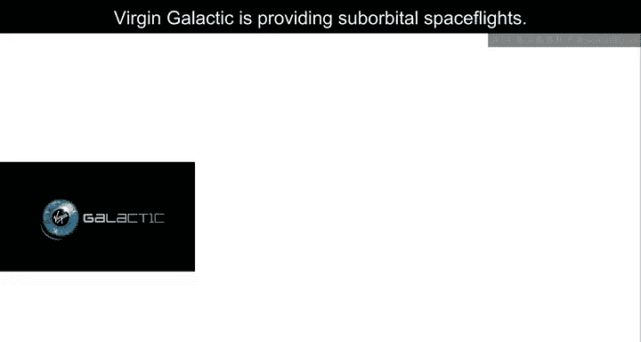
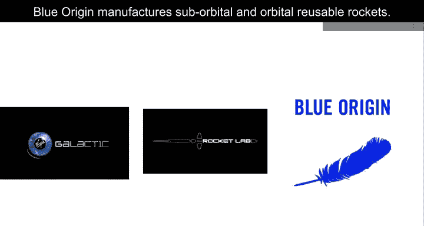
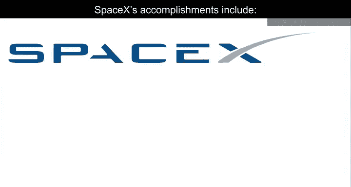
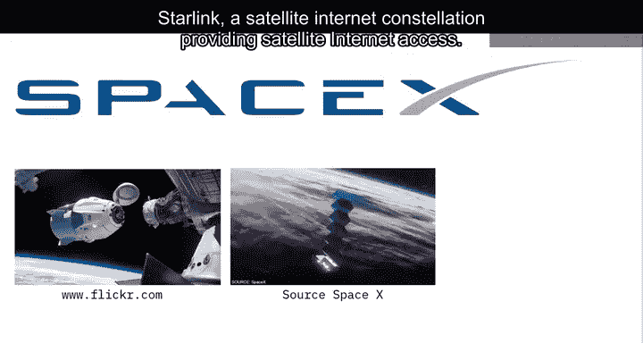
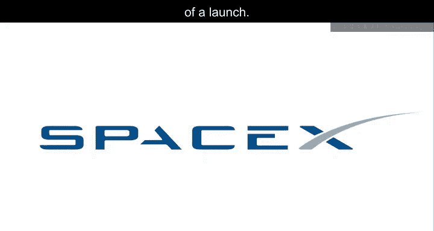
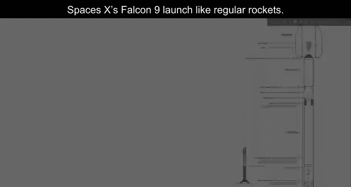
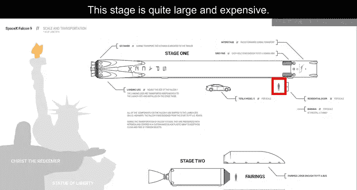
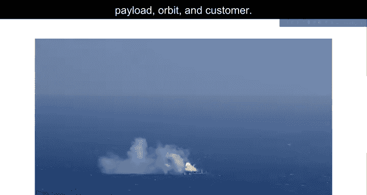
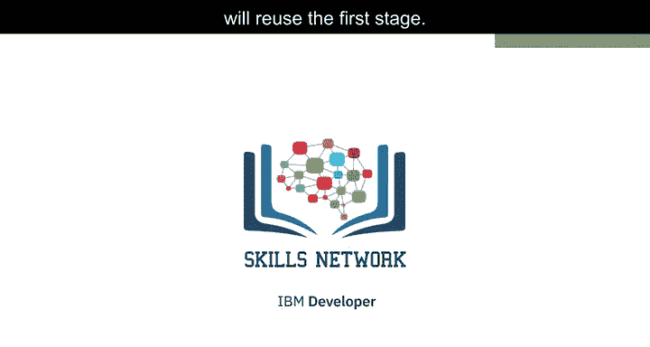

# 001：项目场景与概述 🚀

在本节课中，我们将介绍毕业项目的整体场景与概述。我们将了解商业航天时代的背景，以及SpaceX如何通过可重复使用的火箭技术降低成本。最后，我们会明确你在这个毕业项目中将要扮演的角色和需要完成的核心任务。

---

商业航天时代已经到来，多家公司正在让太空旅行变得人人可负担。维珍银河公司提供亚轨道太空飞行服务。

火箭实验室是一家小型卫星发射服务提供商。蓝色起源公司则制造亚轨道和轨道可重复使用火箭。

其中，或许最成功的是SpaceX。SpaceX的成就包括向国际空间站运送航天器。

星链是一个卫星互联网星座，提供卫星互联网接入服务，并向太空运送载人任务。

SpaceX能够做到这一点的一个原因是其火箭发射成本相对低廉。😊

SpaceX在其网站上宣传猎鹰9号火箭的发射成本为6200万美元。其他供应商的每次发射成本高达1.65亿美元以上。节省大部分成本的原因在于SpaceX能够重复使用第一级火箭。

因此，如果我们能确定第一级火箭是否会成功着陆，我们就能确定一次发射的成本。

SpaceX的猎鹰9号发射过程与常规火箭类似。为了帮助我们理解猎鹰9号的规模，我们将使用来自Forest Cattch的图表。他是一位3D艺术家，也是ZLdesign.com的软件工程师，他制作关于太空飞行和航天器的信息图表与艺术作品，同时也开发软件。有效载荷被封装在整流罩内。

第二级火箭帮助将有效载荷送入轨道，但大部分工作是由第一级完成的。第一级如图所示。这一级完成了大部分工作，并且比第二级大得多。在这里，我们看到第一级火箭与一个人以及几个其他地标建筑的对比。这一级体积相当庞大且昂贵。

与其他火箭供应商不同，SpaceX的猎鹰9号能够回收第一级火箭。有时第一级不会成功着陆，有时它会像这个片段中显示的那样坠毁。其他时候，SpaceX会根据任务参数（如有效载荷、轨道和客户要求）选择牺牲第一级。

在这个毕业项目中，你将扮演一家新火箭公司Space Y的数据科学家角色，该公司希望与SpaceX竞争。Space Y由亿万富翁实业家Alon Mask创立。

你的工作是确定每次发射的价格。你将通过收集有关SpaceX的信息并为你的团队创建仪表板来完成这项工作。你还将确定SpaceX是否会重复使用第一级火箭。

你将不使用火箭科学来确定第一级是否会成功着陆，而是训练一个机器学习模型，并利用公开信息来预测SpaceX是否会重复使用第一级。

---

本节课中，我们一起学习了商业航天领域的概况，重点了解了SpaceX通过可重复使用技术实现成本优势的关键。我们明确了毕业项目的核心目标：**扮演Space Y公司的数据科学家，通过数据收集、分析和机器学习建模，来预测火箭发射成本及第一级回收的可能性**。在接下来的课程中，我们将深入探讨如何具体执行这些任务。