# 002：数据收集概述 📊


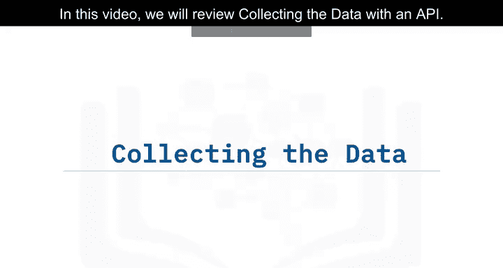

在本节课中，我们将学习如何通过API收集数据。具体来说，我们将使用SpaceX的API来获取火箭发射数据，并了解如何将这些数据处理成可用于分析的格式。

## 项目与数据源介绍 🚀


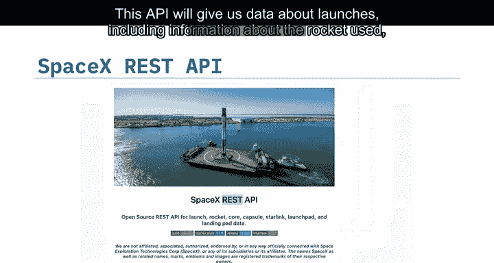

在这个毕业项目中，我们将使用从API收集的SpaceX发射数据。具体来说，我们将使用SpaceXRt API。该API提供关于发射的数据，包括使用的火箭信息、运送的有效载荷、发射规格、着陆规格以及着陆结果。我们的目标是利用这些数据来预测SpaceX是否会尝试回收火箭。

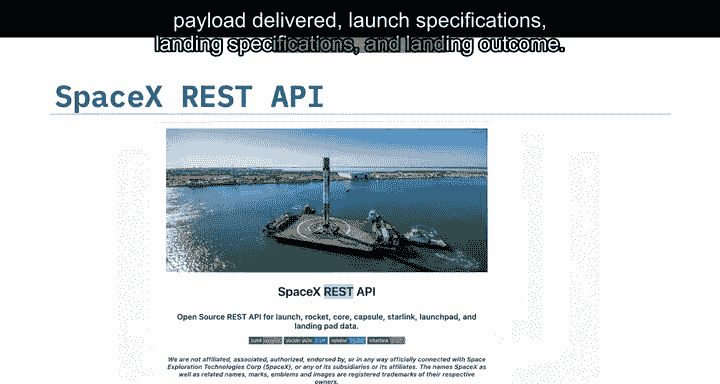


## 了解API端点 🔗

SpaceX API的端点（或URL）以 `api.spacexdata.com/v4/` 开头。存在不同的端点，例如 `/capsules` 和 `/launches`。在本项目中，我们将使用端点 `api.spacexdata.com/v4/launches/past`。接下来，让我们看看这个API是如何工作的。

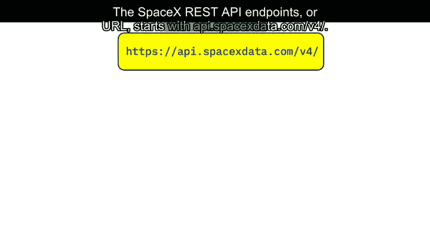

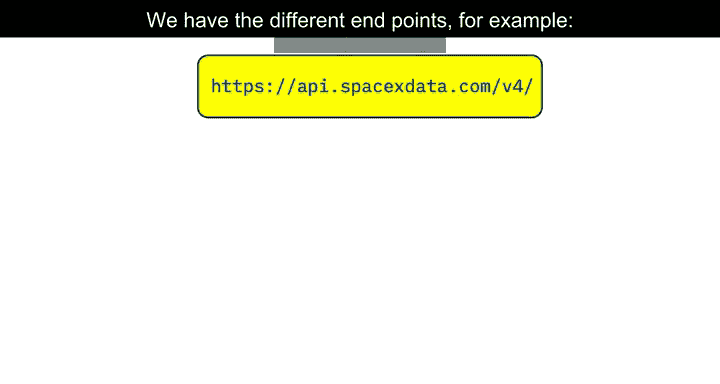

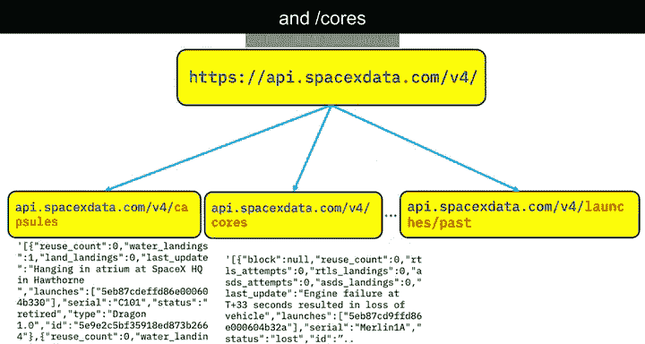

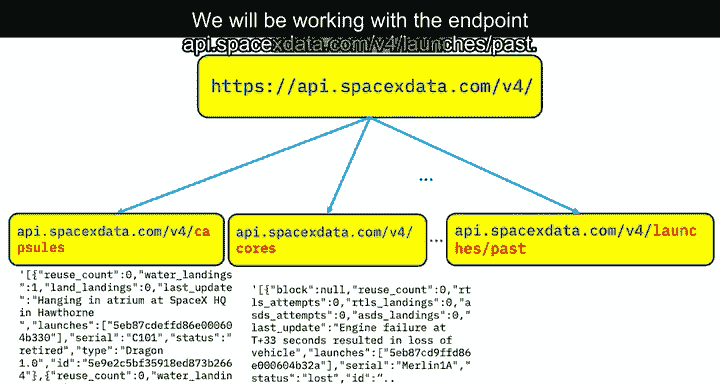

## 发起请求与获取数据 📡

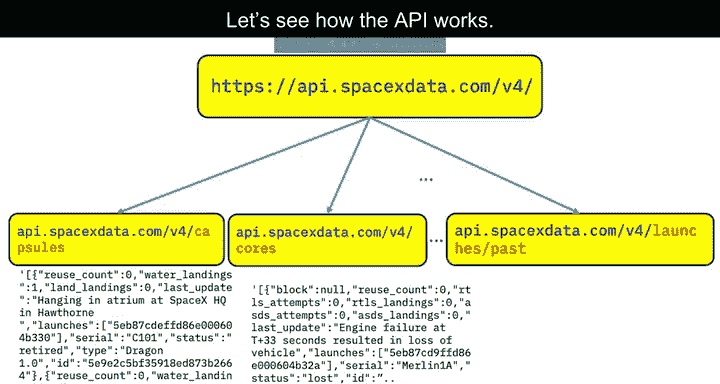

我们将使用上述URL来定位API的特定端点，以获取过去的发射数据。我们将使用Python的 `requests` 库发起一个GET请求来获取这些数据。通过调用 `.json()` 方法可以查看请求的结果。响应将以JSON格式返回，具体来说，是一个JSON对象列表，其中每个对象代表一次发射。

## 数据转换与规范化 📋

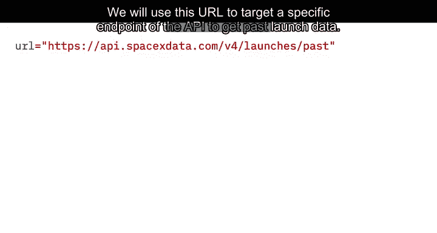

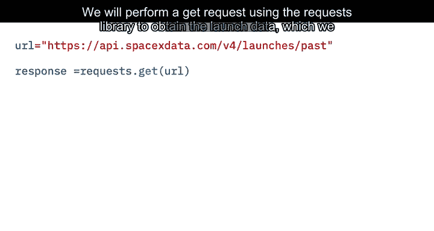

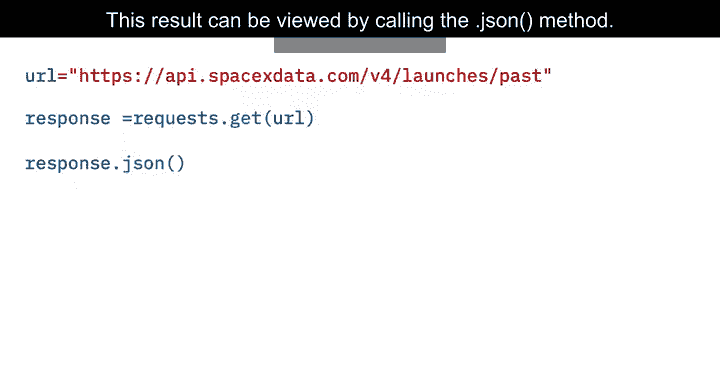

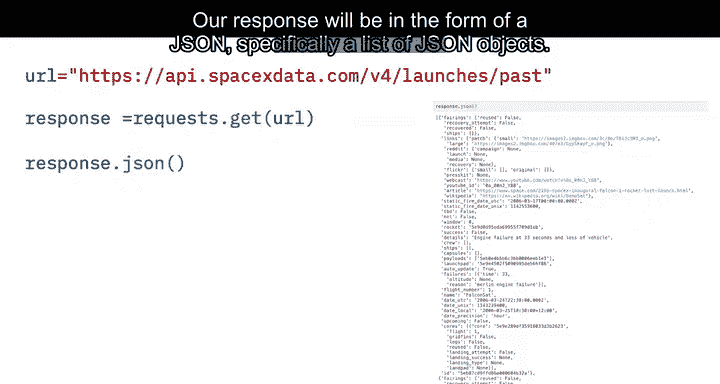

由于我们使用的是API，你会注意到当我们获得响应时，数据是JSON格式。具体来说，我们得到一个JSON对象列表，每个对象代表一次发射。为了将这个JSON转换为数据框（DataFrame），我们可以使用 `json_normalize` 函数。这个函数允许我们将结构化的JSON数据规范化成一个扁平的表格。

以下是一个示例代码片段，展示了如何发起请求并转换数据：

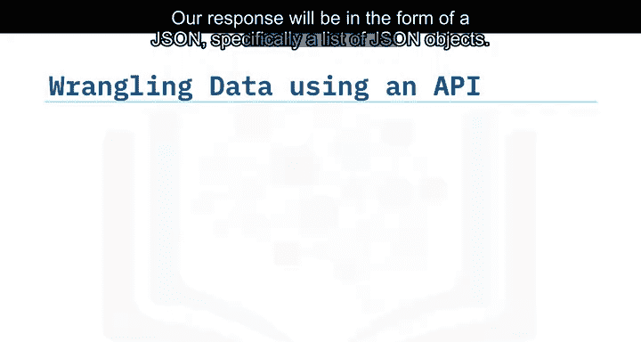

```python
import requests
import pandas as pd
from pandas import json_normalize

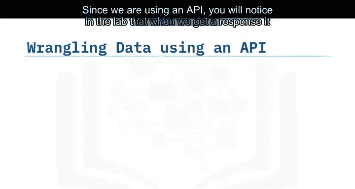

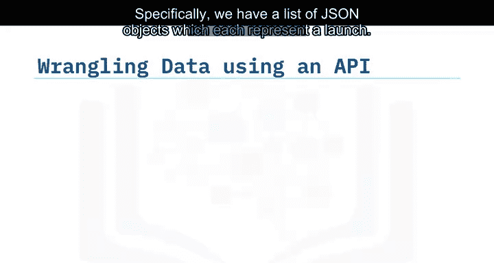

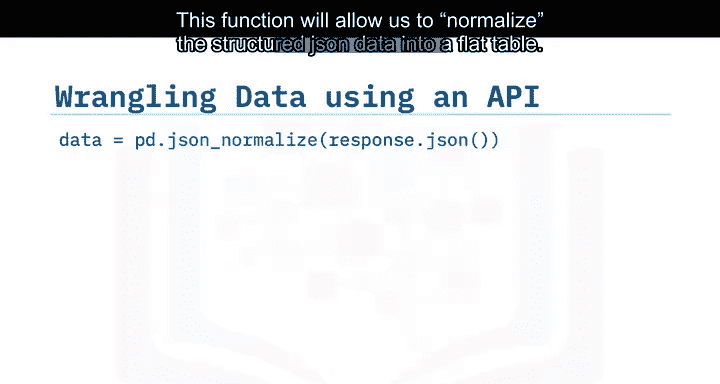

# 发起GET请求
url = "https://api.spacexdata.com/v4/launches/past"
response = requests.get(url)
data = response.json()

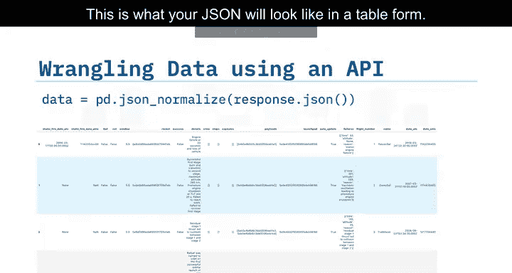

# 将JSON数据转换为DataFrame
df = json_normalize(data)
```

## 数据清洗与处理 🧹

我们获得的原始数据需要被转换成干净的数据集，以便进行有意义的分析。这包括使用API进行数据整理、数据抽样以及处理缺失值。

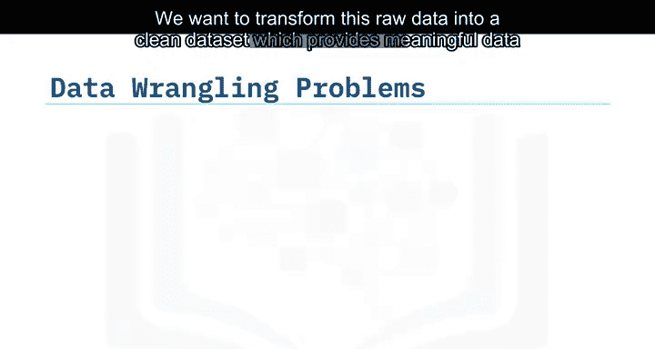

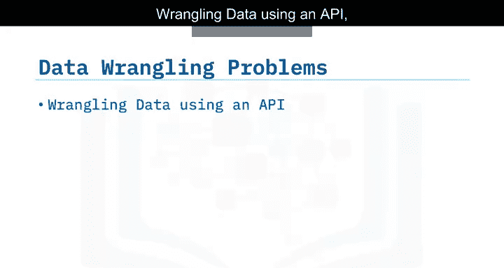

在数据中，你可能会注意到某些列（如“rocket”）只包含标识号，而不是实际数据。这意味着我们需要再次使用API，针对另一个端点来收集每个ID号的具体信息。项目中已经为你创建了相应的函数，它们将使用以下端点：`booster`、`launchpad`、`payload` 和 `core`。收集到的数据将存储在列表中，并用于创建我们的最终数据集。

另一个问题是，我们获得的发射数据包含了“猎鹰1号”助推器的数据，而我们只需要“猎鹰9号”的数据。在实验中，你需要找出如何过滤和抽样数据，以移除“猎鹰1号”的发射记录。

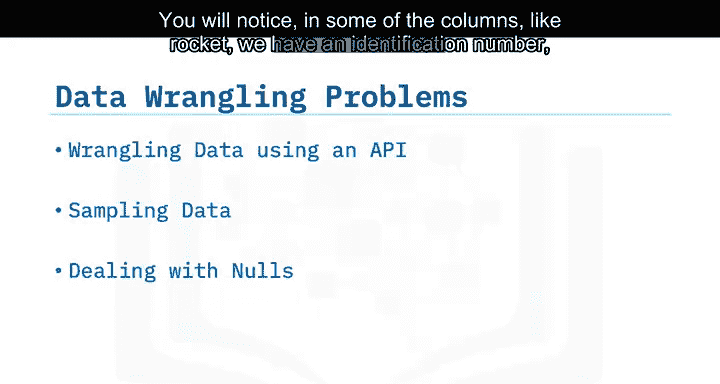

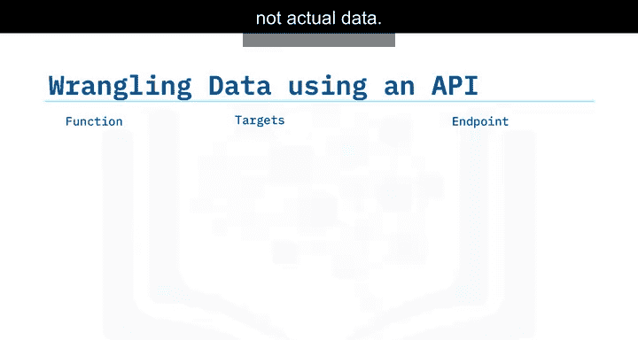

## 处理缺失值 ⚠️

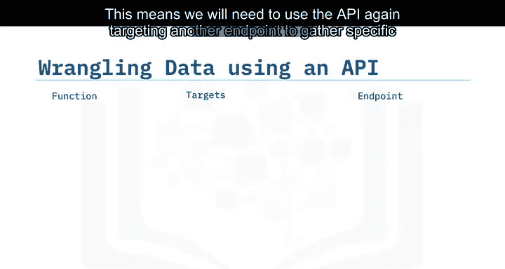

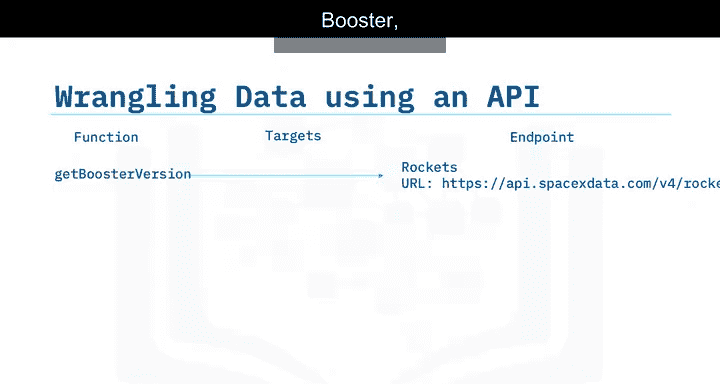

最后，并非所有收集到的数据都是完美的。我们最终可能会遇到包含缺失值的数据。为了使数据集适合分析，有时我们必须处理这些缺失值。在本例中，我们将处理“payload_mass”列中的缺失值。

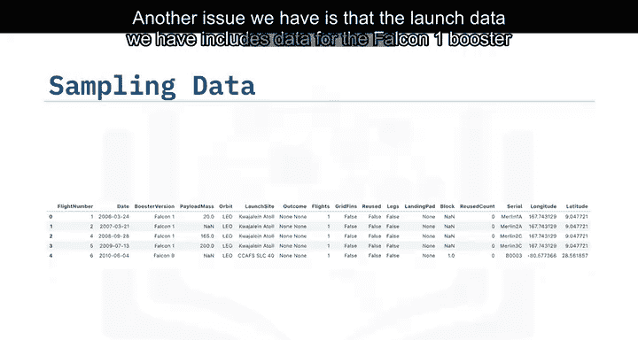

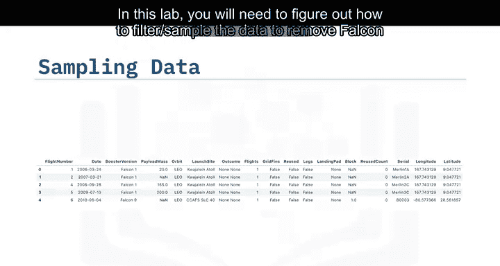

在实验中，你需要找出一种方法来计算有效载荷质量数据的平均值，然后用这个平均值替换“payload_mass”中的缺失值。我们将暂时保留“landing_pad”列中的缺失值，因为它们表示未使用着陆场的情况。这将在后续使用独热编码（One-Hot Encoding）时进行处理。

以下是处理缺失值的示例步骤：

1.  计算“payload_mass”列的平均值。
2.  用计算出的平均值填充该列中的缺失值。

```python
# 计算平均值并填充缺失值
mean_payload_mass = df['payload_mass'].mean()
df['payload_mass'].fillna(mean_payload_mass, inplace=True)
```

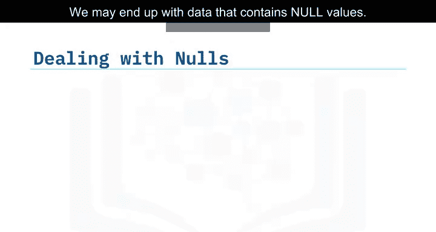

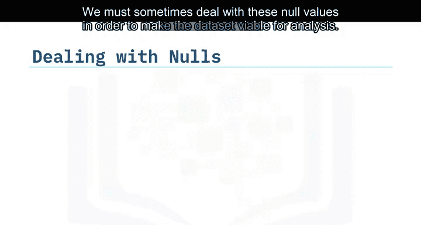

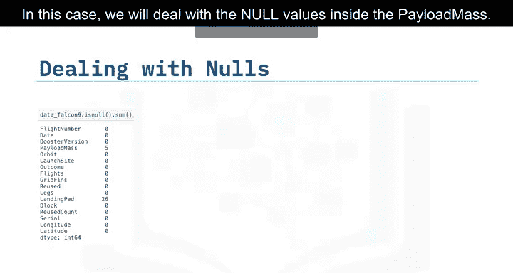

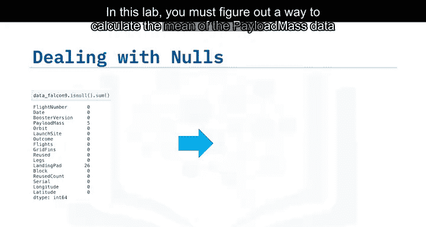

## 总结 📝

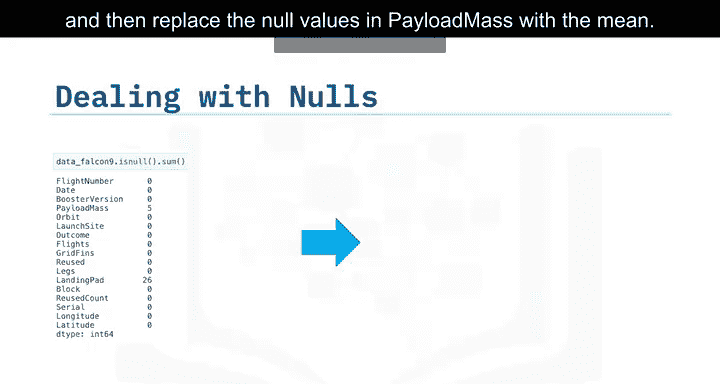

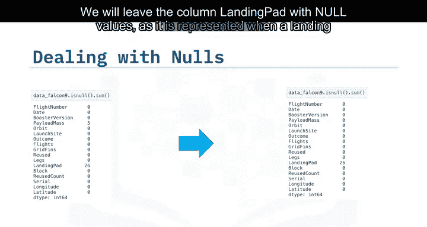

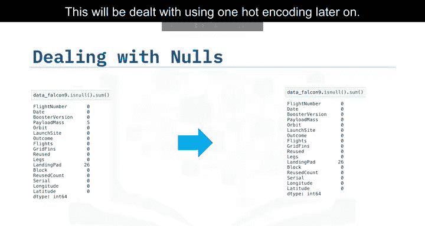


本节课中，我们一起学习了如何通过API收集SpaceX发射数据。我们介绍了API端点的概念，演示了如何使用 `requests` 库发起GET请求并获取JSON格式的响应。接着，我们学习了如何使用 `json_normalize` 函数将复杂的JSON数据转换为结构化的Pandas DataFrame。最后，我们探讨了数据清洗的关键步骤，包括过滤特定数据（如只保留猎鹰9号的数据）以及处理数据集中的缺失值，特别是用平均值填充“payload_mass”列的缺失值。这些步骤为我们后续的数据分析和建模奠定了坚实的基础。