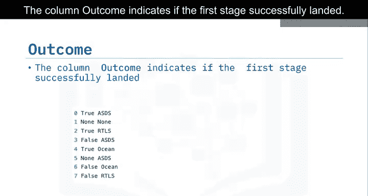

# 003：数据整理概述 📊

在本节课中，我们将学习数据整理的基本概念和步骤。数据整理是数据科学项目中的关键环节，它涉及对原始数据进行清洗、转换和整理，以便后续分析和建模使用。

---

## 数据属性回顾

上一节我们介绍了数据科学项目的整体流程，本节中我们来看看数据集中的具体属性。我们将回顾数据集中的一些关键列及其含义。

以下是数据集中的主要属性列表：

*   **Flight Number**：飞行编号
*   **Date**：日期
*   **Booster Version**：助推器版本
*   **Payload Mass**：有效载荷质量
*   **Orbit**：轨道
*   **Launch Site**：发射场
*   **Outcome**：结果（第一级火箭着陆状态）
*   **Gridfins**：用于辅助着陆的栅格翼
*   **Reused**：着陆腿是否复用
*   **Landing Pad**：着陆平台区块
*   **Reused Count**：复用次数
*   **Serial**：序列号
*   **Longitude and Latitude**：发射场的经度和纬度

---

## 关键属性详解

现在，让我们详细查看其中几个重要的属性。

### 发射场 (Launch Site)

`Launch Site` 列包含了不同的发射场地。

以下是主要的发射场：

*   Vandenberg AFB Space Launch Complex
*   Kennedy Space Center
*   CCAFS SLC 40

### 轨道类型 (Orbit)

`Orbit` 列表示有效载荷进入的不同轨道类型。

例如：
*   **LEO (近地轨道)**：一种以地球为中心、高度在2000公里以下的轨道。
*   **GTO (地球同步转移轨道)**：一种高地球轨道，允许卫星与地球自转同步。它位于地球赤道上方22，236英里（35，786公里）处。

### 着陆结果 (Outcome)

`Outcome` 列指示第一级火箭是否成功着陆。该列包含八种可能的状态。

例如：

*   **True ASDS**：表示助推器成功降落在无人船上，如下方循环视频所示。
*   **False ASDS**：表示任务结果未能成功降落在无人船上，如下方循环视频所示。

---

## 数据转换目标

对于 `Outcome` 列，我们希望将着陆结果转换为二分类的标签 `Y`，其值为 `0` 或 `1`。

转换规则如下：
*   `0` 代表坏结果，即助推器未能着陆。
*   `1` 代表好结果，即助推器成功着陆。

因此，变量 `Y` 将作为一个**分类变量**，用于表示每次发射的最终结果。

---

本节课中我们一起学习了数据整理的基本步骤，包括识别数据集的关键属性、理解其含义，并明确了将着陆结果（Outcome）转换为机器学习模型可用的二分类标签（`Y`）的目标。这是为后续数据分析和模型构建做准备的重要基础。