# 004：探索性数据分析概述 📊

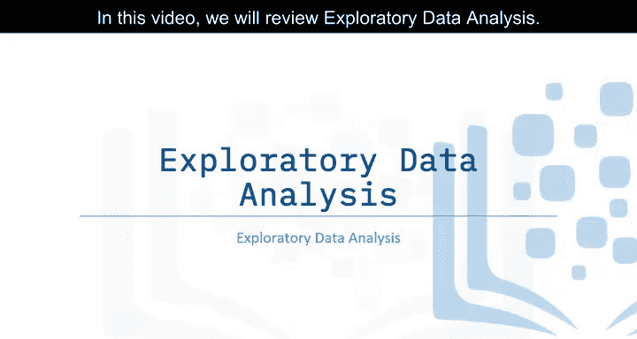

在本节课中，我们将学习探索性数据分析（EDA）的基本概念及其在数据科学项目中的重要性。探索性数据分析是任何数据科学项目的第一步，它帮助我们理解数据、发现模式并识别潜在的特征，为后续的机器学习建模做好准备。

## 什么是探索性数据分析？ 🔍

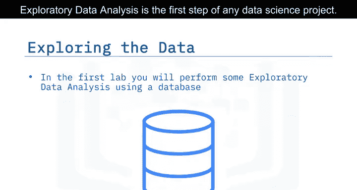

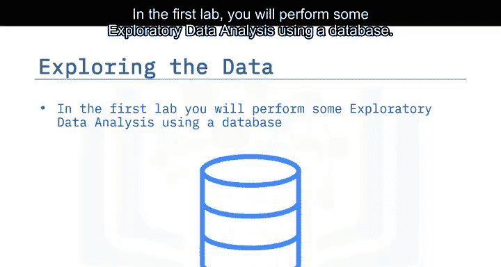

探索性数据分析是任何数据科学项目的第一步。在第一个实验中，你将使用数据库进行一些探索性数据分析。在第二个实验中，你将查看数据是否可用于自动判断猎鹰9号火箭的第二级是否能成功着陆。

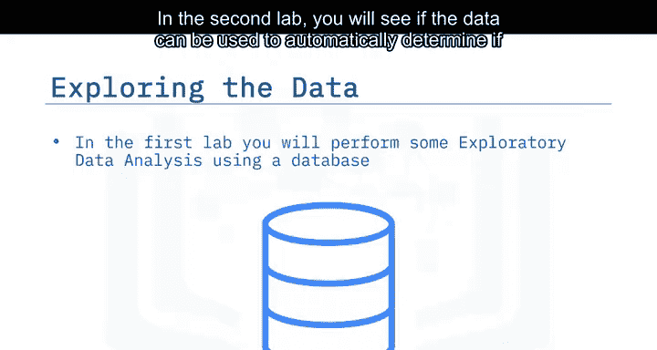

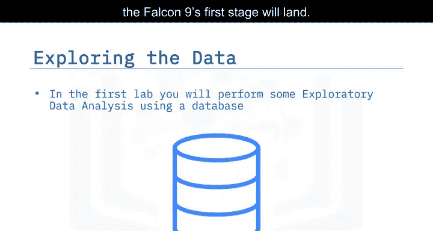

## 识别关键特征 🎯

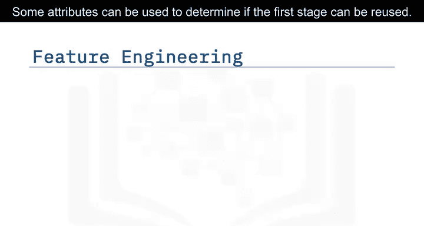

某些属性可用于判断火箭第一级是否能被重复使用。然后，我们可以将这些特征与机器学习结合使用，自动预测第一级是否能成功着陆。

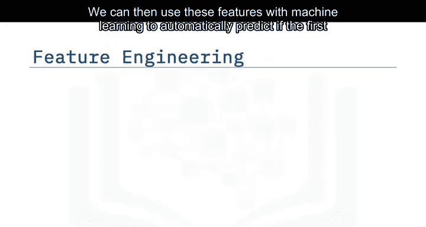

例如，我们可以观察到自2013年以来，火箭发射的成功率有所提高。我们可以通过发射次数将这一趋势转化为一个特征。

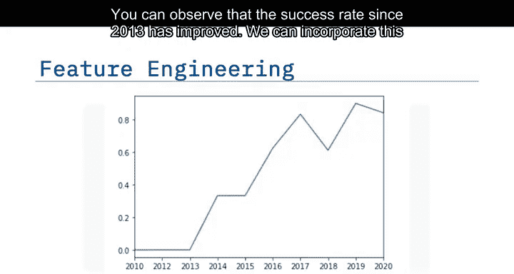

## 分析发射场成功率 🚀

我们看到不同的发射场具有不同的成功率。因此，这些信息可用于帮助判断第一级是否能成功着陆。CCAFSLC40发射场的成功率为60%，而KSCLC 39A和VAFB SLC4E发射场的成功率约为77%。

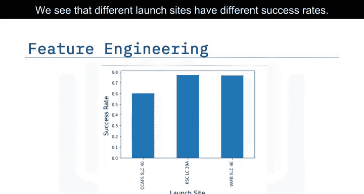

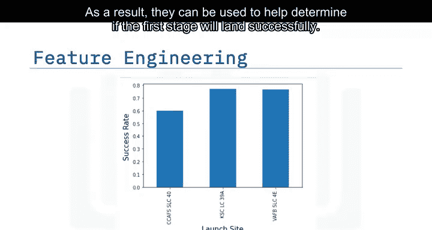

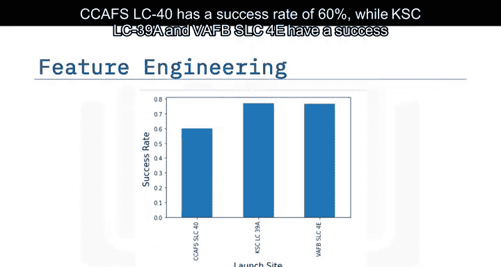

## 组合特征以获得更多信息 📈

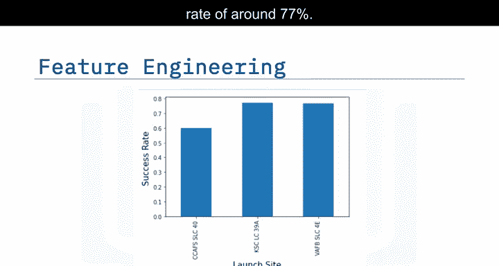

组合多个属性能为我们提供更多信息。如果我们用颜色叠加着陆结果，会发现CCAFSLC40发射场的成功率为60%，但如果有效载荷质量超过10,000公斤，成功率则为100%。因此，我们将组合多个特征。

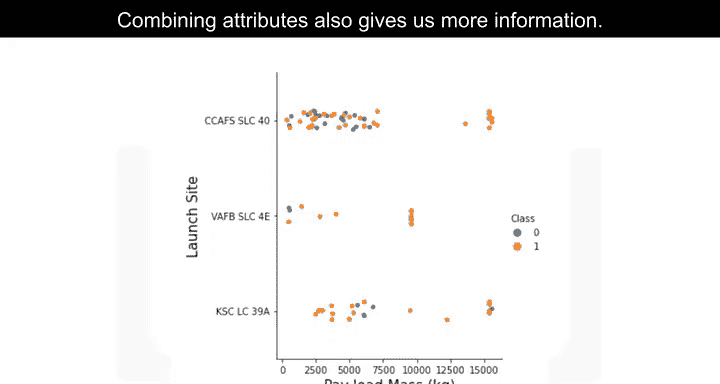

## 为机器学习模型准备数据 ⚙️

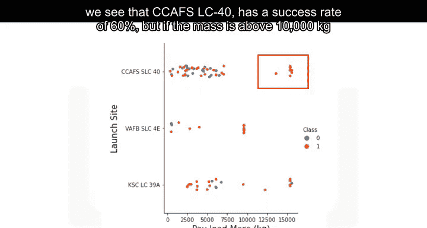

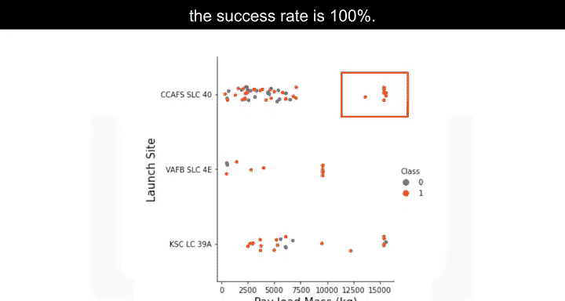

在实验中，你将确定哪些属性与成功着陆相关。分类变量将使用独热编码进行转换，为机器学习模型准备数据，该模型将预测第一级是否能成功着陆。

## 总结 📝

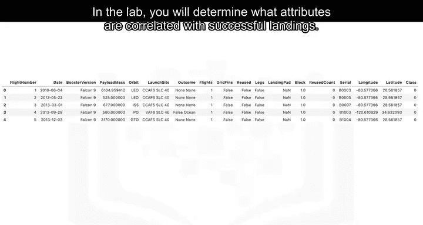

本节课中，我们一起学习了探索性数据分析的核心概念。我们了解到EDA是数据科学项目的第一步，它帮助我们识别关键特征、分析不同发射场的成功率，并通过组合特征获得更深入的见解。最后，我们还探讨了如何为机器学习模型准备数据，特别是通过独热编码处理分类变量。掌握这些步骤，将为后续的预测建模打下坚实的基础。