# 005：《应用数据科学毕业项目》 - 交互式可视化分析与仪表盘 📊


在本节课中，我们将学习如何构建交互式可视化分析与仪表盘。交互式可视化允许用户以实时和互动的方式探索数据，相比静态图表，它能更有效地揭示数据模式并讲述更吸引人的故事。我们将使用 `folium` 库创建交互式地图，并使用 `plotly dash` 构建一个功能完整的仪表盘应用。

---

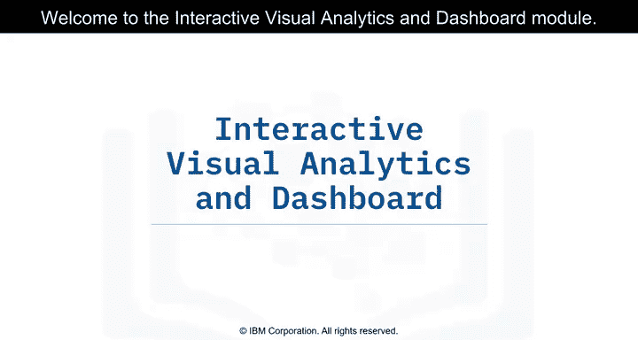

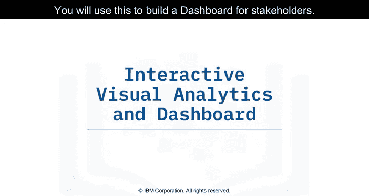

## 交互式可视化分析介绍 🎨

上一节我们介绍了课程的整体目标，本节中我们来看看什么是交互式可视化分析。

交互式可视化分析使用户能够以交互和实时的方式探索和操作数据。常见的交互操作包括**缩放**、**平移**、**筛选**、**搜索**和**联动**。通过交互式可视化分析，用户可以更快、更有效地发现视觉模式。

与使用静态图表展示发现相比，交互式数据可视化或仪表盘总能讲述更引人入胜的故事。

在本模块中，你将使用 `folium` 和 `plotly dash` 来构建交互式地图和仪表盘，以执行交互式可视化分析。

---

## 使用 Folium 分析发射场地理位置 🗺️

本模块的第一部分将重点使用 `folium` 分析发射场的地理位置及其邻近区域。

我们将首先在交互式地图上标记发射场的位置及其邻近区域。然后，我们将通过这些标记探索地图，并尝试从中发现任何模式。

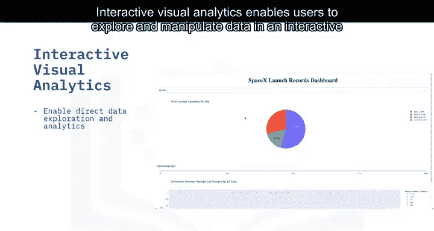

以下是使用 `folium` 的基本步骤：
1.  创建基础地图。
2.  为每个发射场位置添加标记。
3.  添加其他图层或要素（如邻近区域范围）。
4.  保存并展示交互式地图。

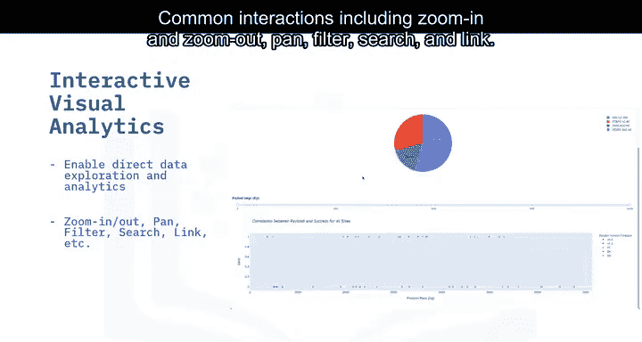

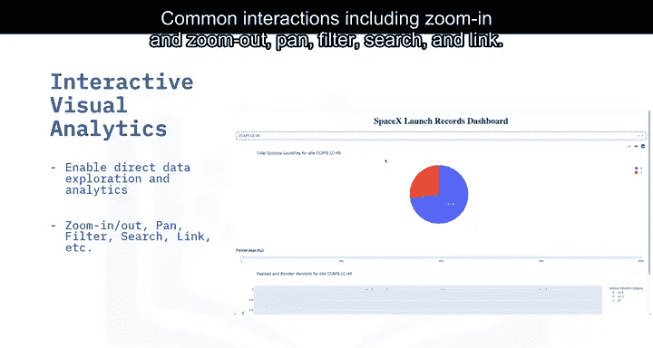

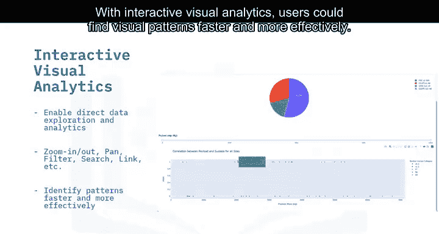

最终，我们应该能够通过探索地图来分析数据，并回答一个核心业务问题：**如何选择最佳的发射场位置**。

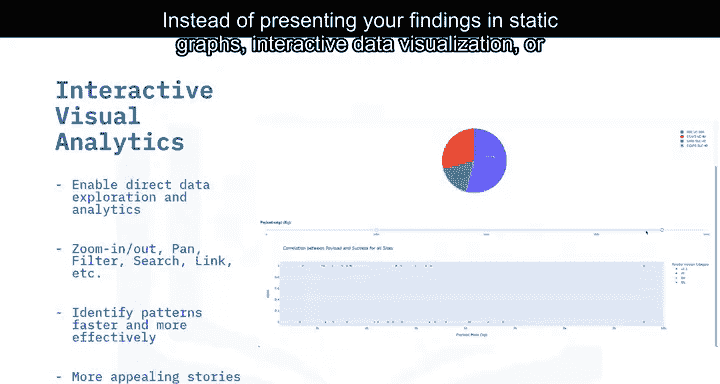

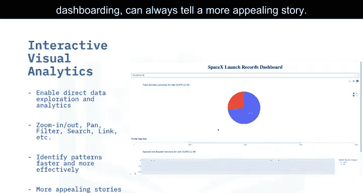

---

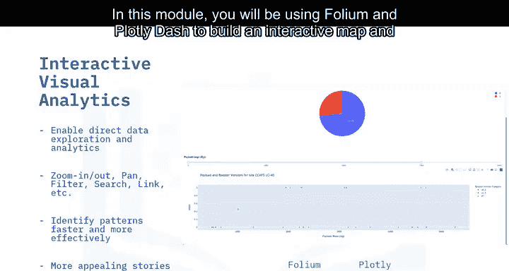

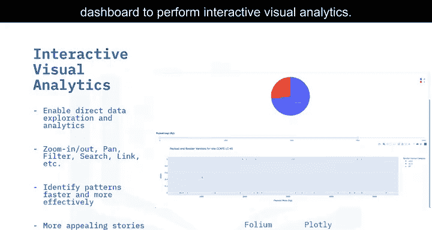

## 使用 Plotly Dash 构建仪表盘应用 📈

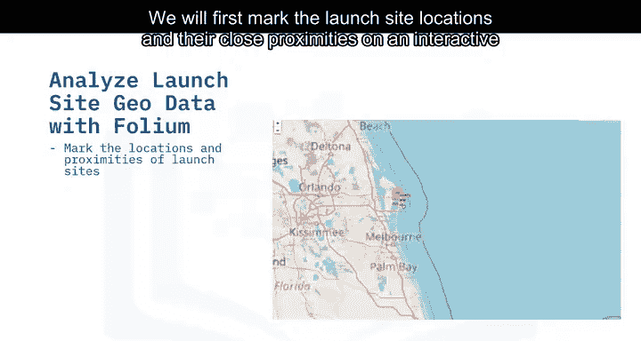

接下来，你将使用 Python 的 `plotly dash` 包构建一个仪表盘应用。

这个仪表盘应用包含输入组件，例如**下拉列表**和**范围滑块**，用于与一个**饼图**和一个**散点图**进行交互。你将在指导性实验中被引导构建这个仪表盘应用。

仪表盘构建完成后，你可以使用它比静态图表更容易地从 SpaceX 数据中发现更多洞察。

以下是构建仪表盘的关键组件示例：
```python
import dash
from dash import dcc, html
import plotly.express as px

app = dash.Dash(__name__)
app.layout = html.Div([
    dcc.Dropdown(options=[...], id='dropdown'),
    dcc.RangeSlider(min=0, max=100, step=1, value=[0, 100], id='slider'),
    dcc.Graph(id='pie-chart'),
    dcc.Graph(id='scatter-plot')
])
```

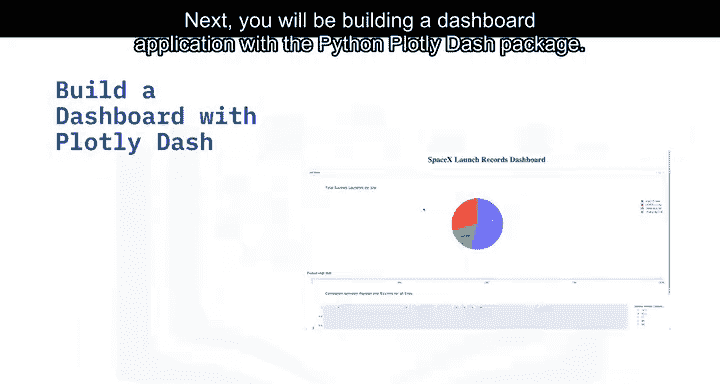

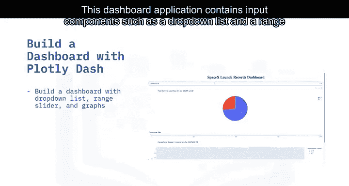

---

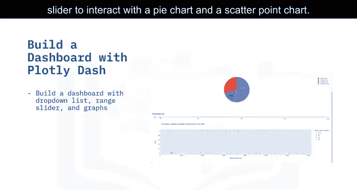

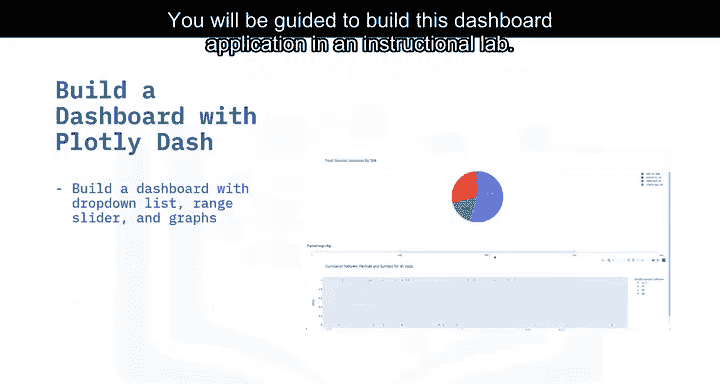

## 课程总结 🎯

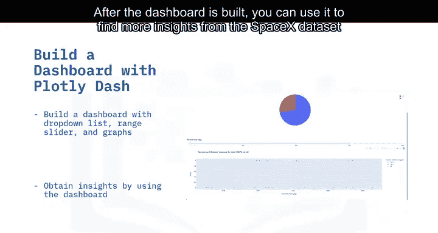


本节课中，我们一起学习了交互式可视化分析的核心概念及其价值。我们介绍了如何使用 `folium` 库创建交互式地图来分析和探索发射场的地理数据模式。接着，我们探讨了如何使用 `plotly dash` 框架构建一个包含交互组件的功能型仪表盘应用，从而实现对数据的动态探索和更深入的洞察。掌握这些工具将极大地提升你呈现和探索数据故事的能力。