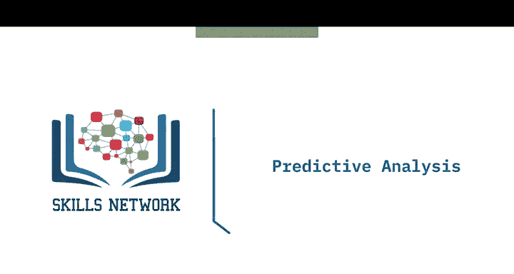
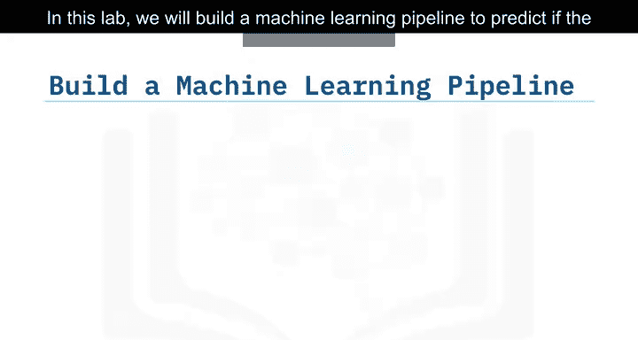
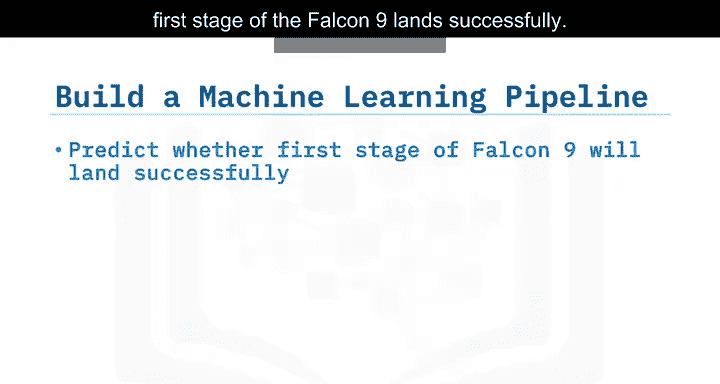
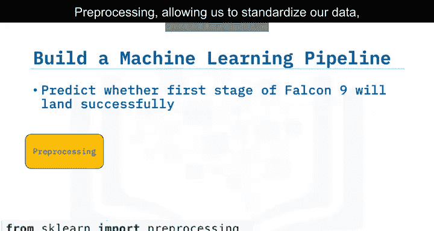
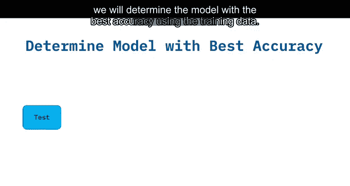
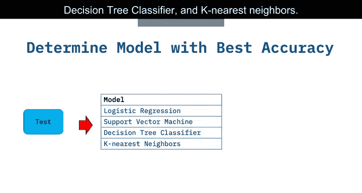

# 006：预测性分析概述 📊

在本节课中，我们将学习预测性分析的基本流程。我们将构建一个机器学习管道，用于预测猎鹰9号火箭第一级是否能够成功着陆。这个过程将涵盖数据预处理、模型训练、超参数调优以及模型评估等关键步骤。

## 概述

预测性分析的目标是利用历史数据构建模型，以预测未来事件的结果。在本实验中，我们的具体任务是预测火箭发射的着陆结果。为了实现这一目标，我们需要遵循一个结构化的机器学习工作流程。

上一节我们介绍了数据分析的背景，本节中我们来看看如何将数据转化为可操作的预测模型。

## 构建机器学习管道 🛠️

我们将按照以下步骤构建一个完整的机器学习管道，以确保预测过程的系统性和可重复性。

以下是构建管道的主要步骤：

1.  **数据预处理**：此步骤旨在标准化数据，确保所有特征处于相同的尺度，这对于许多机器学习算法的性能至关重要。通常使用 `StandardScaler` 进行标准化，公式为：`z = (x - u) / s`，其中 `u` 是均值，`s` 是标准差。
2.  **训练集与测试集划分**：为了客观评估模型性能，我们需要将数据分割为两部分。一部分用于训练模型（训练集），另一部分用于测试模型的泛化能力（测试集）。可以使用 `train_test_split` 函数实现。
3.  **模型训练与网格搜索**：我们将训练多种分类模型。同时，通过网格搜索（Grid Search）技术，系统性地寻找能让特定算法达到最佳性能的超参数组合。
4.  **模型评估**：使用测试集数据，基于最佳超参数值评估各个模型的准确率，并选择表现最佳的模型。
5.  **输出混淆矩阵**：最后，我们将为最佳模型输出混淆矩阵，以更细致地了解模型在各类别上的预测表现（如真阳性、假阳性等）。

## 将要测试的算法 🤖

在模型训练阶段，我们将尝试并比较以下几种经典的机器学习分类算法。

以下是本实验计划测试的四种算法：

*   **逻辑回归**：一种用于二分类问题的线性模型。
*   **支持向量机**：通过寻找最大间隔超平面来区分类别的算法。
*   **决策树分类器**：一种基于树状结构进行决策的模型，易于解释。
*   **K最近邻**：基于实例的学习算法，根据最近邻居的类别进行预测。

通过比较这些算法在相同数据上的表现，我们可以为当前预测任务选择最合适的模型。

## 总结

本节课中我们一起学习了预测性分析的核心流程。我们从数据预处理和划分开始，逐步完成了模型训练、超参数优化以及最终的评估。重点掌握了利用网格搜索寻找最佳模型参数，并使用测试集和混淆矩阵来客观评估模型性能的方法。这套流程是解决许多实际数据科学预测问题的基础框架。