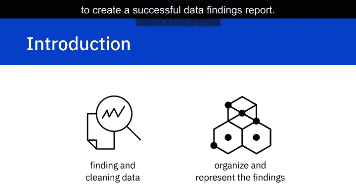
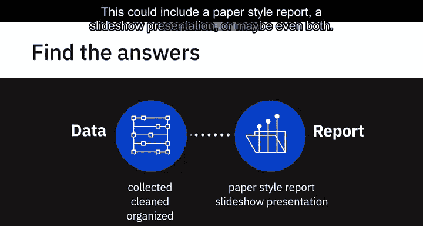
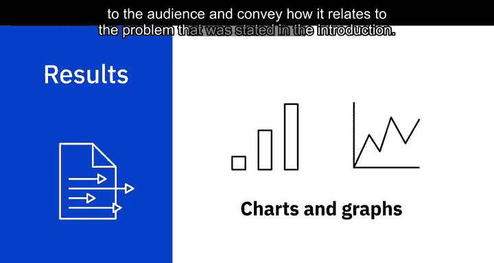
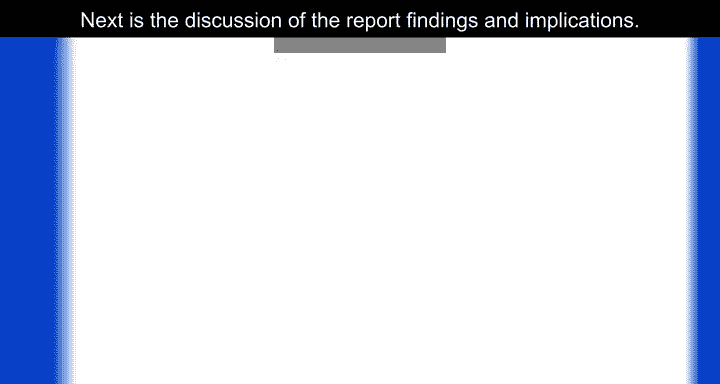
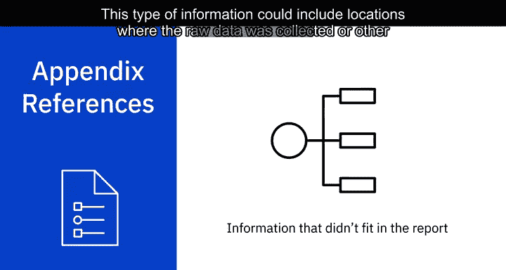

# 007：成功数据发现报告的要素

在本节课中，我们将学习如何有效地组织和呈现数据分析的发现，以创建一份成功的数据发现报告。虽然发现和清理数据是分析的重要第一步，但若不能有效地向受众组织和呈现发现，其价值可能会丧失。

## 📝 报告概述与结构

上一节我们讨论了数据收集与清理，本节中我们来看看如何将分析结果整理成一份清晰的报告。在数据被收集、清理和组织之后，解释工作便开始了。此时，你能够获得数据的完整视图，并有望回答分析开始前提出的问题。

通常，你需要开始撰写一份发现报告，以解释所学到的内容。根据利益相关者及其接收信息的方式，报告的形式可能有所不同。这可能包括纸质报告、幻灯片演示，或两者兼有。发现报告是数据分析的关键部分，因为它传达了所发现的内容。

在开始这个过程时，收集到的数据和信息可能看起来有些令人不知所措。克服这个障碍的最佳方法是首先创建一个大纲。通过完成大纲，你可以获得一个完整的图景，并开始以精确而简单的方式撰写。

虽然创建数据驱动演示文稿的格式多种多样，但我们创建了一个简单且易于遵循又有效的大纲。在创建大纲时，请始终记住要针对你的受众进行结构化，并创建适合你情况的演示文稿。

以下是创建报告大纲的核心步骤：

1.  **封面页**：此起始部分包含演示文稿的标题、你的姓名以及日期。
2.  **执行摘要**：紧接着是执行摘要和目录。
3.  **目录**：目录包含报告的各章节和子章节，以便为受众提供内容概览。这也使读者能够直接跳转到对他们可能更重要的特定部分。
4.  **报告主体**：继续你的演示文稿，包括引言、方法论、结果、讨论、结论，最后是附录。

请注意，每个要素的深度和长度可能因受众和报告格式而异。

## 🔍 报告各核心部分详解

### 执行摘要
创建报告的第一步是恰当地撰写执行摘要。该摘要将简要解释项目的细节，并应被视为一份独立的文档。这些信息取自你报告中的要点。虽然可以重复信息，但不应呈现新的信息。

### 引言
目录之后的下一个部分是引言。引言解释了分析的性质，陈述了问题，并给出了通过执行分析要回答的问题。

### 方法论
方法论解释了分析中使用的数据来源，并概述了收集数据的计划。例如，是使用聚类方法还是回归方法来分析数据。

### 结果
结果部分详细说明了数据收集、组织方式以及分析方法。这部分还将包含图表，这些图表可以证实结果，并通过提供对数据的解释来引起对更复杂或关键发现的注意。通过这种方式，你能够向受众提供详细的解释，并传达其与引言中所述问题的关联。

### 讨论
接下来，讨论报告的发现和影响。在这一部分，你将与受众讨论从研究中得出的影响。例如，假设你正在为大学毕业生研究顶级编程语言。你会发现他们需要学习多种语言以在就业市场中保持竞争力，还是某一种语言始终占据主导地位？

### 结论
我们现在已经到达报告发现的结论部分。这最后一部分应重申引言中给出的问题，并对发现进行总体总结。它还将说明分析的结果，以及未来是否会采取任何其他步骤。

### 附录
最后，我们有附录。此部分包含那些不太适合报告正文，但你仍然认为足够重要而需要包含的信息。这类信息可能包括收集原始数据的地点，或其他细节，如资源、致谢或参考文献。

## 🎯 课程总结

本节课中，我们一起学习了创建成功数据发现报告的重要要素。我们了解了报告的基本结构，包括封面、执行摘要、目录、引言、方法论、结果、讨论、结论和附录。每个部分都有其特定的目的，共同构成了一份清晰、完整的数据分析成果展示。在下一视频中，我们将学习呈现发现时的最佳实践。