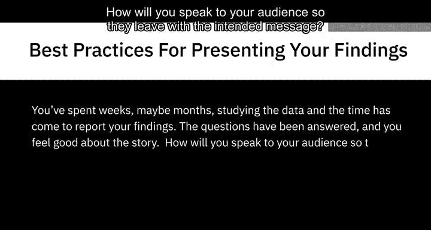
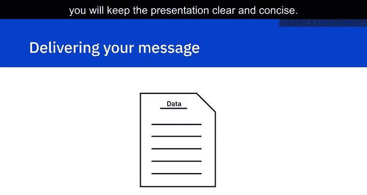
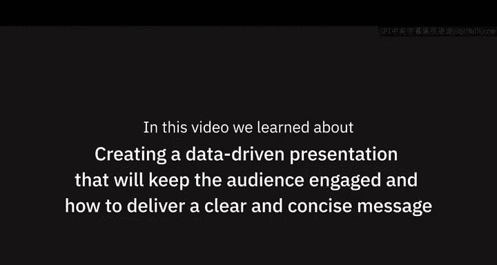

# 008：成果展示最佳实践 📊

在本节课中，我们将学习如何有效地展示数据科学项目的成果。我们将探讨如何组织报告内容、设计可视化图表，以及如何向观众清晰传达核心信息，确保你的研究发现能够被准确理解和记住。

你已经花费了数周甚至数月的时间研究数据，现在到了汇报成果的时刻。问题已经得到解答，你对整个故事脉络感到满意。那么，你将如何向观众讲述，才能让他们带着你预期的信息离开呢？本节视频将教你如何以一种能够吸引并保持观众注意力的方式来展示你的发现。

---

## 清晰传达信息的关键要素

进行数据驱动的演示看似简单，但要准确传达信息，有几个重要因素需要牢记。

以下是确保演示成功的三个核心要点：

1.  **确保图表清晰可读**：图表和图形不应过小，并且标签必须清晰。
2.  **数据仅作为支撑证据**：仅使用数据来支持你的论点。
3.  **聚焦核心信息**：每张图表只阐明一个观点，并剔除不支持关键信息的数据。

---

## 设计易于理解的视觉化图表

上一节我们介绍了清晰传达信息的三个要点，本节中我们来看看如何具体实现第一点：设计易于理解的图表。

你是否曾参加过一场演示，其中展示的信息难以阅读或理解？虽然这看起来显而易见，但过小的图表和标签很容易被忽视。

**最佳实践是**：像你的观众一样，坐在不同的距离测试你的可视化图表。如果数据无法被清晰看到，那么就应该考虑重新设计。

**公式/代码示例**：
在准备图表时，一个简单的检查原则是：`图表标题 + 轴标签 + 数据点 > 模糊的图形`。确保每个元素都足够大、对比度足够高。

---

## 构建以故事为核心的演示结构

在准备报告时，你可能会觉得解释发现的唯一方法就是在幻灯片中塞满数据。作为一名数据分析师，这似乎很合理。但你的观众可能不会欣赏数据的复杂性，只会看到一堆数字。

为了解决这个问题，请遵循以下步骤来构建你的演示：

1.  **首先形成需要传达给观众的关键信息**，并围绕这些信息构建故事线。
2.  形成大纲后，再回过头来插入数据以支持你的发现。
3.  通过不过度依赖数据，并使用这种方法来创建演示文稿，你将创造一个对观众有吸引力且有趣的故事。

---

## 每张图表只传达一个观点

使用图表和图形展示数据是传达信息的最佳方式。然而，如果你提供的信息过多，反而会造成混淆。

例如，请看下面这个饼图。你能解读出关键信息是什么吗？演示者试图传达什么？

在这个例子中，图表包含了太多信息，很难确定演示者想表达的观点以及观众应该关注的重点。通过坚持一个想法，并且不将多个观点总结到一个可视化图表中，你就能准确地将想法传达给观众，避免任何混淆。

**核心原则**：`一张图表 ≈ 一个核心结论`。

---

## 剔除无关数据，保持简洁

数据分析师可能会花费数月时间研究数据。然而，一些对分析师来说有趣的细节可能与项目无关。

试图向观众解释每一个小细节，并且没有识别出无关数据，可能会损害关键信息的传递。通过剔除这些不必要的数据，并仅突出支持你关键想法的数据点，你将使演示保持清晰和简洁。

---

## 课程总结

本节课中，我们一起学习了如何创建能够吸引观众的数据驱动型演示，以及如何传递清晰简洁的信息。关键要点包括：确保视觉化图表清晰可读、围绕核心故事构建演示、每张图表只阐明一个核心观点，并果断剔除无关数据。掌握这些最佳实践，将帮助你有效地展示数据科学项目的价值。