# 001：数据科学工具概览 🛠️

在本节课中，我们将要学习数据科学工具的整体概况。课程将介绍数据科学家需要完成的核心任务，并对比开源与商业工具的优势与适用场景。我们还会探讨编程、可视化编程、云计算等关键概念如何融入数据科学工作流。

欢迎学习本课程。您将开始学习当前互联网上最全面的数据科学工具概述之一。

这并不意味着我们会涵盖每一种工具。

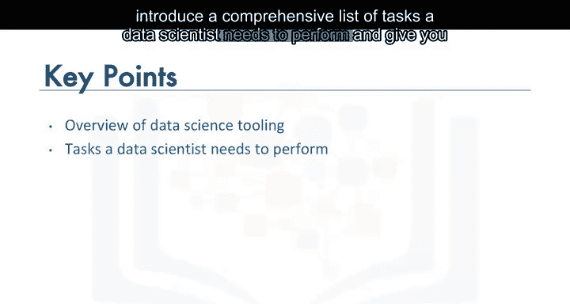

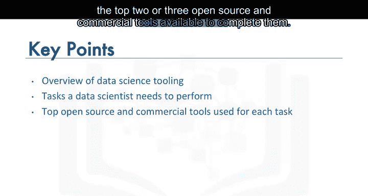

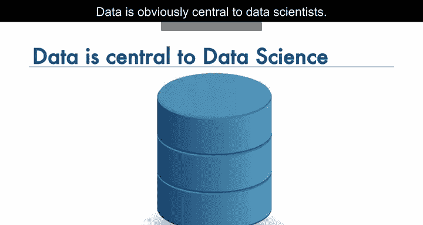

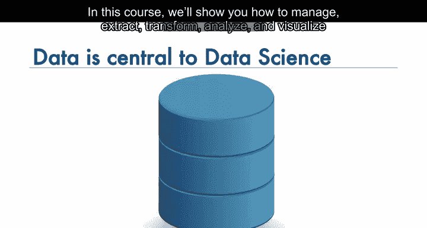

但在课程后续部分，我们将介绍数据科学家需要执行的一系列完整任务，并为您提供完成这些任务最常用的两到三种开源和商业工具。我们还会解释这些工具在功能上如何重叠、各自的优缺点，以及它们如何应对整个数据科学流程。

让我们从数据开始。数据显然是数据科学的核心。在本课程中，我们将向您展示如何管理、提取、转换、分析和可视化数据。

现在，如果您使用正确的工具集，即使没有编程技能也可能在数据科学领域生存。

然而，我们强烈建议您熟悉编程及相关的数据科学编程框架。为了帮助您，我们将向您介绍数据科学中最常用的编程语言和框架。

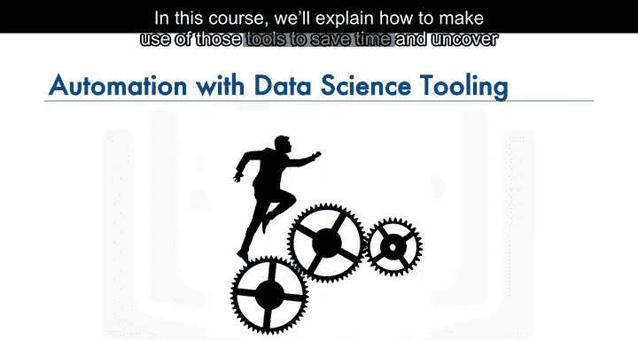

也就是说，数据科学家可以在最新的工具中使用大量自动化功能。在本课程中，我们将解释如何利用这些工具来节省时间并激发灵感。

可视化编程在许多工具中都有提供。在本课程中，您将学习如何使用可视化编程来加快开发速度，并帮助非编程人员进入数据科学领域。

开源软件正在引领数据科学领域。

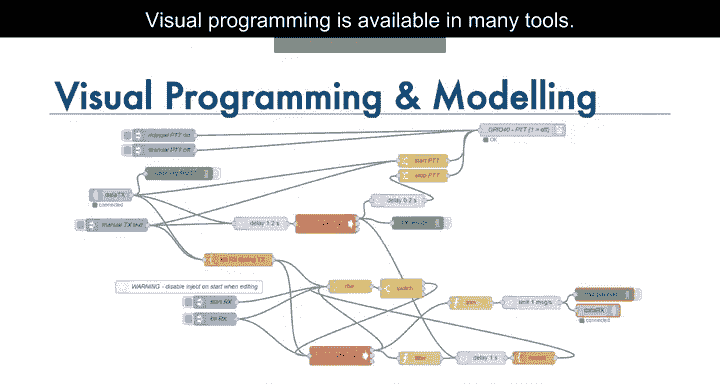

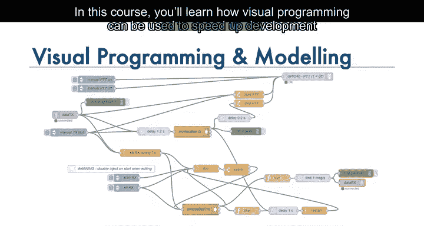

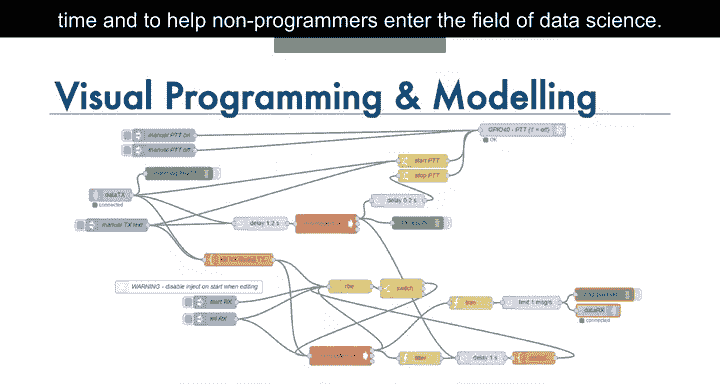

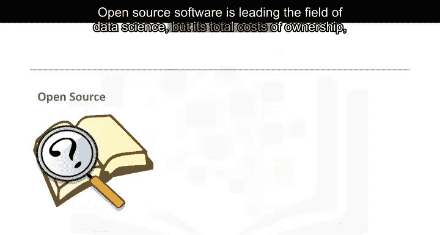

但由于配置、定制和维护成本，其总体拥有成本有时可能更高。因此，商业软件也有其用武之地。

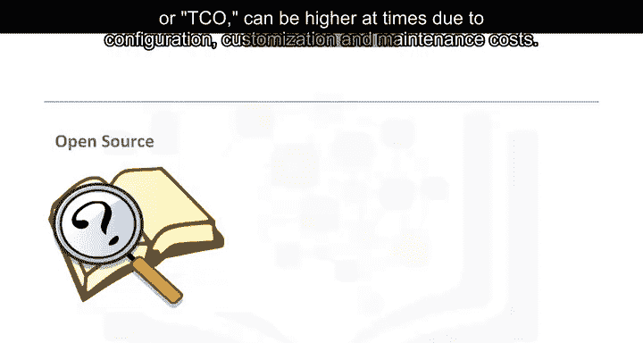

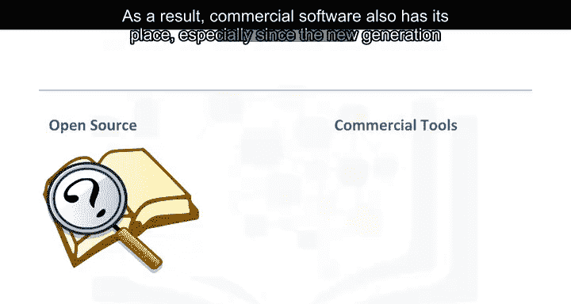

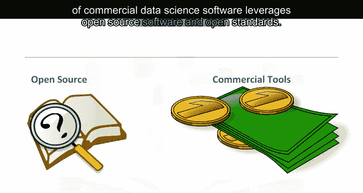

特别是新一代的商业数据科学软件利用了开源软件和开放标准。

这使得在工具之间迁移变得容易，并可以降低总体拥有成本。在本课程中，我们将向您介绍开源和商业软件，并指出它们在数据科学方面的优势和劣势。我们还将向您展示如何利用它们各自优势的方法。

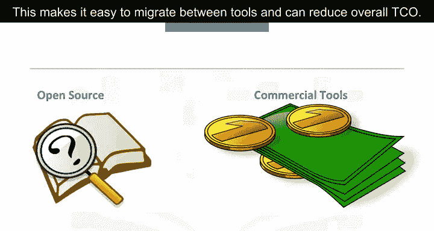

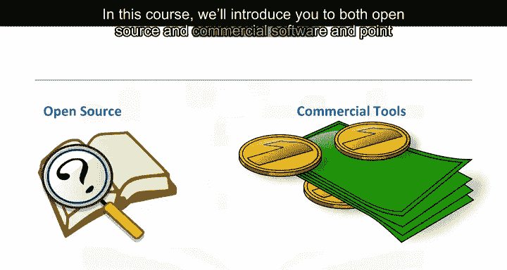

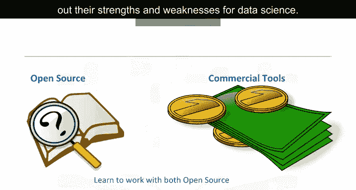

最后，我们将向您展示如何使用云计算来进一步加速和促进数据科学家的工作。除了讲座，本课程还有大量实验，让您更熟悉材料并获得实践经验。

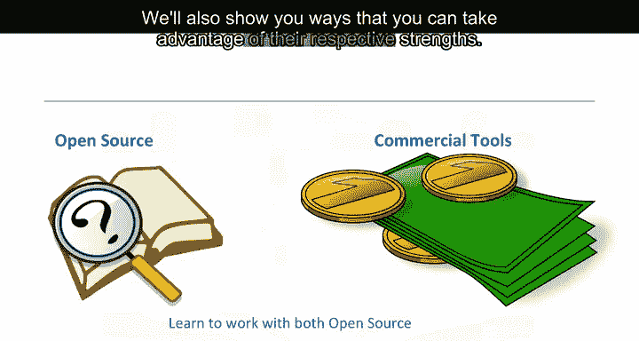

还有多个测验来测试您的学习成果。除了开始学习，别无他事。

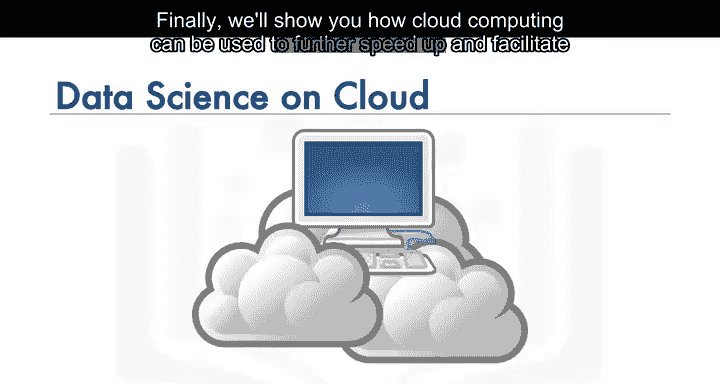

我们非常高兴在您开始数据科学之旅时有您相伴。

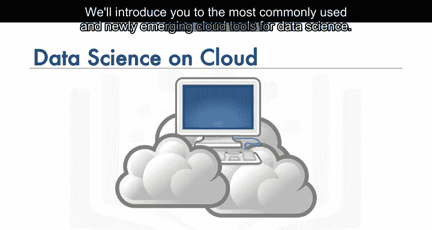

如果您在课程材料中遇到任何困难，请不要犹豫，在讨论论坛中联系我们。让我们开始吧。😊

---

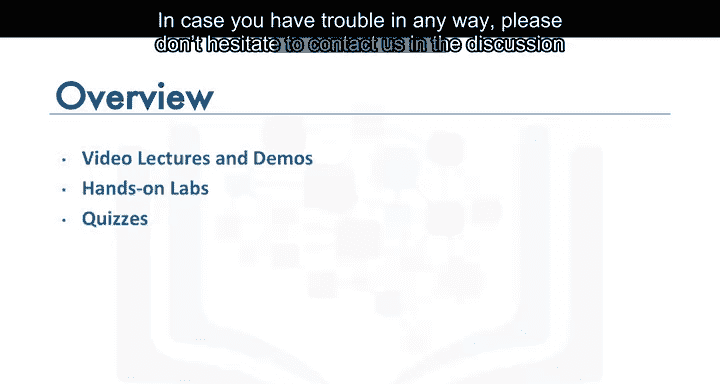

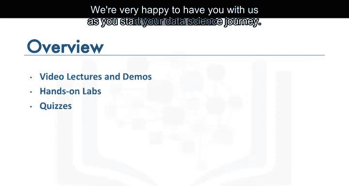

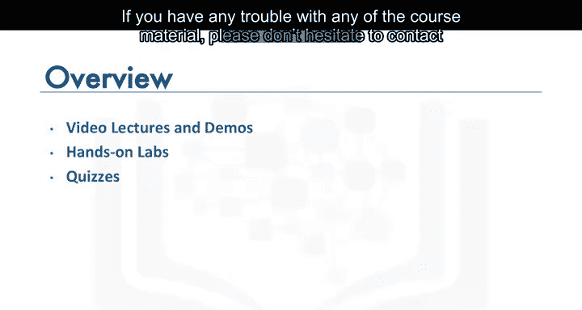

本节课中我们一起学习了数据科学工具课程的总体介绍，明确了课程将涵盖数据处理、编程工具、可视化编程、开源与商业软件对比以及云计算应用等核心模块，并了解了课程包含实验和测验的实践性特点。