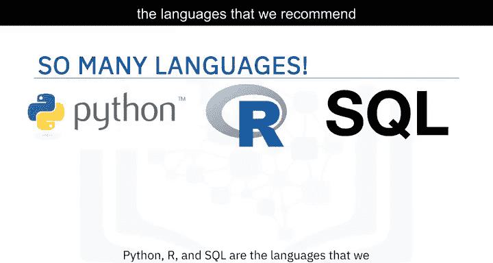
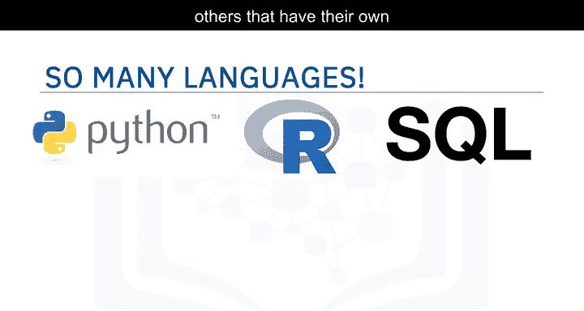
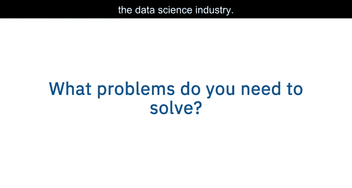
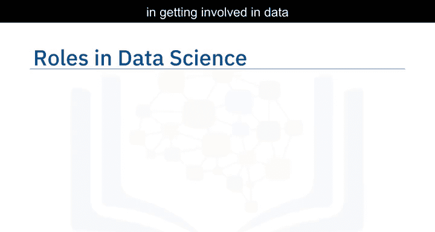
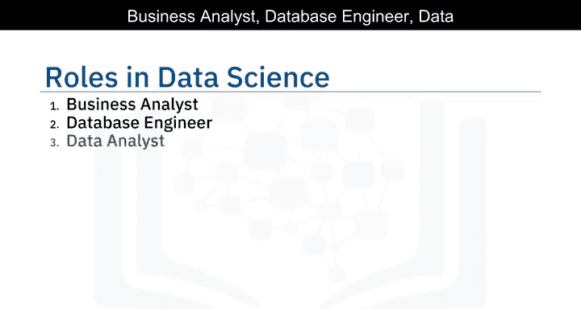
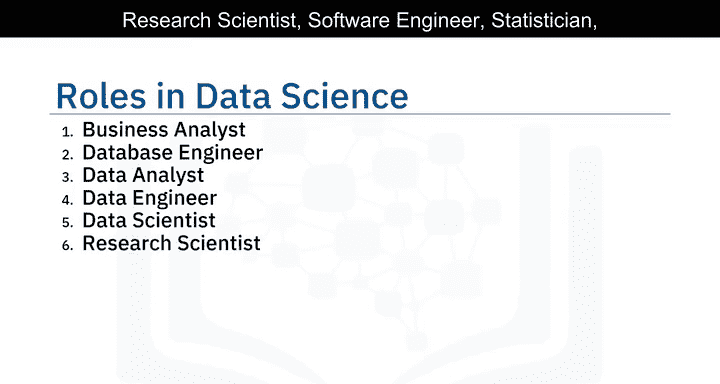
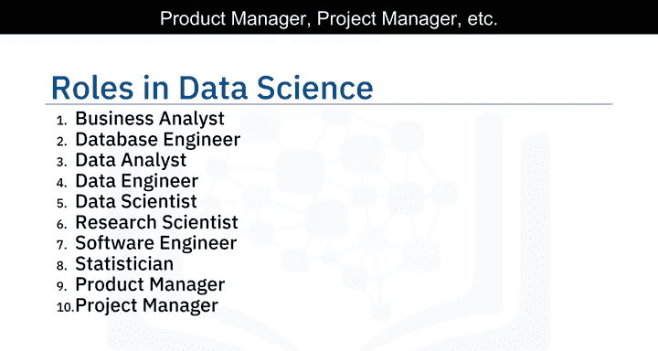
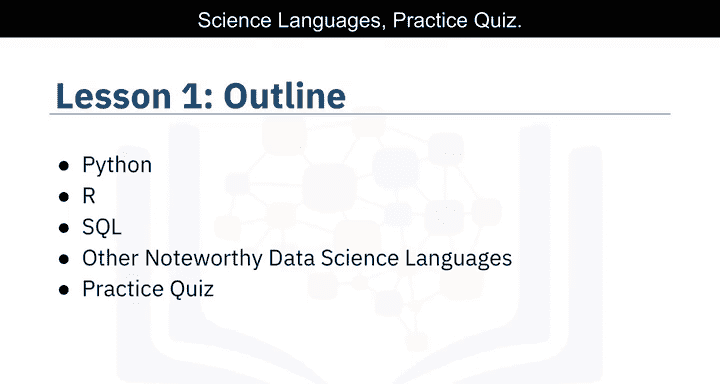

# 002：数据科学语言体系 🗣️💻

在本节课中，我们将学习数据科学领域常用的编程语言。对于刚踏上数据科学之旅的人来说，技术选项的范围可能令人不知所措。

编程语言的选择繁多，每种语言都有其自身的优势和劣势。对于“应该先学习哪种语言”这个问题，并没有一个唯一正确的答案。答案很大程度上取决于你的需求、你试图解决的问题以及你为谁解决这些问题。

我们建议你首先考虑 **Python**、**R** 和 **SQL** 这三种语言。但除此之外，还有许多其他语言也各具特色和优势。

## 语言选择的影响因素

你选择学习的语言将取决于你需要完成的任务和需要解决的问题。它还会受到你所在的公司、你的职位角色以及现有应用程序的“年龄”（技术栈新旧）的影响。

随着我们深入探讨数据科学行业的流行语言，我们将探索这个问题的答案。

## 数据科学中的角色

对于有兴趣涉足数据科学领域的人来说，有许多可用的角色，例如：业务分析师、数据工程师、数据分析师、数据科学家、研究科学家、软件工程师、统计学家、产品经理、项目经理等。

接下来，让我们深入了解第一课将要学习的内容。

## 本课内容概述

我们将把大部分重点放在三大数据科学语言上：**Python**、**R** 和 **SQL**，它们各自都有专门的课程。然后，我们将继续介绍其他值得注意的语言及其独特之处。最后，我们将以一个小测验结束。

以下是本课涵盖的内容要点：

*   **Python**
*   **R**
*   **SQL**
*   **其他值得注意的数据科学语言**
*   **练习测验**

---

本节课中，我们一起学习了数据科学领域的主要编程语言及其选择依据，并概述了课程将重点讲解的 **Python**、**R** 和 **SQL** 三大核心语言。理解这些基础是构建数据科学技能体系的重要第一步。