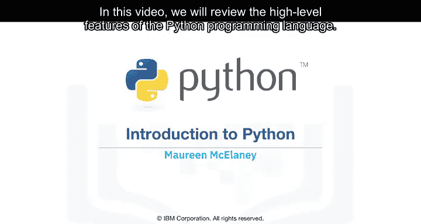
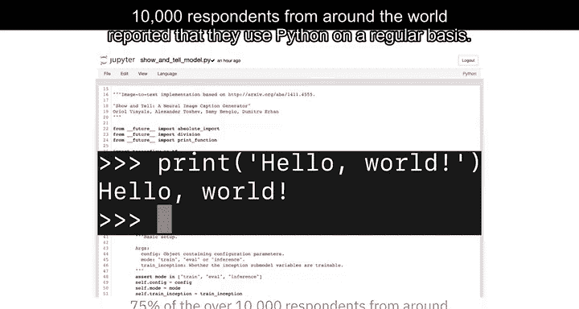
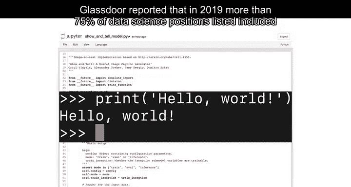
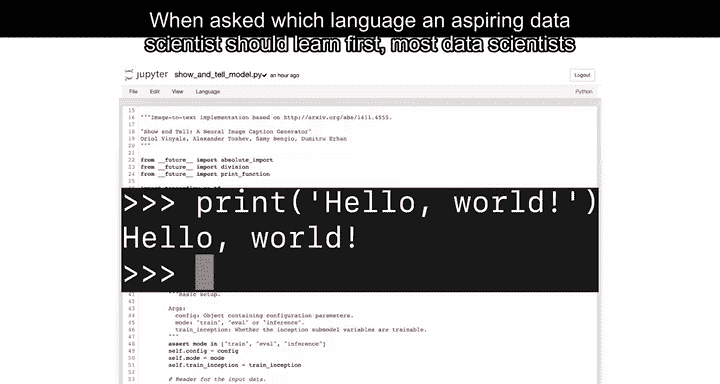
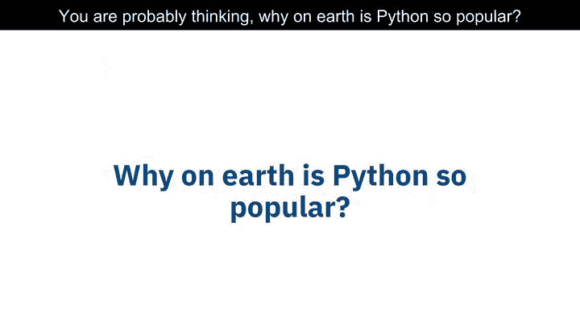
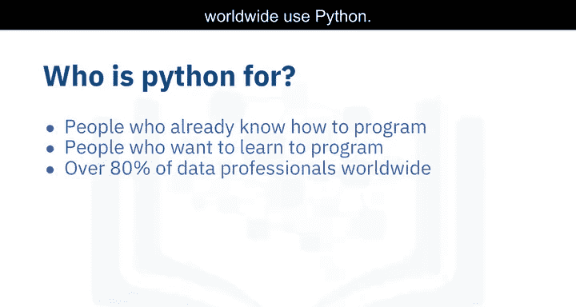
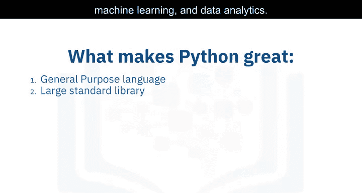
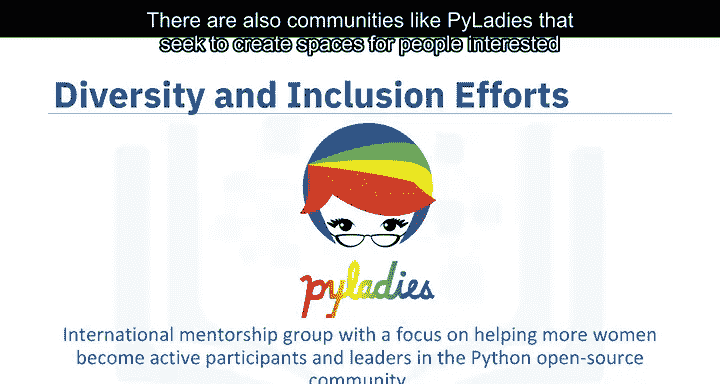
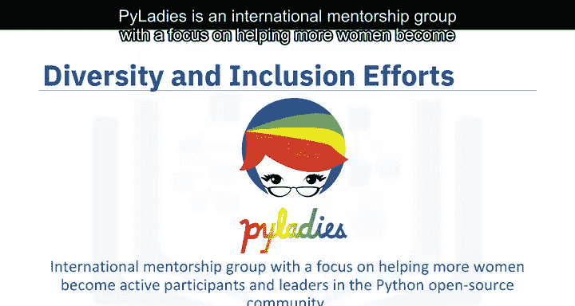

# 003：Python语言导论 🐍

在本节课中，我们将回顾Python编程语言的高级特性。

Python是一种强大的语言，它是目前数据科学领域最受欢迎的编程语言。

根据2019年Kaggle数据科学与机器学习调查报告，全球超过10,000名受访者中，75%的人表示他们定期使用Python。Glassdoor报告称，在2019年，超过75%的数据科学职位描述中都包含了Python。当被问及有抱负的数据科学家应该首先学习哪种语言时，大多数数据科学家都推荐Python。

你可能会想，Python为何如此受欢迎。让我们从Python的使用者开始了解。

如果你已经知道如何编程，那么Python非常适合你，因为它使用清晰、可读的语法。你可以在Python中完成许多在其他编程语言中习惯做的事情，但使用Python可以用更少的代码实现。

如果你想学习编程，Python也是一个极佳的入门语言，因为它拥有庞大的全球社区和丰富的文档资源。事实上，2019年的几项不同调查发现，全球超过80%的数据专业人士使用Python。

Python适用于多种场景，包括数据科学、人工智能与机器学习、Web开发以及物联网设备（如树莓派）。大量使用Python的大型组织包括IBM、维基百科、谷歌、雅虎、CERN、NASA、Facebook、亚马逊、Instagram、Spotify和Reddit。

Python是一种强大的通用编程语言，能够处理许多任务。它得到了全球社区的广泛支持，并由Python软件基金会进行管理。

Python是一种高级通用编程语言，可应用于许多不同类别的问题。它拥有一个大型标准库，提供了适合多种不同任务的工具，包括但不限于数据库、自动化、网络爬虫、文本处理、图像处理、机器学习以及数据科学的数据分析。

对于数据科学，你可以使用Python的科学计算库，例如：
*   **pandas**
*   **NumPy**
*   **SciPy**
*   **Matplotlib**

对于人工智能，它拥有：
*   **TensorFlow**
*   **PyTorch**
*   **Keras**
*   **scikit-learn**

Python也可用于自然语言处理，使用**自然语言工具包**。

Python社区的另一个巨大优势在于，它在整个科技行业推动多样性和包容性方面有着良好记录。Python语言由Python软件基金会执行行为准则，旨在确保所有在线和线下Python社区的安全与包容。此外，还有像**PyLadies**这样的社区，致力于为对Python感兴趣的人们创造安全、包容的学习环境。PyLadies是一个国际性的导师组织，专注于帮助更多女性成为Python开源社区的积极参与者和领导者。

---

本节课中，我们一起学习了Python编程语言的核心优势、广泛应用领域及其强大的社区生态。我们了解到Python因其简洁的语法、丰富的库和包容的社区，成为了数据科学和众多技术领域的首选语言。