# 004：R语言导论

在本节课中，我们将对R编程语言进行简要概述。上一节我们介绍了Python及其广泛应用，你可能会疑惑为何还需要学习其他语言。本节将阐述学习R语言的价值、其核心特性以及适用场景。

## 🔍 为何学习R语言？

根据2019年Kaggle数据科学调查（覆盖全球超10000名受访者），掌握最多三种编程语言有助于提升薪资水平。R语言在此方面具有显著优势。

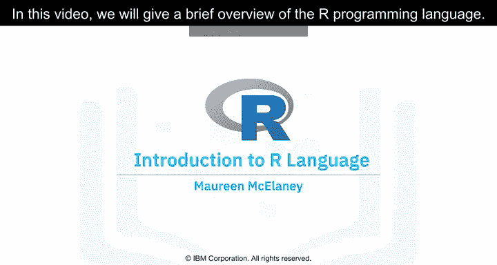

与Python类似，R可免费使用。但R并非开源项目，而是**自由软件**。那么，开源软件与自由软件有何区别？

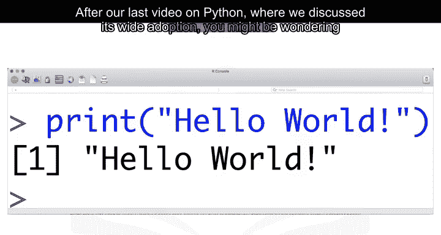

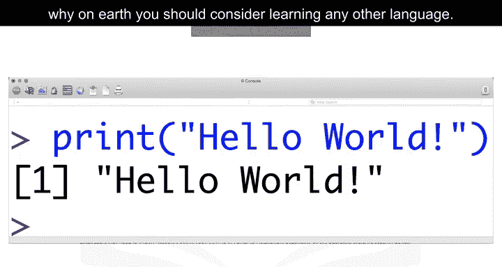

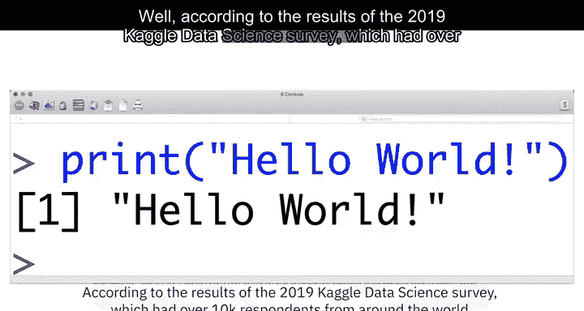

*   **开源软件**与**自由软件**通常指代同一组许可证，许多开源项目使用GNU通用公共许可证。
*   两者均支持协作，多数情况下可互换使用，但侧重点不同：
    *   **开源倡议组织**倡导开源，更关注商业应用。
    *   **自由软件基金会**定义自由软件，更强调价值观与用户自由。

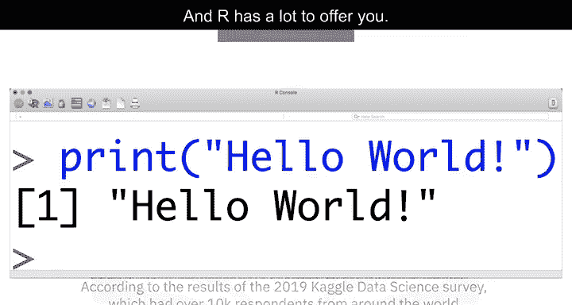

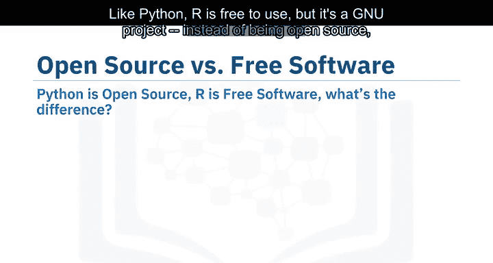

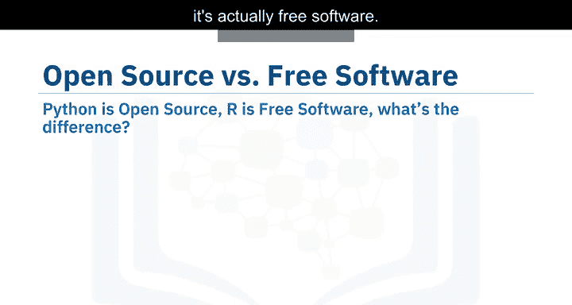

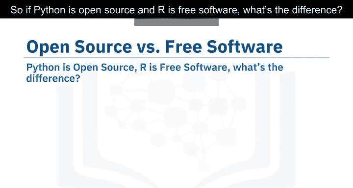

回到学习R的原因：作为自由软件项目，R允许你以贡献开源项目的方式使用语言，支持公开协作及私人与商业用途。此外，R拥有一个广泛的全球社区，社区成员热衷于使用该语言解决重大问题。

## 👥 R语言适合谁？

R最常被统计学家、数学家及数据挖掘人员用于开发统计软件、绘图和数据分析。其**面向数组的语法**便于将数学公式转化为代码，尤其适合编程背景薄弱或零基础的学习者。

根据Kaggle数据科学与机器学习调查，多数人在数据科学职业生涯数年后再学习R，但它对无软件编程背景者依然友好。

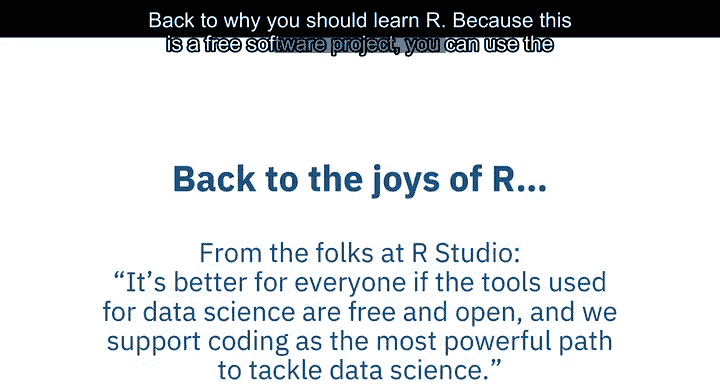

## 🏢 R语言的应用领域

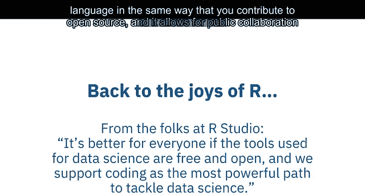

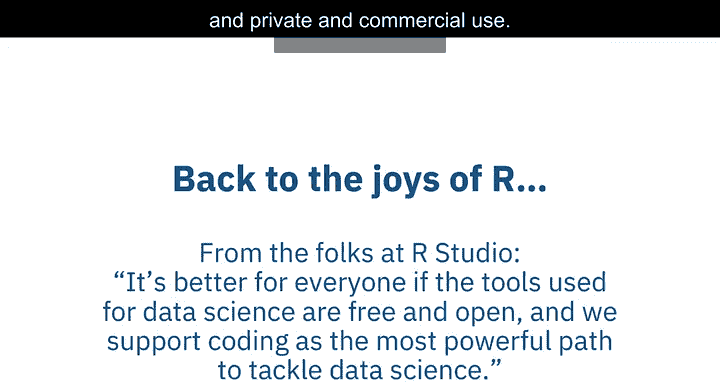

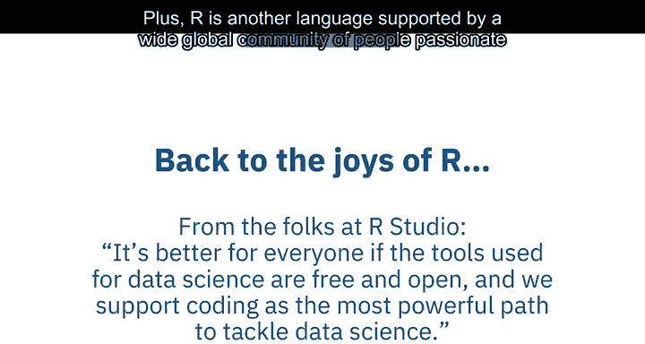

R在学术界颇受欢迎，同时也被众多企业采用，包括：
*   IBM
*   Google
*   Facebook
*   Microsoft
*   美国银行
*   福特
*   TechCrunch
*   Uber
*   Trulia

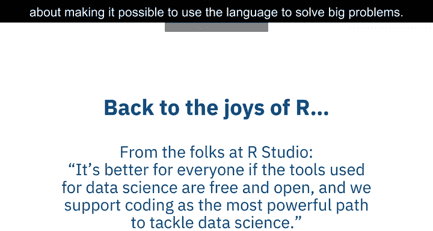

截至2018年，R已成为全球最大的统计知识库，拥有超过**15,000个公开可用的软件包**，使得进行复杂的探索性数据分析成为可能。

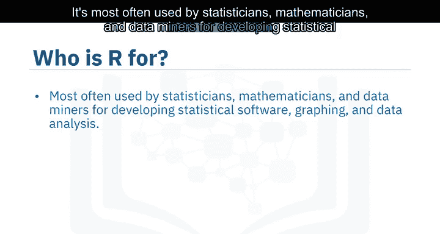

## 🔗 R语言的集成与特性

R能良好集成其他编程语言，例如：
*   C++
*   Java
*   C
*   .NET
*   Python

常见的数学运算（如矩阵乘法）可开箱即用。相较于大多数统计计算语言，R具备更强大的**面向对象编程功能**。

## 🌐 加入R语言社区

有多种方式可以连接全球的R语言用户：
*   **useR!** 会议
*   **SatRdays** 活动
*   **RLadies** 社区

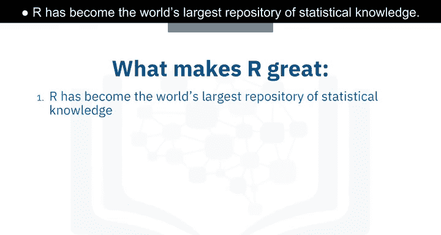

你也可访问R项目官网，查找相关的R会议与活动信息。

---

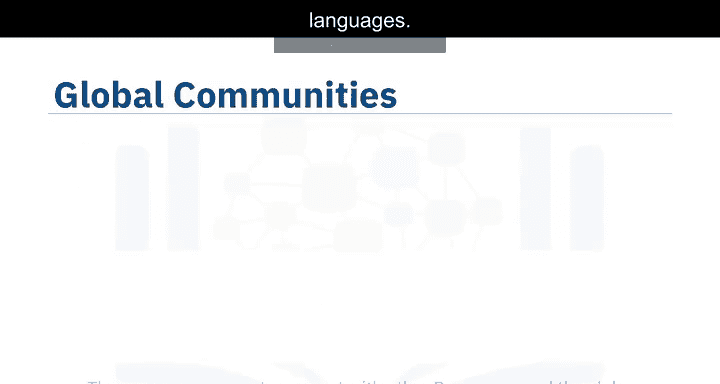

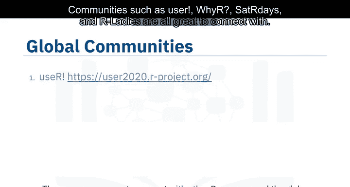

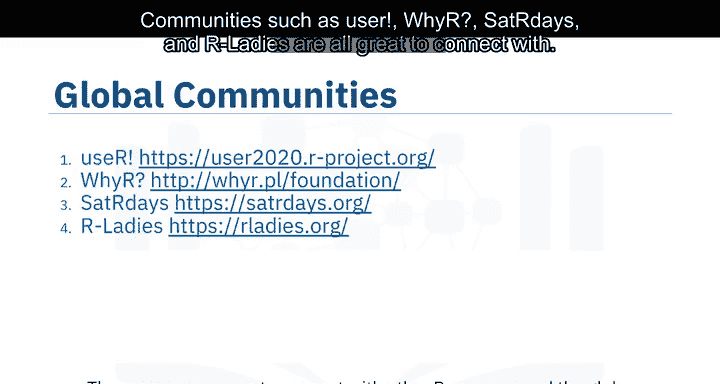

本节课中，我们一起学习了R语言的核心价值、适用人群、应用场景、技术特性及社区资源。理解R作为自由软件的特点及其在数据科学领域的独特优势，将帮助你在技术选型和学习路径上做出更明智的决策。