# 005：SQL语言导论

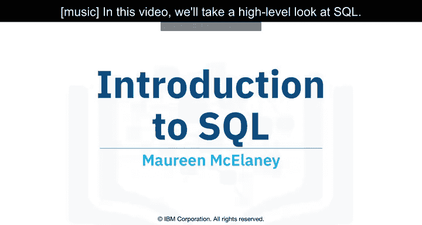

在本节课中，我们将从宏观层面了解SQL语言。SQL是数据科学领域一项基础且强大的工具，掌握它对于处理和分析结构化数据至关重要。

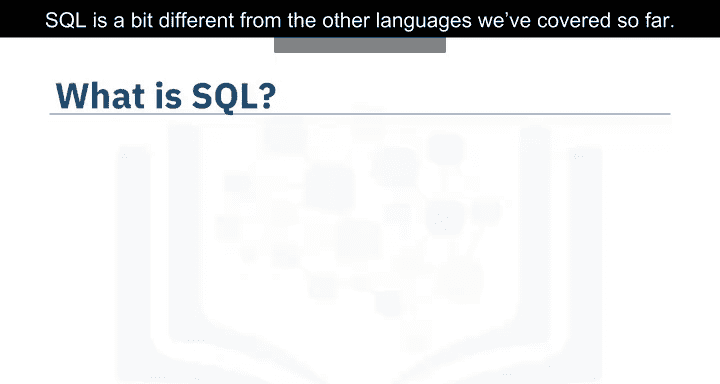

## 🗣️ SQL的发音与含义

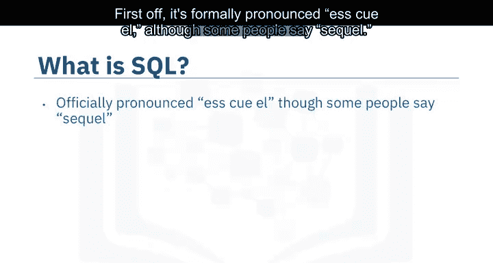

上一节我们介绍了课程概述，本节中我们来看看SQL的基本概念。SQL的发音存在两种常见读法：`SQL` 或 `SQL`。

其全称为 **结构化查询语言**。许多人并不将其视为典型的软件开发语言，因为它是一种**非过程化语言**，其主要作用范围仅限于查询和管理数据。

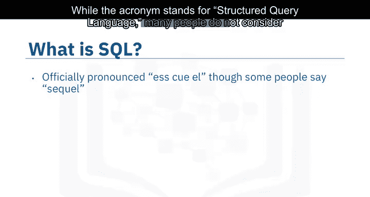

## 🔍 SQL在数据科学中的角色

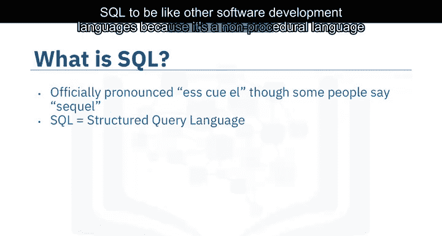

尽管SQL本身并非专为数据科学设计的语言，但由于其简单性和强大功能，数据科学家经常使用它。

关于SQL还有几个有趣的事实：它比Python和R语言早了大约20年，首次出现于1974年，并且是由IBM公司开发的。

## 🗃️ SQL与结构化数据

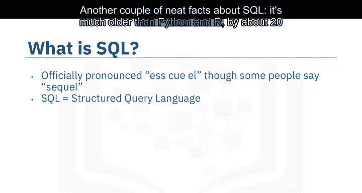

SQL主要用于处理**结构化数据**，即包含实体和变量之间关系的数据。它专为管理关系型数据库中的数据而设计。

下图展示了一个关系型数据库的通用结构：

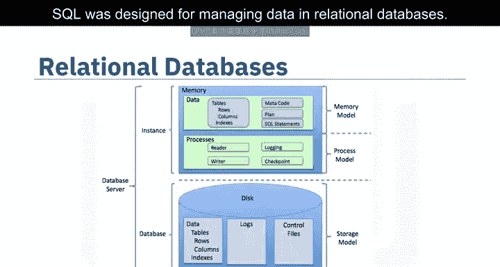

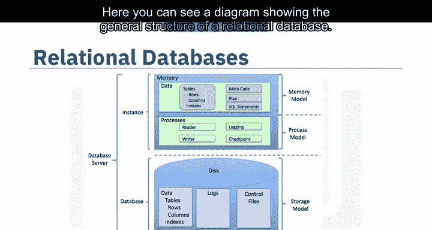

一个关系型数据库由多个二维表集合构成，例如数据表和Microsoft Excel电子表格。

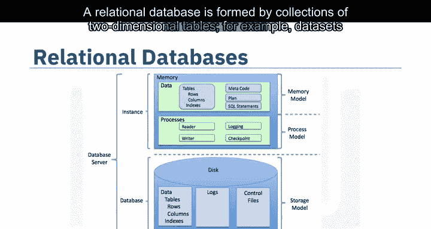

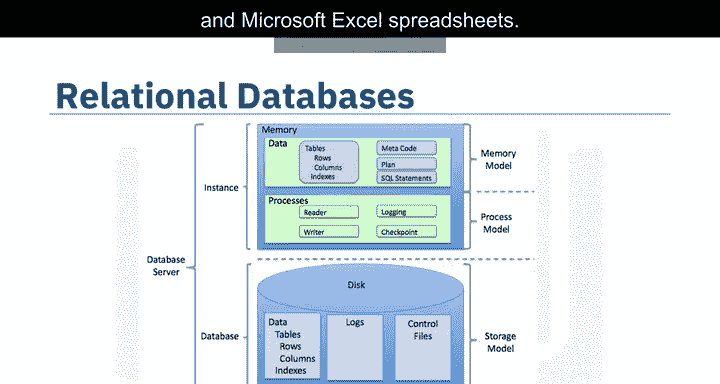

这些表格中的每一个都由固定数量的列和任意数量的行组成。

## 🌐 SQL的广泛应用

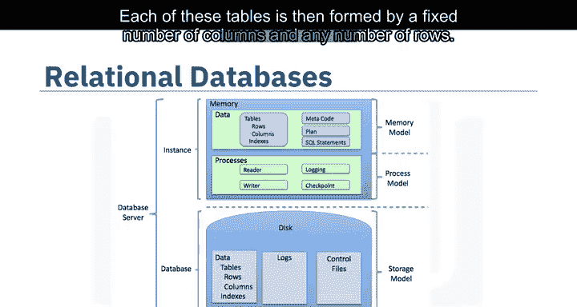

尽管SQL最初是为关系型数据库开发的，但由于其普及性和易用性，许多NoSQL和大数据存储库也开发了SQL接口。

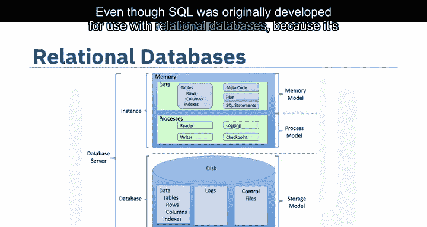

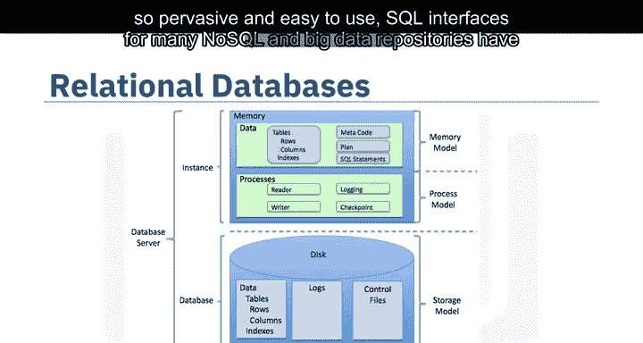

SQL语言可细分为多种语言元素，包括：
*   子句
*   表达式
*   谓词
*   查询
*   语句

## ⚡ SQL的优势

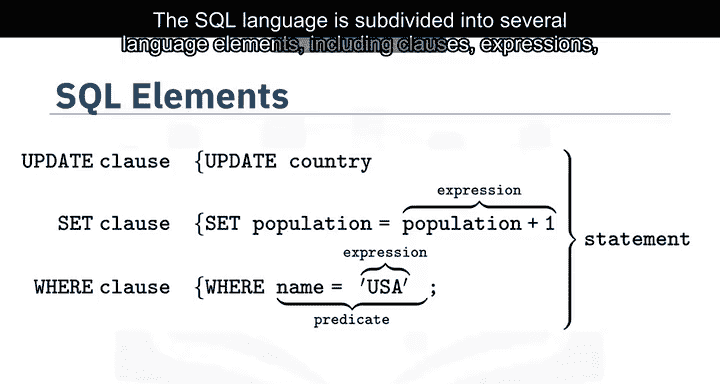

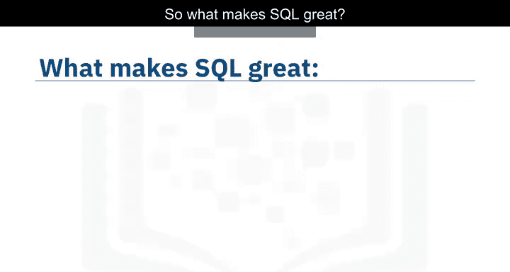

那么，SQL的强大之处体现在哪里呢？

以下是掌握SQL能带来的主要好处：

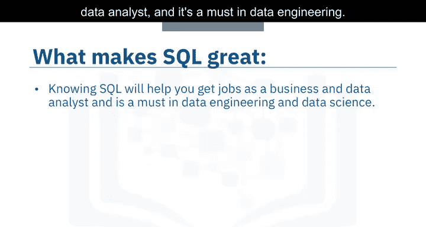

*   **职业发展**：掌握SQL将帮助您胜任数据科学领域的许多不同工作，包括商业分析师和数据分析师，并且它是数据工程领域的必备技能。
*   **高效操作**：使用SQL执行操作时，您可以直接访问数据，无需事先复制。这可以显著加快工作流的执行速度。
*   **通用标准**：SQL是您与数据库之间的解释器。它是一项美国国家标准协会标准，这意味着如果您学会SQL并在一个数据库中使用它，您将能够轻松地将该SQL知识应用到许多其他数据库上。

## 🗄️ 常见的SQL数据库

市面上有许多不同的SQL数据库可用，以下是部分主流选择：

*   MySQL
*   IBM DB2
*   PostgreSQL
*   Apache OpenOffice Base
*   Oracle
*   MariaDB
*   Microsoft SQL Server

您所编写的SQL语法可能会根据您使用的关系数据库管理系统而略有变化。

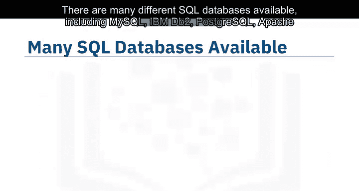

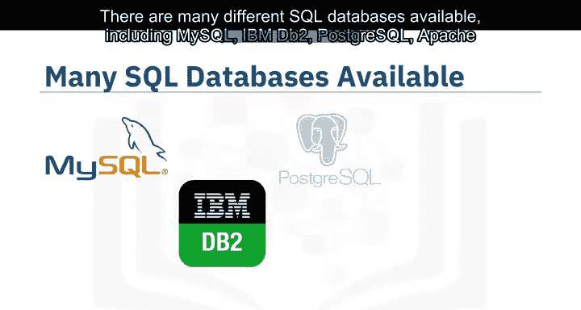

## 🎯 学习SQL的建议

如果您打算学习SQL，最好的方法可能是专注于一个特定的关系数据库，然后融入该特定平台的社区。目前有许多优秀的SQL入门课程可供选择。

---

本节课中我们一起学习了SQL语言的基本概况。我们了解了它的发音、含义、在数据科学中的重要性，以及它作为处理结构化数据的标准工具的核心优势。SQL是与数据库交互的通用桥梁，是数据领域从业者的关键技能之一。