# 006：其他编程语言概述

在本节课中，我们将学习除了Python、R和SQL之外，其他在数据科学领域有重要应用价值的编程语言。我们将简要介绍每种语言的特点及其在数据科学中的典型工具或应用。

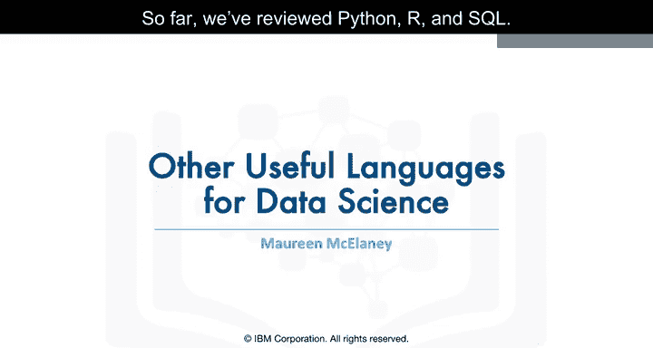

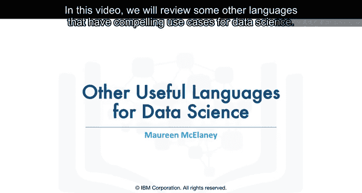

到目前为止，我们已经回顾了Python、R和SQL。

在本视频中，我们将回顾一些其他在数据科学领域具有引人注目用例的语言。

无可争议，Python、R和SQL是数据科学家最常用的三种语言。

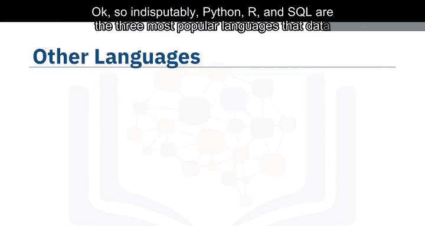

但在考虑使用哪种语言来解决特定的数据科学问题时，还有许多其他语言值得你花时间去了解。

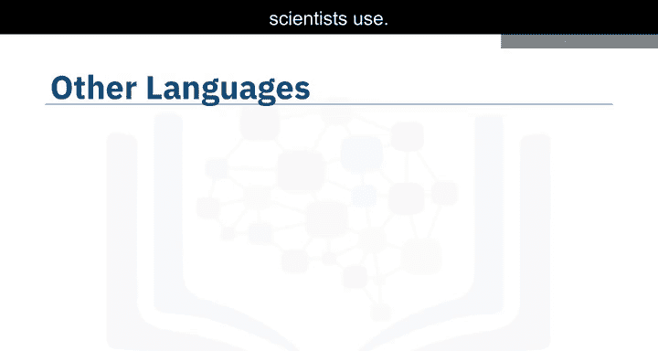

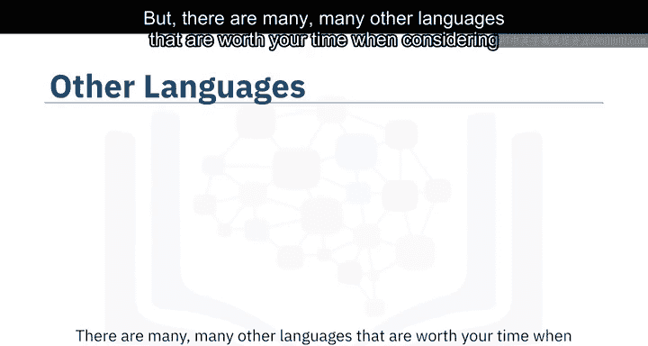

以下是几种值得关注的其他编程语言及其简要介绍。

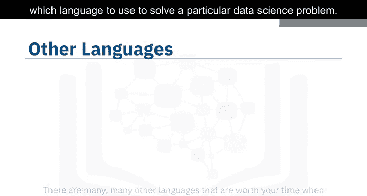

*   Scala、Java、C++和Julia可能是本幻灯片中最传统的数据科学语言。
*   JavaScript、PHP、Go、Ruby、Visual Basic等语言也在数据科学社区中找到了各自的位置。

我不会深入探讨每一种语言，但会提及一些显著的亮点。

## ☕ Java

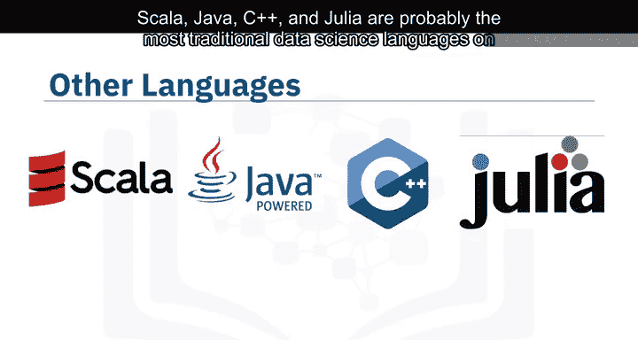

上一节我们介绍了多种语言，本节我们先来看看Java。

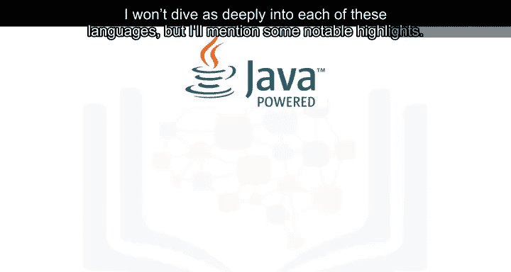

Java是一种久经考验的通用、面向对象编程语言。

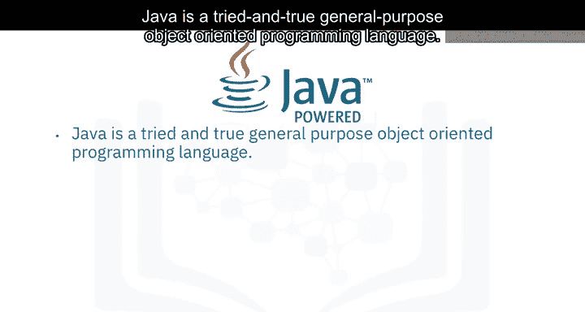

它已在企业领域被广泛采用，其设计目标是快速和可扩展。

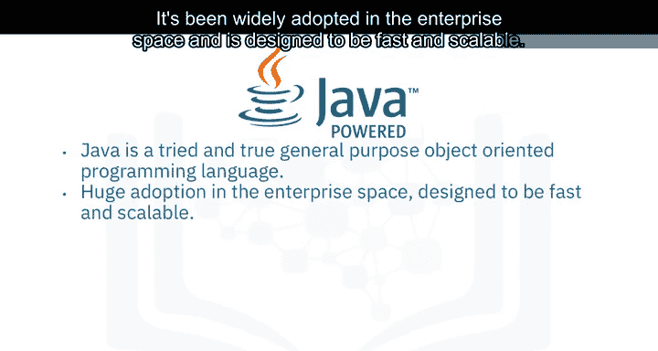

Java应用程序被编译成字节码，并在Java虚拟机（JVM）上运行。

以下是一些用Java构建的著名数据科学工具。

*   **Weka**：用于数据挖掘。
*   **Java-ML**：一个机器学习库。
*   **Apache MLlib**：使机器学习可扩展。
*   **Deeplearning4J**：用于深度学习。

Apache Hadoop是另一个用Java构建的应用程序，它为在集群系统上运行的大数据应用程序管理数据处理和存储。

## 🚀 Scala

接下来，我们看看Scala。

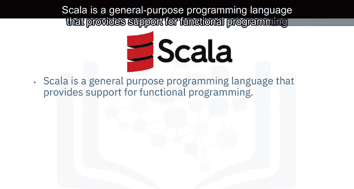

Scala是一种通用编程语言，支持函数式编程并具有强大的静态类型系统。

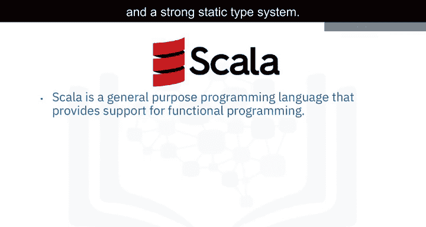

Scala语言构建中的许多设计决策都是为了解决对Java的批评。

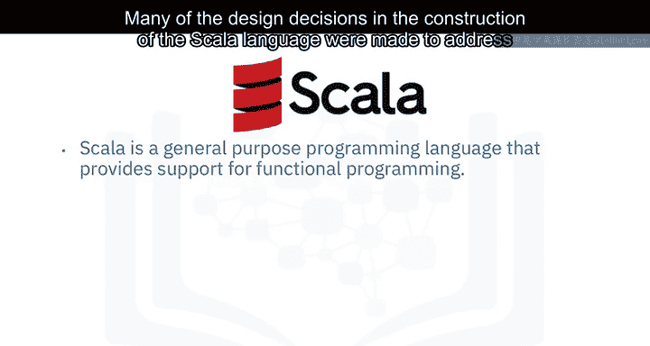

Scala也可以与Java互操作，因为它运行在JVM上。

Scala这个名字是“可扩展的”（scalable）和“语言”（language）的组合。这门语言旨在随着用户需求的发展而成长。

对于数据科学，使用Scala构建的最流行的程序是**Apache Spark**。

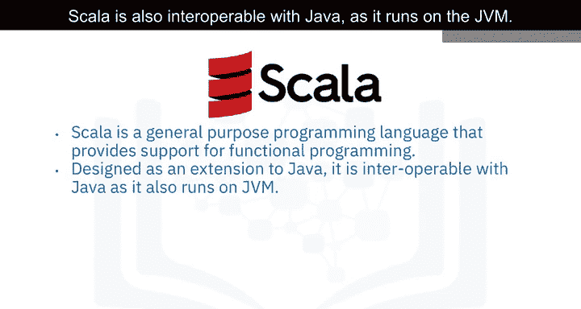

Spark是一个快速、通用的集群计算系统。它提供了易于编写并行作业的API，以及支持通用计算图的优化引擎。

Spark包含以下组件。

*   **Shark**：一个查询引擎。
*   **MLlib**：用于机器学习。
*   **GraphX**：用于图处理。
*   **Spark Streaming**：用于流处理。

Apache Spark的设计目标是比Hadoop更快。

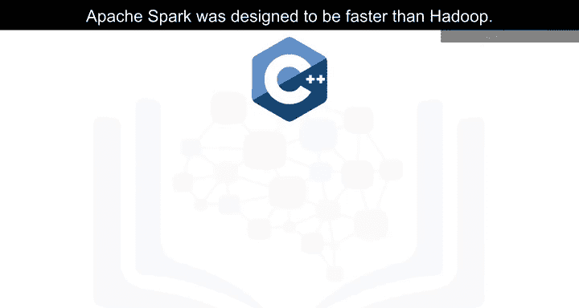

## ⚙️ C++

现在，我们来了解C++。

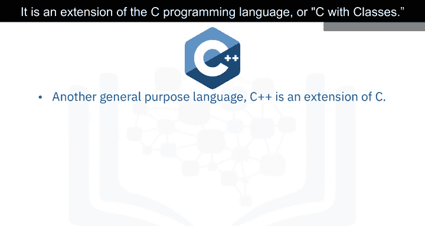

C++是一种通用编程语言，它是C编程语言的扩展，或者说“带类的C”。

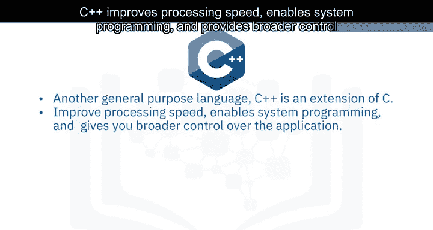

C++提高了处理速度，支持系统编程，并提供了对软件应用程序更广泛的控制。

许多使用Python或其他高级语言进行数据分析和探索性任务的组织，仍然依赖C++来开发向客户实时提供这些数据的程序。

在数据科学领域，一个流行的用于数据流的深度学习库**TensorFlow**就是用C++构建的。

但需要注意的是，虽然C++是TensorFlow的基础，但它通过Python接口运行，因此你不需要懂C++就能使用它。

以下是其他用C++构建的数据科学相关工具。

*   **MongoDB**：一个用于大数据管理的NoSQL数据库。
*   **Caffe**：一个深度学习算法库，用C++构建，带有Python和MATLAB绑定。

## 🌐 JavaScript

JavaScript是万维网的一项核心技术，它是一种通用语言，随着Node.js和其他服务器端方法的创建，其应用已超越浏览器。JavaScript与Java语言无关。

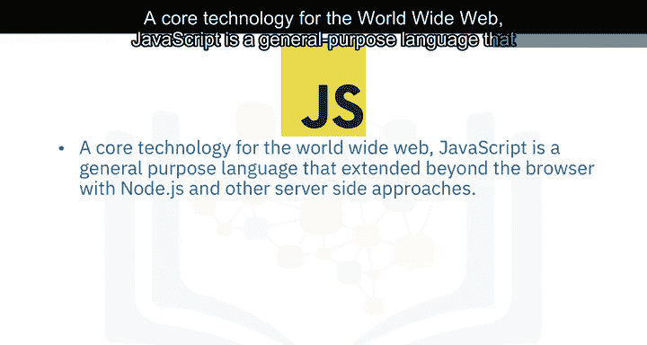

对于数据科学，最流行的实现无疑是**TensorFlow.js**。

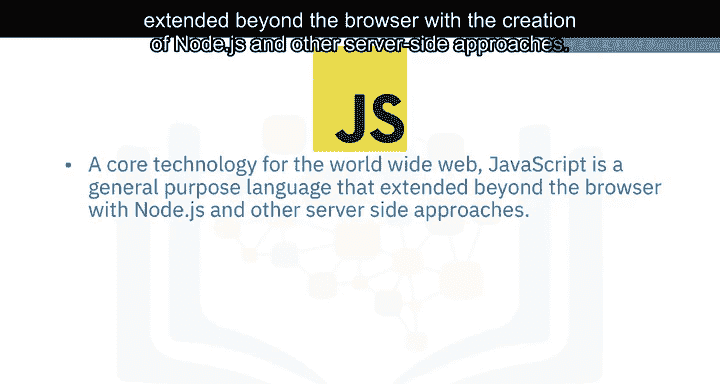

TensorFlow.js使得在Node.js以及浏览器中进行机器学习和深度学习成为可能。

TensorFlow.js也被其他开源库采用，包括Brain.js和MachineLearn.js。

**RJS项目**是JavaScript在数据科学领域的另一个重要实现。

RJS将R语言的线性代数规范用TypeScript重写。这次重写将为其他项目实现更强大的基于数学的框架（如Python的NumPy和SciPy）奠定基础。

TypeScript是JavaScript的超集。

## ⚡ Julia

最后，我们介绍Julia。

Julia由麻省理工学院设计，用于高性能数值分析和计算科学。

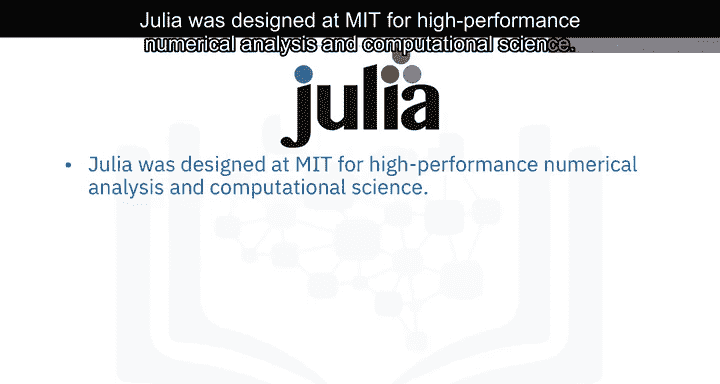

它在提供像Python或R一样的快速开发体验的同时，能生成运行速度与C或Fortran程序相媲美的程序。

Julia是编译型语言，这意味着代码作为可执行代码直接在处理器上执行。

它可以调用C、Go、Java、MATLAB、R、Fortran和Python的库，并具有精细的并行处理能力。

Julia语言相对较新，于2012年编写，但它对数据科学行业未来的影响很有前景。

**JuliaDB**是Julia在数据科学中一个特别有用的应用。它是一个用于处理大型、持久数据集的包。

## 📝 总结

本节课中，我们一起学习了多种用于解决数据科学问题的其他编程语言。

我们对Java、Scala、C++、JavaScript和Julia的特点及其在数据科学中的关键工具或应用进行了概述。

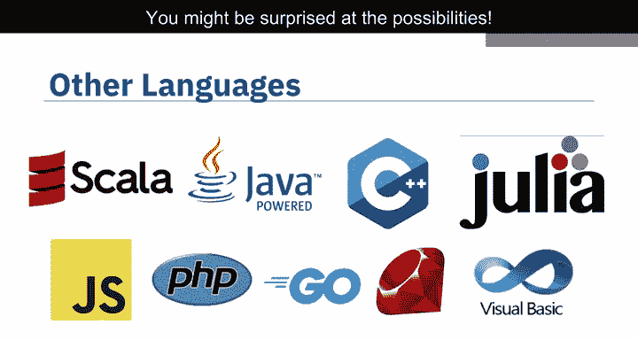

如果你对某种特定语言有经验，建议你进行网络搜索，看看它在数据科学方面可能已经实现了哪些功能。你可能会对它的可能性感到惊讶。