# 007：数据科学工具分类 📊

在本节课中，我们将学习数据科学工作流中涉及的不同任务类别，并了解为这些任务设计的开源工具。理解这些分类是后续选择和使用具体工具的基础。

开源工具可用于各种数据科学任务。在本视频中，我们将了解不同的数据科学任务。在后续的视频中，我们将逐一介绍用于这些任务的最常用开源工具。本课程将涵盖最重要的工具。

---

## 数据管理 💾

数据管理是持久化存储和检索数据的过程。

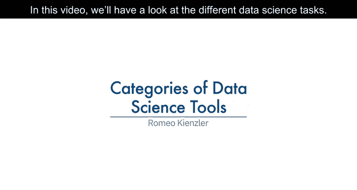
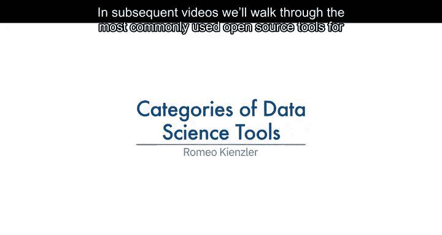
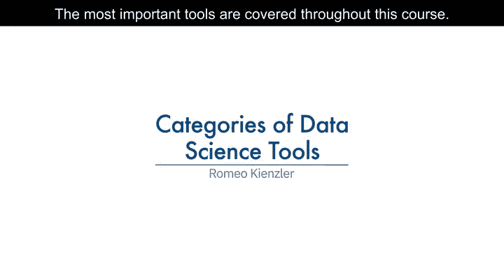
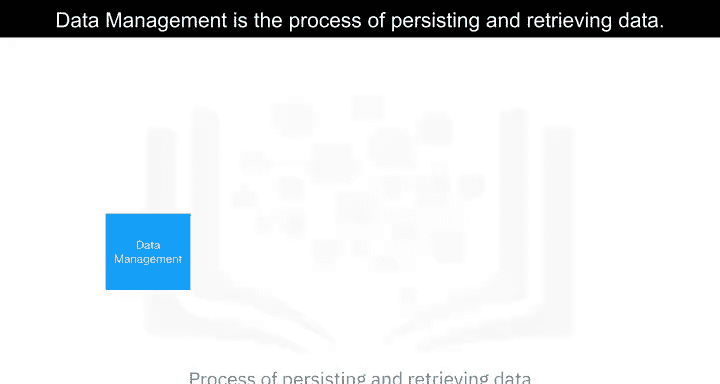

---

## 数据集成与转换 🔄

上一节我们介绍了数据管理，本节中我们来看看如何处理来自不同源头的数据。数据集成与转换，通常被称为**提取、转换、加载（ETL）**，是从远程数据管理系统检索数据、转换数据并将其加载到本地数据管理系统的过程。

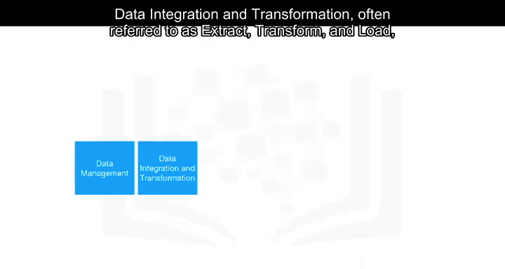
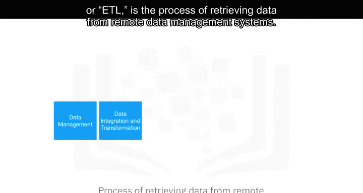
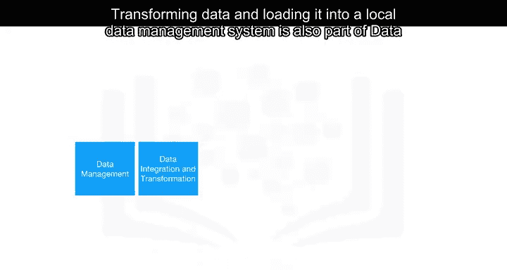
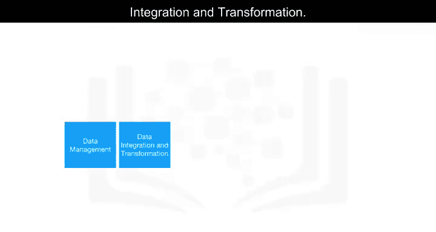

---

## 数据可视化 📈

数据可视化既是初始数据探索过程的一部分，也是最终交付成果的一部分。

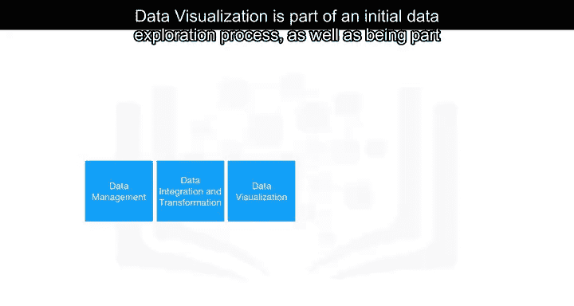

---

## 模型构建 🤖

了解了如何探索和呈现数据后，下一步是构建预测模型。模型构建是使用大量数据和合适的算法创建机器学习或深度学习模型的过程。

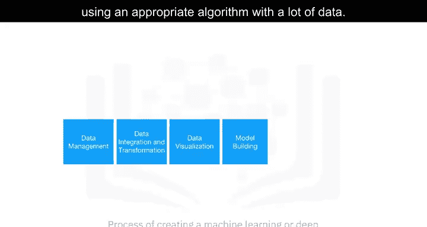

---

## 模型部署 🚀

模型构建完成后，需要将其投入使用。模型部署使这样的机器学习或深度学习模型可供第三方应用程序使用。

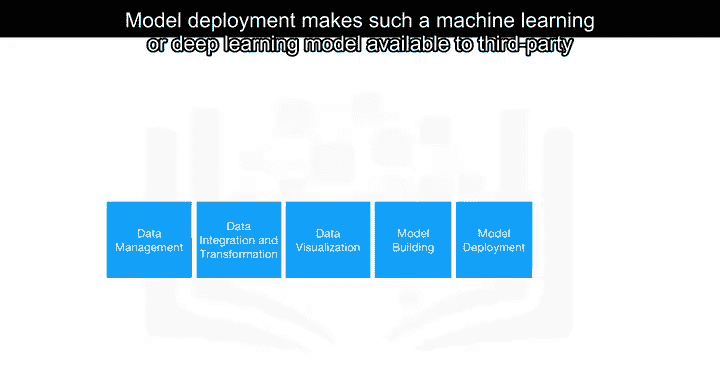
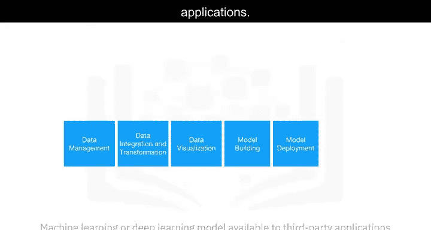

---

## 模型监控与评估 👁️

模型部署后，工作并未结束。模型监控与评估确保对已部署模型进行持续的性能质量检查。这些检查针对**准确性、公平性和对抗鲁棒性**。

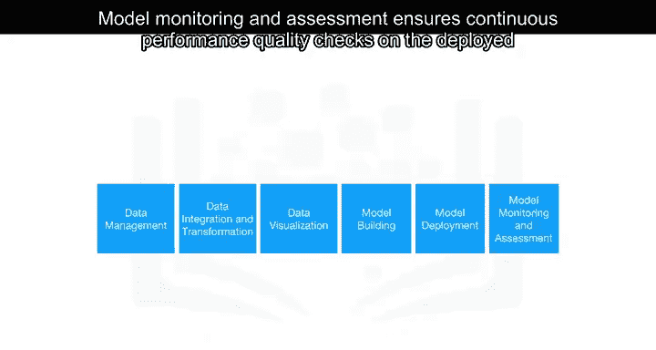
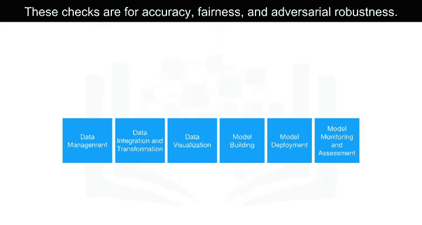

---

## 代码资产管理 📁

除了模型本身，管理产生模型的代码同样重要。代码资产管理利用版本控制和其他协作功能来促进团队合作。

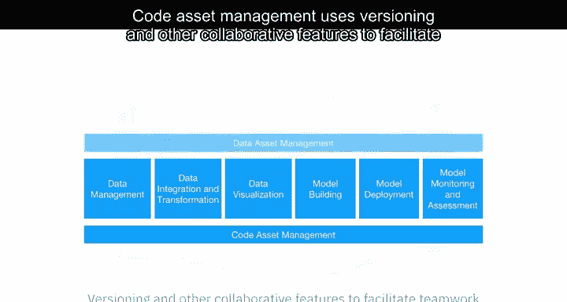

---

## 数据资产管理 🗃️

与代码类似，数据本身也需要妥善管理。数据资产管理还支持复制、备份和访问权限管理。

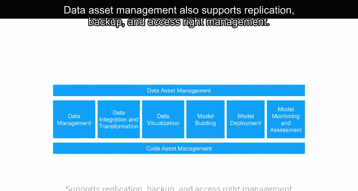

---

## 开发环境 🛠️

要进行有效的开发，我们需要合适的工具。开发环境，通常称为集成开发环境（IDE），是帮助数据科学家实现、执行、测试和部署其工作的工具。

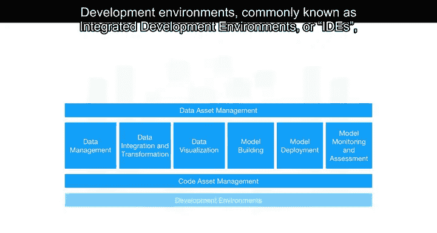
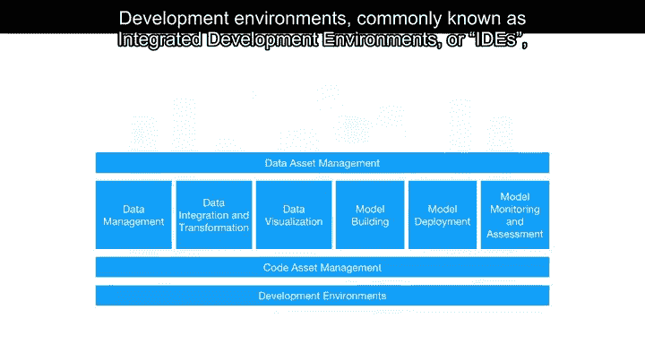
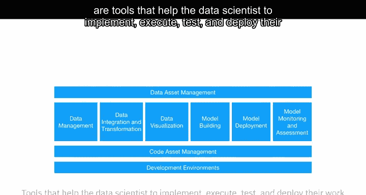

---

## 执行环境 ⚙️

开发完成后，代码需要在特定的环境中运行。执行环境是进行数据处理、模型训练和部署的工具。

---

## 全集成可视化工具 🎨

最后，还有可用的全集成可视化工具，它们部分或完全覆盖了之前的所有工具组件。

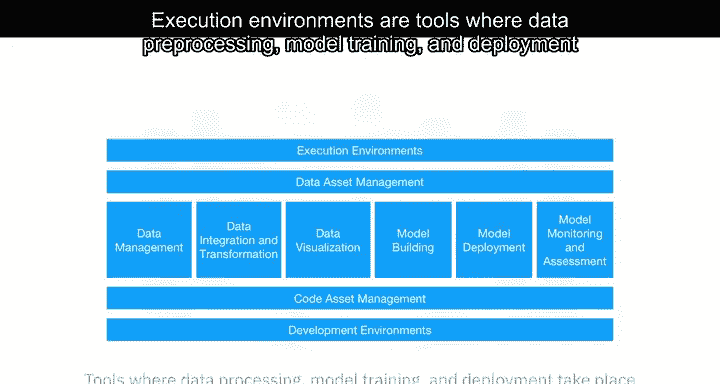

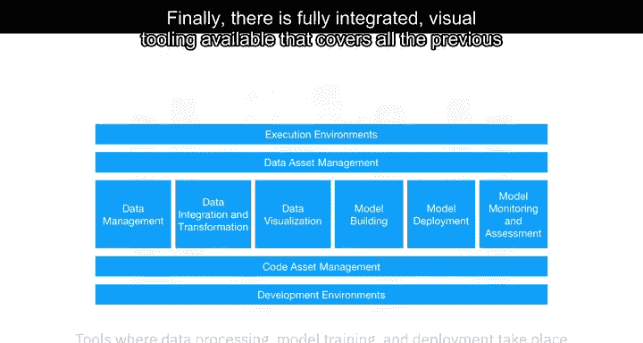
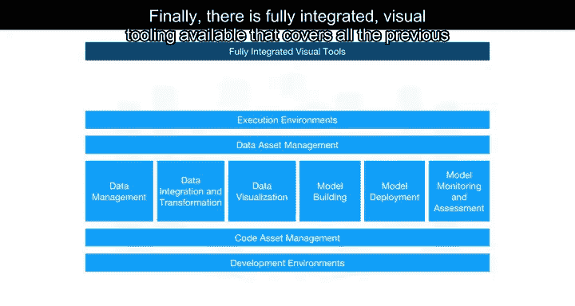

---

## 总结

本节课中我们一起学习了数据科学工作流的十大核心任务类别：**数据管理、数据集成与转换（ETL）、数据可视化、模型构建、模型部署、模型监控与评估、代码资产管理、数据资产管理、开发环境（IDE）以及执行环境**。理解这些分类是系统化掌握数据科学工具的第一步。

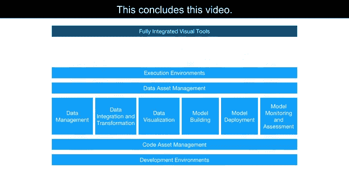

本视频到此结束。在下一个视频中，我们将开始研究用于数据科学任务的开源工具。

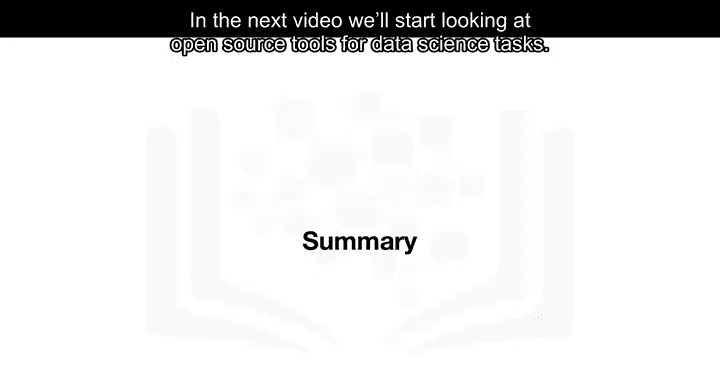

