# 008：开源数据科学工具（上）

在本节课中，我们将学习开源数据科学工具的第一部分内容。我们将涵盖数据管理、数据集成与转换、数据可视化、模型部署与监控，以及代码与数据资产管理等核心领域。通过了解这些工具，你可以为构建完整的数据科学工作流打下基础。

## 数据管理工具 🗄️

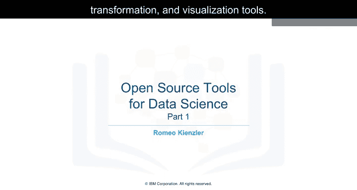

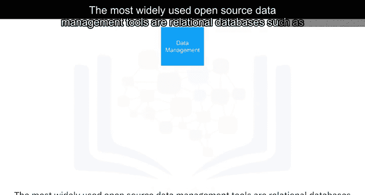

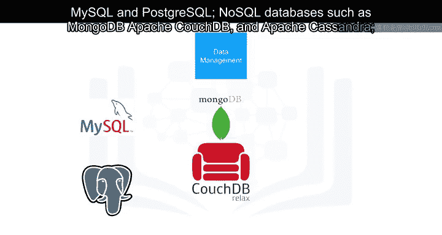

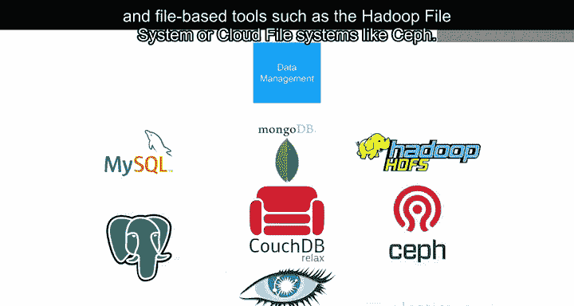

数据管理是数据科学流程的基石。它涉及存储、组织和检索数据。以下是几种最广泛使用的开源数据管理工具。

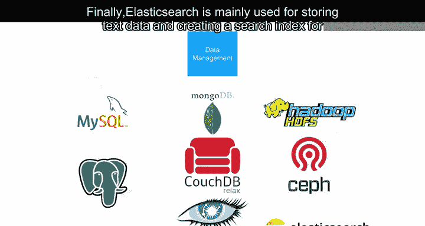

上一节我们介绍了课程概述，本节中我们来看看具体的数据管理工具。

以下是主要的数据管理工具类别：

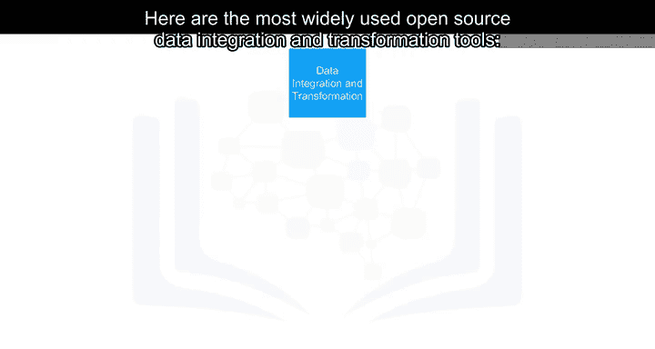

*   **关系型数据库**：例如 **MySQL** 和 **PostgreSQL**。它们使用表格结构存储数据，并通过SQL语言进行操作。
*   **NoSQL数据库**：例如 **MongoDB**、**Apache CouchDB** 和 **Apache Cassandra**。它们适用于非结构化或半结构化数据，提供更灵活的数据模型。
*   **基于文件的系统**：例如 **Hadoop文件系统（HDFS）** 或云文件系统。
*   **全文搜索引擎**：**Elasticsearch** 主要用于存储文本数据并创建搜索索引，以实现快速文档检索。

## 数据集成与转换工具 ⚙️

在经典的数据仓库领域，数据集成与转换的任务被称为 **ETL**，即 **提取（Extract）、转换（Transform）、加载（Load）**。

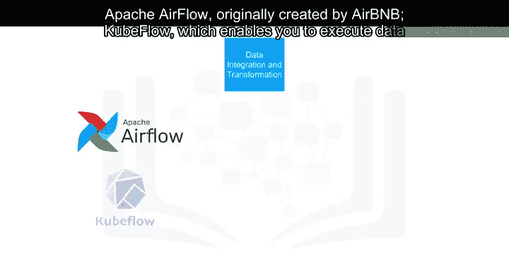

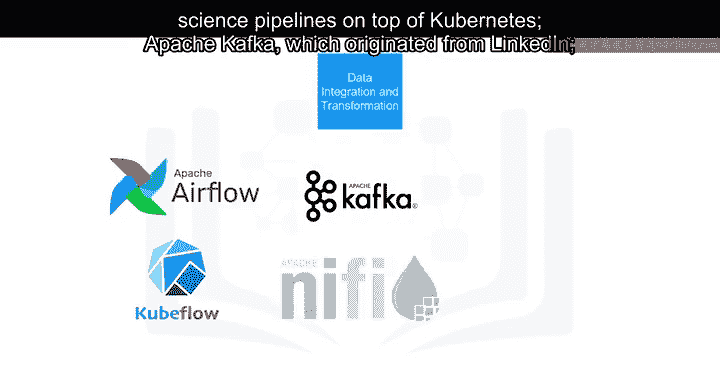

如今，数据科学家经常提出 **ELT** 这个术语，即 **提取（Extract）、加载（Load）、转换（Transform）**，强调数据先被转储到某处，然后由数据工程师或数据科学家自己负责转换。

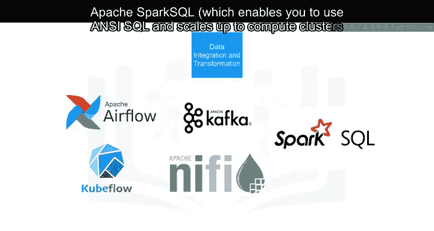

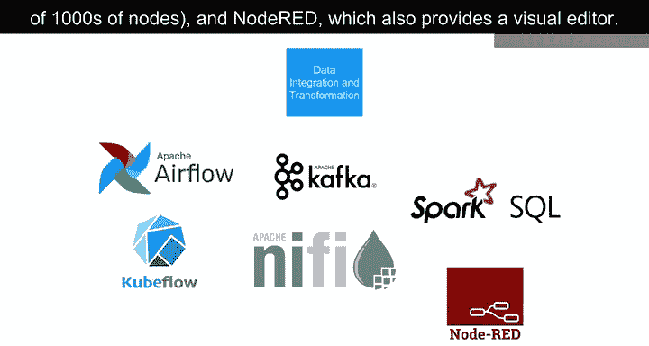

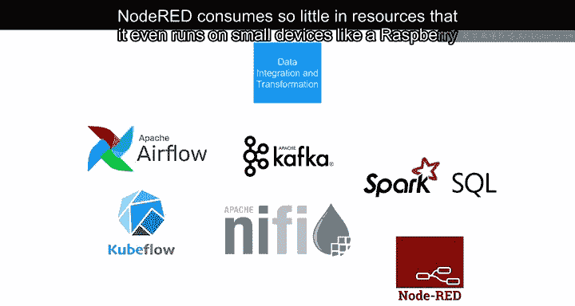

这个过程现在也出现了另一个术语：**数据提炼与清洗**。

了解了数据存储后，接下来我们需要处理数据的移动和塑形。以下是使用最广泛的开源数据集成和转换工具。

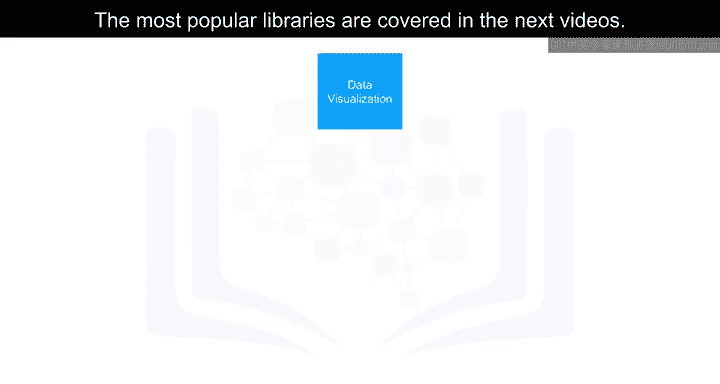

以下是主要的工具列表：

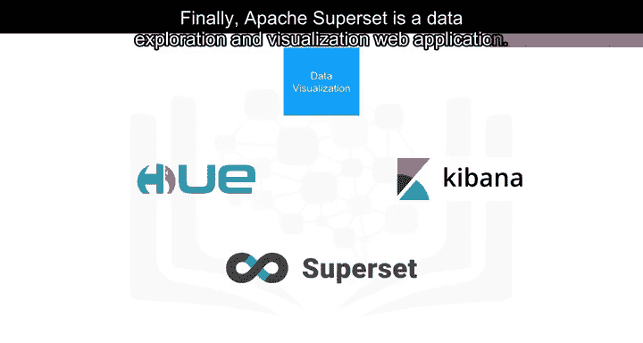

*   **Apache Airflow**：最初由Airbnb创建，用于编排复杂的工作流。
*   **Kubeflow**：使您能够在Kubernetes上执行数据科学流水线。
*   **Apache Kafka**：起源于LinkedIn，用于构建实时数据管道和流应用。
*   **Apache NiFi**：提供了一个非常友好的可视化编辑器，用于设计数据流。
*   **Apache Spark SQL**：使您能够使用类似SQL的语法，并能扩展到由数千个节点组成的计算集群。
*   **Node-RED**：同样提供可视化编辑器。Node-RED消耗的资源极少，甚至可以在树莓派这样的小型设备上运行。

## 数据可视化工具 📈

数据可视化是将数据转化为直观图形的关键步骤。我们必须区分需要编写代码的编程库和包含用户界面的工具。最流行的库将在后续视频中介绍。

在将数据处理完毕后，我们需要将其呈现出来以获取洞见。现在介绍最广泛使用的开源数据可视化工具。

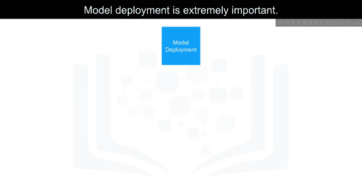

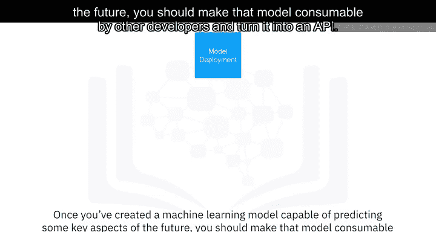

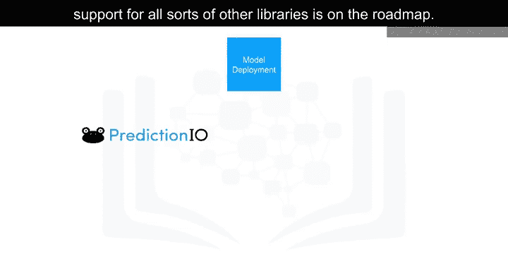

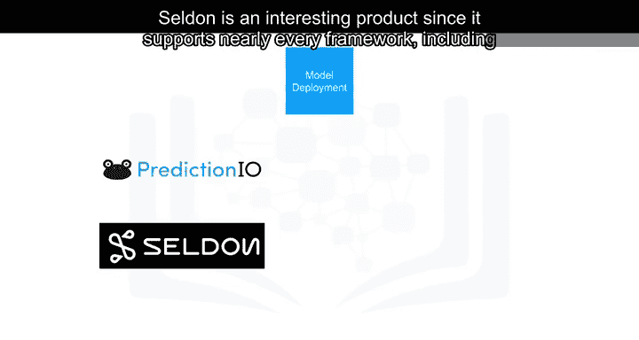

以下是包含用户界面的工具示例：

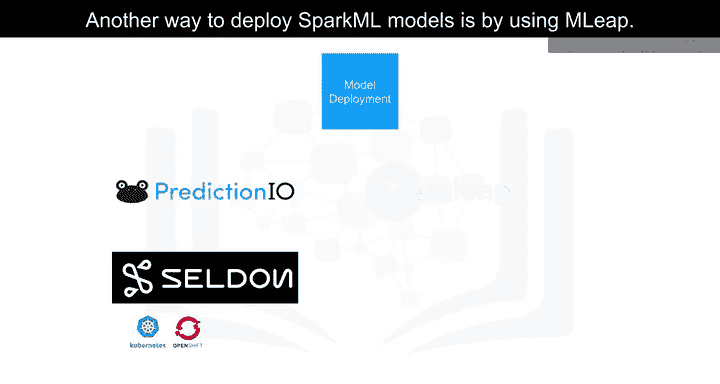

*   **Hue**：可以采用类似的方法，它可以从SQL查询创建可视化。
*   **Kibana**：一个数据探索和可视化Web应用程序，但仅限于使用Elasticsearch作为数据提供者。
*   **Apache Superset**：一个数据探索和可视化Web应用程序，支持多种数据源。

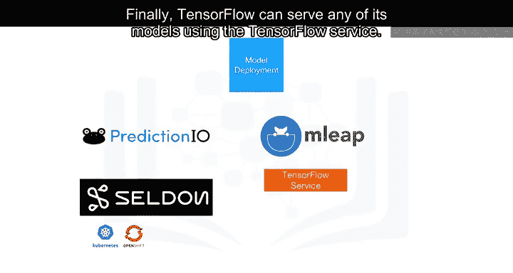

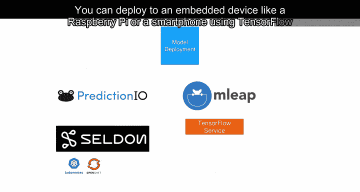

## 模型部署工具 🚀

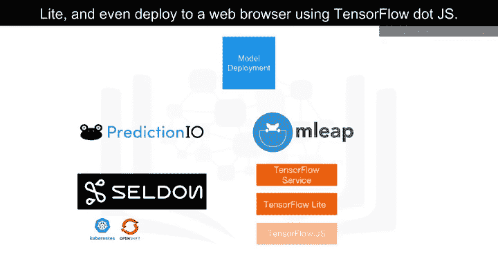

模型部署极其重要。一旦你创建了一个能够预测未来某些关键方面的机器学习模型，你就应该让其他开发者能够使用这个模型，并将其转化为一个API。

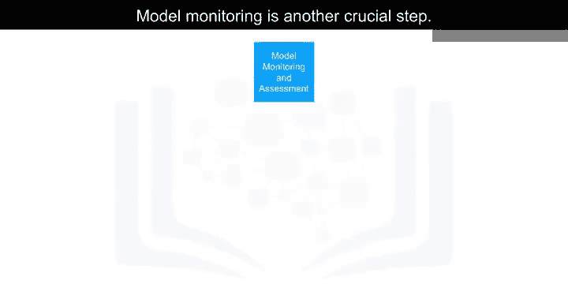

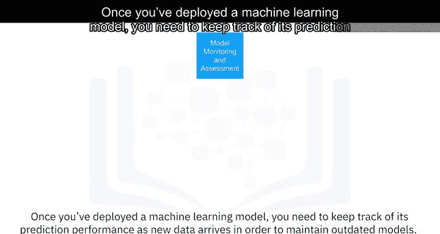

模型构建完成后，下一步就是将其投入实际使用。以下是几种模型部署工具。

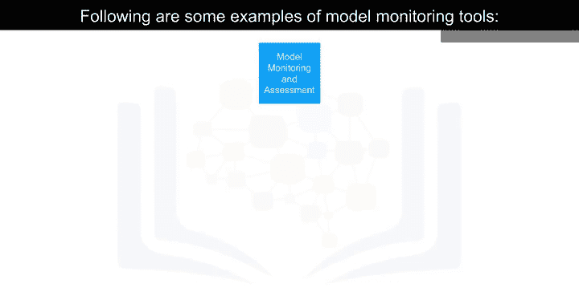

以下是主要的部署工具：

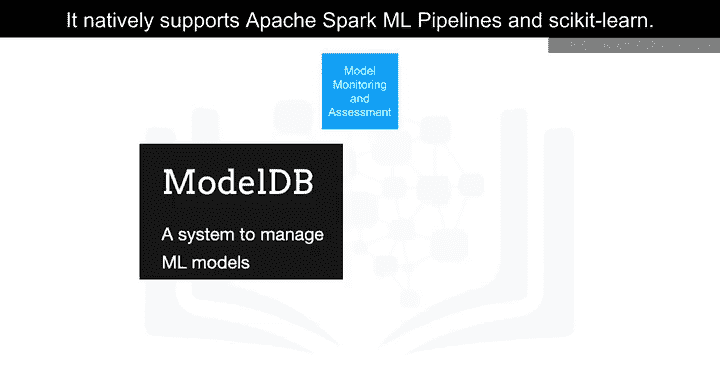

*   **Apache PredictionIO**：目前仅支持部署Apache Spark ML模型，但路线图中计划支持各种其他库。
*   **Seldon**：一个有趣的产品，因为它支持几乎所有框架，包括TensorFlow、Apache Spark ML、R和Scikit-learn。Seldon可以运行在Kubernetes和Red Hat OpenShift之上。
*   **MLeap**：部署Spark ML模型的另一种方式。
*   **TensorFlow Serving**：可以服务于任何TensorFlow模型。
*   **TensorFlow Lite**：可用于部署到嵌入式设备（如树莓派或智能手机）。
*   **TensorFlow.js**：甚至可以使用它将模型部署到Web浏览器中。

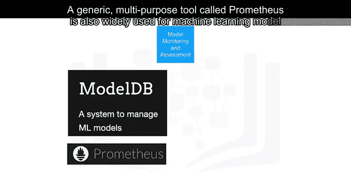

## 模型监控工具 🔍

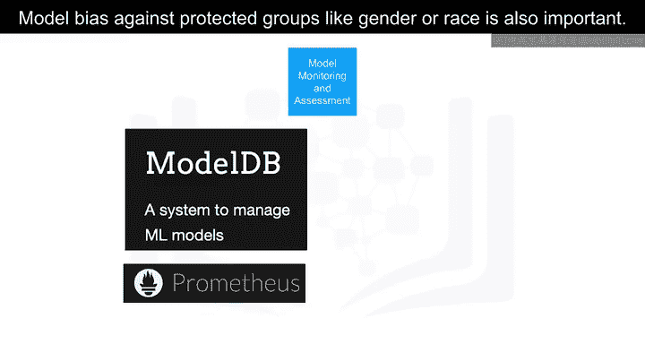

模型监控是另一个关键步骤。一旦你部署了一个机器学习模型，你需要随着新数据的到来跟踪其预测性能，以维护过时的模型。

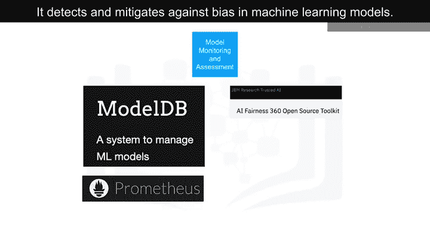

模型部署后，持续的监控至关重要。以下是一些模型监控工具的示例。

以下是相关的监控工具：

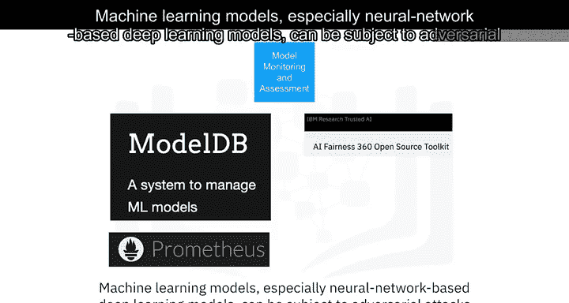

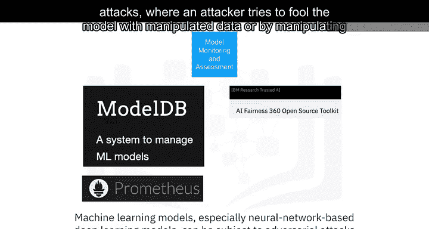

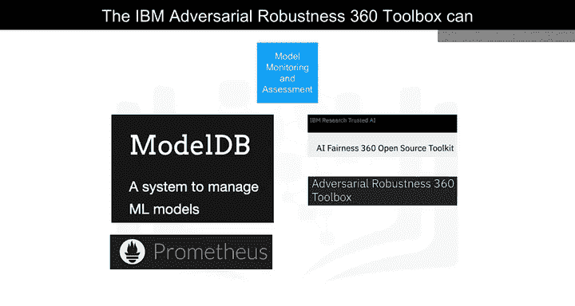

*   **ModelDB**：一个机器学习模型元数据库，存储有关模型的信息并可进行查询。它原生支持Apache Spark ML流水线和Scikit-learn。
*   **Prometheus**：一个通用的多用途工具，也广泛用于机器学习模型监控，尽管它并非专门为此目的而设计。
*   **IBM AI Fairness 360**：模型性能不仅通过准确性来衡量。模型对受保护群体（如性别或种族）的偏见也很重要。IBM AI Fairness 360开源工具包正是做这件事的，它能检测并减轻机器学习模型中的偏见。
*   **IBM Adversarial Robustness 360**：机器学习模型，特别是基于神经网络的深度学习模型，可能受到对抗性攻击，攻击者试图通过操纵数据或模型本身来欺骗模型。IBM Adversarial Robustness 360工具箱可用于检测对抗性攻击的脆弱性，并帮助使模型更加健壮。
*   **IBM AI Explainability 360**：机器学习模型通常被认为是一个应用某种神秘魔法的黑盒。IBM AI Explainability 360工具包通过查找数据集中可以呈现给用户进行手动比较的相似示例，使机器学习过程更容易理解。它还可以通过解释不同输入变量如何影响模型的最终决策，来说明更简单的机器学习模型的训练过程。

## 代码资产管理工具 💾

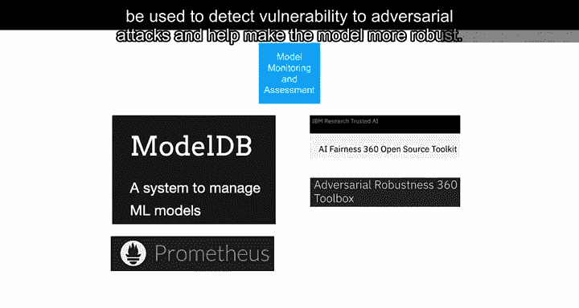

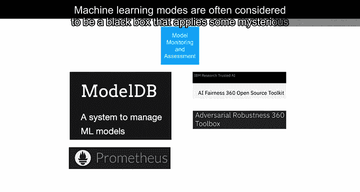

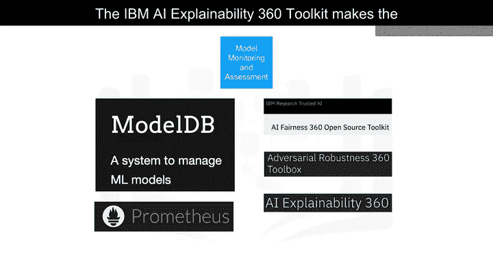

代码资产管理工具的选择已经大大简化。代码资产管理，也称为版本管理或版本控制。**Git** 现在是标准。

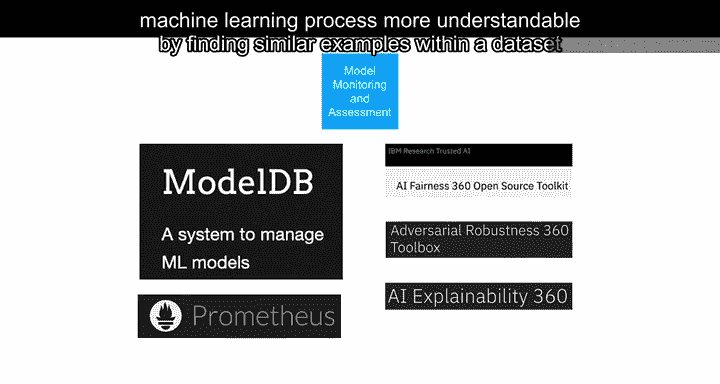

在管理数据和模型的同时，代码本身也需要被妥善管理。以下是代码资产管理工具。

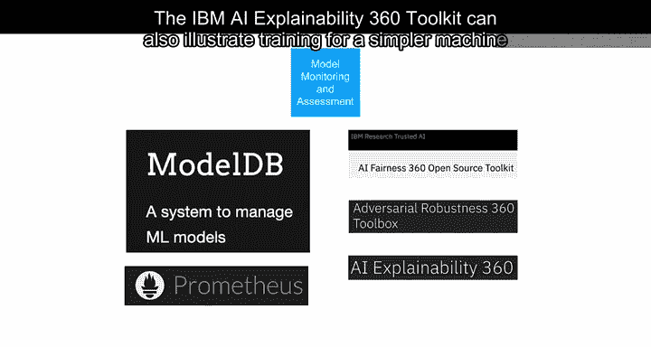

以下是主要的Git托管服务：

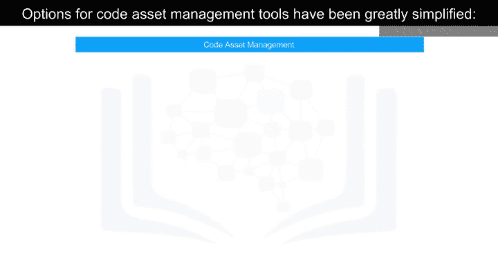

*   **GitHub**：为软件开发版本管理提供托管服务，是目前最突出的。
*   **GitLab**：紧随其后，其优势在于它是一个完全开源的平台，您可以自行托管和管理。
*   **Bitbucket**：另一个选择。

## 数据资产管理工具 🗂️

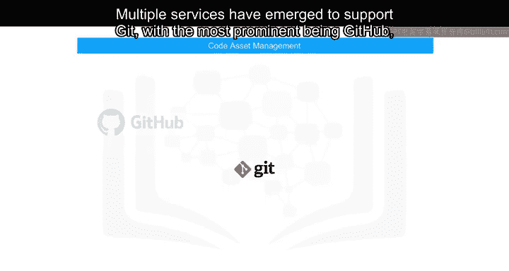

数据资产管理，也称为数据治理或数据沿袭，是企业级数据科学的另一个关键部分。数据必须进行版本控制并用元数据进行注释。

最后，我们来看如何管理数据资产本身。**Apache Atlas** 是一个支持此任务的工具。

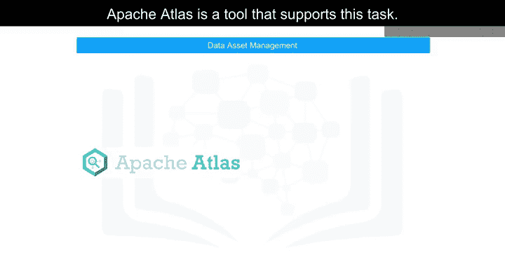

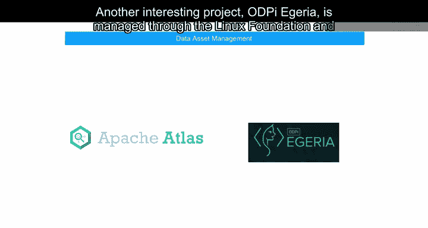

以下是相关的数据资产管理项目：

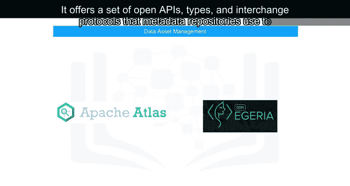

*   **ODPI Egeria**：另一个有趣的项目，通过Linux基金会管理，是一个开放的生态系统。它提供了一组开放的API、类型和交换协议，供元数据存储库用来共享和交换数据。
*   **Kylo**：一个开源的数据湖管理软件平台，为广泛的数据资产管理任务提供广泛支持。

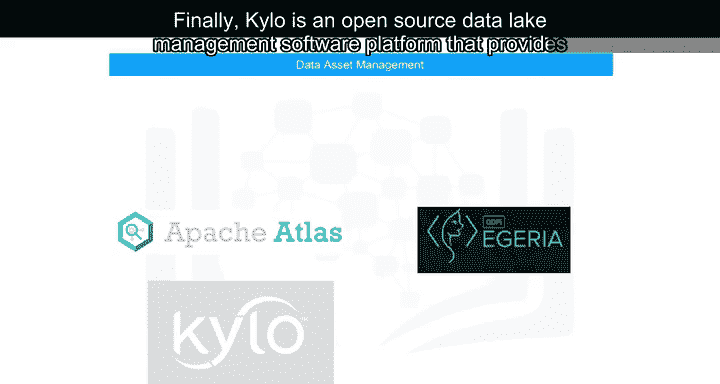

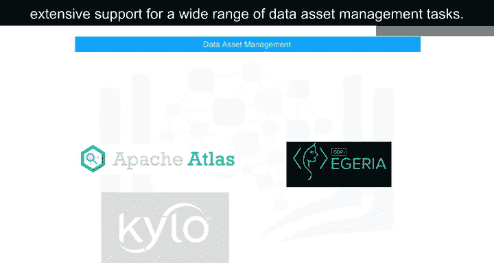

## 总结 📝

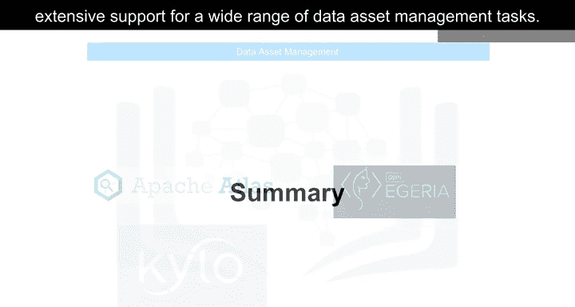

本节课中，我们一起学习了开源数据科学工具的上半部分内容。我们介绍了数据管理、数据集成与转换、数据可视化、模型部署与监控，以及代码与数据资产管理等核心领域的多种工具。掌握这些工具是构建高效、可靠数据科学工作流的基础。本系列的第一部分到此结束，让我们继续学习第二部分。