# 010：商业数据科学工具

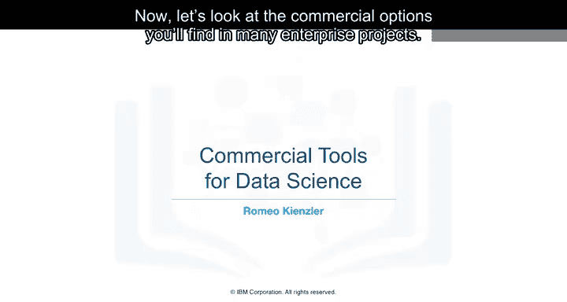

在本节课中，我们将学习企业环境中常用的商业数据科学工具。我们将探讨数据管理、集成、可视化、机器学习模型构建与部署，以及数据资产管理等关键任务所对应的商业解决方案。

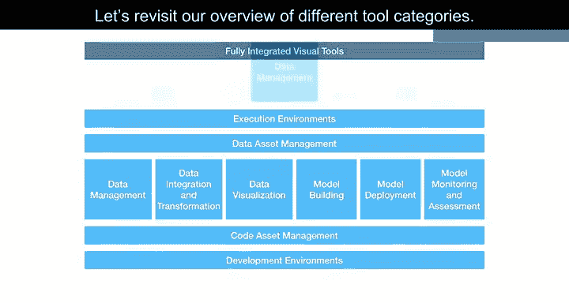

上一节我们介绍了开源数据科学工具。本节中，我们来看看在企业项目中常见的商业选项。

## 🗄️ 数据管理工具

在数据管理领域，企业的大部分相关数据通常存储在以下数据库中：
*   Oracle数据库
*   Microsoft SQL Server
*   IBM DB2

尽管开源数据库日益流行，但这三种数据管理产品仍被视为行业标准，并且在可预见的未来仍将占据重要地位。这不仅是功能性的问题，数据是每个组织的核心，而商业支持的可用性至关重要。商业支持由软件供应商、有影响力的合作伙伴和支持网络直接提供。

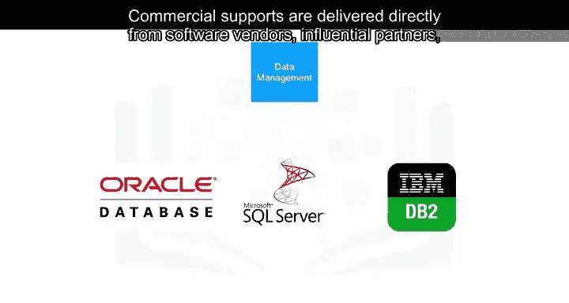

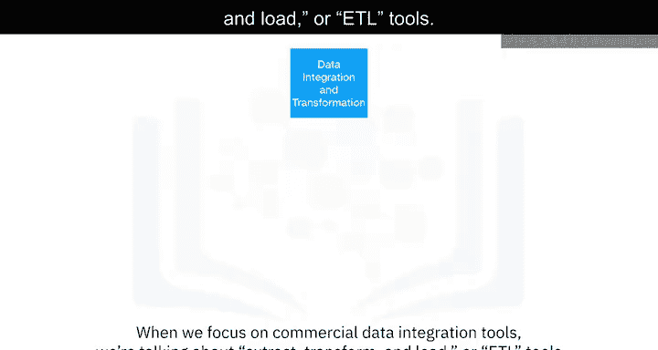

## 🔄 数据集成工具

当我们聚焦于商业数据集成工具时，主要讨论的是**ETL（提取、转换、加载）**工具。

根据Gartner魔力象限，以下是该领域的领导者：
*   Informatica PowerCenter
*   IBM Infosphere DataStage

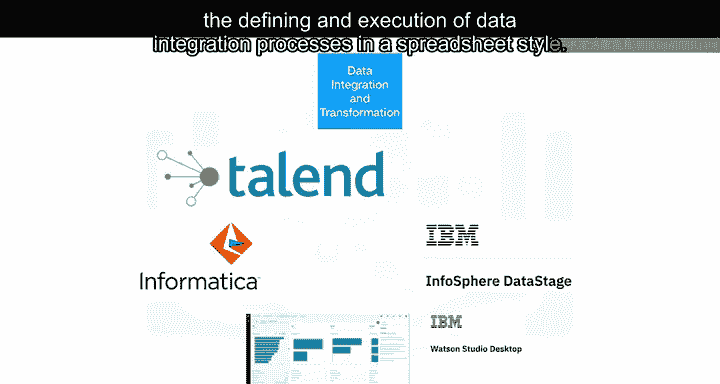

紧随其后的产品来自SAP、Oracle、SAS、Talend和Microsoft。这些工具通过图形界面支持ETL数据处理管道的设计和部署，并为大多数商业和开源目标信息系统提供连接器。

此外，Watson Studio Desktop包含一个名为“Data Refinery”的组件，它支持以电子表格风格定义和执行数据集成流程。

## 📈 数据可视化工具

在商业环境中，数据可视化通常利用**商业智能（BI）**工具。它们的主要焦点是创建视觉吸引力强且易于理解的报告和实时仪表板。

以下是主要的商业示例：
*   Tableau
*   Microsoft Power BI
*   IBM Cognos Analytics

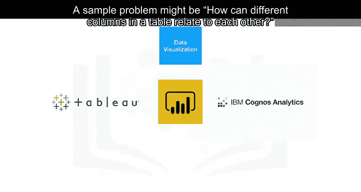

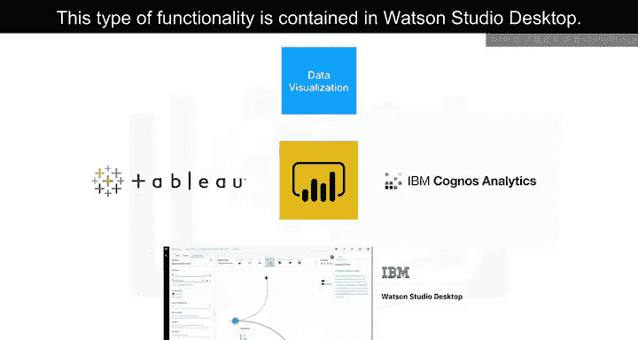

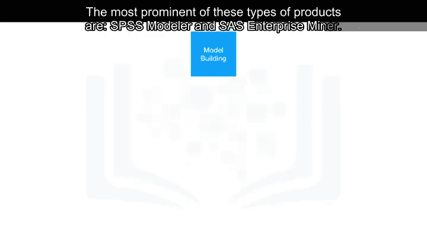

另一种可视化工具则面向数据科学家而非普通用户，例如探索数据表中不同列之间关系的问题。这类功能包含在Watson Studio Desktop中。

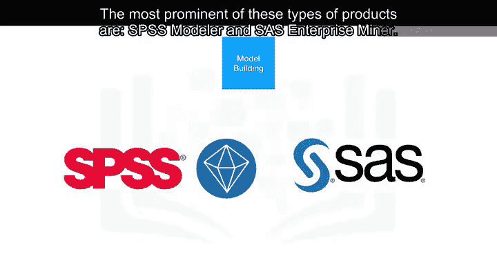

## 🤖 机器学习建模工具

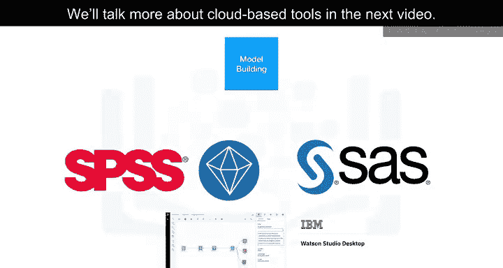

如果你想使用商业工具构建机器学习模型，可以考虑使用数据挖掘产品。这类产品中最突出的是：
*   SPSS Modeler
*   SAS Enterprise Miner

此外，SPSS Modeler的一个版本也包含在Watson Studio Desktop中。基于云的工具版本我们将在下一个视频中详细讨论。

## 🚀 模型部署

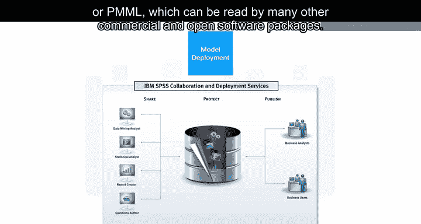

在商业软件中，模型部署与模型构建过程紧密集成。下图展示了SPSS协作与部署服务的示例，该服务用于部署由SPSS软件工具套件创建的任何类型的资产。其他供应商也使用类似的过程。

商业软件也可以以开放格式导出模型。例如，SPSS Modeler支持将模型导出为**预测模型标记语言（PMML）**，该格式可以被许多其他商业和开源软件包读取。

## 👁️ 模型监控与代码资产管理

模型监控是一个新兴领域，目前尚无相关的成熟商业工具可用。因此，开源工具是首选。代码资产管理的情况类似，基于**Git**和**GitHub**的开源方案是实际上的标准。

## 🏛️ 数据资产管理

数据资产管理，也称为数据治理或数据沿袭，是企业级数据科学的关键部分。数据必须使用元数据进行版本控制和注释。

以下是提供此类专用工具的供应商：
*   Informatica Enterprise Data Governance
*   IBM

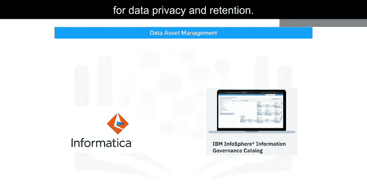

IBM Infosphere Information Governance Catalog涵盖了以下功能：
*   **数据字典**：便于发现数据资产。
*   **数据负责人**：每个数据资产都被分配给一个数据负责人（即数据所有者），他负责该资产并可被联系。
*   **数据沿袭**：使用户能够追溯创建数据资产所遵循的转换步骤。数据沿袭还包括对实际源数据的引用。
*   **规则与策略**：可以添加规则和策略，以反映复杂的数据法规和业务要求，例如隐私和保留策略。

## 💻 集成开发环境

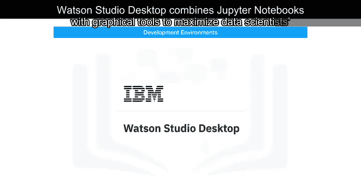

Watson Studio是一个为数据科学家打造的完全集成的开发环境。它通常通过云平台使用，我们将在后续课程中详细讨论。它也有桌面版本可用。

Watson Studio Desktop将Jupyter Notebook与图形化工具相结合，以最大化数据科学家的工作效率。

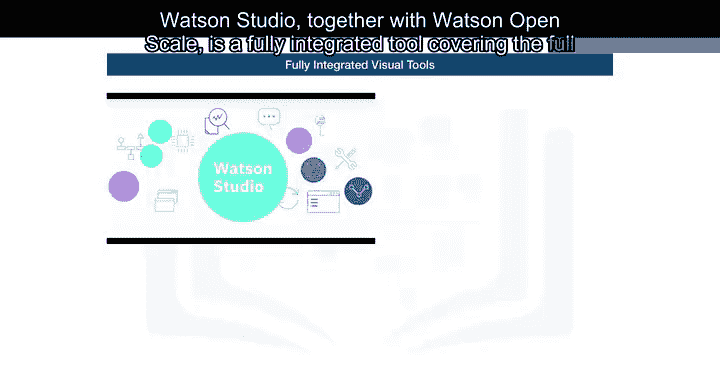

Watson Studio与Watson OpenScale一起，构成了一个覆盖完整数据科学生命周期以及我们之前讨论的所有任务的完全集成工具。我们将在下一课中详细讨论两者，但请记住，它们可以部署在本地数据中心，基于Kubernetes或Red Hat OpenShift运行。

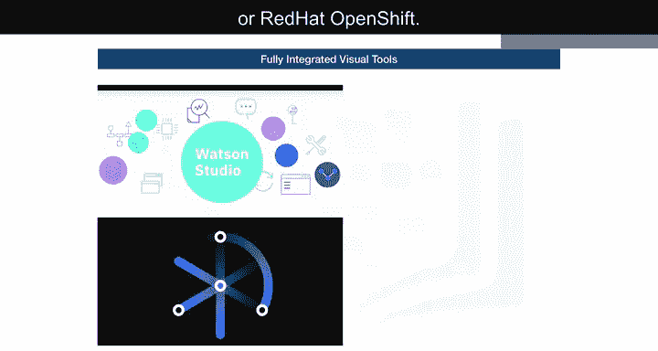

另一个完全集成的商业工具例子是**H2O Driverless AI**，它也涵盖了完整的数据科学生命周期。

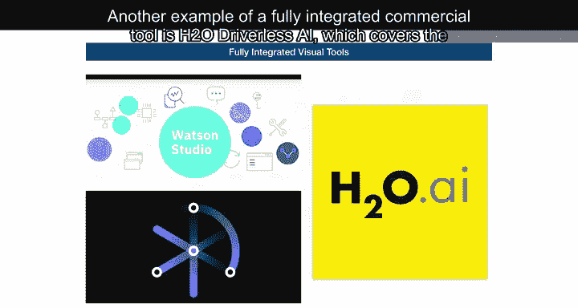

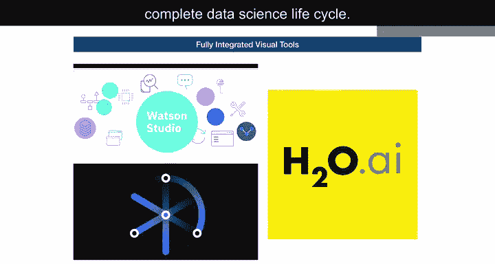

## 📝 总结

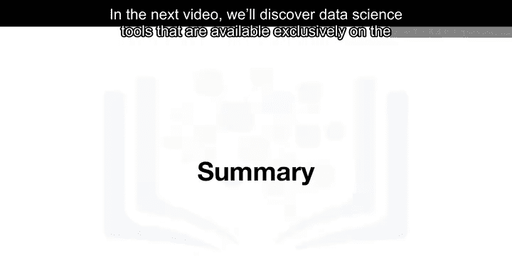

本节课中，我们一起学习了最常见的几类数据科学任务是如何得到商业工具支持的。在下一个视频中，我们将探索那些专门在云平台上提供的数据科学工具。