# 011：云端数据科学工具

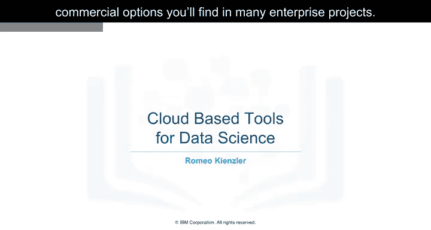

在本节课中，我们将学习商业化的云端数据科学工具。这些工具在企业级项目中非常常见，它们通常将多种任务集成到单一平台中，为数据科学家提供高效、可扩展的工作环境。

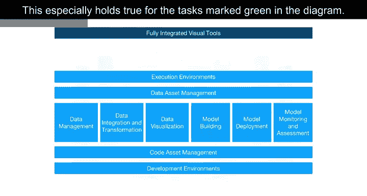

---

上一节我们介绍了开源数据科学工具，本节中我们来看看商业化的选项。

再次回顾不同工具类别的概览图。由于云产品是较新的类别，它们遵循将多个任务集成到单一工具的趋势。这在图中标记为绿色的任务中尤其明显。

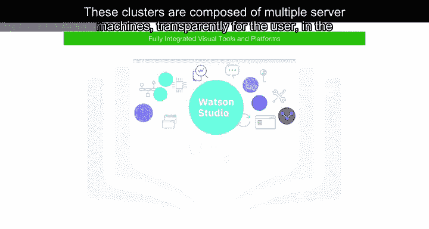

---

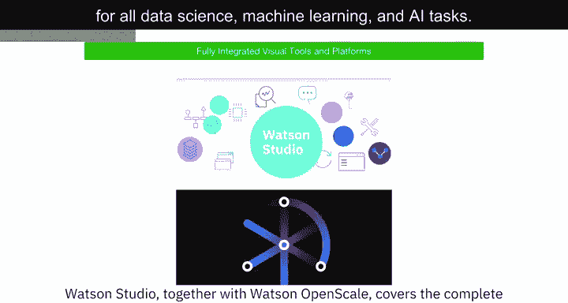

## 🖥️ 完全集成的可视化工具平台

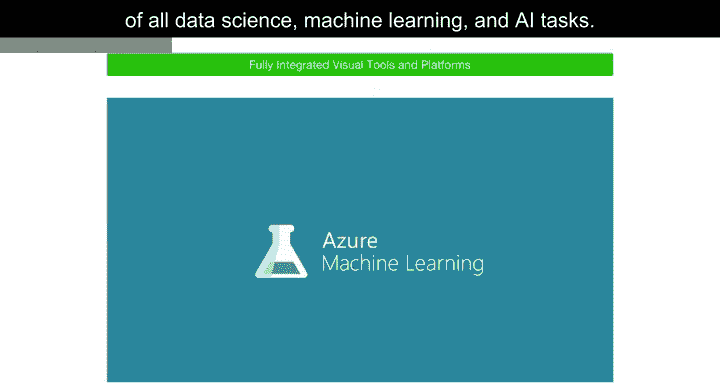

让我们从完全集成的可视化工具类别开始。由于这些工具引入了一个组件，使得数据科学工作流的大规模执行在计算集群中进行，我们在此更改了标题并添加了“平台”一词。这些集群由多台服务器机器组成，对用户而言是后台透明的。

以下是几个主要示例：

*   **IBM Watson Studio 与 Watson OpenScale**：覆盖了所有数据科学、机器学习和AI任务的完整开发生命周期。
*   **Microsoft Azure Machine Learning**：同样是完全云托管的服务，支持所有数据科学、机器学习和AI任务的完整开发生命周期。
*   **H2O Driverless AI**：虽然这是一个需要下载安装的产品，但主流云服务提供商提供一键部署。由于运维不由云提供商负责（这与Watson Studio、OpenScale和Azure Machine Learning不同），这种交付模式不应与平台即服务（PaaS）或软件即服务（SaaS）混淆。

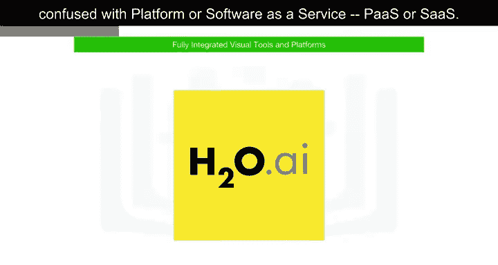

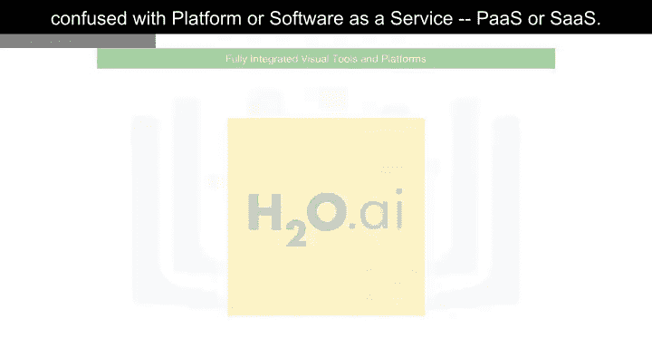

---

## 💾 数据管理工具

在数据管理领域，除少数例外，现有的开源和商业工具都有其SaaS版本。SaaS代表软件即服务，意味着云提供商在云端为你运行该工具。例如，云提供商通过备份数据、配置和安装更新来运营产品。

有时也存在专有工具，它们仅作为云产品提供，有时甚至仅由单一云提供商提供。

以下是此类服务的例子：

*   **Amazon Web Services DynamoDB**：一种NoSQL数据库，允许以键值对或文档存储格式存储和检索数据。最著名的文档数据结构是JSON。
*   **Cloudant**：一种数据库即服务产品，但其底层基于开源Apache CouchDB。其优势在于，虽然备份、恢复和扩展等复杂操作任务由云提供商在底层完成，但该服务与CouchDB兼容。因此，应用程序可以迁移到另一个CouchDB服务器而无需更改应用。
*   **IBM Db2 as a Service**：这是一个商业数据库作为SaaS产品在云端提供的例子，将操作任务从用户手中接管。

---

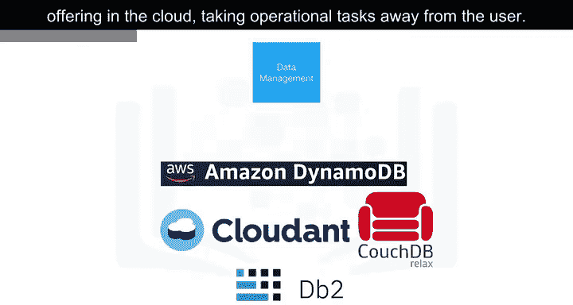

## 🔄 数据集成工具

谈到商业数据集成工具，我们不仅指提取、转换、加载（ETL）工具，也指提取、加载、转换（ELT）工具。这意味着转换步骤不由数据集成团队完成，而是推向数据科学家或数据工程师的领域。

以下是两个广泛使用的商业数据集成工具：

*   **Informatica Cloud Data Integration**
*   **IBM Data Refinery**：Data Refinery能够在类似电子表格的用户界面中，将大量原始数据转换为可消费的高质量信息。它是IBM Watson Studio的一部分。

---

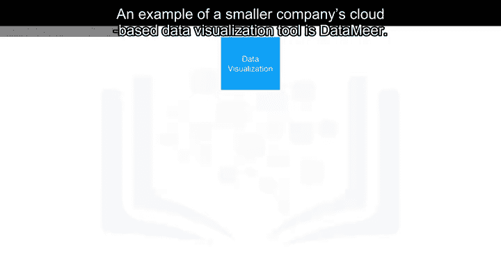

## 📈 数据可视化工具

云端数据可视化工具市场巨大，每个主要的云供应商都拥有自己的产品。以下是一些例子：

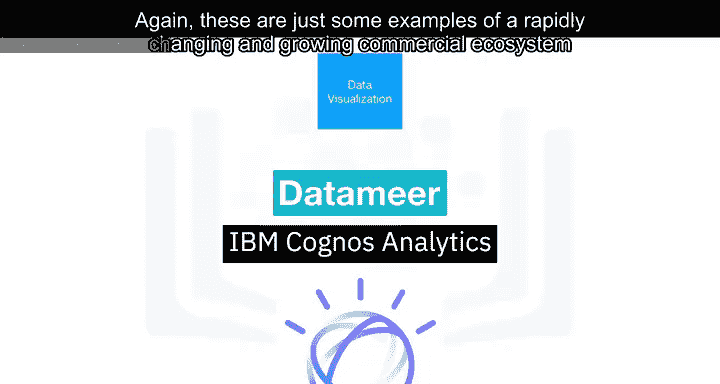

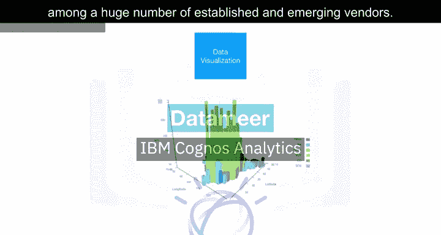

*   **Tableau**：来自较小公司的基于云的数据可视化工具。
*   **IBM Cognos Business Intelligence Suite**：IBM也将其著名的Cognos商业智能套件作为云解决方案提供。
*   **IBM Data Refinery**：在Watson Studio中再次提供了数据探索和可视化功能。

这些只是庞大且快速变化的商业生态系统中的一些例子，该生态系统中包含大量成熟和新兴的供应商。

在Watson Studio中，可以使用丰富的不同可视化图表来更好地理解数据：

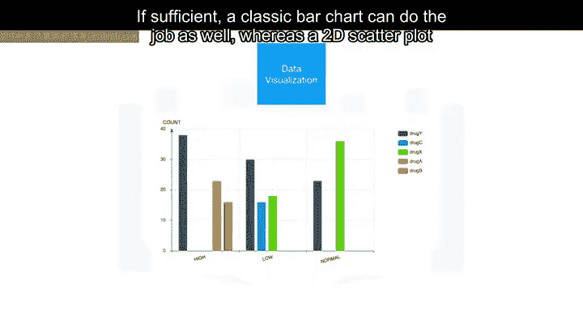

*   **3D条形图**：允许在垂直维度上可视化目标值，该值依赖于水平维度上的另外两个值。着色可以可视化第三个维度。
*   **分层变化捆绑图**：用于可视化实体之间的关联和从属关系。
*   **经典条形图**：如果足够，也可以完成工作。
*   **带热图的2D散点图**：显示两个相关的数据字段，一个在Y轴，另一个用颜色强度表示。
*   **树状图**：显示集合内子集的分布。
*   **饼图**：以非分层的方式实现相同目的。
*   **词云图**：突出显示文档语料库中的重要术语。

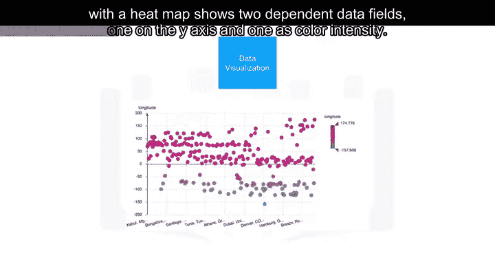

---

## 🤖 模型构建与部署

模型构建可以使用诸如**Watson Machine Learning**这样的服务来完成。Watson Machine Learning可以使用各种开源库来训练和构建模型。谷歌在其云平台上也有类似的服务，称为**AI Platform Training**。几乎每个云提供商都有针对此任务的解决方案。

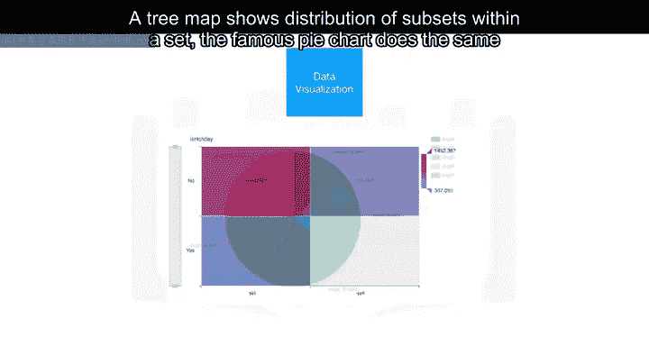

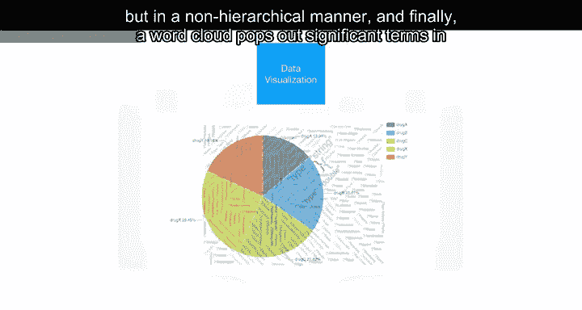

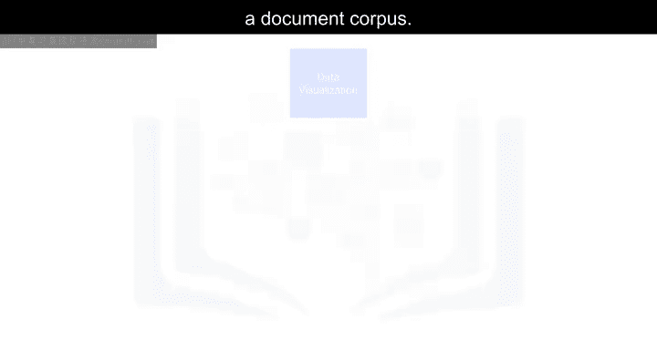

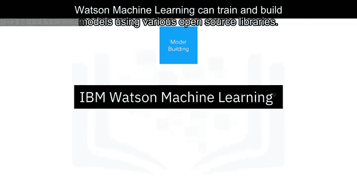

在商业软件中，模型部署通常与模型构建过程紧密集成。例如，**SPSS协作和部署服务**可用于部署由SPSS软件工具套件创建的任何类型的资产。其他供应商也是如此。

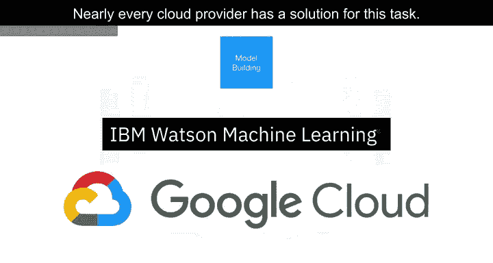

此外，商业软件可以以开放格式导出模型。例如，**SPSS Modeler**支持将模型导出为预测模型标记语言（PMML），该格式可以被许多其他商业和开源软件包读取。

**Watson Machine Learning**也可用于部署模型，并通过REST接口使其可供消费者使用。

---

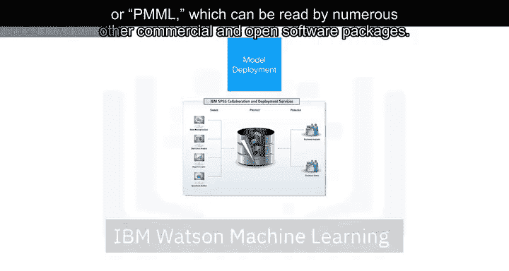

## 👁️ 模型监控

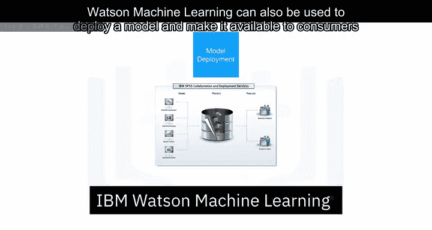

**Amazon SageMaker Model Monitor**是一个云端工具的例子，它持续监控已部署的机器学习和深度学习模型。同样，每个主要的云提供商都有类似的工具。

**Watson OpenScale**也是如此。OpenScale和Watson Studio统一了整个工作流视图。图中所有标记为绿色的任务都可以使用Watson Studio和Watson OpenScale完成。OpenScale将在后续视频中详细介绍。

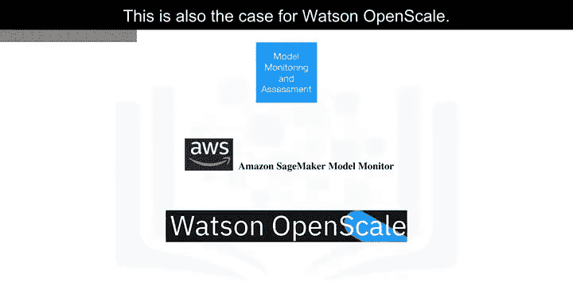

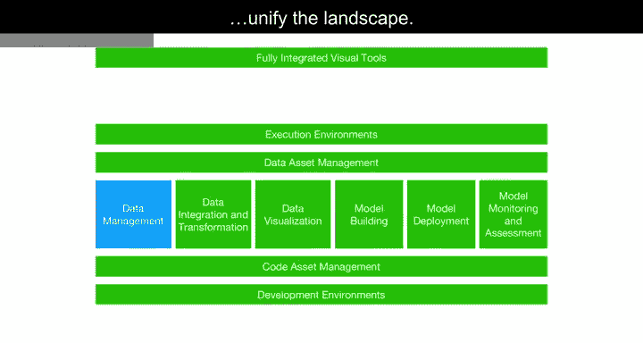

---

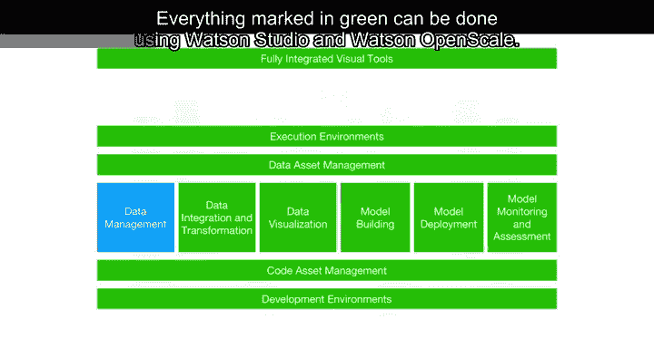

## 📝 总结

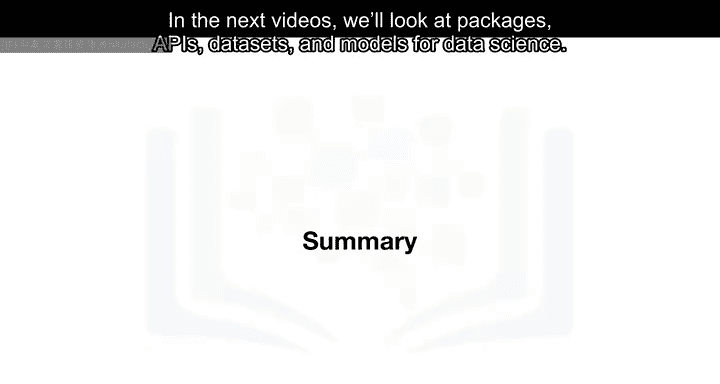

本节课中我们一起学习了最常见的商业云端数据科学工具如何支持数据科学的各项任务。集成化使我们能够使用相同的工具处理多项任务。在接下来的视频中，我们将探讨用于数据科学的包、API、数据集和模型。