# 013：应用程序接口（API）详解

在本节课中，我们将要学习应用程序接口（API）的核心概念。我们将探讨API是什么、API库、以及REST API，包括请求与响应的工作机制。

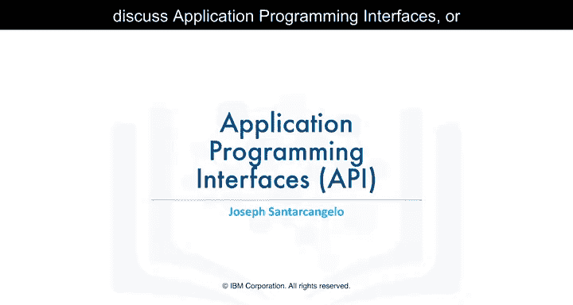

---

## 🤔 什么是API？

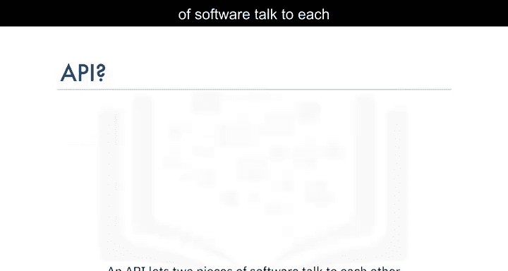

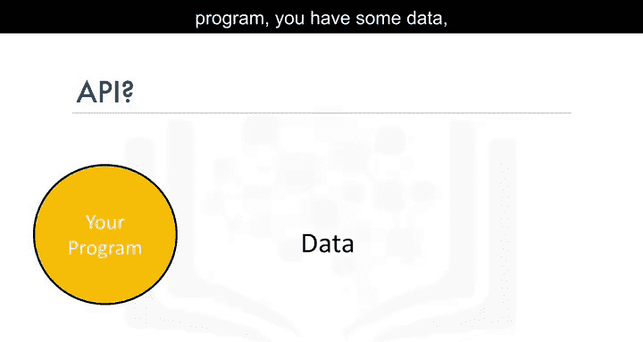

API允许两个软件组件相互通信。例如，你有一个程序和一些数据，同时还有其他软件组件。你可以使用API与其他软件组件进行通信。

你无需了解API的内部工作原理，只需知道它的输入和输出即可。请记住，API仅指你看到的接口或库的一部分，而“库”指的是整个软件包。

---

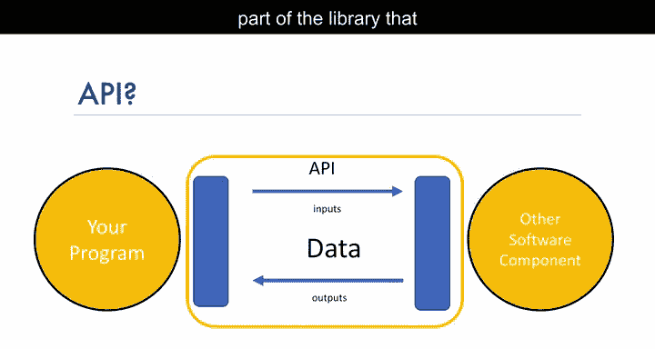

## 📚 API库示例：Pandas

上一节我们介绍了API的基本概念，本节中我们来看看一个具体的API库示例。

考虑Pandas库。Pandas实际上是一组软件组件，其中许多甚至不是用Python编写的。你有一些数据和一组软件组件。我们通过Pandas API与其他软件组件通信来处理数据。

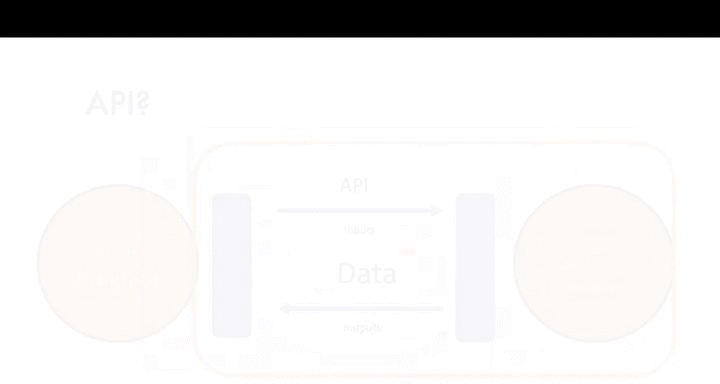

---

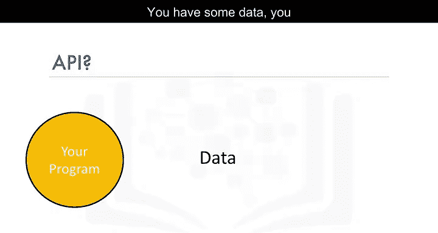

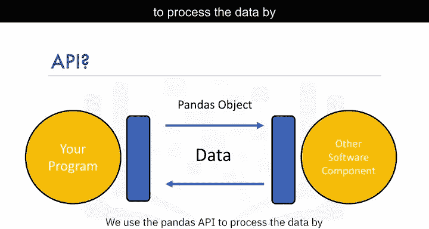

## 🌐 多语言API与后端

后端可以只有一个软件组件，但可以为不同语言提供独立的API。以用C++编写的TensorFlow为例。

它为Python、JavaScript、C++、Java和Go提供了独立的API。API仅仅是接口。此外，还有多个由志愿者为TensorFlow开发的API，例如Julia、Matlab、R、Scala等。

---

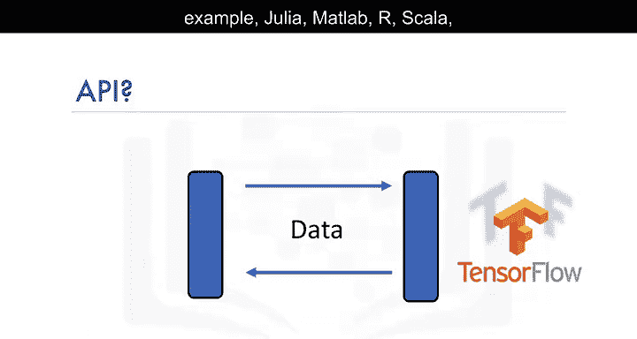

## 🔄 REST API简介

上一节我们讨论了通用API和库，本节中我们来看看一种特别流行的API类型：REST API。

REST API是另一种流行的API类型。它们使你能够利用互联网进行通信，从而利用存储、更广泛的数据访问、人工智能算法和许多其他资源。R代表“表征性”，S代表“状态”，T代表“转移”。

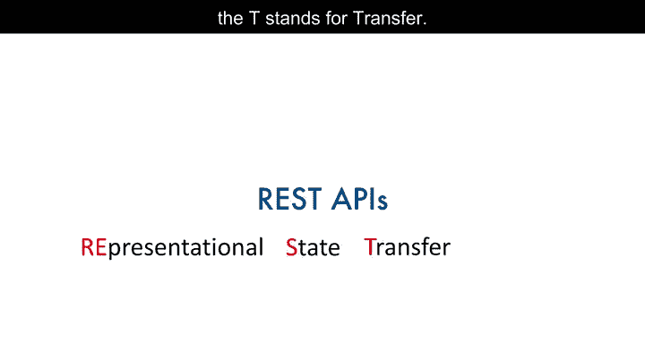

---

## 🧩 REST API的核心组件

在REST API中，你的程序被称为**客户端**。API通过互联网与你调用的**Web服务**进行通信。一组规则管理着通信、输入（或请求）和输出（或响应）。

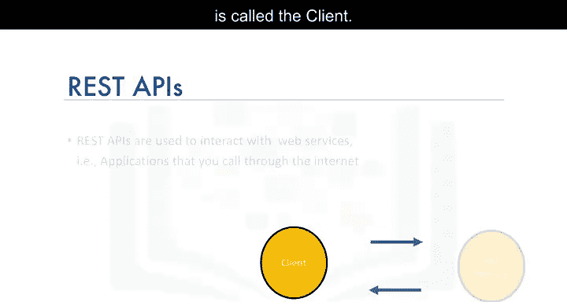

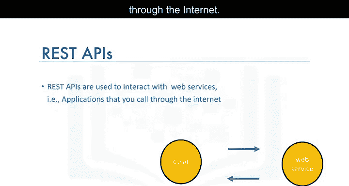

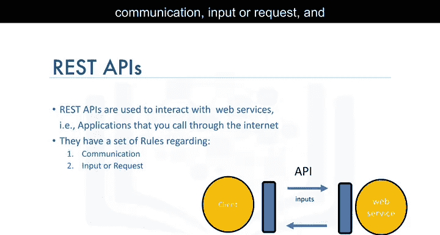

以下是REST API中一些常见的相关术语：

*   **客户端**：指你或你的代码。
*   **资源**：指Web服务。
*   **端点**：客户端通过端点找到服务。
*   **请求**：客户端发送给资源的信息。
*   **响应**：资源返回给客户端的信息。

---

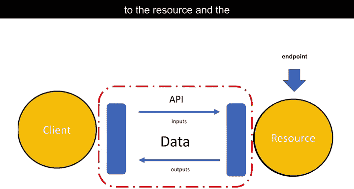

## 📡 HTTP方法与通信过程

HTTP方法是通过互联网传输数据的一种方式。我们通过发送**请求**来告诉REST API要做什么。

请求通常通过**HTTP消息**进行通信。HTTP消息通常包含一个JSON文件，该文件包含我们希望服务执行的操作指令。这个操作通过互联网传输到Web服务。

服务执行该操作。类似地，Web服务通过HTTP消息返回**响应**，其中信息通常使用JSON文件返回。这些信息被传输回客户端。

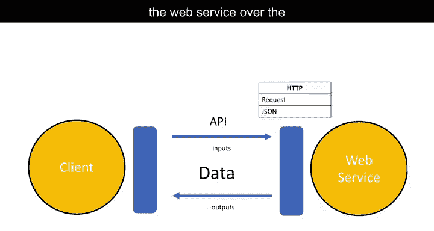

---

## 🎤 REST API实例：Watson语音转文本

上一节我们介绍了REST API的通信机制，本节中我们通过两个具体例子来看看它是如何工作的。

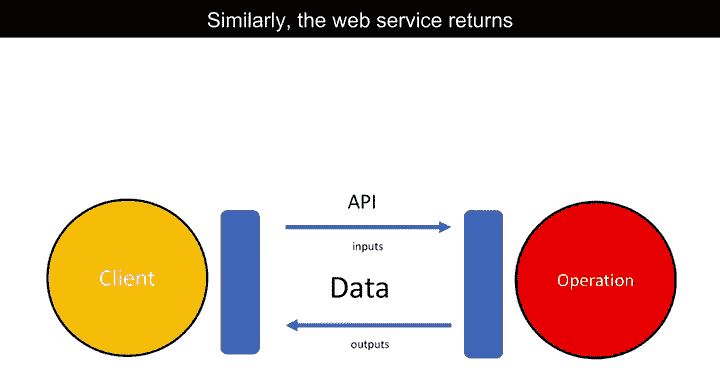

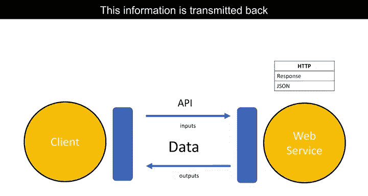

Watson语音转文本API是REST API的一个例子。此API将语音转换为文本。

在API调用中，你将音频文件的副本发送给API。这个过程称为**POST请求**。然后，API发送个人所说内容的文本转录。

---

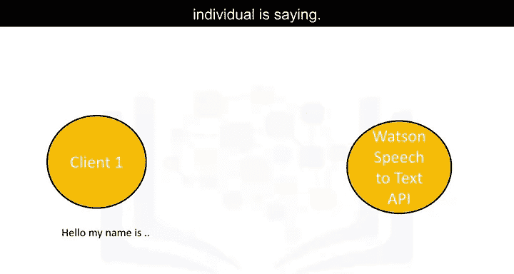

## 🌍 REST API实例：Watson语言翻译器

Watson语言翻译器API提供了另一个例子。你将想要翻译的文本发送到API。

API翻译文本并将翻译结果发送回给你。在这个例子中，我们将英语翻译成西班牙语。

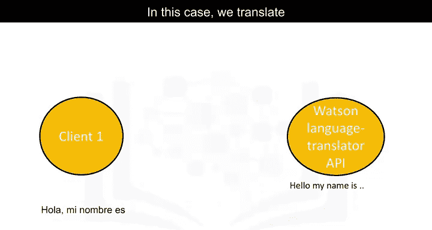

---

## 📝 课程总结

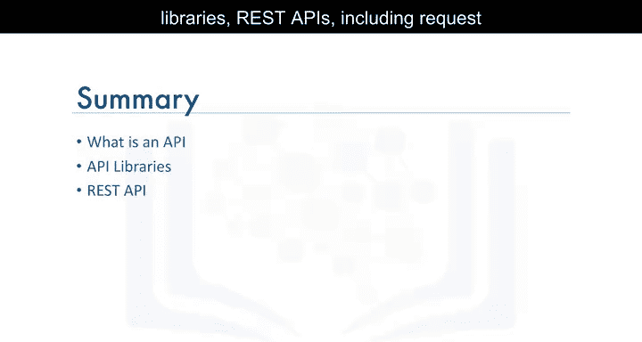

本节课中我们一起学习了API的核心概念。我们讨论了API是什么、API库、以及REST API，包括请求与响应的工作机制。理解这些概念是使用各种数据科学工具和服务进行有效集成与通信的基础。