# 014：驱动数据科学的数据集

在本节课中，我们将要学习数据集的概念、它们在数据科学中的重要性，以及如何找到它们。我们将首先定义数据集，然后探讨其常见结构，最后介绍开放数据及其获取途径。

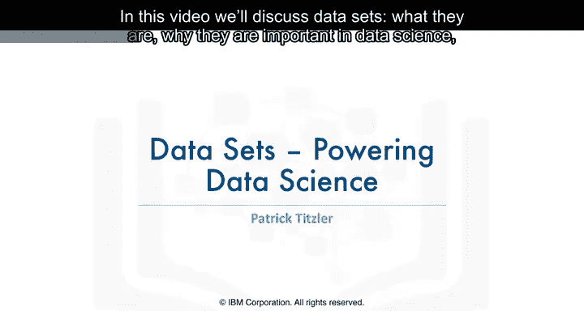

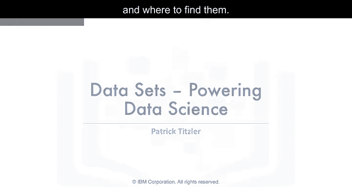

---

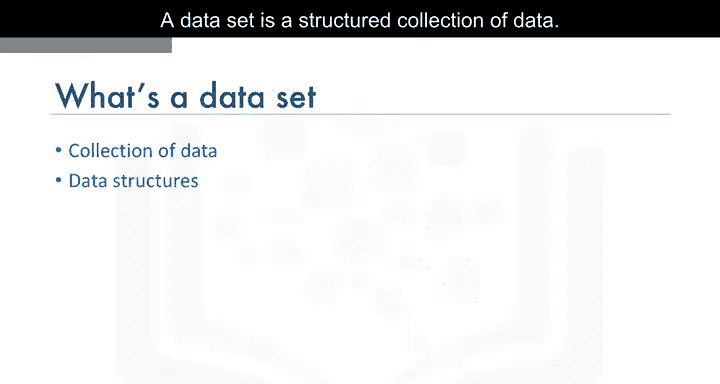

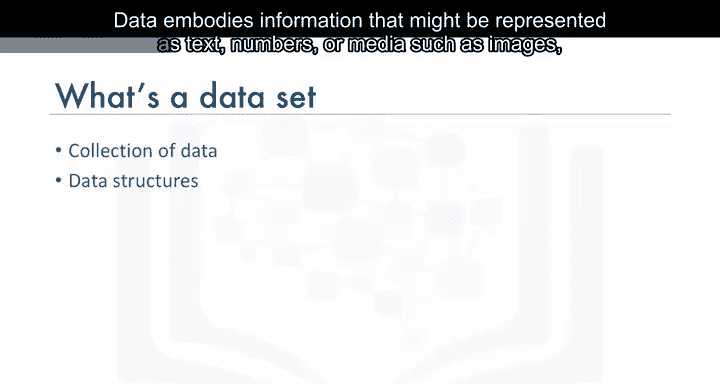

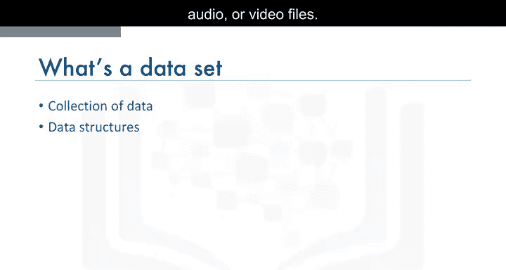

## 数据集的定义与重要性

数据集是数据的结构化集合。数据是信息的载体，可以表现为文本、数字或图像、音频、视频等媒体文件。

在数据科学中，数据集是进行分析、建模和获取洞察的基础。没有数据，数据科学工作就无法开展。

---

## 数据集的常见结构

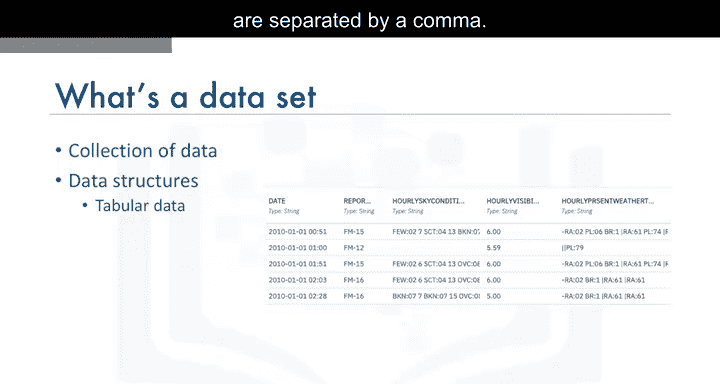

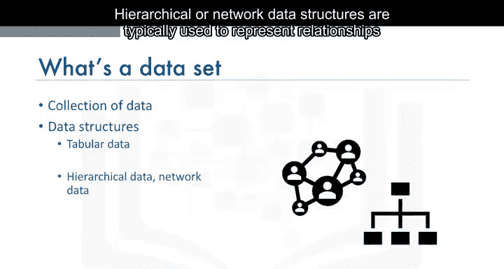

上一节我们介绍了数据集的基本概念，本节中我们来看看数据集常见的几种结构。

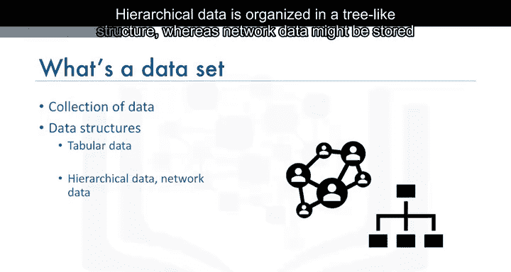

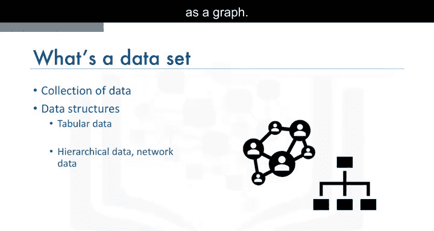

### 表格数据


表格数据是最常见的结构，它由行和列组成。每一行代表一条记录，每一列代表一个特定的属性或特征。

一种流行的表格数据格式是**逗号分隔值**文件，即CSV文件。它是一种分隔文本文件，其中每一行代表一条记录，数据值由逗号分隔。

例如，一个气象站观测数据集可能如下所示：

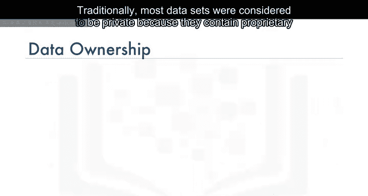

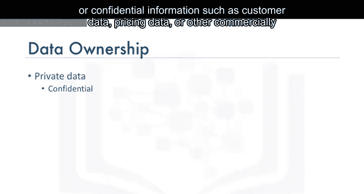

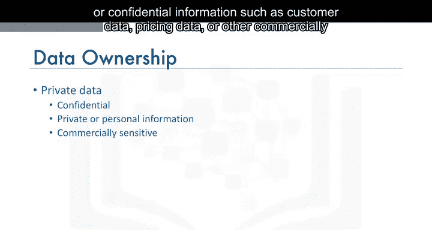

```csv
时间戳,温度(℃),湿度(%),风速(m/s)
2023-10-27 08:00:00, 22.5, 65, 3.2
2023-10-27 09:00:00, 24.1, 62, 2.8
```

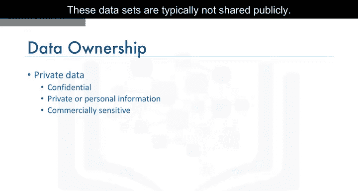

### 层次与网络结构

层次结构数据以树状形式组织，而网络结构数据通常以图的形式存储，用于表示数据间的关系。

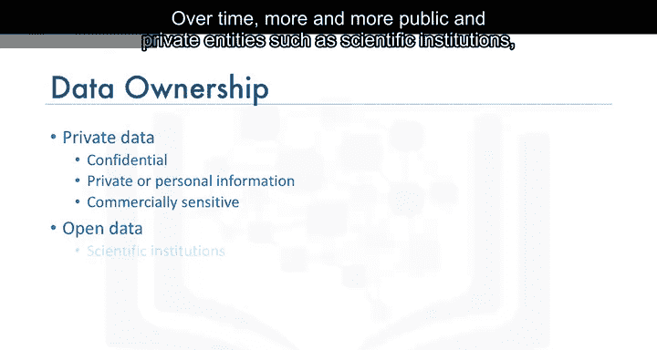

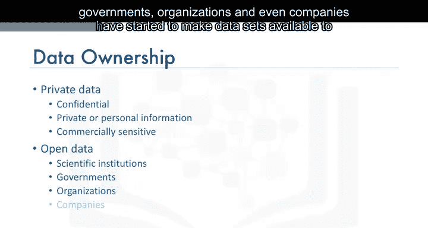

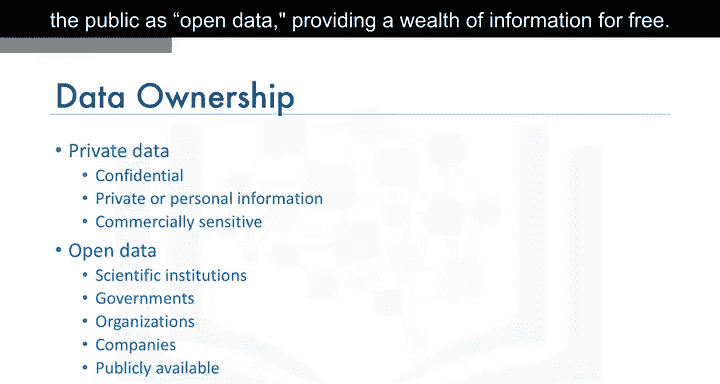

例如，社交网站上的用户连接关系通常用图来表示，其中节点代表用户，边代表用户间的联系。

### 原始文件数据

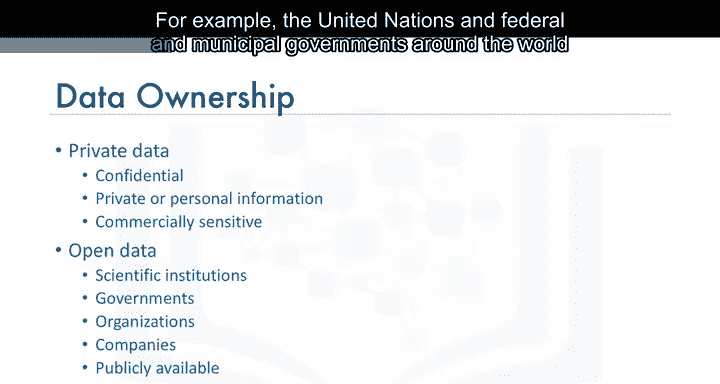

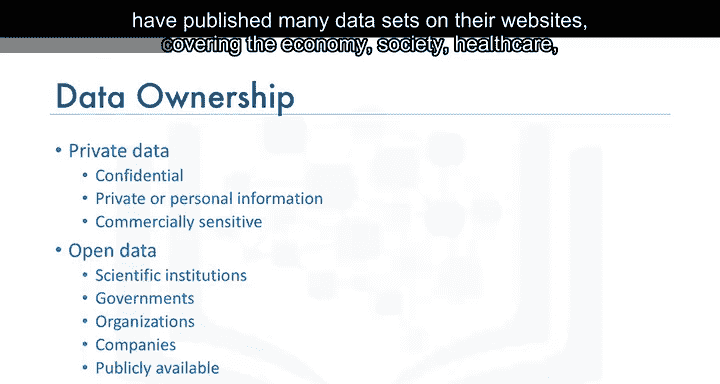

数据集也可以包含原始文件，如图像或音频。一个著名的例子是**MNIST数据集**，它包含手写数字的图像，常用于训练图像处理系统。

---

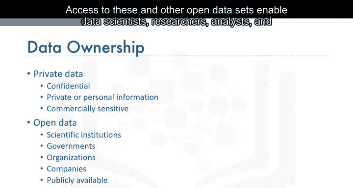

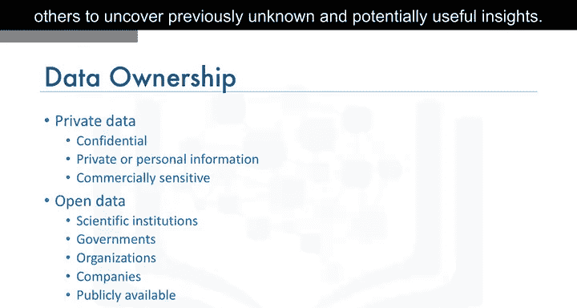

## 从私有数据到开放数据

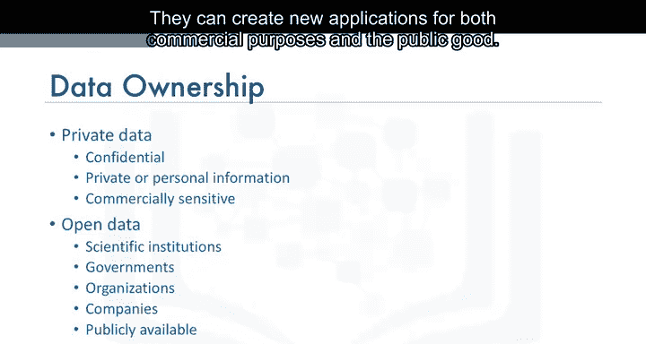

传统上，大多数数据集被视为私有资产，因为它们包含专有或机密信息，如客户数据、定价数据或其他商业敏感信息。这些数据集通常不公开共享。

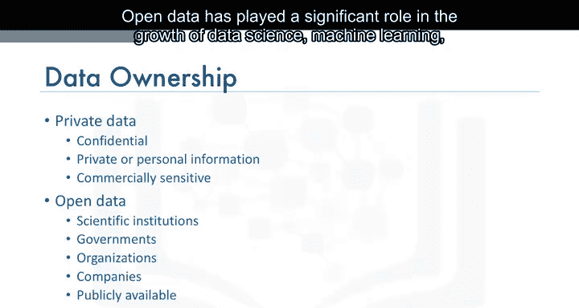

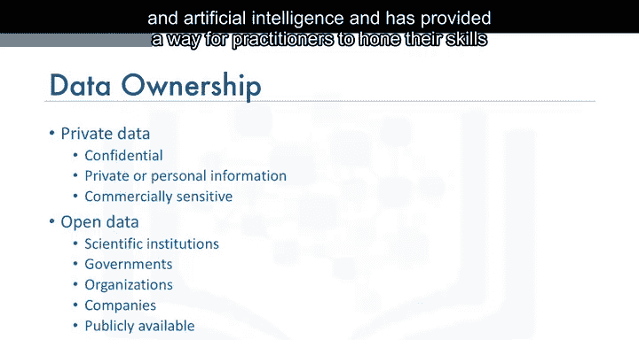

随着时间的推移，越来越多的公共和私人实体，如科研机构、政府、组织甚至公司，开始将数据集作为**开放数据**向公众提供，免费提供了丰富的信息资源。

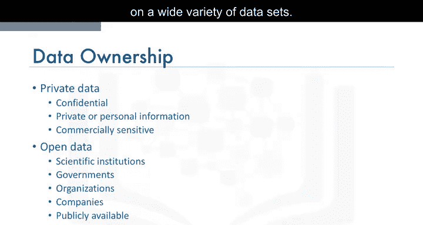

例如，联合国以及世界各地的联邦和市政府在其网站上发布了许多数据集，涵盖经济、社会、医疗保健、交通、环境等诸多领域。

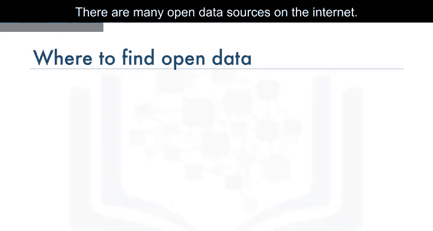

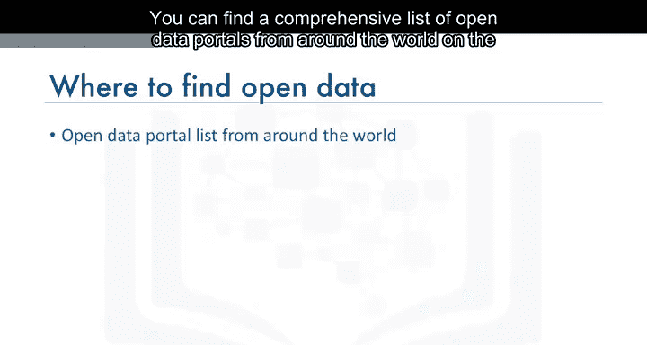

---

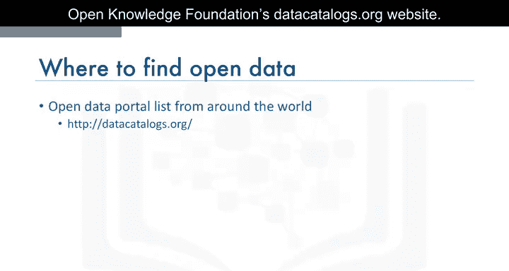

## 开放数据的作用与获取

访问这些开放数据集使数据科学家、研究人员和分析师能够发现先前未知且具有潜在价值的洞察。他们可以为商业目的或公共利益创建新的应用程序，也可以开展新的研究。

开放数据在数据科学、机器学习和人工智能的发展中发挥了重要作用，并为从业者提供了在多种数据集上磨练技能的机会。

以下是互联网上一些主要的开放数据源：

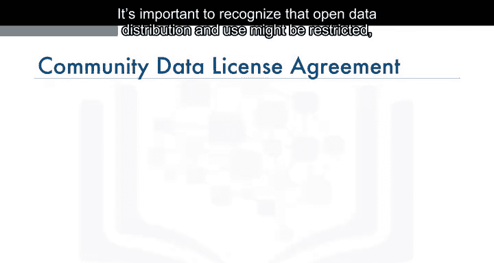

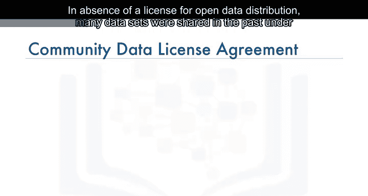

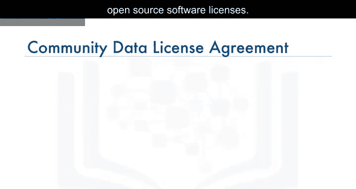

*   **开放知识基金会数据门户列表**：你可以在Open Knowledge Foundation的 `datacatalogs.org` 网站上找到全球开放数据门户的综合列表。
*   **政府与国际组织**：联合国、欧盟以及许多其他政府间和政府组织维护着数据仓库，提供广泛的信息访问。
*   **Kaggle**：这是一个流行的数据科学在线社区，你可以在此查找和贡献普遍感兴趣的数据集。
*   **Google数据集搜索**：谷歌提供了一个数据集搜索引擎，可以帮助你找到对你有特定价值的数据集。

---

## 开放数据许可协议

认识到开放数据的分发和使用可能受到其许可条款的限制非常重要。过去，许多数据在缺乏专门许可的情况下，是依据开源软件许可证共享的。

这些许可证并非为涵盖数据集分发和使用的特定问题而设计。为解决此问题，Linux基金会创建了**社区数据许可协议**。

最初创建了两种用于共享数据的许可证：

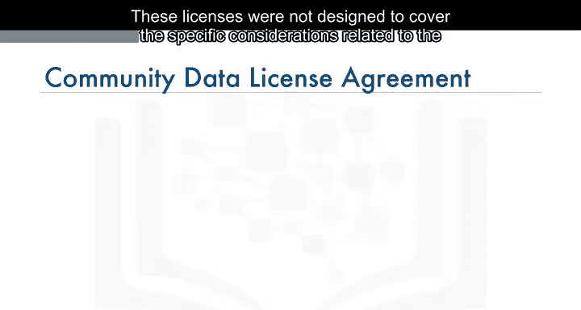

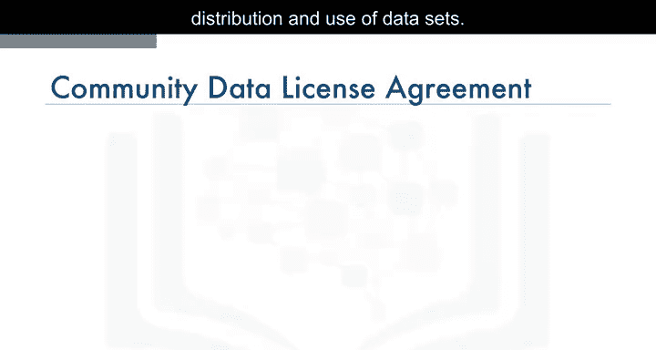

1.  **CDLA共享许可证**：此许可证授予你使用和修改数据的权限。它规定，如果你发布修改后的数据版本，必须采用与原始数据相同的许可条款。
2.  **CDLA宽松许可证**：此许可证同样授予你使用和修改数据的权限。但是，你**无需**共享对数据的更改。

需要注意的是，这两种许可证都**没有**对你通过使用数据可能得出的结果施加任何限制，这在数据科学中至关重要。

例如，假设你正在构建一个用于形成预测的模型。如果你使用CDLA许可的数据集训练模型，你没有义务分享该模型，也没有义务在特定许可下分享它（如果你选择分享的话）。

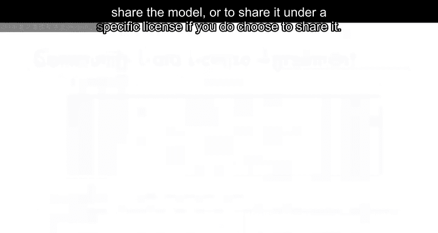

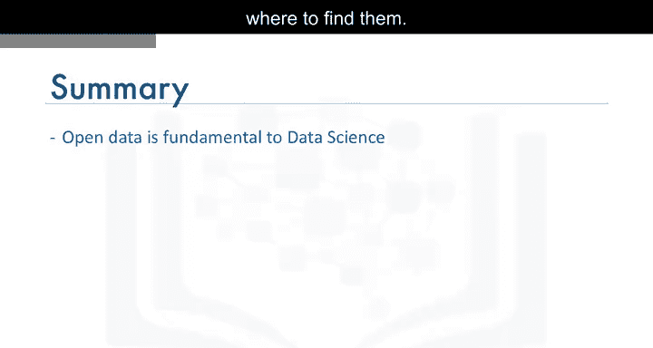

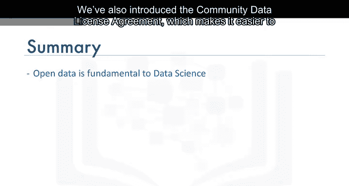

---

## 总结与下节预告

本节课中我们一起学习了数据集的核心概念、常见结构以及开放数据的重要性与获取方式。我们还介绍了**社区数据许可协议**，它使得共享开放数据变得更加容易。

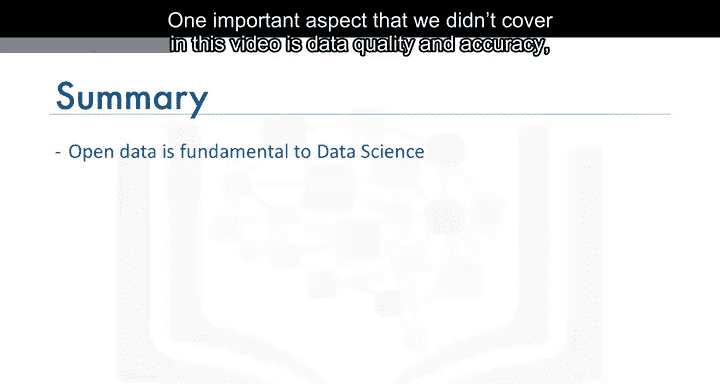

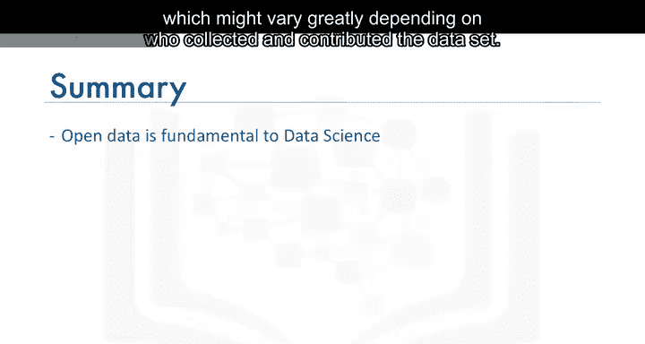

本视频未涵盖的一个重要方面是**数据质量和准确性**，这可能因数据收集和贡献者的不同而有很大差异。虽然某些开放数据对于个人使用可能足够好，但由于可能对业务产生影响，它们可能无法满足企业要求。

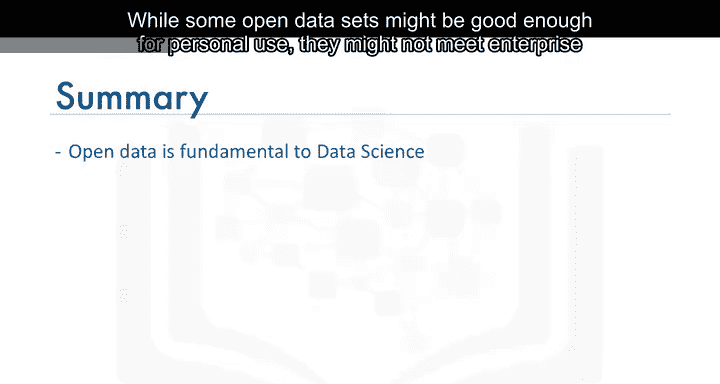

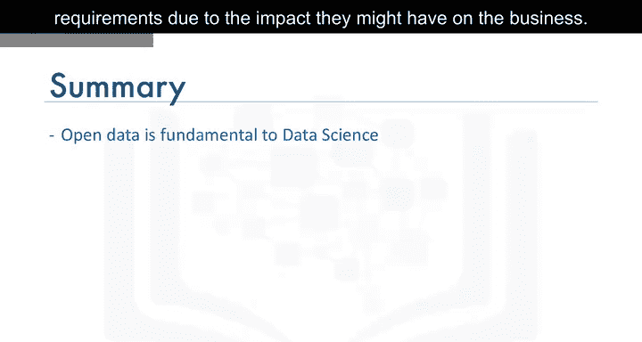

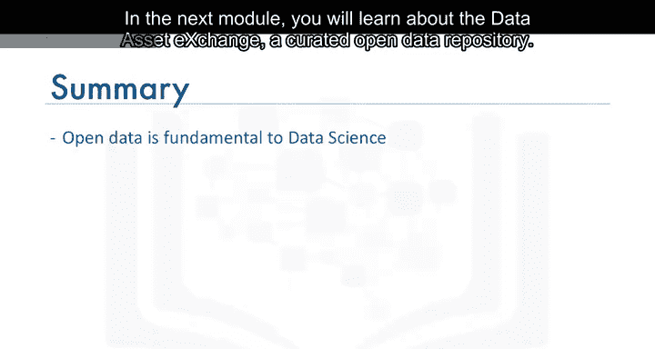

在下一个视频中，你将了解**数据资产交换**，这是一个经过策划的开放数据仓库。