# 015：企业数据共享-数据资产交换

在本节课中，我们将要学习IBM为解决高质量、授权清晰的数据集发现难题而创建的平台——**数据资产交换**。我们将了解它的核心功能、优势以及如何利用它来加速数据科学项目。

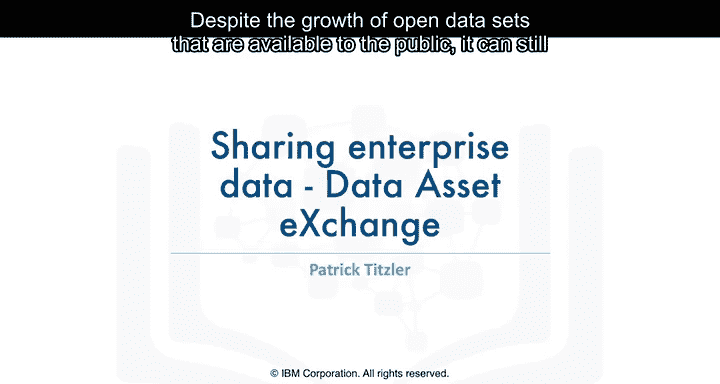

尽管可供公众使用的开放数据在不断增长，但要找到**高质量**且具有**明确定义的许可和使用条款**的数据集仍然具有挑战性。为了应对这一挑战，IBM创建了**数据资产交换**。

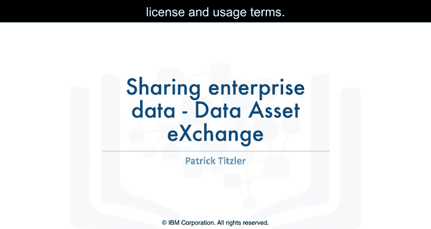

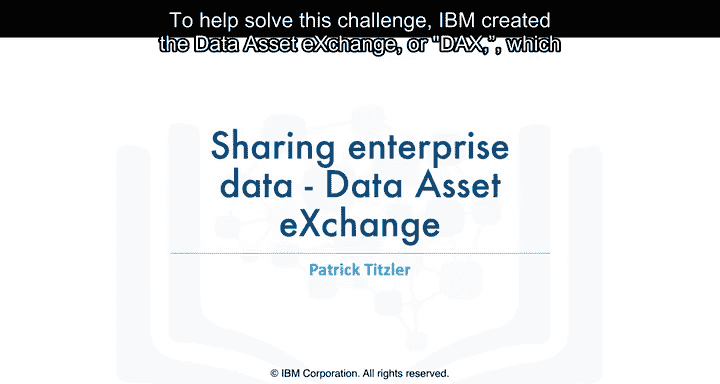

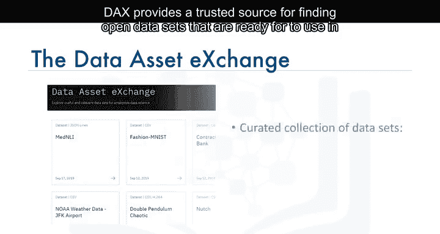

数据资产交换为企业级应用提供了一个可信赖的、**开箱即用**的开放数据源。这些数据覆盖了广泛的领域，包括图像、视频、文本和音频。

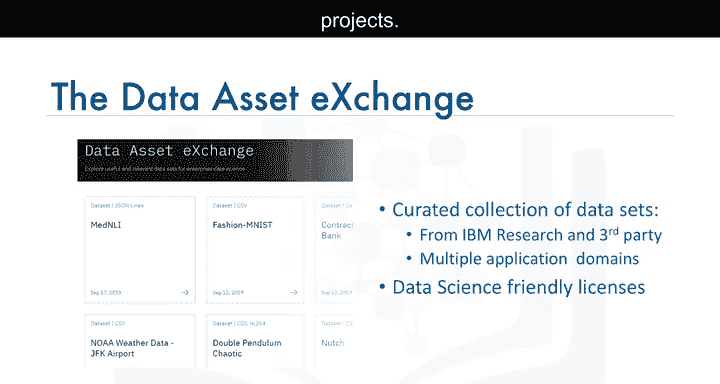

由于数据资产交换在数据质量、许可和使用条款方面提供了高水平的**策展**，因此无论是在研究还是商业项目中，采用其数据通常都更加容易。

为了促进数据共享与协作，数据资产交换尽可能使数据集在**社区数据许可协议**的某个变体下可用。同时，它也为访问独特的数据集（特别是来自IBM研究项目的数据）提供了一个统一的平台。

为了让开发者更容易开始使用这些数据集，数据资产交换还以**Jupyter Notebook**的形式提供了教程。这些教程会引导用户完成数据清洗、预处理和探索性分析的基础工作。

对于某些数据集，还提供了展示如何进行更复杂分析的Notebook，例如创建图表、统计分析、时间序列分析、训练机器学习模型，以及使用**模型资产交换**集成深度学习。通过这种方式，数据资产交换帮助开发者在明确定义的许可条款下，自信地使用开放数据和模型，创建端到端的分析和机器学习工作流。

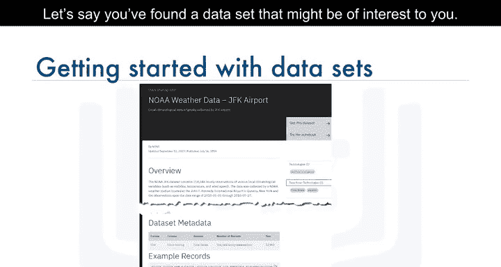

假设您在数据集页面上找到了一个感兴趣的数据集，您可以进行以下操作：

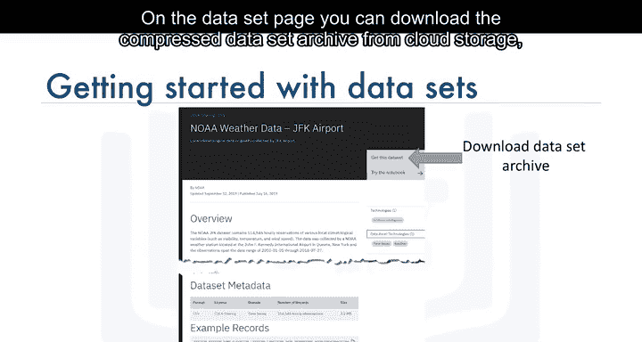

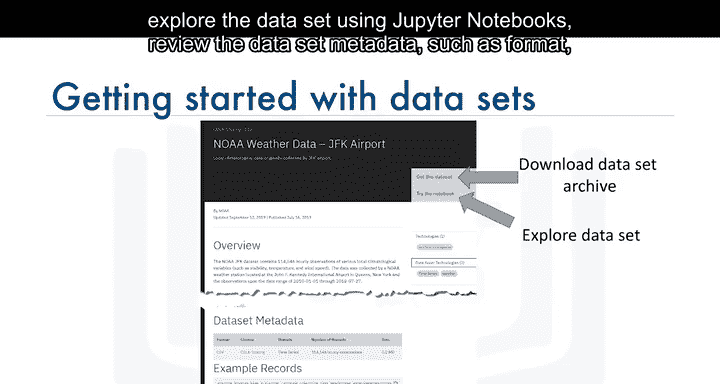

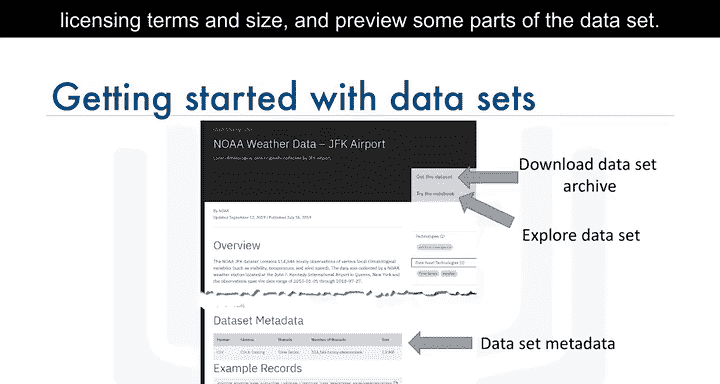

以下是您可以对数据集执行的核心操作列表：
*   从云存储下载压缩的数据集归档文件。
*   使用Jupyter Notebook探索数据集。
*   查看数据集元数据，如格式、许可条款和大小。
*   预览数据集的部分内容。

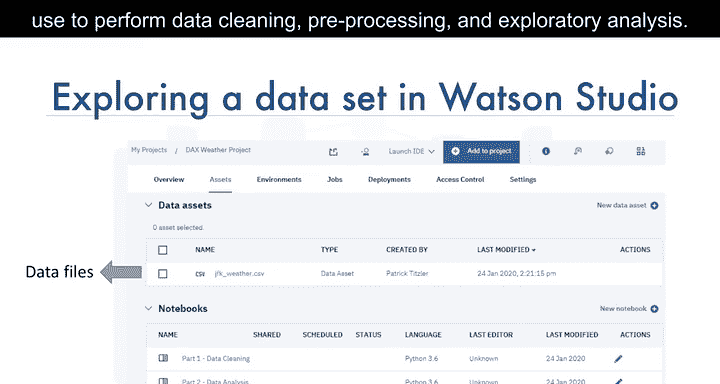

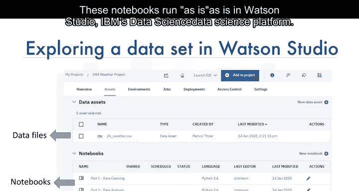

数据资产交换上的大多数数据集都配有一个或多个Jupyter Notebook，您可以用它们来执行数据清洗、预处理和探索性分析。这些Notebook可以在**Watson Studio**（IBM的数据科学平台）中直接运行。Jupyter Notebook和Watson Studio将在本课程后续内容中详细介绍。

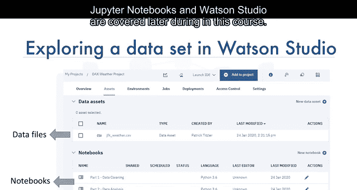

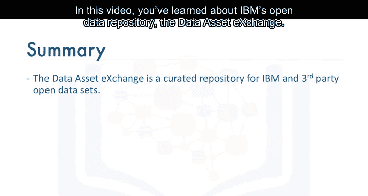

本节课中，我们一起学习了IBM的开放数据存储库——**数据资产交换**。在动手实验环节，您将有机会亲自探索这个资源库。