# 016：机器学习与深度学习模型 🧠

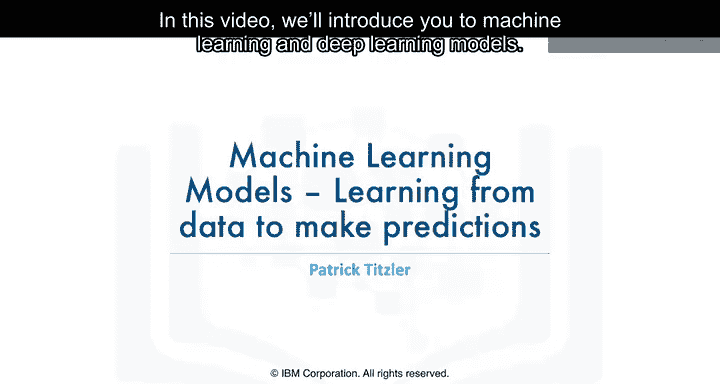

在本节课中，我们将介绍机器学习与深度学习模型的基本概念、主要类型及其应用场景。我们将了解模型如何从数据中学习，以及如何利用它们解决实际问题。

数据蕴含着丰富的信息，可用于解决特定类型的问题。

传统的数据分析方法，例如人工检查数据或自动化人类分析的专用计算机程序，由于待分析的数据量巨大或问题复杂性高，其能力很快会达到极限。

机器学习使用算法（也称为**模型**）来识别数据中的模式。

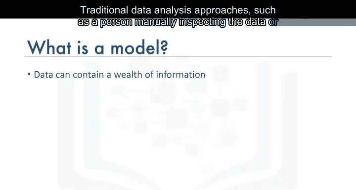

模型从数据中学习这些模式的过程称为**模型训练**。

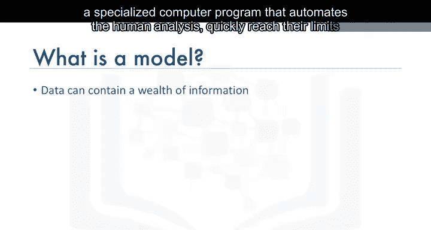

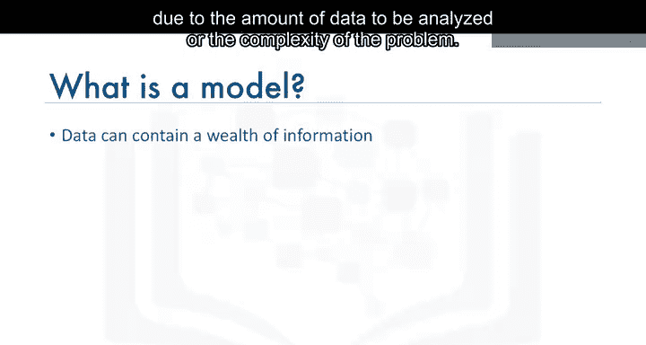

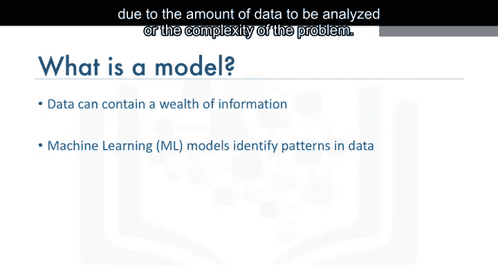

模型训练完成后，当呈现新数据时，它就可以用来进行预测。模型会尝试根据从过去数据中学到的模式进行预测或决策。

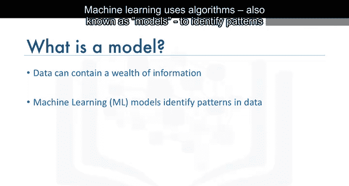

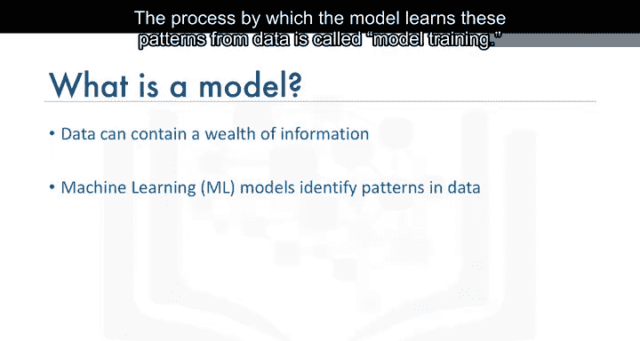

## 机器学习模型的三大类别

上一节我们了解了模型训练的基本概念，本节中我们来看看机器学习模型的三种基本类型。

机器学习模型可分为三个基本类别：**监督学习**、**无监督学习**和**强化学习**。

### 监督学习 👁️

监督学习是最常用的机器学习模型类型之一。在监督学习中，人类提供输入数据和正确的输出结果。

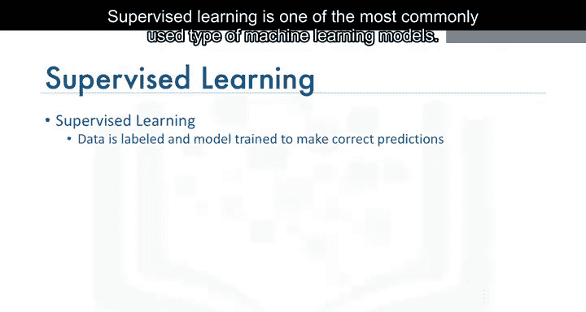

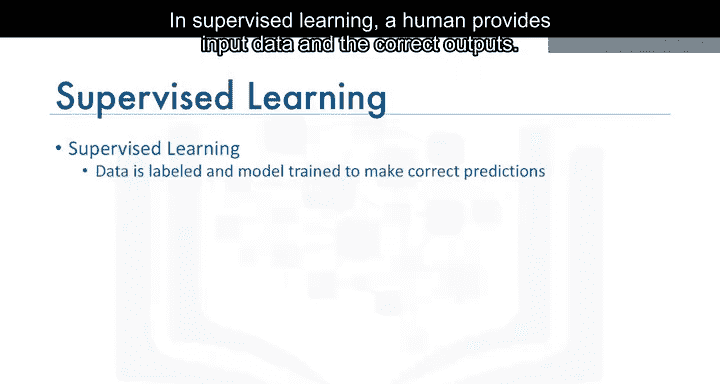

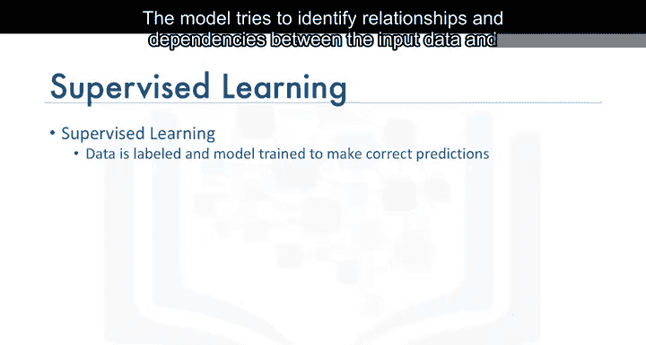

模型试图识别输入数据与正确输出之间的关系和依赖关系。

一般来说，监督学习用于解决**回归**和**分类**问题。以下是每种问题类型的示例。

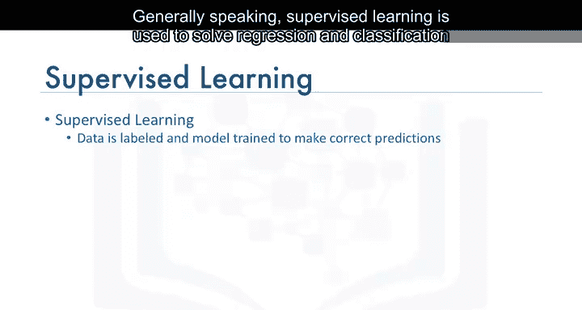

#### 回归模型

回归模型用于预测数值或实际值。

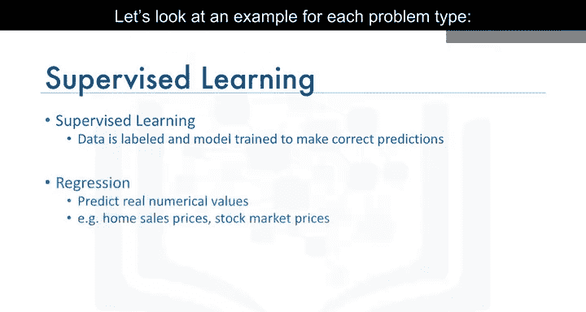

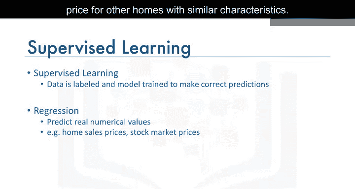

例如，给定过去房屋销售的信息（如地理位置、面积、卧室数量和销售价格），你可以训练一个模型来预测具有相似特征的其他房屋的估计销售价格。

#### 分类模型

分类模型用于预测某物是否属于某个类别。

例如，给定一组电子邮件，以及它们是否被视为垃圾邮件的标记，可以训练一个算法来识别未经请求的电子邮件。

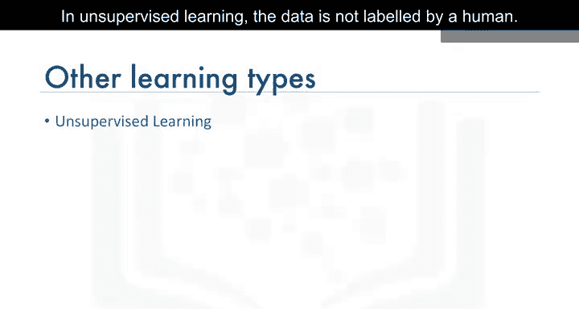

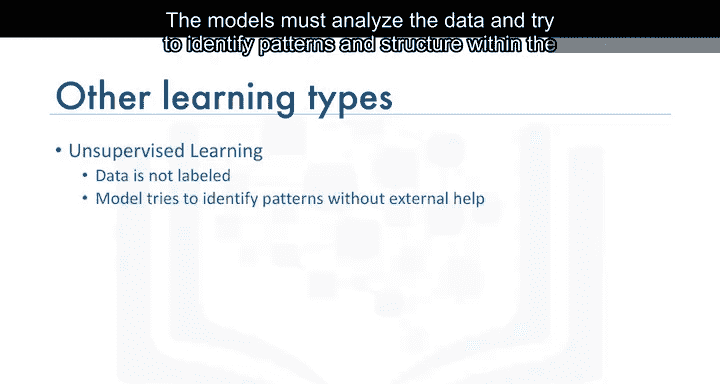

### 无监督学习 🕵️

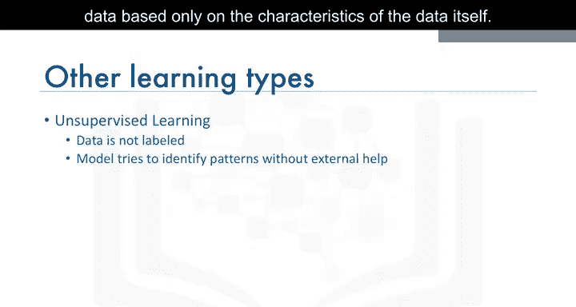

在无监督学习中，数据没有人工标记。模型必须分析数据，并仅根据数据本身的特征尝试识别其中的模式和结构。

以下是这种学习风格的两个例子。

#### 聚类模型

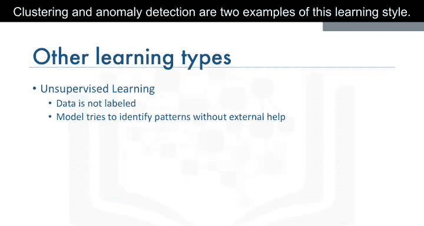

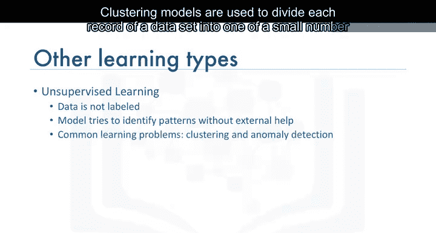

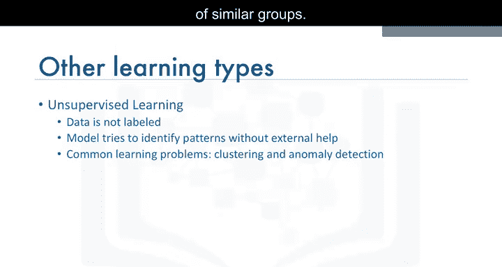

聚类模型用于将数据集的每条记录划分到少数几个相似组中的一个。

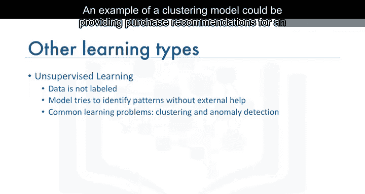

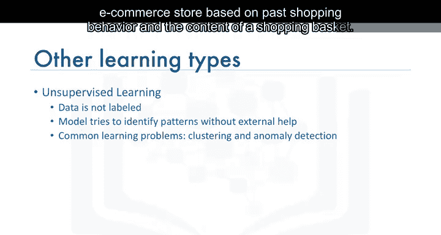

聚类模型的一个例子可以是，根据过去的购物行为和购物车内容，为电子商务商店提供购买推荐。

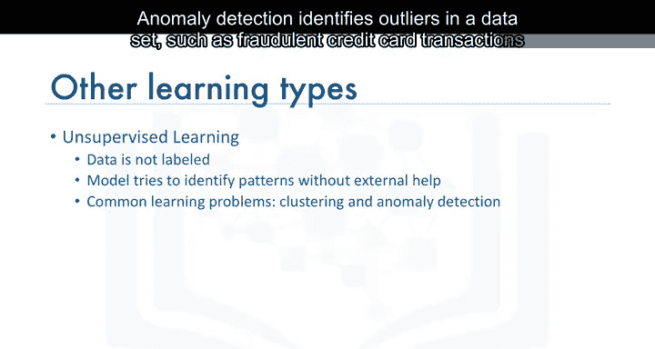

#### 异常检测

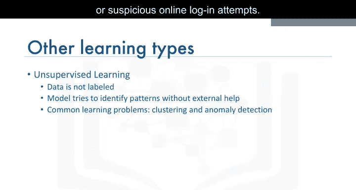

异常检测用于识别数据集中的异常值，例如欺诈性信用卡交易或可疑的在线登录尝试。

### 强化学习 🐭

第三种学习类型是强化学习，它大致基于人类和其他生物的学习方式。

想象一只在迷宫中的老鼠。如果老鼠到达迷宫终点，它会得到一块奶酪。这是完成任务获得的奖励。老鼠通过试错学习如何穿过迷宫以获得尽可能多的奶酪。

类似地，强化学习模型学习在当前环境下采取的最佳行动组合，以随时间获得最多的奖励。

这种学习类型最近在围棋、国际象棋和流行的策略视频游戏等游戏中，击败最优秀的人类玩家方面取得了巨大成功。

## 深度学习简介

上一节我们介绍了三种主要的机器学习范式，本节中我们来看看一个更专门的领域——深度学习。

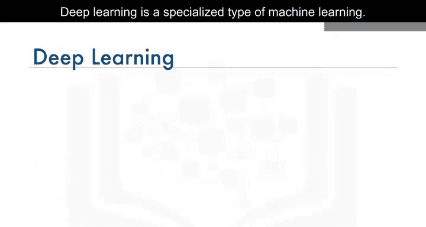

深度学习是机器学习的一种专门类型。它指的是一套通用的模型和技术，试图大致模拟人脑解决广泛问题的方式。

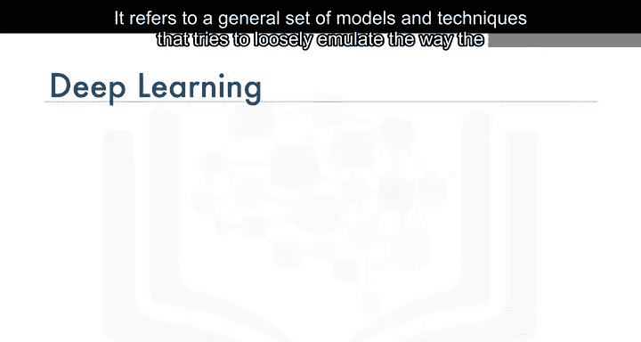

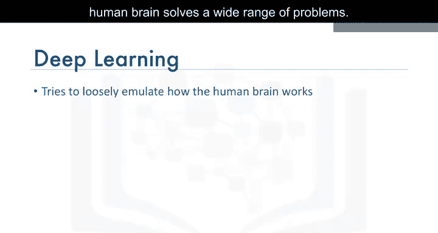

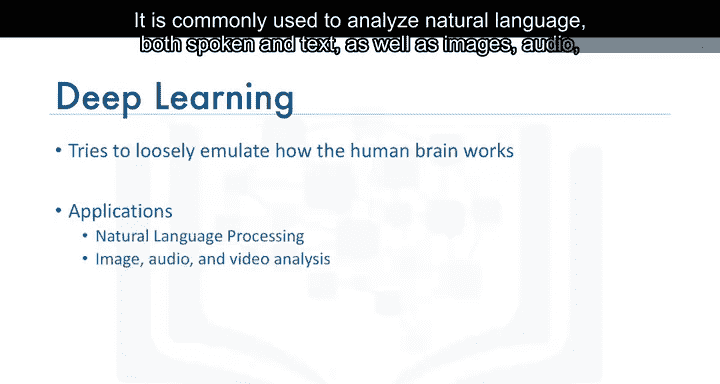

它通常用于分析自然语言（包括口语和文本）、图像、音频和视频，预测时间序列数据等等。

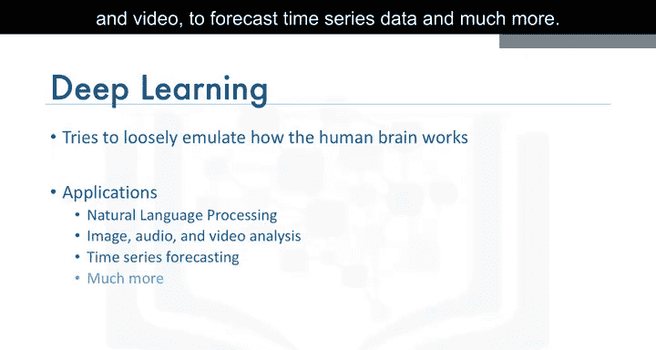

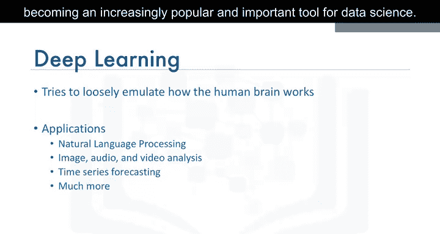

深度学习在这些和其他领域最近取得了许多成功，因此正成为数据科学中日益流行和重要的工具。

深度学习通常需要非常大的标记数据集来训练模型，计算密集，并且通常需要专用硬件才能获得可接受的训练时间。

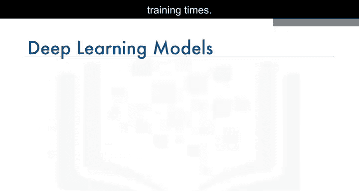

你可以从头开始构建自定义的深度学习模型，也可以使用公共模型库中的预训练模型。

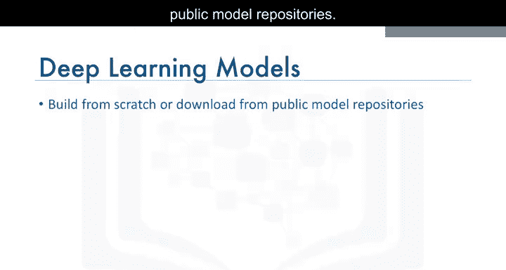

## 深度学习框架与模型库

了解了深度学习的基本概念后，我们来看看实现和获取模型的工具。

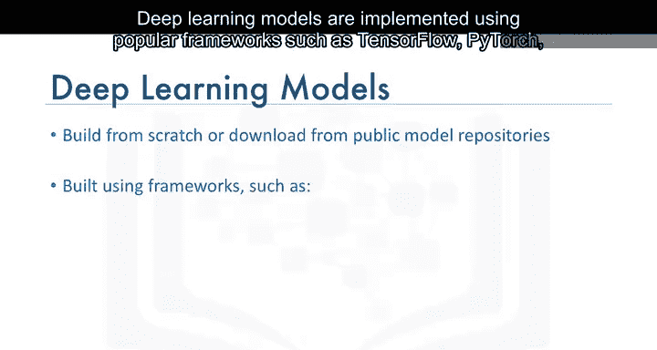

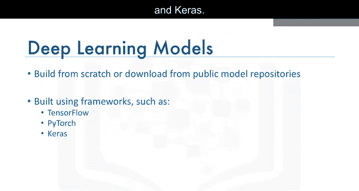

深度学习模型使用流行的框架实现，例如 **TensorFlow**、**PyTorch** 和 **Keras**。

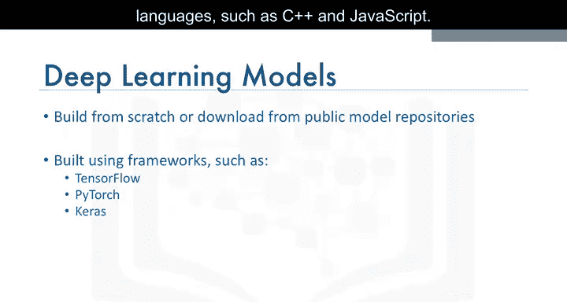

深度学习框架通常提供 Python API，许多也支持其他编程语言，如 C++ 和 JavaScript。

你可以从通常被称为“模型动物园”的存储库下载预训练的最先进模型。

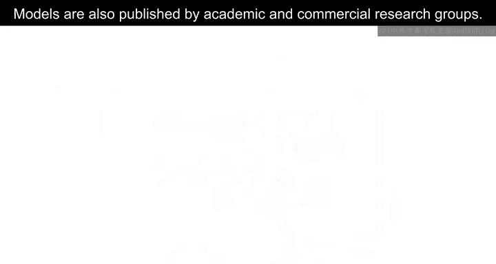

流行的模型动物园包括由 TensorFlow、PyTorch、Keras 和 ONNX 提供的那些。模型也由学术和商业研究小组发布。

## 构建深度学习模型的简要流程

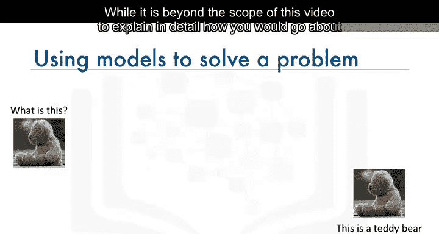

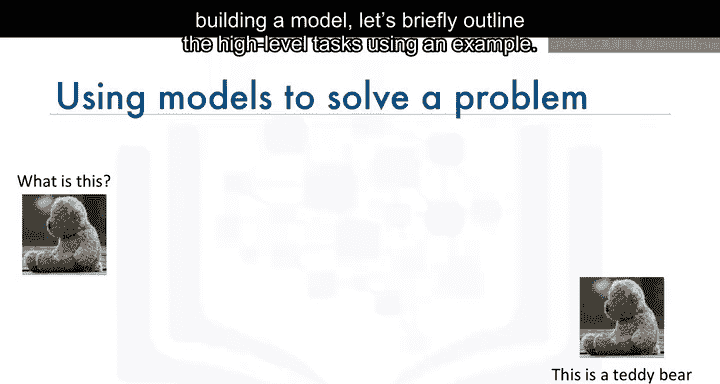

虽然详细解释如何构建模型超出了本视频的范围，但让我们通过一个例子简要概述一下高级任务。

假设你想通过训练一个深度学习模型，使应用程序能够识别图像中的物体。

以下是构建模型的主要步骤。

首先，收集并准备用于训练模型的数据。

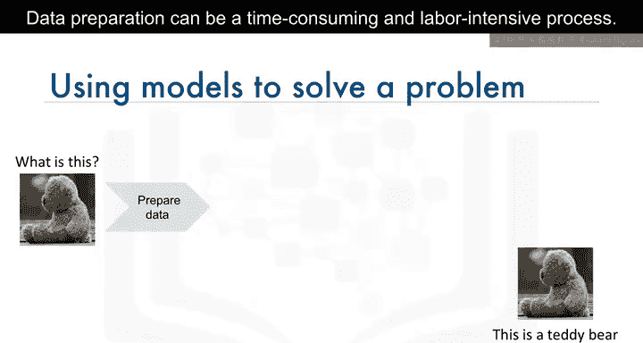

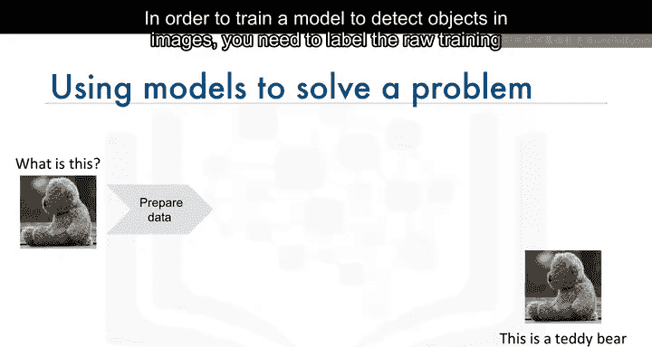

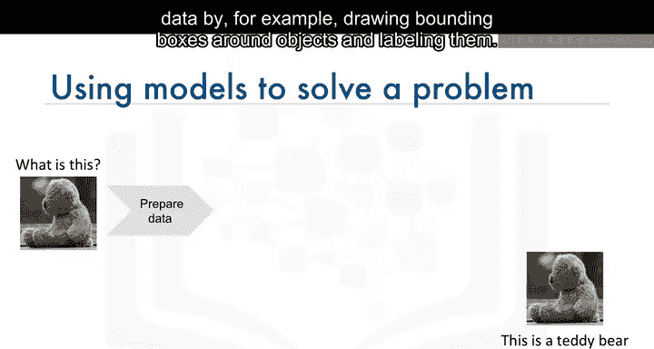

数据准备可能是一个耗时且劳动密集的过程。为了训练一个检测图像中物体的模型，你需要标记原始训练数据，例如，在物体周围绘制边界框并为其添加标签。

接下来，从头开始构建模型，或从公共或私有资源中选择一个可能非常适合该任务的现有模型。

然后，在你准备好的数据上训练模型。在训练期间，你的模型从标记数据中学习如何识别图像中描绘的物体。

训练开始后，你分析训练结果，并重复此过程，直到训练后的模型性能满足你的要求。

当训练后的模型达到期望的性能时，你将其部署，使其对你的应用程序可用。

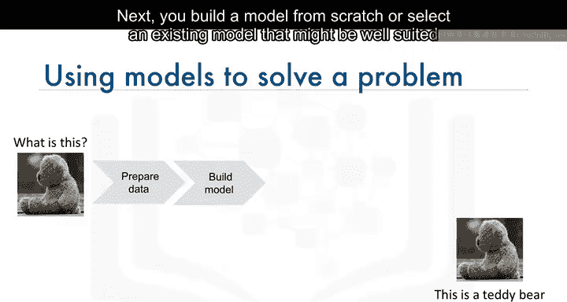

## 总结

本节课中，我们一起学习了机器学习和深度学习的基本概念、它们的用途以及在哪里可以找到开源模型。

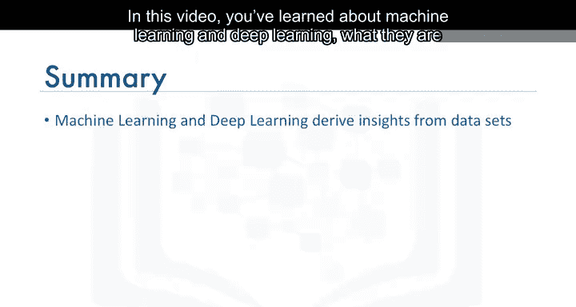

在下一个视频中，我们将向你介绍模型资产交换中心，这是一个精心策划的、即用且可定制的深度学习模型集合。