# 018：Jupyter Notebook入门

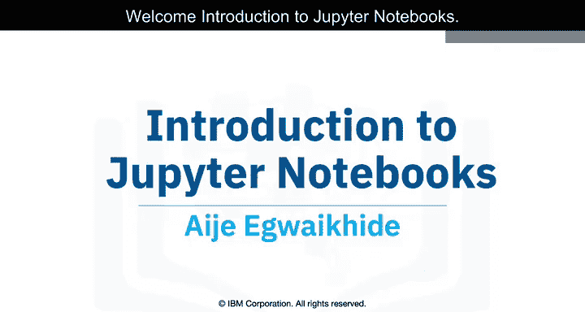

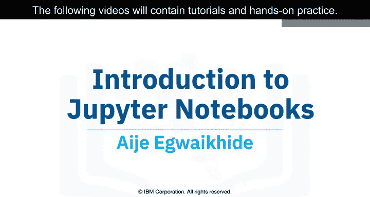

在本节课中，我们将学习Jupyter Notebook是什么，了解其基本概念、核心功能以及如何开始使用它。本教程将引导你认识Jupyter，并介绍一些基础语法。后续视频将包含更详细的教程和动手实践环节。

---

## 什么是Jupyter Notebook？🔍

Jupyter Notebook是一个基于浏览器的应用程序，它允许你创建和共享包含**代码**、**公式**、**可视化图表**、叙述性文本、链接等多种内容的文档。

它类似于科学家的实验笔记本。科学家会在其中记录实验的所有步骤和结果，以确保未来可以复现实验。同样地，Jupyter Notebook允许数据科学家记录他们的**数据实验**和**结果**，并使得任何人都可以使用和重复相同的实验。

一个Jupyter Notebook文件允许数据科学家将**描述性文本**、**代码块**和**代码输出**组合在单个文件中。当你运行代码时，它会在Notebook文件内生成输出（包括图表和表格）。然后，你可以将Notebook导出为PDF或HTML文件，以便与任何人共享。

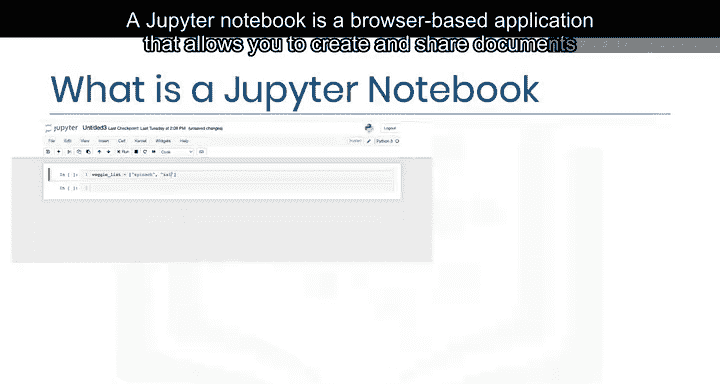

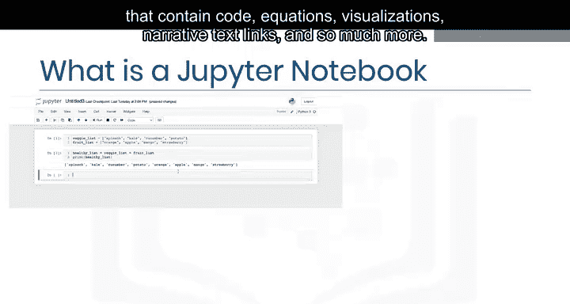

---

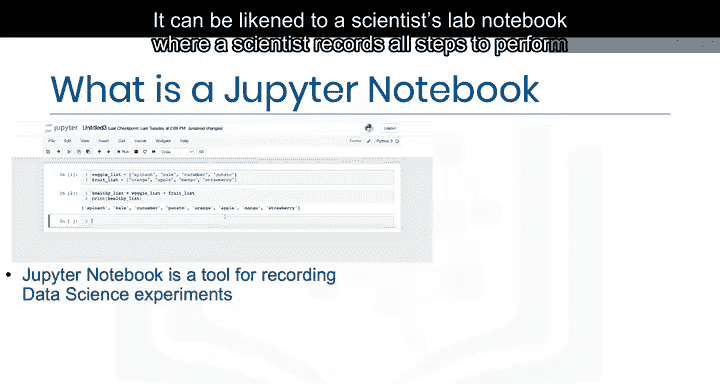

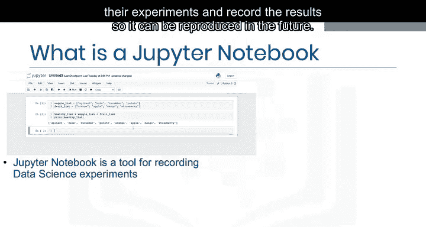

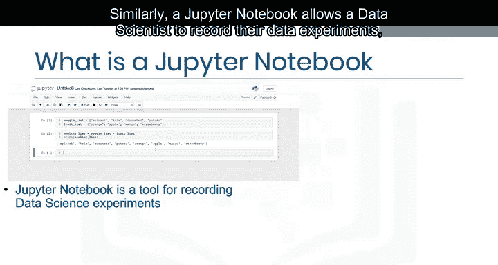

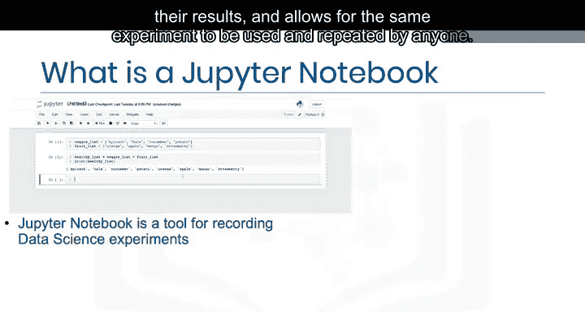

## Jupyter的起源与发展 🌱

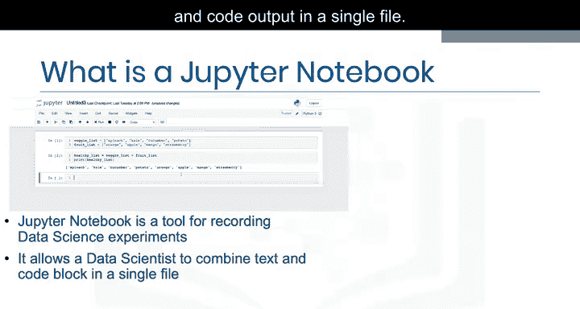

Jupyter Notebook最初起源于**IPython**，专为Python编程语言开发。后来，它开始支持更多语言，因此更名为**Jupyter**。这个名字代表了**Ju**lia、**Py**thon和**R**这三种语言。如今，Jupyter Notebook已经支持许多其他编程语言。

---

## Jupyter Lab：更强大的工作环境 🧪

上一节我们介绍了基础的Jupyter Notebook。本节中我们来看看它的增强版——Jupyter Lab。

Jupyter Lab也是一个基于浏览器的应用程序，它允许你访问多个Jupyter Notebook文件以及其他代码和数据文件。Jupyter Lab通过让你能够以灵活、集成和可扩展的方式处理多个Notebook、文本编辑器、终端和自定义组件，从而扩展了Jupyter Notebook的功能。

以下是Jupyter Lab的一些核心功能：
*   **交互式控制**：可以交互式地控制Notebook的单元格和输出。
*   **实时编辑**：支持实时编辑Markdown、CSV等格式。
*   **多格式兼容**：兼容多种文件格式，如CSV、JSON、PDF、Vega等。
*   **开源**：Jupyter Lab是一个开源项目。

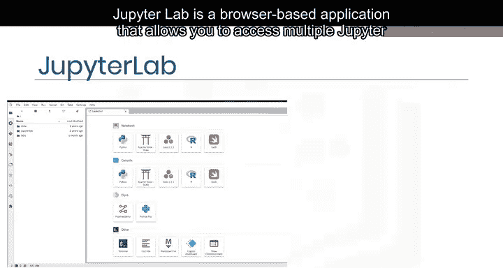

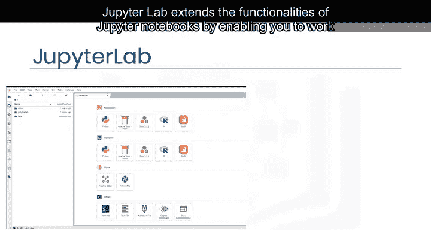

---

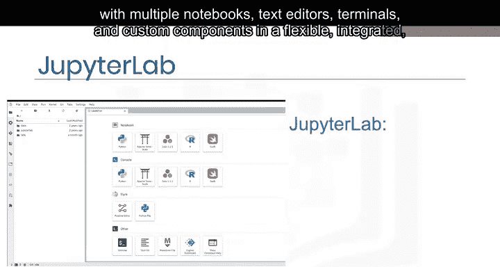

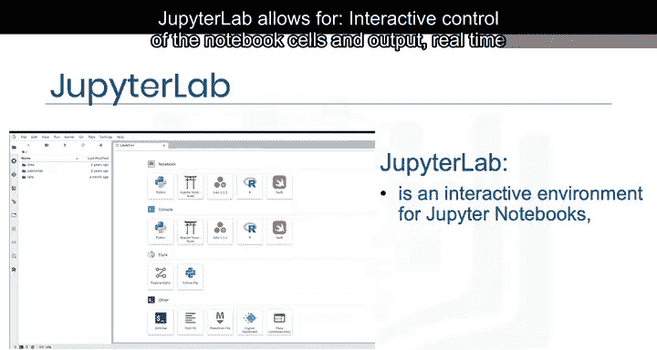

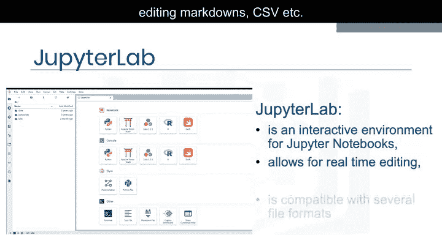

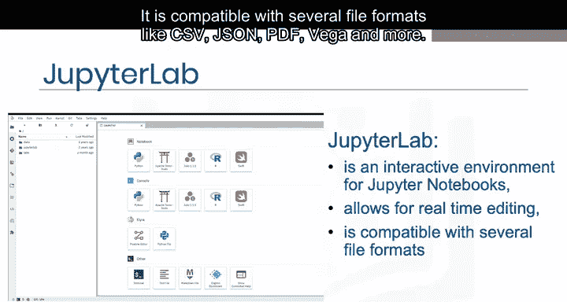

## 如何使用Jupyter Notebook？ 🚀

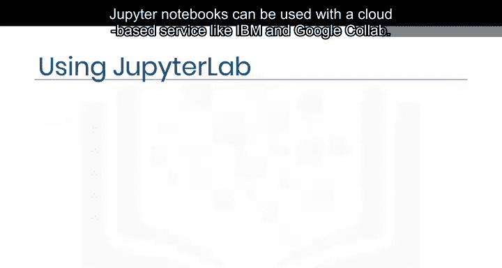

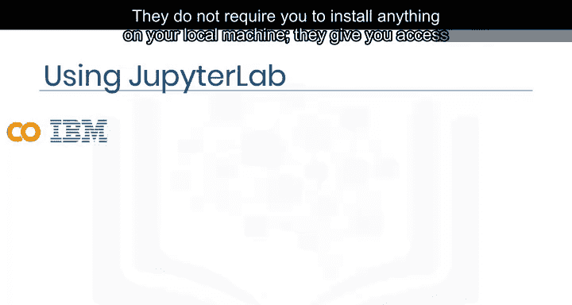

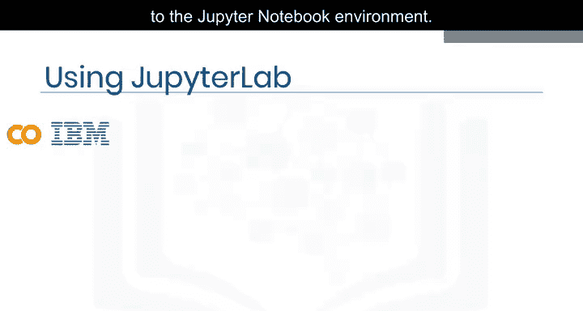

了解了Jupyter Notebook和Lab是什么之后，本节我们来看看如何获取和使用它们。

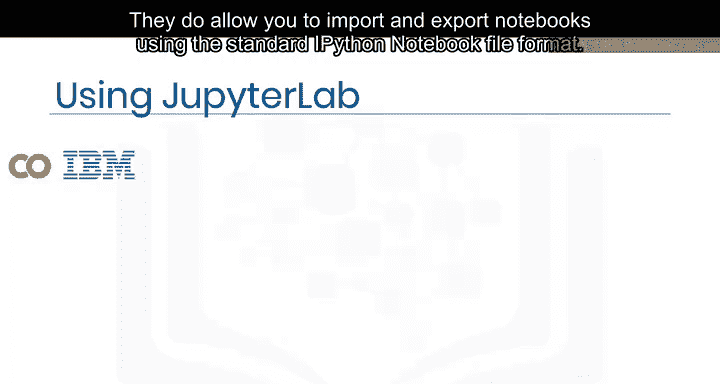

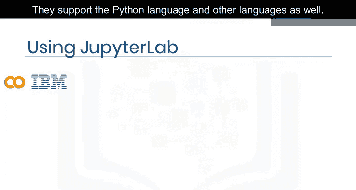

Jupyter Notebook可以通过多种方式使用：

**1. 云端服务**
Jupyter Notebook可以与IBM Cloud或Google Colab等基于云的服务一起使用。这种方式**不需要**你在本地机器上安装任何软件。它为你提供对Jupyter Notebook环境的访问，允许你使用标准的`.ipynb`文件格式导入和导出Notebook，并支持Python及其他语言。

**2. 本地安装**
你也可以在本地电脑上安装Jupyter Notebook。
*   **通过命令行安装**：可以使用`pip`安装命令。
    ```bash
    pip install notebook
    ```
*   **通过Anaconda平台安装**：可以从Anaconda官网下载。Anaconda是一个流行的发行版，包含了Jupyter和Jupyter Lab。为了在本课程中学习，你可以通过Skills Network Labs访问托管的Jupyter Lab版本，因此**无需**在自己的设备上下载和安装任何软件即可完成动手实验。

你会看到一个类似下图的屏幕，它在虚拟环境中启动了Jupyter Lab。只需点击“Open Tool”即可开始。

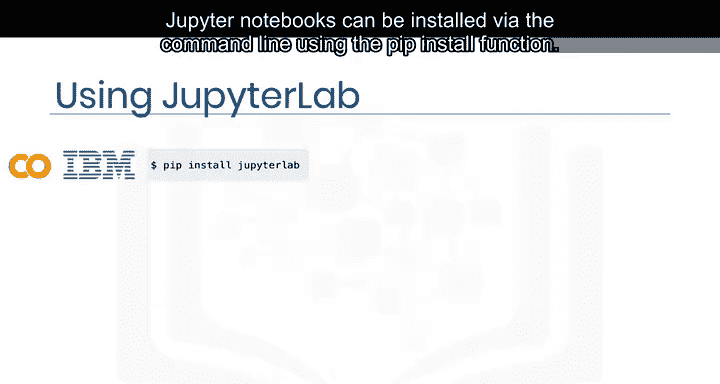

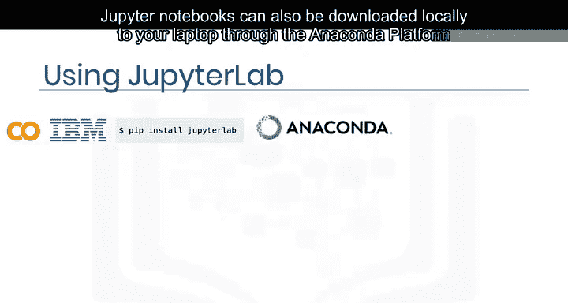

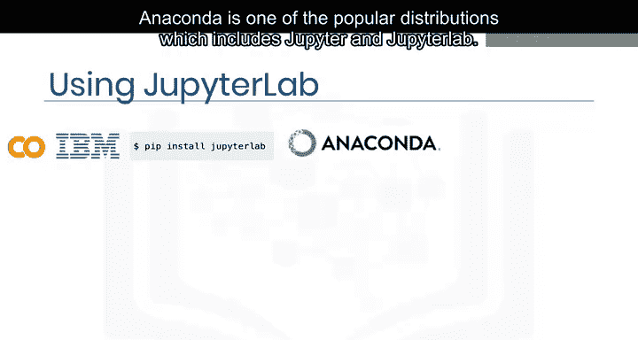

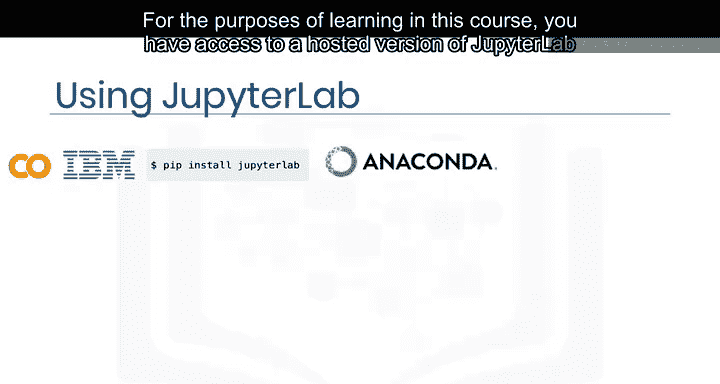

---

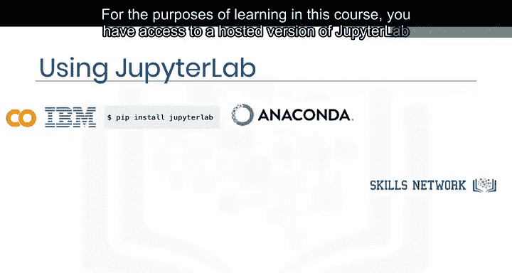

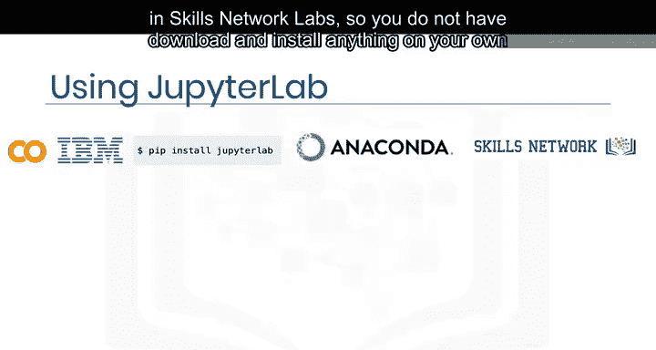

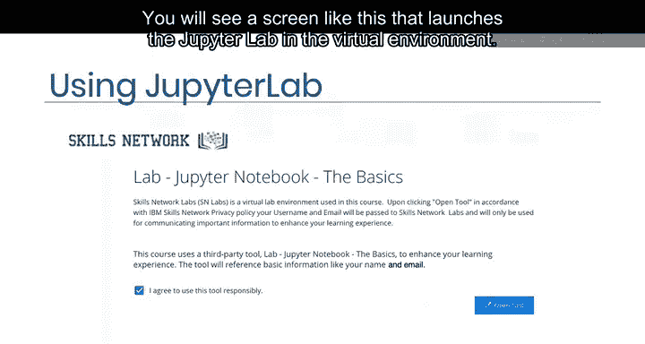

## 课程总结 📝

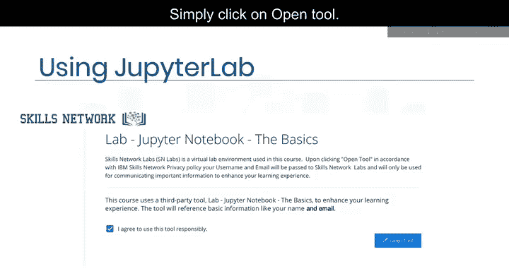

本节课中，我们一起学习了Jupyter Notebook在数据科学中的核心作用。你现在应该熟悉了：
*   Jupyter Notebook如何用于记录数据实验和项目。
*   Jupyter Lab如何兼容多种文件和数据科学语言。
*   安装和使用Jupyter Notebook的不同方式。

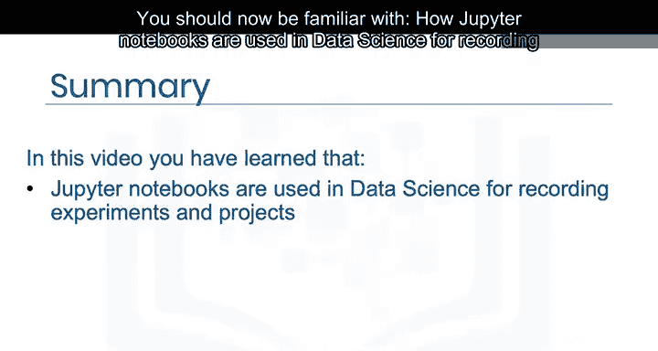

希望本教程能帮助你顺利开始使用Jupyter Notebook进行数据科学探索。