# 019：Jupyter Notebook 基础操作教程


在本节课中，我们将学习Jupyter Notebook的基本操作，包括如何启动、运行代码、管理单元格、使用Markdown进行演示，以及如何正确关闭会话。

---

## 🚀 启动Jupyter Notebook

在本模块的实验环节，我们可以使用Skills Network虚拟环境启动一个Notebook。

只需点击“打开工具”，环境将启动JupyterLab。

JupyterLab将打开一个类似这样的Notebook。启动Notebook后，我们可以通过点击“文件”，然后重命名Notebook来更改其名称。

我们现在可以开始新项目的工作。让我们打印“Hello World”来验证环境运行正常。要从代码单元格获得输出，必须运行该单元格。

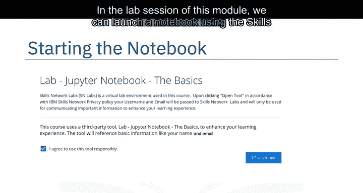

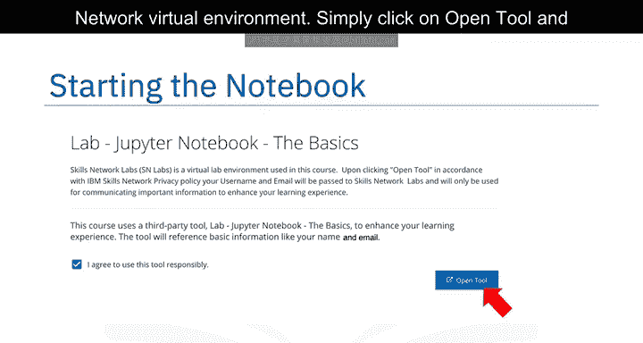

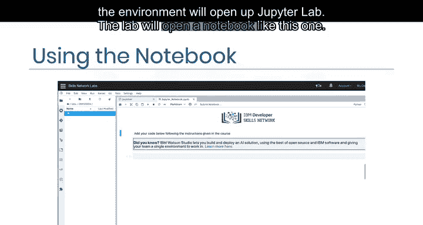

要运行单元格，请将光标置于单元格内，并点击屏幕顶部的“运行”按钮。

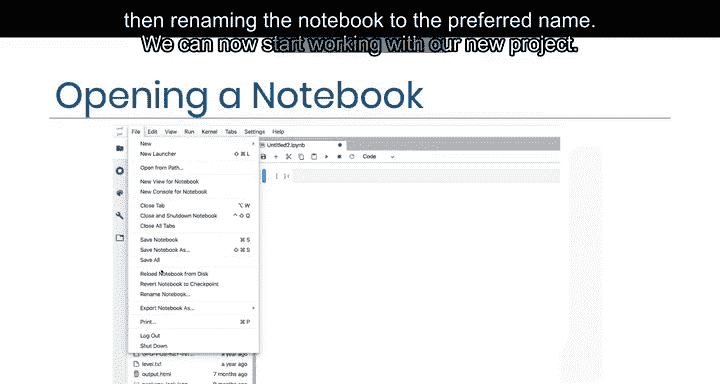

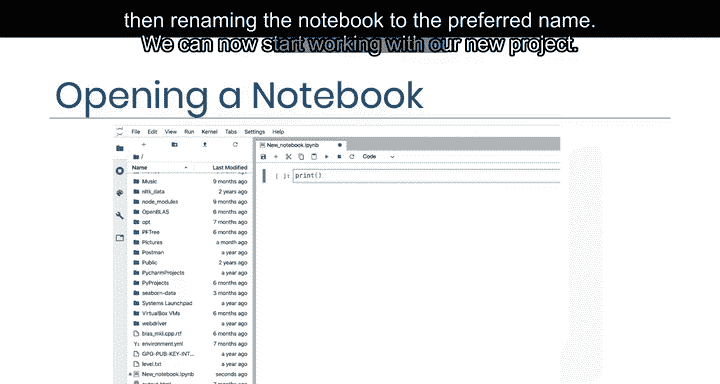

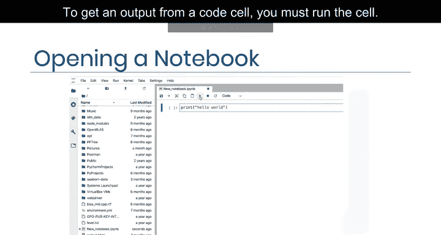

然后点击“运行选中单元格”来运行当前高亮的单元格。要使用快捷键，请按 `Shift + Enter`。

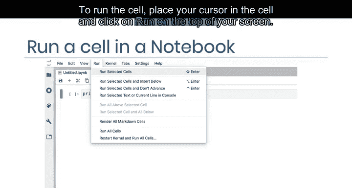

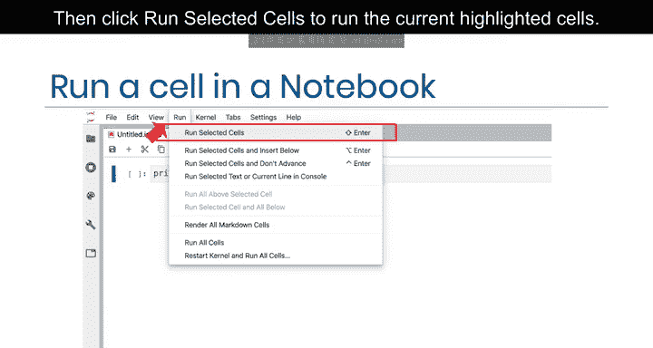

您也可以通过点击“运行所有单元格”来运行Notebook中的所有单元格。

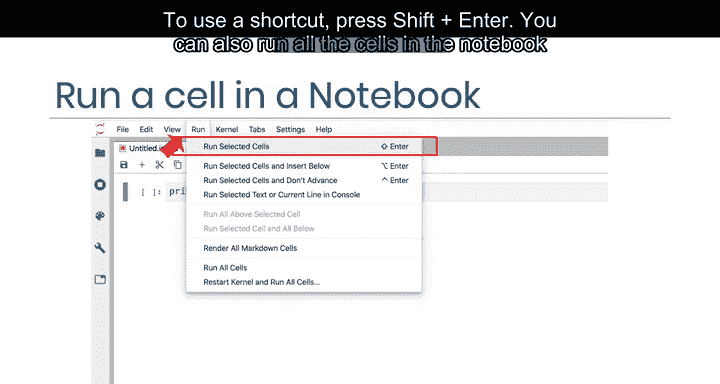

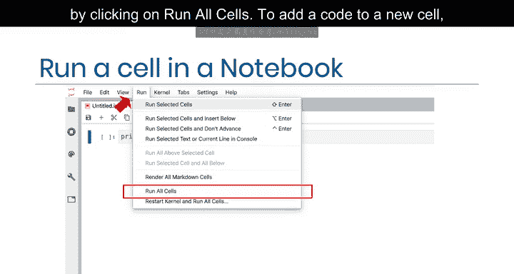

要添加新代码单元格，请点击加号图标 `+`。

---

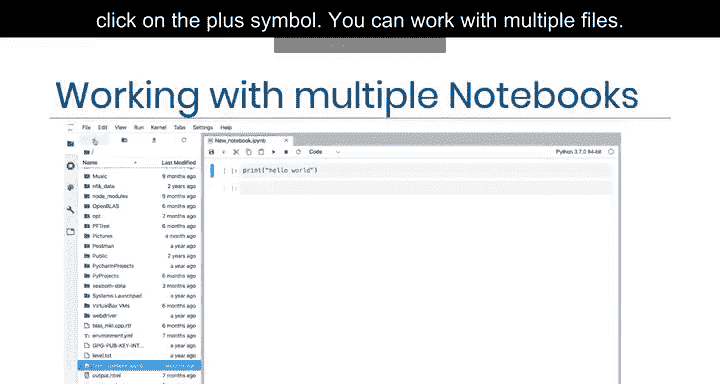

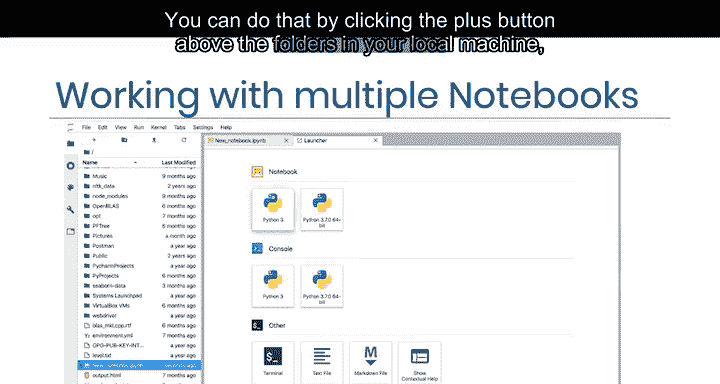

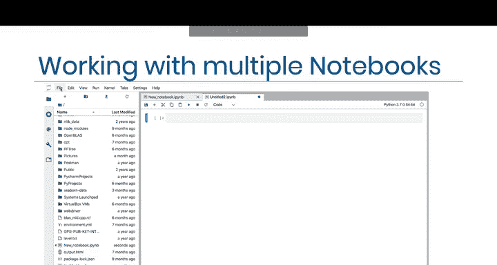

## 📂 处理多个文件

您可以同时处理多个文件。为此，请点击本地机器文件夹上方的加号按钮，然后选择要打开的文件。

我们将打开另一个Notebook。

您也可以使用“文件”选项来打开一个新的启动器或一个新的Notebook。

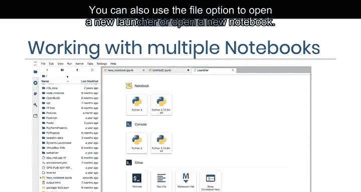

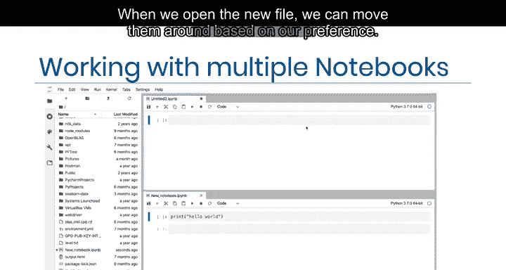

打开新文件后，我们可以根据偏好调整它们的位置。在处理同一问题的多个Notebook时，我喜欢将它们并排放置，以便同时查看两个Notebook。

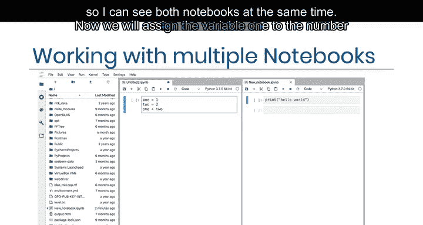

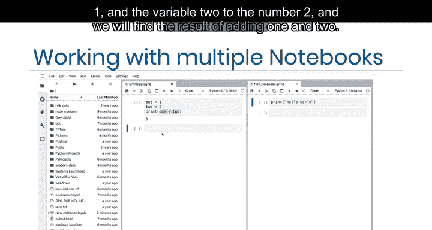

现在，我们将为变量 `one` 赋值数字1，为变量 `two` 赋值数字2，并计算两者相加的结果。

```python
one = 1
two = 2
result = one + two
print(result)
```

---

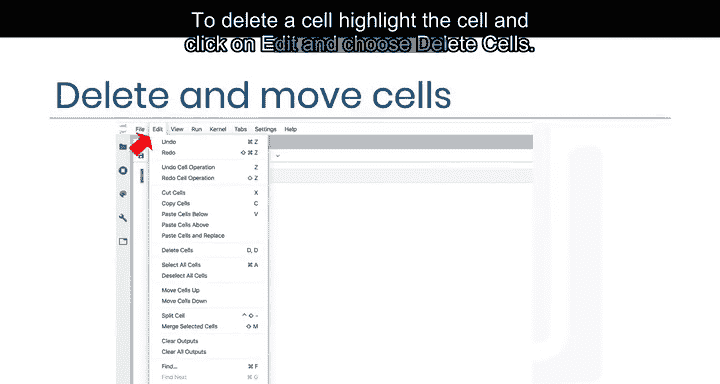

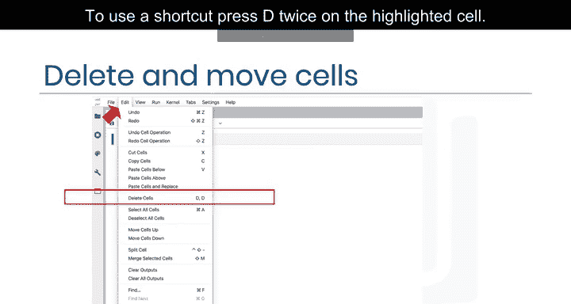

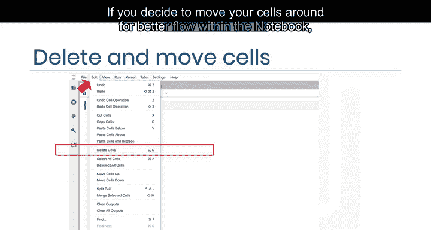

## 🗑️ 管理单元格

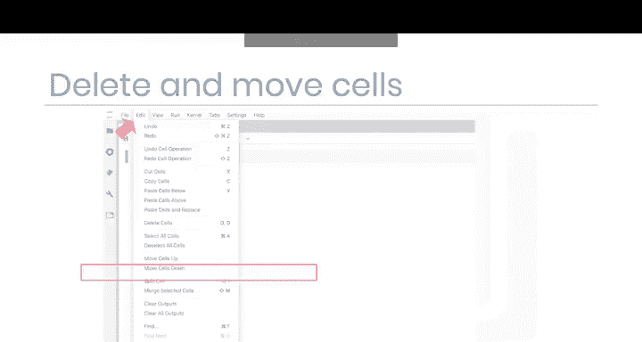

要删除一个单元格，请高亮该单元格，点击“编辑”菜单，然后选择“删除单元格”。要使用快捷键，请在选中的单元格上按两次 `D` 键。

如果您想为了Notebook内部更好的流程而移动单元格，可以根据您的偏好将单元格上移或下移。

---

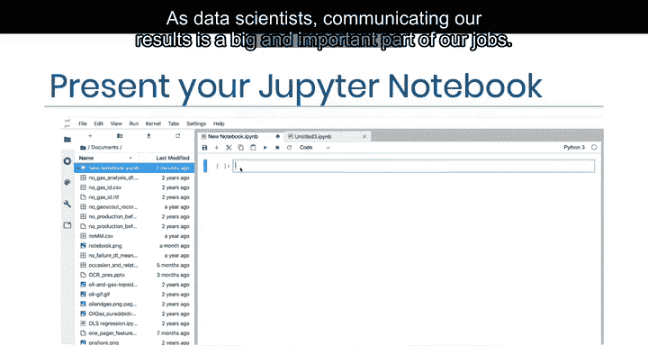

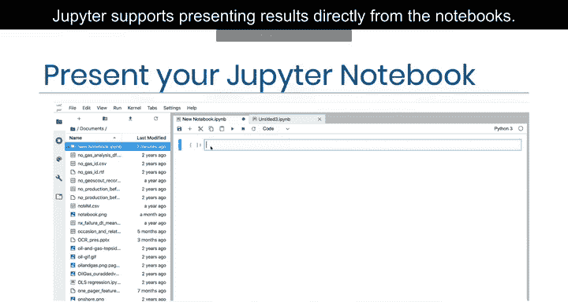

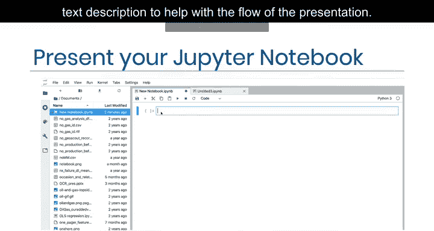

## 📝 使用Markdown进行演示

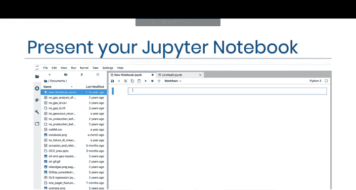

作为数据科学家，展示我们的结果是工作中一个重要且关键的部分。Jupyter支持直接从Notebook呈现结果。

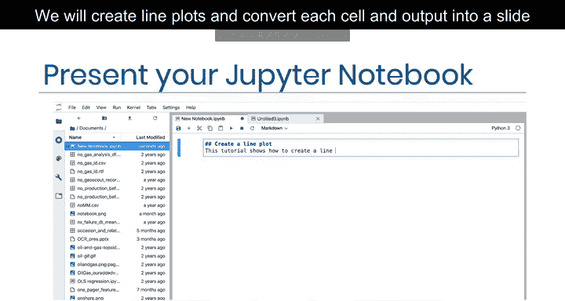

您可以创建Markdown来添加标题和文本描述，以帮助演示的流程。为此，请点击“代码”旁边的下拉菜单，选择“Markdown”。

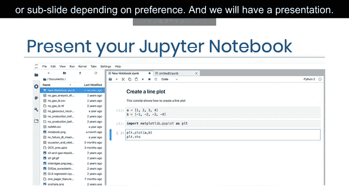

我们将创建折线图，并根据偏好将每个单元格和输出转换为幻灯片或子幻灯片，从而形成一个完整的演示。

Jupyter中的幻灯片功能使我们能够有效地展示代码、可视化图表、文本和代码执行结果，这对于展示数据科学项目非常重要。

---

## 🔚 关闭Notebook会话

当您完成Notebook的工作后，可以将其关闭。这有助于释放Notebook正在使用的内存。

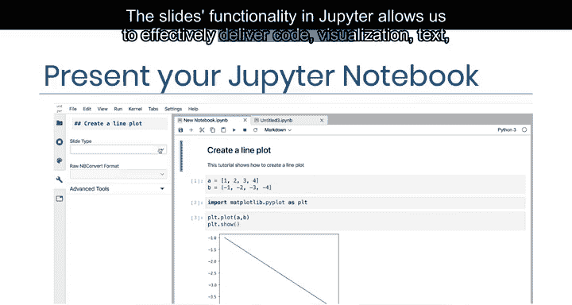

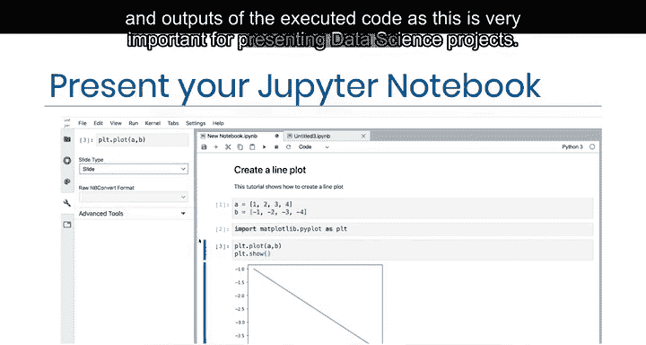

为此，请点击侧边栏上的停止图标（通常是第二个图标）。您可以一次性终止所有会话，也可以单独终止或关闭它们。

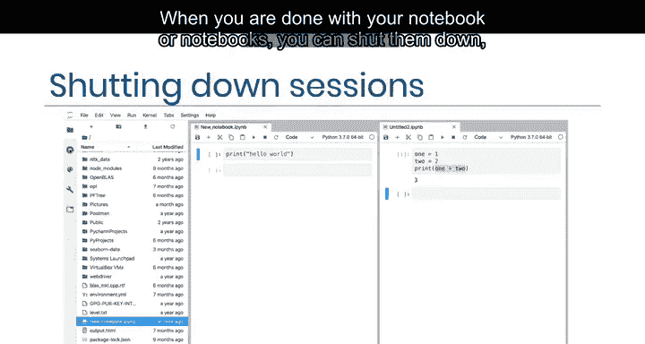

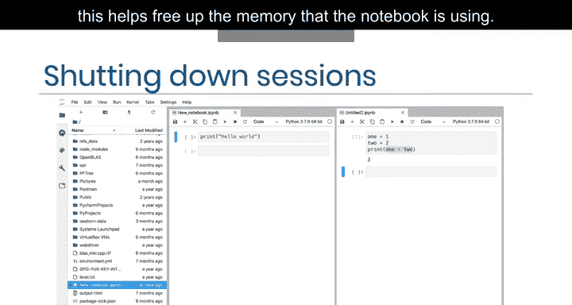

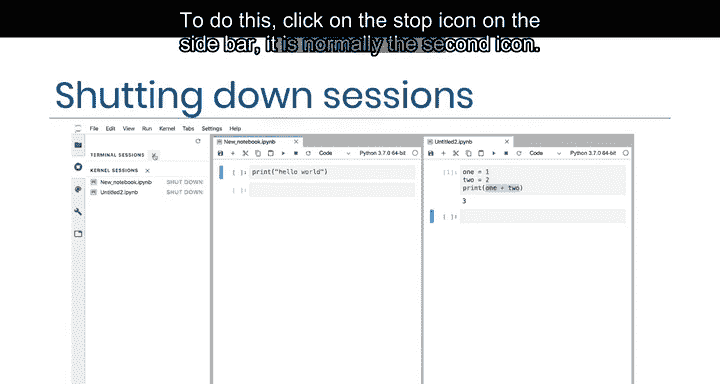

关闭Notebook会话后，您会在Notebook的右上角看到“无内核”的提示，确认它已不再活动，此时您可以关闭浏览器标签页。

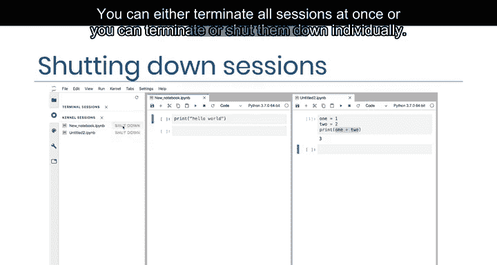

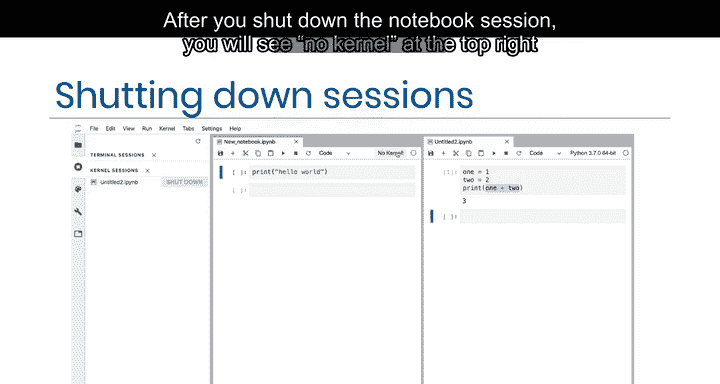

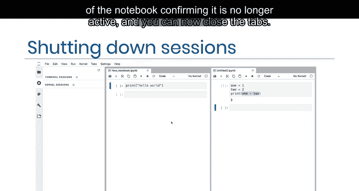

---

## 🎯 课程总结

在本节课中，我们一起学习了Jupyter Notebook的基础操作。

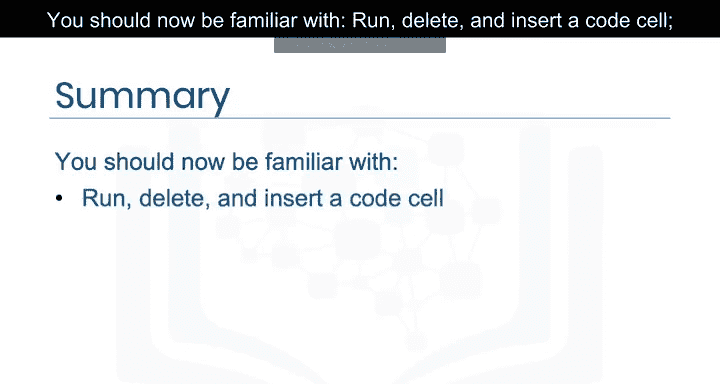

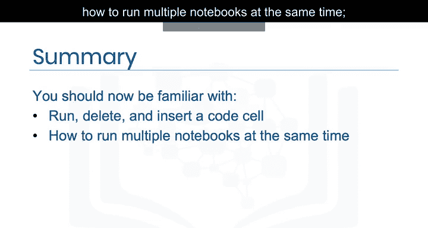

您现在应该熟悉了如何运行、删除和插入代码单元格，如何同时运行多个Notebook，Jupyter结合Markdown和代码单元格进行演示的能力，以及如何在完成后正确关闭会话。